# 第10章：必須システムサービス

> **この資料について**
> これは研修当日のための **予備知識** をまとめた資料です。
> 研修当日は **おさらい → 暗記のコツの説明 → テスト → 答え合わせ** という流れで進むため、当日「初めて聞く話」が出てこないように、ここで必要な前提をひと通り押さえておきます。
>
> Linuxを触ったことがなくても理解できるよう、できるだけ身近な例で書いています。
>
> **前提**
> この資料は **101試験の範囲(第1〜5章)** と、102の **第7章(シェルとシェルスクリプト)・第9章(管理タスク)** をひと通り学んでいることを前提にしています。とくに第4章の **プロセス**、第7章の **環境変数(TZ)**、第9章の **timedatectl・タイムゾーン・systemd・journalctl** は本章で再登場します。あやしい場合は先にそちらを確認してください。
>
> **この章の重要度について**
> 第10章は、102試験の「トピック108(必須システムサービス)」に対応します。出題数が多く、サーバ運用で必ず使う重要章です。「システムクロックとハードウェアクロック(date / hwclock)」「NTP」「rsyslogの書式(ファシリティ.プライオリティ)」「ログ調査(tail -f など)」「ログローテーション」「メール配送(MUA/MTA/MDA)とエイリアス・転送」「CUPSと印刷コマンド」が問われます。とくに **設定ファイルの書式** と **コマンドのオプション** は丸暗記が必要です。
>
> **読み方の指針**
> 1. まずは1回ざっと通読してください(細かい暗記は不要)
> 2. 各セクションの「📌 試験ポイント」と「📝 ここまでのまとめ」を見直してください
> 3. 巻末の「事前チェックリスト」で自分の理解度を測ってください
> 4. 研修当日は、このチェックリストのおさらいから始まります

---

<!-- ## 目次

- [10.1 システムクロックの設定](#101-システムクロックの設定)
  - [10.1.1 システムクロックとハードウェアクロック](#1011-システムクロックとハードウェアクロック)
  - [10.1.2 NTPによる時刻設定](#1012-ntpによる時刻設定)
  - [10.1.3 Chrony](#1013-chrony)
- [10.2 システムログの設定](#102-システムログの設定)
  - [10.2.1 rsyslogの設定](#1021-rsyslogの設定)
  - [10.2.2 ログの調査](#1022-ログの調査)
  - [10.2.3 ログファイルのローテーション](#1023-ログファイルのローテーション)
- [10.3 メール管理](#103-メール管理)
  - [10.3.1 メール配送の仕組み](#1031-メール配送の仕組み)
  - [10.3.2 MTAの起動](#1032-mtaの起動)
  - [10.3.3 メールの送信と確認](#1033-メールの送信と確認)
  - [10.3.4 メールの転送とエイリアス](#1034-メールの転送とエイリアス)
- [10.4 プリンタ管理](#104-プリンタ管理)
  - [10.4.1 印刷の仕組み](#1041-印刷の仕組み)
  - [10.4.2 印刷関連コマンド](#1042-印刷関連コマンド)
- [事前チェックリスト](#事前チェックリスト)

-->

---

## 10.1 システムクロックの設定

### ここで学ぶこと

- Linuxが持つ2つの時計 **システムクロック** と **ハードウェアクロック**
- 時刻を操作する **date / hwclock / timedatectl**
- ネットワーク経由で正確な時刻に合わせる **NTP** と、その新実装 **Chrony**

コンピュータにとって「正確な時刻」は、思った以上に大切です。ログには「いつ何が起きたか」が時刻付きで記録され、メールにも送受信の時刻が刻まれます。もし時計が狂っていると、トラブルが起きたとき「いつの出来事か」が分からなくなり、原因究明が難しくなります。複数のサーバの時刻がバラバラだと、ログを突き合わせても順序が分からない、といった事態も起こります。

そこでこの節では、Linuxの内蔵時計を正しく調整する方法を学びます。まず押さえたいのは、**Linuxには時計が2つある** ということ。この2つの関係を理解するところから始めましょう。

### 10.1.1 システムクロックとハードウェアクロック

#### 2つの時計 ─ 役割の違い

Linuxには、性質の異なる2つの時計があります。

- **ハードウェアクロック**: マザーボード(コンピュータの基板)に組み込まれた物理的な時計。**電源がオフでも、内蔵の電池で動き続けます**。RTC(Real Time Clock)とも呼ばれます
- **システムクロック**: Linuxの **カーネル内** にある時計。**起動している間、システムが実際に使う** のはこちらです

たとえるなら、ハードウェアクロックは「壁掛けの電池式時計」(電源を切っても動く)、システムクロックは「パソコンを起動している間だけ動く画面上の時計」です。

両者の関係はこうです。**Linuxの起動時に、ハードウェアクロックを参照してシステムクロックがセットされます**。しかし、その後は **別々に時を刻みます**。どちらも完璧に正確ではないため、起動してから時間が経つほど、2つの時計の間にズレが生じてきます。

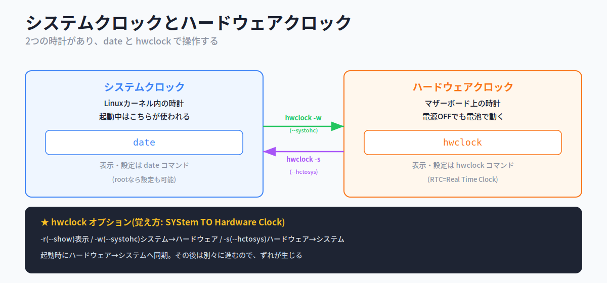

#### date ─ システムクロックの表示と設定

システムクロックを操作するのが **date** コマンドです。引数なしで実行すると、現在の日時が表示されます。

```bash
$ date
2018年 12月 10日 月曜日 19:35:47 JST
```

**root ユーザーなら、date でシステムクロックを設定** できます。設定するときの書式は `date MMDDhhmm[[CC]YY][.ss]` で、月・日・時・分(必要なら西暦・秒)を続けて並べます。

```bash
# date 121020002018      # 2018年12月10日20時00分に設定(MM DD hh mm YYYY)
```

また、引数を **`+`** で始めると、指定した書式で日時を表示できます。日付入りのファイル名を作るときなどに便利です。

| 書式 | 意味 |
|---|---|
| **%Y** | 年(4桁) |
| **%m** | 月(01〜12) |
| **%d** | 日(01〜31) |
| **%H** | 時(00〜23) |
| **%M** | 分(00〜59) |
| **%a** | 曜日 |
| **%b** | 月名 |

```bash
$ date "+%Y/%m/%d (%a)"
2018/12/10 (月)
```

> 💡 バックアップ時に `` tar czf `date "+%Y%m%d"`.tar.gz /data `` のようにすると、`20181210.tar.gz` のような **日付入りファイル名** が作れます(第7章のコマンド置換の応用)。

#### hwclock ─ ハードウェアクロックの操作

ハードウェアクロックを操作するのが **hwclock** コマンドです。2つの時計の間で時刻をコピーする(同期する)のが主な役目です。

| オプション | 説明 |
|---|---|
| **-r**(--show) | ハードウェアクロックを表示する |
| **-w**(--systohc) | システムクロック → ハードウェアクロックに設定 |
| **-s**(--hctosys) | ハードウェアクロック → システムクロックに設定 |

```bash
# hwclock --systohc      # システムクロックの時刻をハードウェアクロックへ
```

> 💡 **覚え方Hack ─ SYStem TO Hardware Clock**。`-w` の別名 `--systohc` は「**sys** to **h**ardware **c**lock(システムからハードウェアへ)」。逆の `-s`(--hctosys)は「hardware clock to sys(ハードウェアからシステムへ)」。長い別名を分解すると、どちら向きの同期かが読み取れます。

#### timedatectl ─ systemd環境でまとめて管理

systemdを採用したディストリビューションでは、**timedatectl** コマンドで日時・タイムゾーン・NTPをまとめて管理できます(第9章で触れたコマンドです)。

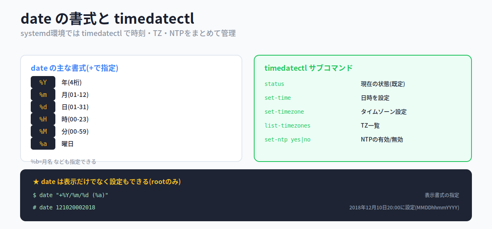

| サブコマンド | 説明 |
|---|---|
| **status** | 現在の状態を表示(引数なしの既定) |
| **set-time 日時** | 日時を設定する |
| **set-timezone TZ** | タイムゾーンを設定する |
| **list-timezones** | タイムゾーンを一覧表示する |
| **set-ntp yes\|no** | NTPを使うかどうかを設定する |

```bash
# timedatectl set-time '2019-03-12 12:24:00'   # 日時を設定
# timedatectl set-timezone Asia/Tokyo          # タイムゾーンを設定
# timedatectl set-ntp yes                       # NTPによる同期を有効化
```

> ⚠ **timedatectl はシステムクロックとハードウェアクロックを同時に設定** します(date や hwclock のように片方だけではない)。また、**NTPが有効だと set-time はエラー** になります(自動同期と手動設定がぶつかるため)。

#### 📌 試験ポイント

| 問われ方 | 答え |
|---|---|
| 電源OFFでも動く時計は? | **ハードウェアクロック**(RTC) |
| カーネル内にあり起動中に使う時計は? | **システムクロック** |
| 起動時、どちらからどちらへ同期する? | **ハードウェア → システム** |
| システムクロックを表示・設定するコマンドは? | **date** |
| date で表示書式を指定する記号は? | **`+`**(例 +%Y) |
| ハードウェアクロックを操作するコマンドは? | **hwclock** |
| システム→ハードウェアへ設定するオプションは? | **-w**(--systohc) |
| ハードウェア→システムへ設定するオプションは? | **-s**(--hctosys) |
| systemdで時刻をまとめて管理するコマンドは? | **timedatectl** |

### 10.1.2 NTPによる時刻設定

#### NTP ─ ネットワーク経由で正確な時刻に合わせる

ハードウェアクロックもシステムクロックも、放っておくと少しずつズレていきます。これを正確に保つには、**ネットワーク経由で正確な時刻を取得して同期する** のが現実的です。その仕組みが **NTP**(Network Time Protocol)です。インターネット上の **NTPサーバ(タイムサーバ)** から正確な時刻をもらってきます。「正確な時計を持っている人に電話して、自分の時計を合わせてもらう」イメージです。

NTPのネットワークは **階層構造** になっており、その階層を **Stratum(ストラタム)** という数字で表します。

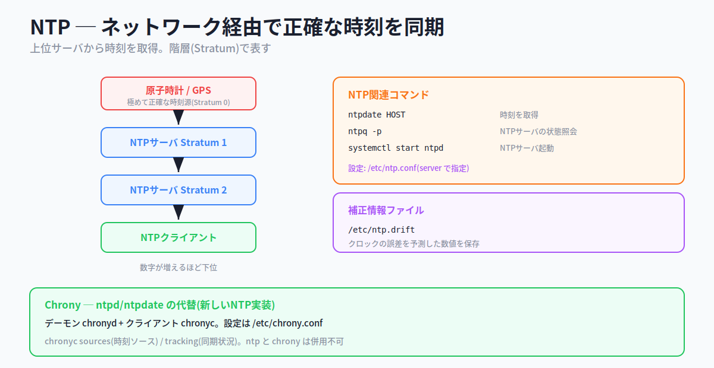

- 最上位には、**原子時計やGPS** など極めて正確な時刻源があります(Stratum 0)
- その直下のNTPサーバが **Stratum 1**、さらにその下が **Stratum 2**…と続きます
- **数字が増えるほど下位**(時刻源から遠い)になります

各サーバは上位のサーバから時刻をもらい、自分の下位に配ります。「正確な大本の時計から、バケツリレーのように時刻が降りてくる」と考えてください。

#### ntpdate / ntpq ─ 時刻取得と状態確認

| コマンド | 説明 |
|---|---|
| **ntpdate サーバ名** | 指定したNTPサーバから現在時刻を取得する |
| **ntpq -p** | NTPサーバの状態(問い合わせ先リスト)を照会する |
| **systemctl start ntpd** | NTPサーバ(ntpd)を起動する |

```bash
# ntpdate time.server.lpic.jp     # NTPサーバから時刻を取得
```

#### NTPの設定ファイル

NTPサーバの設定は **/etc/ntp.conf** で行い、問い合わせ先を **server** パラメータで指定します。クロックの誤差を予測した **補正情報** は **/etc/ntp.drift** に保存されます。

```
server 0.jp.pool.ntp.org      # 問い合わせ先NTPサーバ
driftfile /etc/ntp.drift      # 補正情報ファイル
```

> 💡 適切なNTPサーバに心当たりがなければ、**pool.ntp.org** プロジェクトのサーバが便利です。これは複数のサーバをまとめて1つの仮想サーバとして運用する仕組みで、問い合わせるたびに別のIPアドレスが返り、特定サーバへの負荷集中を防いでいます。

#### 📌 試験ポイント

| 問われ方 | 答え |
|---|---|
| ネットワーク経由で時刻を同期するプロトコルは? | **NTP** |
| NTPの階層を表す言葉は? | **Stratum** |
| 最上位(原子時計・GPS)はStratumいくつ? | **0** |
| 数字が増えるとどうなる? | **下位になる**(時刻源から遠い) |
| NTPサーバから時刻を取得するコマンドは? | **ntpdate** |
| NTPサーバの状態を照会するコマンドは? | **ntpq -p** |
| NTPの設定ファイルは? | **/etc/ntp.conf** |
| 問い合わせ先を指定するパラメータは? | **server** |
| 補正情報を保存するファイルは? | **/etc/ntp.drift** |

### 10.1.3 Chrony

#### Chrony ─ ntpd/ntpdate の新しい代替

**Chrony** は、ntpd / ntpdate の代わりとなる新しいNTPの実装です(近年のディストリビューションで標準採用が増えています)。次の2つの部品から成ります。

- **chronyd** … 裏で動くデーモン(常駐プログラム)
- **chronyc** … 状態を確認・操作するクライアントコマンド

設定ファイルは **/etc/chrony.conf** です(ntp.conf と同様に `server` でサーバを指定します)。

chronyc の主なサブコマンドは次の通りです。

| サブコマンド | 説明 |
|---|---|
| **sources** | 時刻ソース(NTPサーバ)の情報を表示 |
| **sourcestats** | 時刻ソースの統計情報を表示 |
| **tracking** | 同期状況(トラッキング)を確認 |
| **activity** | サーバのオンライン/オフライン数を表示 |

> ⚠ **ntp パッケージと chrony パッケージは同時に使えません**。どちらか一方を選びます。「従来の ntpd/ntpdate か、新しい Chrony か、片方だけ」と覚えておきましょう。

#### 📌 試験ポイント

| 問われ方 | 答え |
|---|---|
| ntpd/ntpdateの代替となるソフトは? | **Chrony** |
| Chronyのデーモンは? | **chronyd** |
| Chronyのクライアントコマンドは? | **chronyc** |
| Chronyの設定ファイルは? | **/etc/chrony.conf** |
| 時刻ソースを表示するサブコマンドは? | **sources** |
| 同期状況を確認するサブコマンドは? | **tracking** |
| ntpとchronyは併用できる? | **できない**(どちらか一方) |

#### 📝 ここまでのまとめ

- 時計は2つ: **ハードウェアクロック**(電源OFFでも電池駆動・RTC)と **システムクロック**(カーネル内・起動中に使用)。起動時にハード→システムへ同期し、その後は別々に進む
- **date**: システムクロックの表示・設定(`+` で表示書式)。**hwclock**: ハード操作(**-w** systohc / **-s** hctosys)
- **timedatectl**: systemdで日時・TZ・NTPをまとめて管理(両方の時計を同時設定)
- **NTP**: ネット経由の時刻同期。階層は **Stratum**(0が最上位、数字が増えると下位)
- **ntpdate**(取得)/ **ntpq -p**(状態)。設定は **/etc/ntp.conf**(server)、補正は **/etc/ntp.drift**
- **Chrony**: 新しいNTP実装。**chronyd**+**chronyc**、設定 **/etc/chrony.conf**。ntpとは併用不可

---

## 10.2 システムログの設定

### ここで学ぶこと

- ログを記録する仕組み **syslog / rsyslog**
- どこからのメッセージを・どの重要度で・どこへ出すかを決める **ファシリティ・プライオリティ・出力先**
- ログを調べるコマンド(**tail -f / grep / who / w / last / lastlog / journalctl**)
- ログが肥大化しないようにする **ログローテーション**

コンピュータは、動作中にさまざまな出来事(イベント)を記録しています。「いつ誰がログインしたか」「どのプログラムがエラーを出したか」といった記録が **ログ** です。ログは、トラブルの原因を探ったり、不正アクセスの兆候を見つけたりするための、いわば「コンピュータの航海日誌」です。

この日誌を取りまとめる役目を負うのが **syslog** という仕組みです。各プログラムから上がってくるメッセージを受け取り、内容に応じて分類し、適切な出力先(ファイルや画面)へ振り分けます。この節では、その設定方法とログの調べ方を学びます。

### 10.2.1 rsyslogの設定

#### rsyslog ─ メッセージを受け取り振り分ける

ログを取得・処理するソフトウェアには、syslog のほか **rsyslog** や **syslog-ng** があります(CentOS 7・Ubuntu 18.04 はいずれも **rsyslog** が標準)。本資料でも rsyslog を扱います。

rsyslog は、いろいろなプログラム(カーネル・デーモン・認証・cron・mail など)からメッセージを受け取り、**分類して、指定された出力先へ振り分けます**。郵便局が、各所から届いた手紙を仕分けして配達先へ送るような役割です。

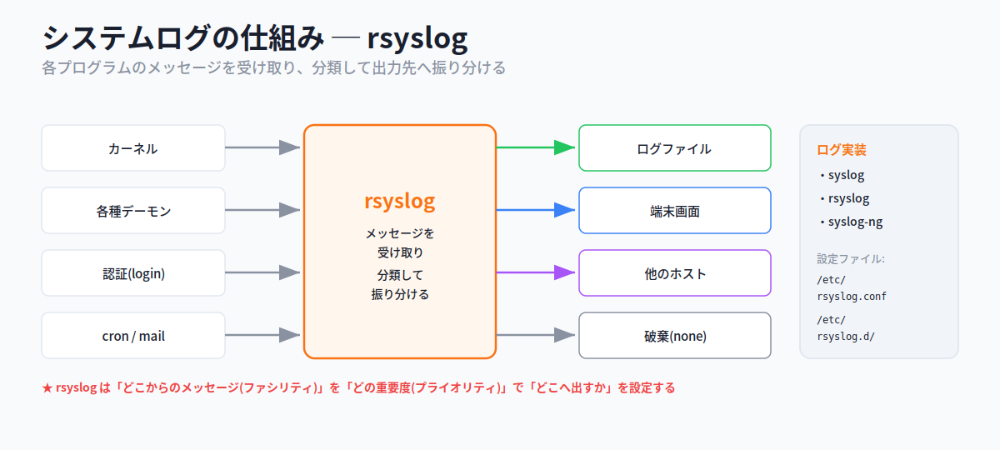

設定は **/etc/rsyslog.conf** と **/etc/rsyslog.d/** 以下のファイルで行います。rsyslog は機能をプラグインモジュールで拡張でき、設定ファイルの先頭部分でモジュールを読み込みます(imuxsock=ローカルロギング、imjournal=systemdジャーナル、imklog=カーネルログ、など)。

#### ログ出力の書式 ─ ファシリティ.プライオリティ 出力先

rsyslog のルール設定の書式は、次の3つの要素から成ります。ここが第10章で最も問われるポイントです。

```
書式: ファシリティ.プライオリティ  出力先
```

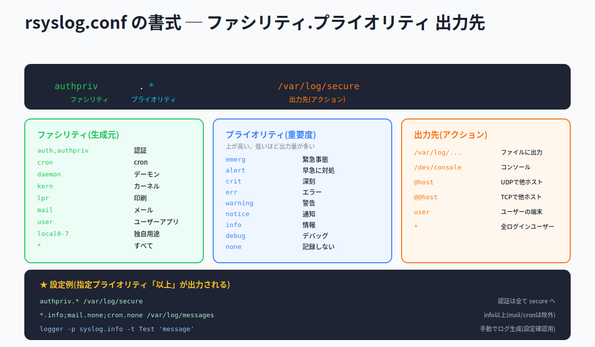

**ファシリティ(facility)= メッセージの生成元** です。「どこから来たログか」を表します。

| ファシリティ | 生成元 |
|---|---|
| **auth, authpriv** | 認証システム(loginなど) |
| **cron** | cron |
| **daemon** | 各種デーモン |
| **kern** | カーネル |
| **lpr** | 印刷システム |
| **mail** | メール関連 |
| **user** | ユーザーアプリケーション |
| **local0〜local7** | ローカルで独自に使う |
| **\*** | すべてのファシリティ |

**プライオリティ(priority)= メッセージの重要度** です。下の表は **重要度の高い順** に並んでいます。

| プライオリティ | 重要度 | 意味 |
|---|---|---|
| **emerg** | 高 | 緊急事態 |
| **alert** | ↑ | 早急に対処が必要 |
| **crit** | | 深刻な事態 |
| **err** | | 一般的なエラー |
| **warning** | | 一般的な警告 |
| **notice** | | 一般的な通知 |
| **info** | ↓ | 一般的な情報 |
| **debug** | 低 | デバッグ情報 |
| **none** | ― | 記録しない(除外) |

ここで重要なルールが2つあります。

1. **指定したプライオリティ「以上」(より重要なもの)が出力されます**。たとえば `info` を指定すると、info より重要な notice・warning・err… もすべて出力されます
2. したがって、**低いプライオリティを指定するほど出力されるログの量は多くなります**(debug にすると、ほぼ全部出る)

**出力先(アクションフィールド)= どこへ出すか** です。

| 出力先 | 意味 |
|---|---|
| **/var/log/messages** など | ログファイルに出力 |
| **/dev/console** | コンソールに出力 |
| **@host** | 他ホストへ **UDP** で送る |
| **@@host** | 他ホストへ **TCP** で送る |
| **user** | 指定ユーザーの端末に出力 |
| **\*** | ログイン中の全ユーザーの端末に出力 |

設定例を見てみましょう。

```
authpriv.*                 /var/log/secure      # 認証関連は全て secure へ
*.info;mail.none;authpriv.none /var/log/messages # info以上(mail/authprivは除外)を messages へ
```

1行目は「authpriv のメッセージを、重要度を問わず(`*`)/var/log/secure に保存」。2行目は「すべての info 以上を /var/log/messages に保存、ただし mail と authpriv は除外(`none`)」という意味です。`;`(セミコロン)で複数の条件を並べられます。

> 💡 **覚え方Hack ─ 「どこから.どの重要度 → どこへ」**。書式は左から「ファシリティ(生成元).プライオリティ(重要度) 出力先」。`@`が1つでUDP、2つ(`@@`)でTCP、と覚えましょう。「指定した重要度**以上**が出る」「`none`で除外」も頻出です。

#### logger ─ 手動でログを生成する

**logger** コマンドを使うと、コマンドラインから手動でログメッセージを生成できます。rsyslog の設定が正しいかを確認するときに便利です。

```bash
$ logger -p syslog.info -t Test "logger test message"
```

`-p` でファシリティ.プライオリティ、`-t` でタグを指定します。なお、systemd環境では **systemd-cat コマンド** で、コマンドの実行結果をジャーナルに書き込めます。

#### 📌 試験ポイント

| 問われ方 | 答え |
|---|---|
| ログを取得・処理するソフトは?(本書) | **rsyslog** |
| rsyslogの設定ファイルは? | **/etc/rsyslog.conf**(と /etc/rsyslog.d/) |
| ログ出力ルールの書式は? | **ファシリティ.プライオリティ 出力先** |
| メッセージの生成元を表すのは? | **ファシリティ** |
| メッセージの重要度を表すのは? | **プライオリティ** |
| 最も重要度が高いプライオリティは? | **emerg** |
| 記録しない(除外する)指定は? | **none** |
| 指定したプライオリティの扱いは? | **それ「以上」が出力される** |
| 他ホストへUDP/TCPで送る記号は? | **@(UDP)/ @@(TCP)** |
| 手動でログを生成するコマンドは? | **logger** |

### 10.2.2 ログの調査

#### 主要なログファイルと閲覧コマンド

ログを調べることで、システムの利用状況や異常の兆候を確認できます。代表的なログファイルと、それを見るためのコマンドの対応を押さえましょう。

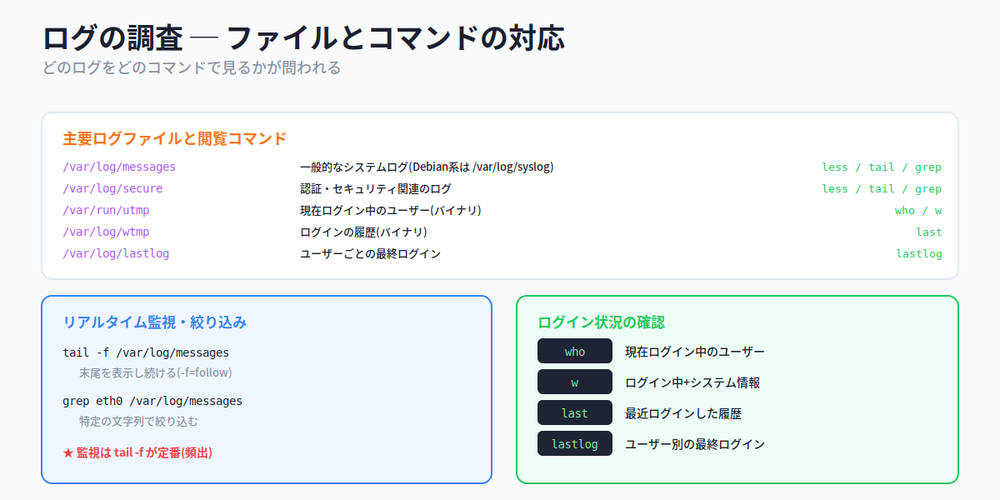

| ログファイル | 内容 | 閲覧コマンド |
|---|---|---|
| **/var/log/messages** | 一般的なシステムログ(Debian系は **/var/log/syslog**) | less / tail / grep |
| **/var/log/secure** | 認証・セキュリティ関連 | less / tail / grep |
| **/var/run/utmp** | 現在ログイン中のユーザー(バイナリ) | who / w |
| **/var/log/wtmp** | ログインの履歴(バイナリ) | last |
| **/var/log/lastlog** | ユーザーごとの最終ログイン | lastlog |

> ⚠ utmp・wtmp は **バイナリファイル** なので、`cat` や `less` では読めません。専用のコマンド(who/w/last)を使います。

#### ログのリアルタイム監視と絞り込み

| コマンド | 説明 |
|---|---|
| **tail -f ログファイル** | ログの末尾を表示し続ける(新しい行が追加されるたびに表示) |
| **grep 文字列 ログファイル** | 特定の文字列を含む行だけを抜き出す |

```bash
# tail -f /var/log/messages      # ログをリアルタイムで監視
# grep eth0 /var/log/messages    # eth0 を含む行だけ抜き出す
```

> 💡 **覚え方Hack ─ 監視は tail -f**。`-f` は **follow**(追従)。ログが書き込まれる様子をリアルタイムで追いかけられるので、トラブル対応の定番です。試験でも「ログを監視し続けるには?」→ `tail -f` が頻出。`cat &` や `top` では監視できない点に注意。

#### ログイン状況の確認

| コマンド | 説明 | 参照ファイル |
|---|---|---|
| **who** | 現在ログイン中のユーザー | /var/run/utmp |
| **w** | ログイン中のユーザー + システム情報 | /var/run/utmp |
| **last** | 最近ログインした履歴 | /var/log/wtmp |
| **lastlog** | ユーザーごとの最終ログイン | /var/log/lastlog |

#### journalctl ─ systemdのジャーナルを見る

systemdを採用したシステムでは、**journalctl** コマンドで systemd のログ(**ジャーナル**)を閲覧できます(第9章でも登場しました)。ジャーナルは rsyslog とは別に、systemd-journald が記録するものです。

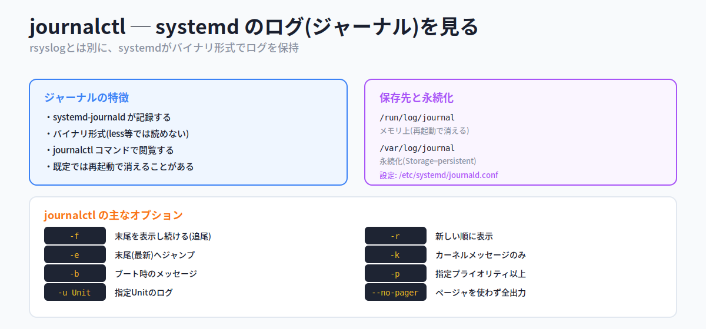

| オプション | 説明 |
|---|---|
| **-f** | 末尾を表示し続ける(tail -f と同様の追尾) |
| **-r** | 新しい順に表示する |
| **-e** | 末尾(最新)へジャンプ |
| **-k** | カーネルメッセージのみ表示 |
| **-b** | ブート時のメッセージを表示 |
| **-p プライオリティ** | 指定プライオリティ以上を表示 |
| **-u Unit名** | 指定したUnitのログを表示 |
| **--no-pager** | ページャを使わず全出力 |

ジャーナルは **バイナリ形式** なので less などでは読めません。保存先は2か所あり、性質が異なります。

- **/run/log/journal** … メモリ上にあり、**再起動で消える**
- **/var/log/journal** … ディスク上で **永続化** される

設定ファイル **/etc/systemd/journald.conf** で `Storage=persistent` にすると、ジャーナルは `/var/log/journal` 以下に永続的に保存されます。

#### 📌 試験ポイント

| 問われ方 | 答え |
|---|---|
| 一般的なシステムログのファイルは? | **/var/log/messages**(Debian系は /var/log/syslog) |
| 認証関連のログファイルは? | **/var/log/secure** |
| ログをリアルタイム監視するには? | **tail -f** |
| ログを文字列で絞り込むには? | **grep** |
| 現在ログイン中のユーザーを見るには? | **who / w** |
| ログイン履歴を見るには? | **last**(/var/log/wtmp) |
| ユーザー別の最終ログインを見るには? | **lastlog** |
| systemdのジャーナルを見るコマンドは? | **journalctl** |
| ジャーナルを追尾表示するオプションは? | **-f** |
| ジャーナルを永続化する設定は? | **Storage=persistent** |

### 10.2.3 ログファイルのローテーション

#### ローテーション ─ 古いログを世代交代させる

ログファイルは放っておくと追記され続け、容量がどんどん膨らみます。これを防ぐのが **ログローテーション** です。「古くなったログを切り分けて世代交代させ、一定数を超えたら一番古いものを捨てる」仕組みです。新聞を一定期間ぶん保管し、古いものから処分していくのに似ています。

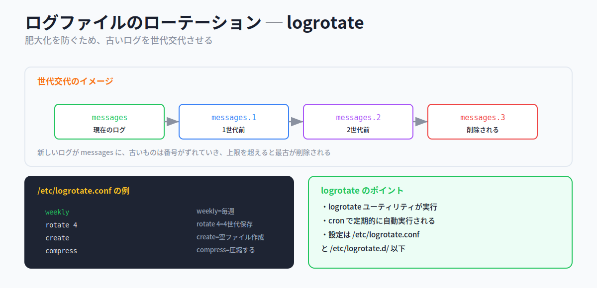

たとえば `/var/log/messages` の場合、ローテーションが起きると次のように世代がずれていきます。

1. 現在の `messages` が `messages.1` にリネームされ、新しい空の `messages` が作られる
2. 次のローテーションで `messages.1` → `messages.2`、`messages` → `messages.1` とずれる
3. 規定の保存数を超えると、一番古いファイルが削除される

#### logrotate ─ ローテーションを行うユーティリティ

この機能は **logrotate** ユーティリティが提供します。logrotate は **cron によって定期的に自動実行** されます(第9章のcronの応用)。設定は **/etc/logrotate.conf** と **/etc/logrotate.d/** 以下で行います。

主な設定キーワードは次の通りです。

| キーワード | 意味 |
|---|---|
| **weekly / monthly** | ローテーションの周期(毎週・毎月) |
| **rotate 数** | 保存する世代数(例: rotate 4 = 4世代保存) |
| **create** | ローテーション後に空のログファイルを作成する |
| **compress** | 古いログファイルを圧縮する |

```
weekly        # 毎週ローテーション
rotate 4      # 4世代保存
create        # 空ファイルを新規作成
compress      # 圧縮する
```

> 💡 「ローテーションの **実体は logrotate**、それを **定期実行するのは cron**」という分担を押さえましょう。`rotate N` の N が世代数(いくつ前まで残すか)です。

#### 📌 試験ポイント

| 問われ方 | 答え |
|---|---|
| ログの肥大化を防ぐ仕組みは? | **ログローテーション** |
| ローテーションを行うユーティリティは? | **logrotate** |
| logrotateを定期実行するのは? | **cron** |
| logrotateの設定ファイルは? | **/etc/logrotate.conf**(と /etc/logrotate.d/) |
| 保存する世代数を指定するキーワードは? | **rotate** |
| ローテーション後に空ファイルを作るのは? | **create** |
| 古いログを圧縮するのは? | **compress** |

#### 📝 ここまでのまとめ

- ログ処理ソフトは **syslog / rsyslog / syslog-ng**(標準は rsyslog)。設定は **/etc/rsyslog.conf** と /etc/rsyslog.d/
- 書式は **ファシリティ.プライオリティ 出力先**。ファシリティ=生成元、プライオリティ=重要度(emerg最高〜debug最低、none=除外)
- 指定プライオリティ「以上」が出力。**@=UDP / @@=TCP**。手動生成は **logger**
- ログ調査: **/var/log/messages**(一般)・**/var/log/secure**(認証)。監視は **tail -f**、絞り込みは **grep**
- ログイン状況: **who / w**(現在・utmp)、**last**(履歴・wtmp)、**lastlog**(最終)
- **journalctl**: systemdジャーナル(バイナリ)。**-f** 追尾。永続化は **Storage=persistent**(/var/log/journal)
- **ログローテーション**: **logrotate**(cronで実行)。設定 **/etc/logrotate.conf**(weekly / rotate N / create / compress)

---

## 10.3 メール管理

### ここで学ぶこと

- メールが届くまでの登場人物 **MUA / MTA / MDA** と配送の流れ
- メールを配送するサーバ **MTA**(SMTPサーバ)の起動と確認
- コマンドラインでメールを扱う **mail**
- メールを別アドレスで受け取る **エイリアス(/etc/aliases)** と **転送(~/.forward)**

電子メールは、裏側でいくつものソフトウェアが連携して届けられています。普段は意識しませんが、「誰が作って、誰が運んで、誰が郵便受けに入れるか」という役割分担があります。この節では、その仕組みと、Linux上でメールを扱うコマンド・設定を学びます。

### 10.3.1 メール配送の仕組み

#### 登場人物 ─ MUA / MTA / MDA

メールに関わるソフトウェアは、役割ごとに3種類に分かれます。郵便にたとえると分かりやすいです。

- **MUA**(Mail User Agent)… ユーザーが使う **メールソフト**。メールの作成・送受信を行う。「手紙を書く人/読む人」
- **MTA**(Message Transfer Agent)… メールを **配送するサーバ**。「手紙を運ぶ郵便屋」。SMTPというプロトコルでやりとりするため **SMTPサーバ** とも呼ばれる
- **MDA**(Mail Delivery Agent)… 届いたメールを **メールボックスに格納** するプログラム。「郵便受けに手紙を入れる配達員」

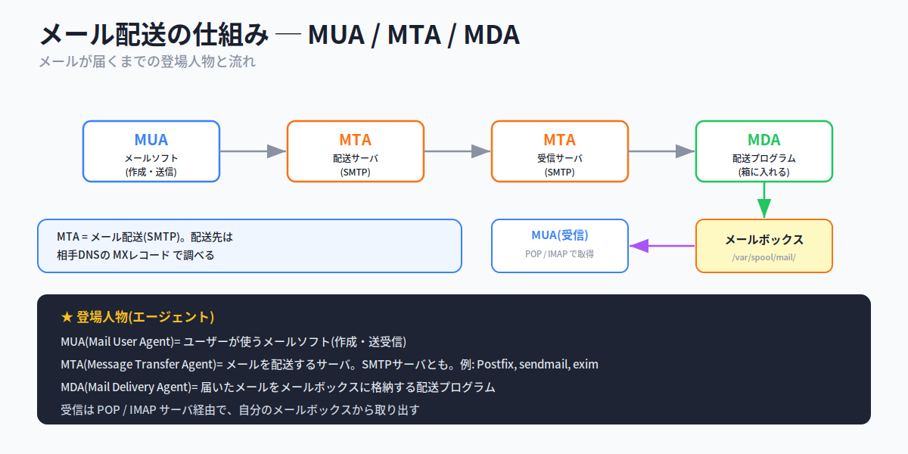

メールが届くまでの流れは次の通りです。

1. **MUA** で作成されたメールが、送信側の **MTA** へ送られる
2. MTAは、宛先アドレスから配送先メールサーバを調べ(相手DNSの **MXレコード** を参照)、受信側の **MTA** へ配送する
3. 受信側MTAが受け取ると、**MDA** が宛先ユーザーの **メールボックス**(`/var/spool/mail/` 以下)に格納する
4. 受取人は、**POP** や **IMAP** サーバ経由で、自分のメールボックスからメールを取り出す(受信側MUA)

代表的なMTA(SMTPサーバ)には **sendmail・Postfix・exim** があります。

> 💡 **覚え方Hack ─ U・T・D**。**U**ser(使う人)= MUA、**T**ransfer(運ぶ)= MTA、**D**elivery(配達して箱に入れる)= MDA。真ん中の文字で役割を区別できます。配送先を調べるのに使うDNSの記録が **MXレコード** という点も頻出です。

#### 📌 試験ポイント

| 問われ方 | 答え |
|---|---|
| ユーザーが使うメールソフトは? | **MUA** |
| メールを配送するサーバは? | **MTA**(SMTPサーバ) |
| メールボックスに格納するプログラムは? | **MDA** |
| 代表的なMTAは? | **sendmail / Postfix / exim** |
| 配送先を調べるDNSの記録は? | **MXレコード** |
| メールボックスの場所は? | **/var/spool/mail/** |
| 受信に使うプロトコルは? | **POP / IMAP** |

### 10.3.2 MTAの起動

#### 稼働中のMTAを確認する

どのMTAがインストールされているかはシステムによって異なります(RHEL/CentOSは **Postfix**、Debian/Ubuntuは **exim4** が多い)。SMTPは **25番ポート** を使うので、25番ポートを開いているプログラムを調べれば、稼働中のMTAが分かります。

```bash
# netstat -atnp | grep 25      # 25番ポートで待ち受けているMTAを確認
```

MTAの起動は、systemd環境なら systemctl で行います。

```bash
# systemctl start postfix.service      # Postfixを起動
```

#### 📌 試験ポイント

| 問われ方 | 答え |
|---|---|
| SMTPが使うポート番号は? | **25番** |
| 稼働中のMTAを確認するには? | **netstat で25番ポートを調べる** |
| RHEL/CentOSで多いMTAは? | **Postfix** |
| Debian/Ubuntuで多いMTAは? | **exim4** |

### 10.3.3 メールの送信と確認

#### mail ─ コマンドラインでメールを扱う

コマンドラインでメールを送信したり、受信メールを確認したりするには **mail** コマンドを使います。

```
書式: mail [-s 題名] [宛先]
```

メールを送るときは宛先を指定して実行します。`-s` で件名(Subject)を指定し、本文を入力したあと、**最後に `.`(ピリオドだけの行)** で入力を終えます。

```bash
$ mail -s samplemail student
Hello! Student!        # 本文を入力
.                      # ピリオドだけの行で送信(入力終了)
```

**引数なしで実行** すると、自分のメールボックスに届いているメールを確認できます。

```bash
$ mail        # 受信メールの一覧を表示
```

> 💡 ユーザー名だけを宛先に指定すると、同じシステム内のそのユーザー宛にメールが送られます。送信待ち(まだ送れていない)メールは **メールキュー** に溜まり、**mailq** コマンドで内容を確認できます。

#### 📌 試験ポイント

| 問われ方 | 答え |
|---|---|
| コマンドラインでメールを送るコマンドは? | **mail** |
| 件名を指定するオプションは? | **-s** |
| メール本文の入力を終えるには? | **`.`(ピリオドだけの行)** |
| 受信メールを確認するには? | **引数なしの mail** |
| 送信待ちメールを確認するコマンドは? | **mailq** |

### 10.3.4 メールの転送とエイリアス

#### 別アドレスで受け取る2つの方法

ある宛先に届いたメールを、別のアドレスで受け取れるようにする方法は2つあります。**誰が設定するか** が大きな違いです。

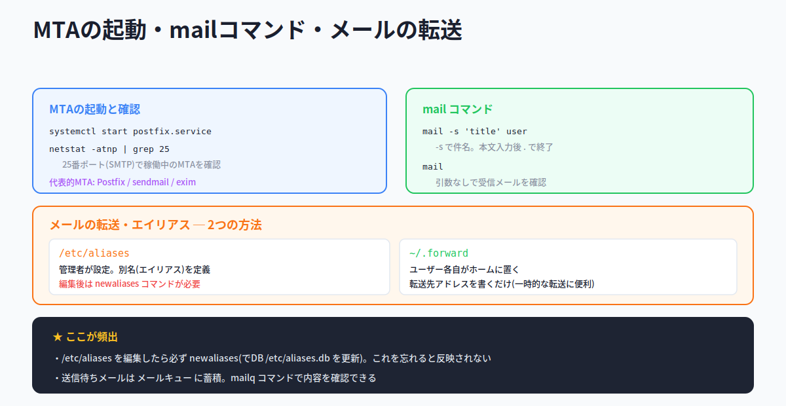

**方法1: /etc/aliases(エイリアス)── 管理者が設定**

`/etc/aliases` に「別名(エイリアス)」を定義します。たとえば root 宛のメールを admin と lpic でも受け取れるようにするには、次のように書きます。

```
root: admin, lpic
```

> ⚠ **超頻出 ─ 編集後は newaliases が必須**。`/etc/aliases` を編集しただけでは反映されません。**newaliases** コマンドを実行して、MTAが実際に参照するデータベース **/etc/aliases.db** を更新する必要があります。「aliases を編集 → newaliases を忘れずに」をセットで覚えましょう。試験では「aliasesを編集したのにメールが届かない、なぜ?」→ newaliases 未実行、という形で問われます。

**方法2: ~/.forward ── ユーザー各自が設定**

各ユーザーが自分のホームディレクトリに **`.forward`** ファイルを置き、その中に転送先アドレスを書きます。管理者の手を借りずに自分で設定でき、**一時的な転送に便利** です。

> 💡 「全体の別名は管理者が **/etc/aliases**(要 newaliases)」「個人の転送は各自が **~/.forward**」と、設定者と場所で区別しましょう。

#### 📌 試験ポイント

| 問われ方 | 答え |
|---|---|
| 管理者がメールの別名を設定するファイルは? | **/etc/aliases** |
| /etc/aliases を編集後に実行するコマンドは? | **newaliases** |
| newaliases が更新するDBファイルは? | **/etc/aliases.db** |
| ユーザー各自が転送設定するファイルは? | **~/.forward** |
| ~/.forward に書くのは? | **転送先のメールアドレス** |

#### 📝 ここまでのまとめ

- メールの登場人物: **MUA**(メールソフト)→ **MTA**(配送・SMTP)→ **MDA**(箱に格納)→ メールボックス(**/var/spool/mail/**)→ 受信MUAが **POP/IMAP** で取得
- 配送先は **MXレコード**(DNS)で調べる。代表的MTAは **Postfix / sendmail / exim**(SMTPは **25番ポート**)
- **mail** でメール送受信(-s 件名、本文は `.` で終了、引数なしで受信確認)。送信待ちは **mailq**
- 転送2方式: **/etc/aliases**(管理者・要 **newaliases**)と **~/.forward**(ユーザー各自・一時的)

---

## 10.4 プリンタ管理

### ここで学ぶこと

- Linuxの印刷システム **CUPS** の特徴と印刷処理の流れ
- 印刷を実行・管理するコマンド(**lpr / lpq / lprm** と、System V系の **lp / lpstat / cancel**)

オフィスでLinuxを使うなら、印刷も避けて通れません。Linuxの印刷の仕組みは、Windowsとは少し違った独自の用語が出てきますが、「アプリ → 受付 → 変換 → プリンタ」という流れさえ押さえれば理解できます。この節では、その仕組みとコマンドを学びます。

### 10.4.1 印刷の仕組み

#### CUPS ─ Linuxの標準的な印刷システム

多くのLinuxディストリビューションは、印刷システムとして **CUPS**(Common Unix Printing System)を採用しています。CUPSの主な特徴は次の通りです。

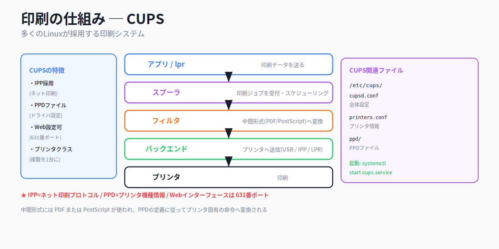

- **IPP**(Internet Printer Protocol)の採用 … ネットワーク上のプリンタをサポートし、インターネット経由の印刷も可能
- **PPD**(PostScript Printer Description)ファイルのサポート … プリンタの機種情報(ドライバ設定)をテキストファイルで持つ。`/etc/cups/ppd/` に格納
- **Webベースで設定可能** … Webブラウザで **631番ポート** に接続すると設定画面が出る
- **プリンタクラス** … 複数のプリンタを1台に見せかける機能

#### 印刷処理の流れ

CUPSの印刷処理は、次のような流れで進みます。

1. アプリケーションや印刷コマンド(**lpr**)から印刷データを受け取る
2. **スプーラ** が印刷データを受け付け、スケジューリングする(印刷待ちの管理)
3. **フィルタ** が、プリンタが直接扱えないデータを中間形式(**PDF** または **PostScript**)に変換する
4. PPDに定義されたルールで、最終的なプリンタ固有の命令に変換する
5. **CUPSバックエンド** が、印刷データをプリンタに送る(USB・IPP・LPRなど経由)

設定ファイルは、全体設定が **/etc/cups/cupsd.conf**、プリンタ情報が **/etc/cups/printers.conf** です。CUPSの起動は `systemctl start cups.service` で行います。

> 💡 試験では「**IPP**=ネット印刷プロトコル」「**PPD**=プリンタ機種情報」「Web設定は **631番ポート**」が問われます。中間形式に **PDF/PostScript** が使われる点も押さえましょう。

#### 📌 試験ポイント

| 問われ方 | 答え |
|---|---|
| Linuxの標準的な印刷システムは? | **CUPS** |
| ネットワーク印刷のプロトコルは? | **IPP** |
| プリンタの機種情報を記述するファイルは? | **PPD** |
| CUPSのWeb設定のポート番号は? | **631番** |
| 複数プリンタを1台に見せる機能は? | **プリンタクラス** |
| 全体の設定ファイルは? | **/etc/cups/cupsd.conf** |
| プリンタ情報の設定ファイルは? | **/etc/cups/printers.conf** |
| 中間形式に使われるのは? | **PDF / PostScript** |

### 10.4.2 印刷関連コマンド

#### lpr / lpq / lprm ─ BSD系の印刷コマンド

印刷を操作する基本コマンドは3つです。歴史あるBSD LPR印刷システム由来のコマンドで、「印刷する・キューを見る・削除する」に対応します。

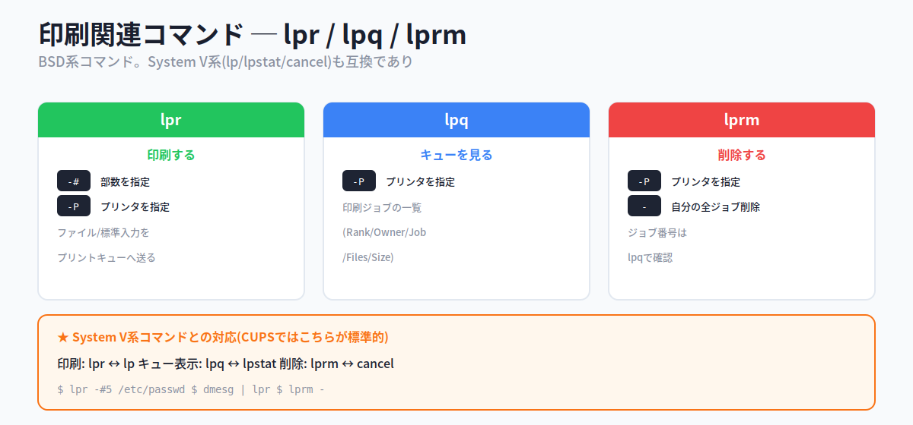

**lpr ─ 印刷する**

ファイルや標準入力を、プリントキュー(印刷待ちの列)に送ります。

| オプション | 説明 |
|---|---|
| **-#部数** | 印刷部数を指定 |
| **-Pプリンタ名** | 印刷するプリンタを指定 |

```bash
$ lpr -#5 /etc/passwd      # /etc/passwd を5部印刷
$ dmesg | lpr              # 標準入力からも受け取れる
```

**lpq ─ プリントキューを見る**

印刷ジョブ(印刷指示)は、プリントキューに入って順番に処理されます。その内容を表示します。Rank(状態)・Owner(指示者)・Job(ジョブ番号)・Files(ファイル名)・Total Size が表示されます。`-Pプリンタ名` でプリンタを指定できます。

**lprm ─ 印刷ジョブを削除する**

プリントキューにある印刷要求を削除します。一般ユーザーは自分の要求のみ、root はすべての要求を削除できます。ジョブ番号は lpq で確認します。オプションに **`-`** を使うと、自分の全印刷ジョブを削除します。

```bash
$ lprm -        # 自分の印刷ジョブをすべて削除
```

#### System V系コマンドとの対応

lpr/lpq/lprm はBSD系ですが、これと互換の **System V印刷システム** のコマンド群もあり、**CUPSではむしろこちらが標準的** です。対応を覚えておきましょう。

| 操作 | BSD系 | System V系 |
|---|---|---|
| 印刷 | **lpr** | **lp** |
| キュー表示 | **lpq** | **lpstat** |
| 削除 | **lprm** | **cancel** |

> 💡 **覚え方Hack ─ BSDとSystem Vの対応**。「lpr↔lp(印刷)」「lpq↔lpstat(状態=statを見る)」「lprm↔cancel(キャンセル=削除)」。なお Debian で lpr 系を使うには **cups-bsd** パッケージが必要です。

#### 📌 試験ポイント

| 問われ方 | 答え |
|---|---|
| ファイルを印刷するコマンドは?(BSD系) | **lpr** |
| 印刷部数を指定するオプションは? | **-#** |
| プリンタを指定するオプションは? | **-P** |
| プリントキューを表示するコマンドは? | **lpq** |
| 印刷ジョブを削除するコマンドは? | **lprm** |
| 自分の全ジョブを削除する引数は? | **-** |
| System V系の印刷コマンドは? | **lp** |
| System V系のキュー表示・削除は? | **lpstat / cancel** |

#### 📝 ここまでのまとめ

- 印刷システムは **CUPS**。特徴: **IPP**(ネット印刷)/ **PPD**(機種情報)/ Web設定(**631番**)/ プリンタクラス
- 印刷の流れ: アプリ/lpr → スプーラ → フィルタ(中間形式 **PDF/PostScript**)→ バックエンド → プリンタ
- 設定: **/etc/cups/cupsd.conf**(全体)・**/etc/cups/printers.conf**(プリンタ)
- BSD系: **lpr**(印刷・-#部数 / -Pプリンタ)/ **lpq**(キュー)/ **lprm**(削除・`-`で全部)
- System V系(CUPS標準): **lp / lpstat / cancel**

---

## 📝 全体まとめ ─ ここまでの学習内容

このセクションを終えた時点で、次のことができるようになっているはずです：

1. **ハードウェアクロック**(電源OFFでも動く)と **システムクロック**(起動中に使う)を区別できる
2. 起動時にハードウェア→システムへ同期し、その後ずれることが分かる
3. **date** でシステムクロックを表示・設定でき、**`+`** で表示書式を指定できると分かる
4. **hwclock** の **-w**(systohc)/ **-s**(hctosys)の向きが分かる
5. **timedatectl** で日時・TZ・NTPをまとめて管理できると分かる
6. **NTP** がネットワーク経由の時刻同期だと分かる
7. NTPの階層 **Stratum**(0が最上位、数字が増えると下位)が分かる
8. **ntpdate**(取得)・**ntpq -p**(状態)が分かる
9. NTP設定 **/etc/ntp.conf**(server)・補正 **/etc/ntp.drift** が分かる
10. **Chrony**(chronyd + chronyc、/etc/chrony.conf)が ntpd の代替だと分かる
11. ログ処理ソフトに **syslog / rsyslog / syslog-ng** があると分かる
12. rsyslogの書式 **ファシリティ.プライオリティ 出力先** が分かる
13. ファシリティ(生成元)とプライオリティ(重要度)の主な値を答えられる
14. 指定プライオリティ「以上」が出力され、**none** で除外すると分かる
15. **@=UDP / @@=TCP** で他ホストへ送ると分かる
16. **logger** で手動ログ生成できると分かる
17. **/var/log/messages**(一般)・**/var/log/secure**(認証)が分かる
18. ログ監視は **tail -f**、絞り込みは **grep** だと分かる
19. **who / w**(現在)・**last**(履歴)・**lastlog**(最終)を区別できる
20. **journalctl** でジャーナルを見られ、**-f** で追尾できると分かる
21. ジャーナルの永続化が **Storage=persistent** だと分かる
22. **ログローテーション** を **logrotate**(cronで実行)が担うと分かる
23. logrotate設定(weekly / rotate N / create / compress)が分かる
24. メールの **MUA / MTA / MDA** の役割を区別できる
25. 配送先を **MXレコード** で調べ、メールボックスが **/var/spool/mail/** だと分かる
26. MTAが **SMTP・25番ポート** で動き、Postfix/sendmail/exim があると分かる
27. **mail** でメール送受信(-s 件名、`.` で終了)できると分かる
28. メール転送の **/etc/aliases**(要 **newaliases**)と **~/.forward** を区別できる
29. 印刷システム **CUPS** の特徴(IPP / PPD / 631番 / プリンタクラス)が分かる
30. 印刷コマンド **lpr / lpq / lprm** と System V系 **lp / lpstat / cancel** を区別できる

第10章は、コマンドのオプション・設定ファイルの書式・ポート番号と、暗記が点数に直結する項目が多い章です。「date/hwclockの向き」「rsyslogのファシリティ.プライオリティ」「tail -fで監視」「MUA/MTA/MDA」「newaliases必須」「CUPSは631番」を確実に押さえれば、トピック108の得点源になります。

---

## 事前チェックリスト

研修当日の朝、これに自信を持って「✓」を付けられる状態が理想です。
分からない項目があれば、該当セクションに戻って読み直してください。

### システムクロックの設定（10.1）

- [ ] **ハードウェアクロック**(電源OFFでも電池で動く)が分かる
- [ ] **システムクロック**(カーネル内・起動中に使用)が分かる
- [ ] 起動時にハードウェア→システムへ同期すると分かる
- [ ] その後は別々に進みずれが生じると分かる
- [ ] **date** でシステムクロックを表示できると分かる
- [ ] rootなら date で設定できると分かる
- [ ] date の **`+`** で表示書式を指定できると分かる
- [ ] %Y %m %d %H %M %a の意味が分かる
- [ ] **hwclock** でハードウェアクロックを操作すると分かる
- [ ] **-w**(--systohc)システム→ハードウェアが分かる
- [ ] **-s**(--hctosys)ハードウェア→システムが分かる
- [ ] **-r**(--show)表示が分かる
- [ ] **timedatectl** で日時・TZ・NTPを管理すると分かる
- [ ] timedatectl は両方の時計を同時設定すると分かる
- [ ] **NTP** がネット経由の時刻同期だと分かる
- [ ] **Stratum**(0が最上位、数字増で下位)が分かる
- [ ] **ntpdate** で時刻を取得すると分かる
- [ ] **ntpq -p** で状態照会すると分かる
- [ ] NTP設定 **/etc/ntp.conf**(server)が分かる
- [ ] 補正情報 **/etc/ntp.drift** が分かる
- [ ] **Chrony**(chronyd + chronyc)が分かる
- [ ] Chrony設定 **/etc/chrony.conf** が分かる
- [ ] ntpとchronyは併用不可と分かる

### システムログの設定（10.2）

- [ ] ログ処理ソフト(syslog / rsyslog / syslog-ng)が分かる
- [ ] rsyslog設定 **/etc/rsyslog.conf** と /etc/rsyslog.d/ が分かる
- [ ] 書式 **ファシリティ.プライオリティ 出力先** が分かる
- [ ] **ファシリティ**(生成元: auth, cron, kern, mail等)が分かる
- [ ] **プライオリティ**(emerg〜debug, none)が分かる
- [ ] 指定プライオリティ「以上」が出力されると分かる
- [ ] 低いプライオリティほど出力量が多いと分かる
- [ ] **none** で除外すると分かる
- [ ] **\*** ですべてを表すと分かる
- [ ] **@=UDP / @@=TCP** で他ホストへ送ると分かる
- [ ] **logger** で手動ログ生成すると分かる
- [ ] **/var/log/messages**(一般)が分かる
- [ ] **/var/log/secure**(認証)が分かる
- [ ] **tail -f** でリアルタイム監視すると分かる
- [ ] **grep** で絞り込むと分かる
- [ ] **who / w**(現在ログイン)が分かる
- [ ] **last**(履歴・wtmp)が分かる
- [ ] **lastlog**(最終ログイン)が分かる
- [ ] utmp/wtmpがバイナリだと分かる
- [ ] **journalctl** でジャーナルを見ると分かる
- [ ] journalctl の **-f**(追尾)が分かる
- [ ] ジャーナル永続化 **Storage=persistent** が分かる
- [ ] **ログローテーション** が肥大化を防ぐと分かる
- [ ] **logrotate** が cron で実行されると分かる
- [ ] 設定 **/etc/logrotate.conf** が分かる
- [ ] rotate / create / compress / weekly が分かる

### メール管理（10.3）

- [ ] **MUA**(メールソフト)が分かる
- [ ] **MTA**(配送サーバ・SMTP)が分かる
- [ ] **MDA**(メールボックスに格納)が分かる
- [ ] 配送先を **MXレコード** で調べると分かる
- [ ] メールボックス **/var/spool/mail/** が分かる
- [ ] 受信は **POP / IMAP** だと分かる
- [ ] 代表的MTA(Postfix / sendmail / exim)が分かる
- [ ] SMTPが **25番ポート** だと分かる
- [ ] netstatで稼働MTAを確認できると分かる
- [ ] **mail** でメール送受信すると分かる
- [ ] **-s** で件名を指定すると分かる
- [ ] 本文は **`.`** で終了すると分かる
- [ ] 引数なしの mail で受信確認すると分かる
- [ ] **mailq** でメールキューを確認すると分かる
- [ ] **/etc/aliases**(管理者・別名)が分かる
- [ ] 編集後に **newaliases** が必要だと分かる
- [ ] **~/.forward**(ユーザー各自・転送)が分かる

### プリンタ管理（10.4）

- [ ] 印刷システム **CUPS** が分かる
- [ ] **IPP**(ネット印刷)が分かる
- [ ] **PPD**(プリンタ機種情報)が分かる
- [ ] Web設定が **631番ポート** だと分かる
- [ ] **プリンタクラス**(複数を1台に)が分かる
- [ ] 設定 **/etc/cups/cupsd.conf**(全体)が分かる
- [ ] **/etc/cups/printers.conf**(プリンタ)が分かる
- [ ] 中間形式が **PDF / PostScript** だと分かる
- [ ] **lpr**(印刷)・**-#**(部数)・**-P**(プリンタ)が分かる
- [ ] **lpq**(プリントキュー表示)が分かる
- [ ] **lprm**(削除)・**-**(自分の全ジョブ)が分かる
- [ ] System V系 **lp / lpstat / cancel** が分かる

### コマンド総まとめ（暗記）

これらを「見ただけで何をするか」答えられるようになっていれば理想です：

| コマンド | これは何? |
|---|---|
| `date` / `date "+%Y%m%d"` | |
| `date 121020002018` | |
| `hwclock -r` / `-w` / `-s` | |
| `timedatectl set-timezone Asia/Tokyo` | |
| `timedatectl set-ntp yes` | |
| `ntpdate time.example.com` | |
| `ntpq -p` | |
| `chronyc sources` / `tracking` | |
| `logger -p syslog.info -t Test 'msg'` | |
| `tail -f /var/log/messages` | |
| `grep eth0 /var/log/messages` | |
| `who` / `w` | |
| `last` / `lastlog` | |
| `journalctl -f` / `-u Unit` | |
| `mail -s 'title' user` | |
| `mailq` | |
| `newaliases` | |
| `netstat -atnp \| grep 25` | |
| `lpr -#5 file` | |
| `lpq` | |
| `lprm -` | |
| `lp` / `lpstat` / `cancel` | |

### ファイル・パス総まとめ（暗記）

| パス | これは何? |
|---|---|
| `/etc/ntp.conf` | |
| `/etc/ntp.drift` | |
| `/etc/chrony.conf` | |
| `/etc/rsyslog.conf` / `/etc/rsyslog.d/` | |
| `/var/log/messages` | |
| `/var/log/secure` | |
| `/var/run/utmp` | |
| `/var/log/wtmp` | |
| `/var/log/lastlog` | |
| `/etc/systemd/journald.conf` | |
| `/var/log/journal` | |
| `/etc/logrotate.conf` | |
| `/etc/aliases` / `/etc/aliases.db` | |
| `~/.forward` | |
| `/var/spool/mail/` | |
| `/etc/cups/cupsd.conf` | |
| `/etc/cups/printers.conf` | |

### 設定ファイルの書式総まとめ（暗記）

| 書式 | 構成 |
|---|---|
| rsyslog.conf のルール | |
| date の設定書式 | |
| logrotate の主なキーワード | |

### 用語総まとめ（暗記）

これらの用語を「自分の言葉で説明できる」状態が目標：

- [ ] システムクロック / ハードウェアクロック（RTC）
- [ ] NTP / Stratum
- [ ] Chrony
- [ ] syslog / rsyslog
- [ ] ファシリティ / プライオリティ
- [ ] セレクタフィールド / アクションフィールド
- [ ] ジャーナル（journald）
- [ ] ログローテーション
- [ ] MUA / MTA / MDA
- [ ] SMTP / POP / IMAP
- [ ] MXレコード
- [ ] メールエイリアス / メールキュー
- [ ] CUPS
- [ ] IPP / PPD
- [ ] スプーラ / フィルタ / バックエンド
- [ ] プリントキュー / 印刷ジョブ
- [ ] タイムゾーン（第9章の復習）
- [ ] 環境変数 TZ（第7・9章の復習）
- [ ] systemd / Unit（第1章の復習）

---

## 研修当日に向けて

事前学習がきちんとできていれば、研修当日は以下の流れで進みます：

1. **おさらい**（このチェックリストの中から数問）
2. **Hackの説明**（覚え方のコツ、暗記時間）
3. **テスト**（実際の試験問題を含む）
4. **答え合わせ・おさらい**

第10章は、コマンドのオプション・設定ファイルの書式・ポート番号など、**暗記が点数に直結** するテーマが多い章です。覚えることが多く見えますが、規則性をつかめば楽になります。「hwclock は **SYStem TO Hardware Clock**」「Stratumは数字が増えると下位」「監視は **tail -f**」「メールは **U→T→D**(MUA→MTA→MDA)」「aliasesを編集したら **newaliases**」「CUPSは **631番**」── このように、この資料に散りばめたHack(覚え方のコツ)を手がかりに読み進めてください。

研修当日にいきなり知らないコマンドやファイル名が並ぶと焦ってしまうものです。事前にこの資料で予備知識を入れておけば、当日は **「あ、これ事前学習で見た」** という安心感を持ちながら進められます。
分からない部分があっても**慌てる必要はありません**。一度通読してから、チェックリストで自分のウィークポイントを把握しておけば、研修で確実に固められます。

頑張ってください。
