# 第11章：ネットワークの基礎

> **この資料について**
> これは研修当日のための **予備知識** をまとめた資料です。
> 研修当日は **おさらい → 暗記のコツの説明 → テスト → 答え合わせ** という流れで進むため、当日「初めて聞く話」が出てこないように、ここで必要な前提をひと通り押さえておきます。
>
> ネットワークを触ったことがなくても理解できるよう、できるだけ身近な例で書いています。
>
> **前提**
> この資料は、101編（第1章〜第5章）の基礎知識があることを前提にしています。とくに、システムサービスを管理する **systemd / systemctl**（第10章）、設定ファイルの編集、`/proc` などの **仮想ファイルシステム**（第5章）は本章でも再登場します。あやしい場合は先にそちらを確認してください。
>
> **この章の重要度について**
> 第11章は、LPIC-1 102試験の試験範囲「トピック109（ネットワークの基礎）」に対応する重要章です。「TCP/UDP/IP/ICMPの違い」「IPアドレスのクラスとプライベートアドレス」「サブネットマスク・CIDR」「ウェルノウンポート番号」「ネットワーク設定ファイル」「ping/traceroute/ip/netstatなどのコマンド」「DNSの設定ファイルと管理コマンド」は試験で確実に複数問出題されます。とくに **プライベートアドレスの範囲・ポート番号・コマンドの使い分け** は丸暗記レベルで覚える必要があります。
>
> **読み方の指針**
> 1. まずは1回ざっと通読してください（細かい暗記は不要）
> 2. 各セクションの「📌 試験ポイント」と「📝 ここまでのまとめ」を見直してください
> 3. 巻末の「事前チェックリスト」で自分の理解度を測ってください
> 4. 研修当日は、このチェックリストのおさらいから始まります

---

<!-- ## 目次

- [11.1 TCP/IPの基礎](#111-tcpipの基礎)
  - [11.1.1 TCP/IPプロトコル](#1111-tcpipプロトコル)
  - [11.1.2 IPアドレス（IPv4）](#1112-ipアドレスipv4)
  - [11.1.3 IPアドレス（IPv6）](#1113-ipアドレスipv6)
  - [11.1.4 ポート](#1114-ポート)
- [11.2 ネットワークの設定](#112-ネットワークの設定)
  - [11.2.1 ネットワークの基本設定](#1121-ネットワークの基本設定)
  - [11.2.2 NetworkManagerによる設定](#1122-networkmanagerによる設定)
- [11.3 ネットワークのトラブルシューティング](#113-ネットワークのトラブルシューティング)
  - [11.3.1 主なネットワーク設定・管理コマンド](#1131-主なネットワーク設定管理コマンド)
  - [11.3.2 ネットワークインターフェースの設定](#1132-ネットワークインターフェースの設定)
- [11.4 DNSの設定](#114-dnsの設定)
  - [11.4.1 DNSの概要](#1141-dnsの概要)
  - [11.4.2 DNSの設定ファイル](#1142-dnsの設定ファイル)
  - [11.4.3 systemd-resolved](#1143-systemd-resolved)
  - [11.4.4 DNS管理コマンド](#1144-dns管理コマンド)
- [全体まとめ](#-全体まとめ--ここまでの学習内容)
- [事前チェックリスト](#事前チェックリスト)

-->

---

## 11.1 TCP/IPの基礎

### ここで学ぶこと

- ネットワーク通信の「お約束ごと」である **プロトコル** という考え方
- インターネットの共通言語 **TCP/IP** と、その中身（**TCP / UDP / IP / ICMP**）
- 通信に住所をつける **IPアドレス**（IPv4・IPv6）と、住所を区切る **サブネットマスク**
- アプリごとの「窓口番号」である **ポート** と、暗記必須の **ウェルノウンポート**

通信を行う上での取り決めのことを **プロトコル** といいます。人間同士なら「日本語で話す」「敬語を使う」といったルールがあるように、コンピュータ同士の通信にもルールが必要です。現在、企業・家庭内のLANやインターネットでもっとも一般的に使われているプロトコルが **TCP/IP** です。

> 💡 **イメージ ─ プロトコルは「共通の話し方」**
> 世界中の人がバラバラの言語で話すと会話になりません。「みんな英語で話そう」と決めれば通じ合えます。TCP/IPは、世界中のコンピュータが採用した「共通の話し方」だと考えてください。

### 11.1.1 TCP/IPプロトコル

#### TCP/IPは「プロトコルの集まり」

TCPとIPは、本来は別々のプロトコルです。これにUDPなどの関連プロトコルを含め、**プロトコル群（集まり）** としてまとめて **TCP/IP** と総称しています。

通信の機能はとても複雑なので、役割ごとに **階層（レイヤー）** に分けて整理します。その代表が **OSI参照モデル（7階層）** で、TCP/IPはこれをより実用的な **4階層** に集約したものと対比できます。

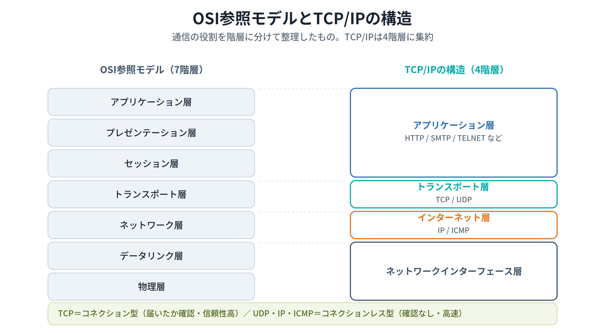

> 💡 **覚え方Hack ─ 階層は「郵便のしくみ」**
> 手紙を出すとき、あなたは「文章を書く（アプリケーション層）」だけで、あとは郵便屋さんが「住所で仕分け（IP）」「確実に届ける／早く届ける（TCP／UDP）」を担当します。階層に分けると、上の人は下の人の仕事の中身を知らなくても通信できる、というのがポイントです。

#### 代表的なプロトコル ─ TCP・UDP・IP・ICMP

試験で必ず問われるのが、次の4つの違いです。とくに **「コネクション型」か「コネクションレス型」か** を区別できるようにしてください。

| プロトコル | 型 | 特徴 | 主な用途 |
|---|---|---|---|
| **TCP**（Transmission Control Protocol） | コネクション型 | 相手に届いたか確認しながら通信。**信頼性が高い**。消失したパケットの**再送**、伝送順序の**整列**を行う | FTP / Telnet / POP / SMTP など |
| **UDP**（User Datagram Protocol） | コネクションレス型 | 届いたか確認しない。**高速・低コスト** | 音声・映像のストリーミング配信 |
| **IP**（Internet Protocol） | コネクションレス型 | データ転送（**ルーティング**）をつかさどる。IPアドレスの規定、データグラム（伝送単位）の規定、経路の制御 | すべてのIP通信の土台 |
| **ICMP**（Internet Control Message Protocol） | コネクションレス型 | エラーメッセージや制御メッセージを伝送 | **ping** / **traceroute** |

> 💡 **覚え方Hack ─ コネクション型 vs コネクションレス型**
> **コネクション型（TCP）** は「電話」。相手が出て（接続を確認して）から話し、聞こえなければ「もう一回言って（再送）」と頼みます。確実ですが手間がかかります。
> **コネクションレス型（UDP・IP・ICMP）** は「ポストに手紙を投函」。届いたかは確認せず一方的に送ります。速いですが、確実に届く保証はありません。

> ⚠ **超頻出** ─ 「ping や traceroute で使われる、エラー/制御メッセージのコネクションレス型プロトコルは？」と問われたら答えは **ICMP**。TCPやIPと混同しないように。

#### 📌 試験ポイント

| 問われ方 | 答え |
|---|---|
| TCP/IPはOSI参照モデルの何階層に集約される？ | **4階層**（アプリケーション/トランスポート/インターネット/ネットワークインターフェース） |
| 信頼性の高いコネクション型のプロトコルは？ | **TCP** |
| 高速だが到達確認しないコネクションレス型は？ | **UDP** |
| ルーティング（経路制御）をつかさどるのは？ | **IP** |
| ping・tracerouteで使われるプロトコルは？ | **ICMP** |
| TCPの代表的な機能は？ | **パケットの再送・伝送順序の整列** |
| UDPの代表的な用途は？ | **音声・映像のストリーミング配信** |

### 11.1.2 IPアドレス（IPv4）

#### IPアドレスは「ネットワーク上の住所」

TCP/IPでは、ネットワークに接続された機器を識別するために **IPアドレス** を使います。IPv4のIPアドレスは **32ビット** で構成され、通常は **8ビットごとに「.」で区切って10進数** で表記します。

```
2進数表記：  11000000 . 10101000 . 00000001 . 00000010
10進数表記：     192   .   168    .    1     .     2
```

> 💡 **覚え方Hack ─ 8ビット＝0〜255**
> 8ビットで表せる数は2の8乗＝256通り、つまり **0〜255** です。だからIPアドレスの各区切り（オクテット）は255までしかありません。「256.1.1.1」のようなアドレスは存在しません。

#### ネットワーク部とホスト部 ─ サブネットマスクで区切る

IPアドレスは、**ネットワーク部**（どのネットワークか）と **ホスト部**（その中のどの機器か）に分けられます。両者の境界は、IPアドレスとセットで使う **サブネットマスク** で決まります。サブネットマスクも32ビットで、IPアドレスとの **論理積（AND）** をとると、ネットワーク自身を表す **ネットワークアドレス** を算出できます。

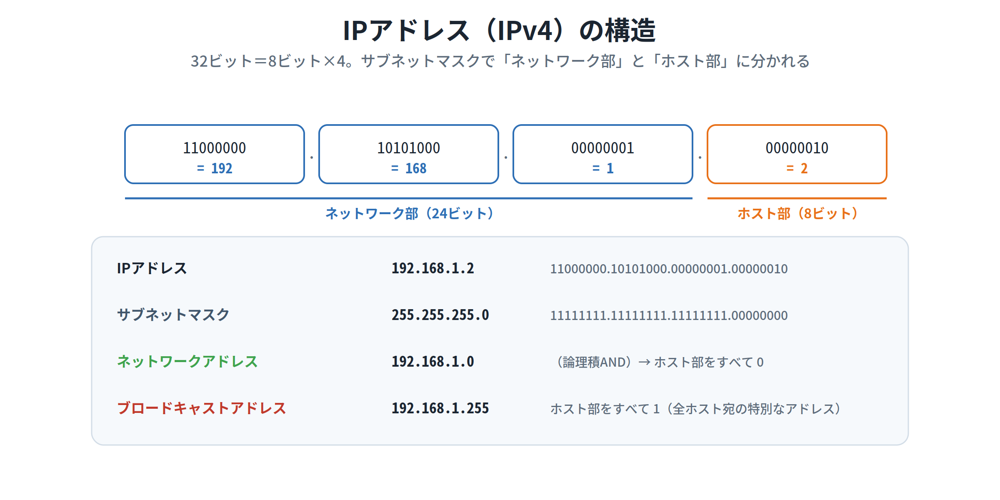

ホスト部のビットを **すべて1** にしたアドレスは **ブロードキャストアドレス** と呼ばれ、同じネットワークに属する全ホストへ一斉送信するための特別なアドレスです。

> ⚠ **頻出ルール** ─ **ネットワークアドレス**（ホスト部すべて0）と **ブロードキャストアドレス**（ホスト部すべて1）は、ネットワークデバイスに **割り当てることができません**。だからクラスCの1ネットワークでは、256個のうち使えるホストは「254個」になります（256 − ネットワークアドレス1 − ブロードキャスト1）。

> 💡 **「ホスト」という言葉に注意**
> TCP/IPでは、IPアドレスを持つ機器全般を「ホスト」と呼びます（大型コンピュータだけではありません）。また、IPアドレスはホスト本体ではなく **ネットワークインターフェース（NICなど）** に論理的に割り当てられるので、1台のホストが複数のIPアドレスを持つこともあります。なお、ネットワークアドレスが異なるネットワークへは、**ルータを介さなければ通信できません**。

#### クラスとプライベートアドレス

IPアドレスには **クラス** という概念があり、ネットワーク部の長さで区分されます。あわせて、ローカルネットワーク内で自由に使える **プライベートアドレス** の範囲が決まっています。**ここは暗記必須** です。

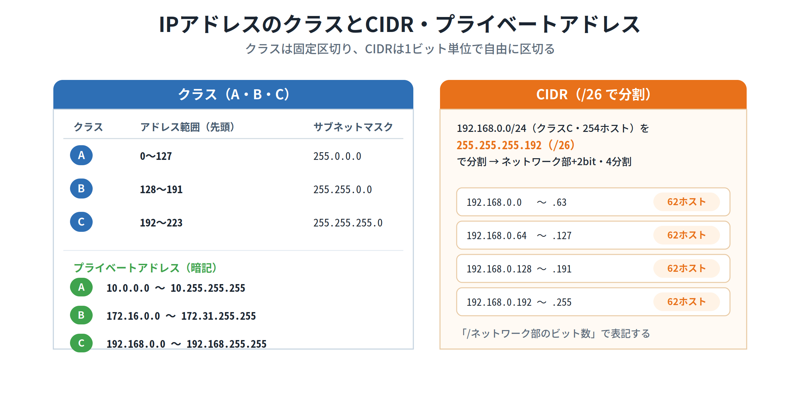

| クラス | ネットワーク部 | 先頭オクテットの範囲 | デフォルトのサブネットマスク |
|---|---|---|---|
| **A** | 8ビット | 0 〜 127 | 255.0.0.0 |
| **B** | 16ビット | 128 〜 191 | 255.255.0.0 |
| **C** | 24ビット | 192 〜 223 | 255.255.255.0 |

特殊なアドレスとして、先頭8ビットが **0** はデフォルトルート、**127** は自分自身を表す **ローカルループバック**（127.0.0.1など）になっています。

| クラス | プライベートアドレスの範囲（暗記） |
|---|---|
| **A** | 10.0.0.0 〜 10.255.255.255 |
| **B** | 172.16.0.0 〜 172.31.255.255 |
| **C** | 192.168.0.0 〜 192.168.255.255 |

> 💡 **覚え方Hack ─ プライベートアドレスは「10・172.16〜31・192.168」**
> 家庭やオフィスのWi-Fiでよく見る `192.168.x.x` がクラスCのプライベートアドレスです。クラスBは **172.16〜172.31**（17ではなく16〜31の範囲なのが引っかけポイント）、クラスAは **10で始まるもの全部**。この3つはセットで丸暗記しましょう。

#### CIDR ─ 1ビット単位で柔軟に区切る

クラスによる区分は大ざっぱで、最少でも組織ごとに256個のIPアドレスを消費してしまいます。そこで、ネットワーク部を **1ビット単位** で扱える **CIDR（Classless Inter-Domain Routing）** が規定されました。

たとえばサブネットマスクを `255.255.255.192`（**26ビット**）にすると、ホスト部が2ビット減る代わりにネットワーク部が2ビット増え、`192.168.0.0/24` を **4つのサブネットワークに分割**できます。各サブネットでは62ホストを扱えます。このネットワークは `192.168.0.0/26` のように「**/ネットワーク部のビット数**」で表記します。

> 💡 **覚え方Hack ─ 「/24」は「上から24ビットがネットワーク部」**
> `/24` は「255.255.255.0」と同じ意味（1が24個）。`/26` なら1が26個＝`255.255.255.192`。スラッシュの後の数字は「サブネットマスクで1が並ぶ個数」と覚えると一発で換算できます。

#### 📌 試験ポイント

| 問われ方 | 答え |
|---|---|
| IPv4アドレスは何ビット？ | **32ビット**（8ビット×4） |
| ネットワーク部とホスト部の境界を決めるのは？ | **サブネットマスク** |
| ホスト部をすべて1にしたアドレスは？ | **ブロードキャストアドレス** |
| ホストに割り当てられない2つのアドレスは？ | **ネットワークアドレス と ブロードキャストアドレス** |
| クラスAのプライベートアドレスは？ | **10.0.0.0 〜 10.255.255.255** |
| クラスBのプライベートアドレスは？ | **172.16.0.0 〜 172.31.255.255** |
| クラスCのプライベートアドレスは？ | **192.168.0.0 〜 192.168.255.255** |
| 自分自身を表す特殊アドレス（先頭127）は？ | **ローカルループバック**（127.0.0.1） |
| 1ビット単位でネットワークを区切る仕組みは？ | **CIDR** |
| `192.168.0.0/26` の「/26」の意味は？ | **先頭26ビットがネットワーク部**（マスク255.255.255.192） |

### 11.1.3 IPアドレス（IPv6）

#### IPv6は128ビット ─ 表記の省略ルールが命

IPv4のアドレスが32ビットなのに対し、**IPv6では128ビット** となっており、ほぼ無限といってよいくらいのアドレスを使えます。IPv6のアドレスは、**「:」で16ビットずつ8ブロックに区切った16進数** で表します。

表記が長くなるので、次の2つのルールで省略できます。

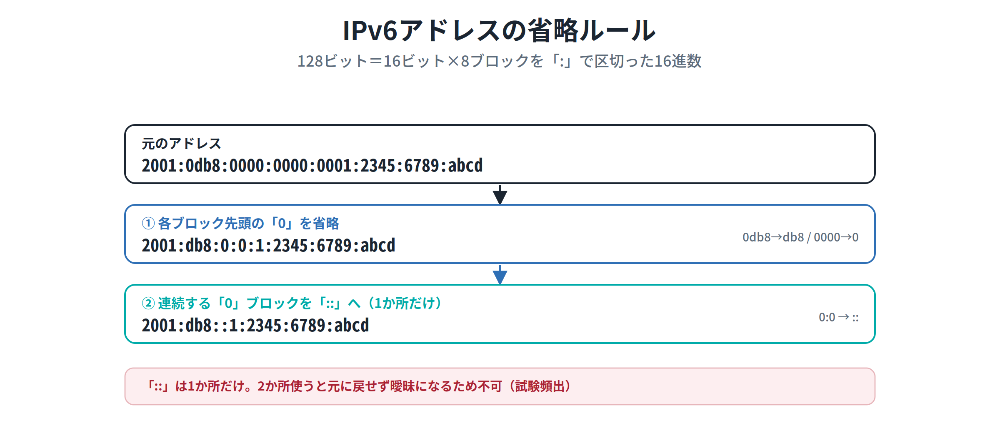

1. **各ブロックの先頭の「0」は省略できる**（例：`0db8` → `db8`、`0000` → `0`）
2. **「0」が連続するブロックは「::」で省略できる（ただし1か所だけ）**

> ⚠ **超頻出の落とし穴** ─ 「::」は **1か所だけ** しか使えません。2か所使うと、どこに何ブロックの0があったのか復元できず曖昧になるため不正解です。試験では「`2001:db8::23::45`（2か所で不可）」のような誤った選択肢がよく出ます。

#### IPv6アドレスの分類

IPv6のアドレスは、ユニキャスト・エニーキャスト・マルチキャストに分類されます。**ユニキャスト**は1つのインターフェースを識別、**エニーキャスト**は複数ホストの集合に割り当て、**マルチキャスト**はIPv4のブロードキャストに相当します。

| 分類 | IPv6表記 |
|---|---|
| ローカルループバックアドレス | **::1/128** |
| グローバルユニキャストアドレス | **2000::/3** |
| リンクローカルユニキャストアドレス | **fe80::/10** |
| マルチキャストアドレス | **ff00::/8** |

IPv6では、IPv4のネットワーク部に相当する部分を **プレフィックス**、ホスト部に相当する部分を **インターフェースID** といい、ともに **64ビット** です。

> 💡 **覚え方Hack ─ fe80で始まれば「同じLAN内専用」**
> `fe80::` で始まるリンクローカルアドレスは、同一セグメント（LAN）内だけで通じる住所です。インターネットには出られません。`ifconfig` や `ip addr` の出力で `inet6 fe80::...` をよく見かけるので、「fe80＝身内専用」と覚えておくと実機で役立ちます。

#### 📌 試験ポイント

| 問われ方 | 答え |
|---|---|
| IPv6アドレスは何ビット？ | **128ビット** |
| IPv6の区切り文字と進数は？ | **「:」で16ビットずつ8ブロック・16進数** |
| 連続する0ブロックの省略記号と回数制限は？ | **「::」・1か所だけ** |
| IPv6のループバックアドレスは？ | **::1/128** |
| 同一LAN内のみで使うアドレスは？ | **リンクローカル（fe80::/10）** |
| IPv4のブロードキャストに相当するIPv6は？ | **マルチキャストアドレス（ff00::/8）** |
| プレフィックスとインターフェースIDの長さは？ | **どちらも64ビット** |

### 11.1.4 ポート

#### ポートは「アプリの窓口番号」

1台のホストでは、Webサーバ・メールサーバ・SSHなど複数のアプリが同時に動きます。送信元・送信先のアプリを識別するために使うのが **ポート番号** です。どのアプリがどの番号を使うかが決まっているので、複数のアプリを同時に利用しても正しく処理できます（例：Webサーバは80番を監視し、ブラウザは宛先の80番にアクセス）。

主要なサービスのポート番号は標準化されており、**1023番まで** が予約されています。これを **ウェルノウンポート（Well Known Port：既知のポート）** と呼び、**IANA** が管理しています。

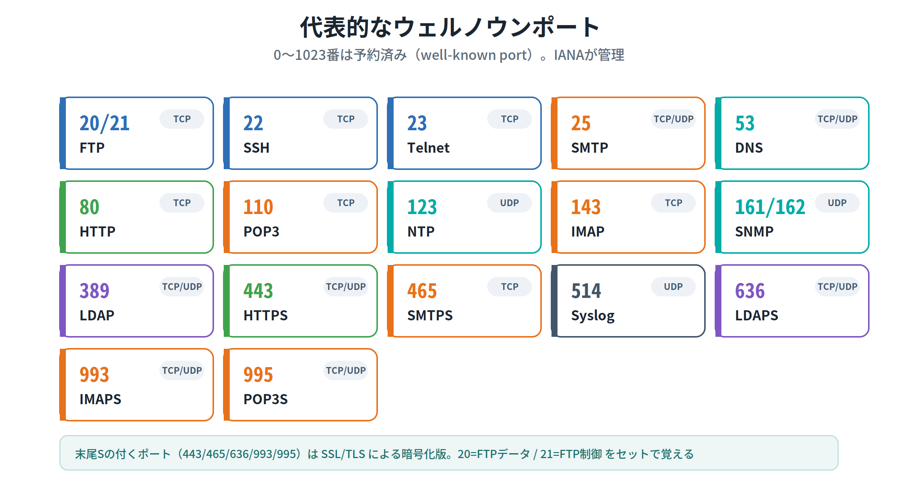

| 番号 | プロトコル | サービス | 説明 |
|---|---|---|---|
| **20** | TCP | FTP | FTPのデータ転送 |
| **21** | TCP | FTP | FTPの制御情報 |
| **22** | TCP | SSH | SSH接続 |
| **23** | TCP | Telnet | Telnet接続（暗号化なし） |
| **25** | TCP | SMTP | 電子メール（送信） |
| **53** | TCP/UDP | DNS | 名前解決 |
| **80** | TCP | HTTP | Web |
| **110** | TCP | POP3 | 電子メール（受信） |
| **123** | UDP | NTP | 時刻同期 |
| **143** | TCP | IMAP | 電子メール（受信） |
| **161 / 162** | UDP | SNMP / SNMP Trap | ネットワークの監視・警告通知 |
| **389** | TCP/UDP | LDAP | ディレクトリサービス |
| **443** | TCP | HTTPS | SSL/TLSによるHTTP |
| **465** | TCP | SMTPS | SSL/TLSによるSMTP |
| **514** | UDP | Syslog | ロギングサービス |
| **636** | TCP/UDP | LDAPS | SSL/TLSによるLDAP |
| **993** | TCP/UDP | IMAPS | SSL/TLSによるIMAP |
| **995** | TCP/UDP | POP3S | SSL/TLSによるPOP3 |

> 💡 **覚え方Hack ─ 「末尾S＝SSL/TLSの暗号化版」**
> HTTPS(443) / SMTPS(465) / LDAPS(636) / IMAPS(993) / POP3S(995) のように、サービス名の末尾に **S** が付くものは、元のプロトコルを **SSL/TLSで暗号化** した版です。暗号化なしの素のプロトコル（HTTP=80, SMTP=25, IMAP=143, POP3=110）とセットで覚えると効率的です。

> 💡 **SNMPは「2つのポート」**
> SNMPはネットワーク機器を監視・制御するプロトコルです。管理する側を **SNMPマネージャ**、監視される機器を **SNMPエージェント** といいます。マネージャからの問い合わせは **161番**、エージェントからの通知（**SNMP Trap**）は **162番** を使います。

IPv6では、`fe80::...:80` と書くと末尾の `:80` がアドレスの一部かポート番号か判別できません。そこでIPv6では **IPアドレス部分を[ ]で囲む** と定められています（例：`[fe80::20c:29ff:fe55:94ef]:80` は80番ポートを示す）。

なお、サービス名とポート番号の対応は **/etc/services** ファイルに記述されています。

#### 📌 試験ポイント

| 問われ方 | 答え |
|---|---|
| ポートで識別するものは？ | **送信元・送信先のアプリケーション** |
| ウェルノウンポートの範囲は？ | **0〜1023番** |
| ウェルノウンポートを管理する組織は？ | **IANA** |
| SSH / Telnet のポートは？ | **22 / 23** |
| SMTP / POP3 / IMAP のポートは？ | **25 / 110 / 143** |
| HTTP / HTTPS のポートは？ | **80 / 443** |
| DNS のポートは？ | **53** |
| SNMP / SNMP Trap のポートは？ | **161 / 162** |
| サービス名とポート番号の対応ファイルは？ | **/etc/services** |
| IPv6でポート番号を付けるときの表記は？ | **[IPアドレス]:ポート番号** |

#### 📝 ここまでのまとめ

11.1では、ネットワークの「言葉」と「住所」を学びました。**TCP/IP**は4階層に整理されたプロトコル群で、確実な**TCP**、高速な**UDP**、経路を担う**IP**、制御の**ICMP**を区別できることが第一歩です。**IPv4は32ビット**で、**サブネットマスク**がネットワーク部とホスト部を分け、**ネットワークアドレス**と**ブロードキャストアドレス**はホストに使えません。**プライベートアドレス（10 / 172.16〜31 / 192.168）** と **ウェルノウンポート** は暗記の山場です。**IPv6は128ビット**で、「::」は**1か所だけ**という省略ルールが頻出。次の11.2では、これらを実際に設定する方法を見ていきます。

---

## 11.2 ネットワークの設定

### ここで学ぶこと

- コマンドでの設定と **設定ファイル** での設定の違い（永続化のしくみ）
- ホスト名・名前解決・IPアドレスを記述する **主な設定ファイル** とディストリビューションごとの違い
- 最近の標準である **NetworkManager** と、その操作コマンド **nmcli / nmtui / hostnamectl**

### 11.2.1 ネットワークの基本設定

#### コマンド設定は消える、ファイル設定は残る

ネットワークの設定には2通りあります。**コマンドで設定する方法**（例：`ifconfig` でIPを設定）と、**/etc以下の設定ファイルに記述する方法** です。

ここが重要です。**コマンドでの設定は、システムやネットワーク機能を再起動すると失われてしまいます。** 再起動後も残る **永続的な設定** をしたいなら、設定ファイルに記述する必要があります。設定ファイルはディストリビューションによって異なるものがあります。

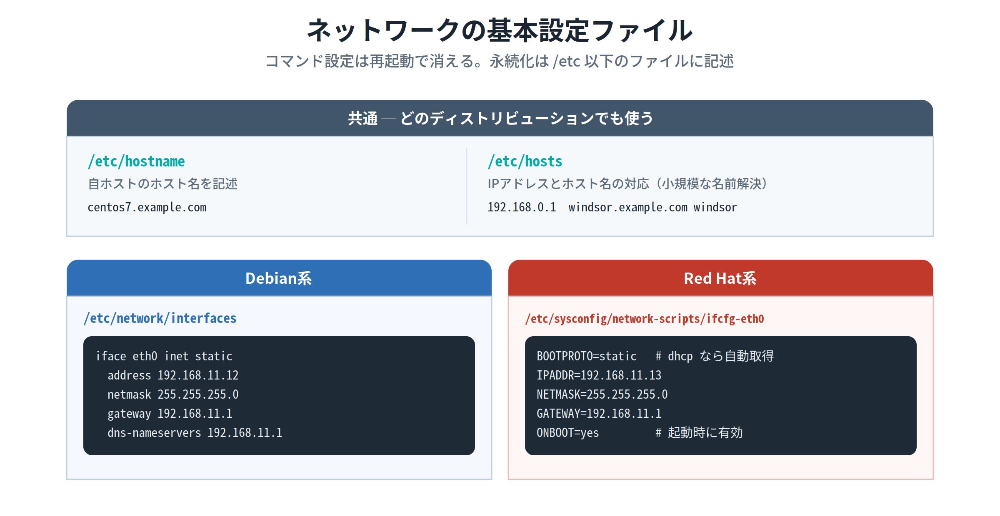

> 💡 **覚え方Hack ─ 「コマンド＝その場限り、ファイル＝ずっと残る」**
> ホワイトボードに書いた予定（コマンド設定）は消されたら終わりですが、手帳に書いた予定（ファイル設定）は残ります。試験で「再起動しても有効にしたい」とあれば、答えは必ず「設定ファイルに記述」です。

#### 全ディストリ共通のファイル

- **/etc/hostname** … 自ホストのホスト名を記述します（ディストリビューションによっては `/etc/HOSTNAME`）。
- **/etc/hosts** … ホスト名とIPアドレスの対応を記述します。小規模な閉じたネットワークなら、このファイルを全ホストに配布するだけで名前解決ができます。ただし規模が大きくなると、変更のたびに全ホストを書き換える必要があり運用が難しくなります。`IPアドレス　ホスト名　別名` をスペースで区切って記述します。

```
127.0.0.1     localhost.localdomain localhost
192.168.0.1   windsor.example.com windsor
192.168.0.2   salt.example.com salt
```

> ⚠ **引っかけ注意** ─ **/etc/hosts は「ホスト名を設定する」ファイルではありません。** ホスト名そのものは **/etc/hostname** で設定します。/etc/hosts は「IPアドレスとホスト名の対応表」です。

#### ディストリビューションごとの設定ファイル

- **Debian系：`/etc/network/interfaces`** … インターフェースの設定を記述します。`iface eth0 inet static`（固定IP）、`address`・`netmask`・`gateway`・`dns-nameservers` などを並べます。
- **Red Hat系：`/etc/sysconfig/network-scripts/ifcfg-<IF名>`** … インターフェースごとに設定ファイルが置かれます（eth0なら `ifcfg-eth0`）。`BOOTPROTO`（`static`=固定 / `dhcp`=自動取得）、`IPADDR`・`NETMASK`・`GATEWAY`・`ONBOOT`（起動時に有効化）などを記述します。

> 参考：最近のRHEL7 / CentOS7 以降では、これらのファイルを直接編集するのではなく、次項の **nmtui / nmcli** コマンドで設定することが推奨されています。

#### 📌 試験ポイント

| 問われ方 | 答え |
|---|---|
| コマンドで設定した内容はどうなる？ | **再起動で失われる**（永続化はファイルに記述） |
| ホスト名を設定するファイルは？ | **/etc/hostname** |
| IPアドレスとホスト名の対応を書くファイルは？ | **/etc/hosts** |
| /etc/hosts の記述順は？ | **IPアドレス　ホスト名　別名**（スペース区切り） |
| Debian系のIF設定ファイルは？ | **/etc/network/interfaces** |
| Red Hat系のIF設定ファイルは？ | **/etc/sysconfig/network-scripts/ifcfg-eth0** |
| ifcfgファイルでDHCP/固定を切り替える項目は？ | **BOOTPROTO**（dhcp / static） |

### 11.2.2 NetworkManagerによる設定

#### NetworkManagerと操作コマンド

CentOSやRed Hat Enterprise Linuxでは、ネットワークを管理するサブシステムとして **NetworkManager** が導入されています。利用しているかは `systemctl status NetworkManager` で確認できます。

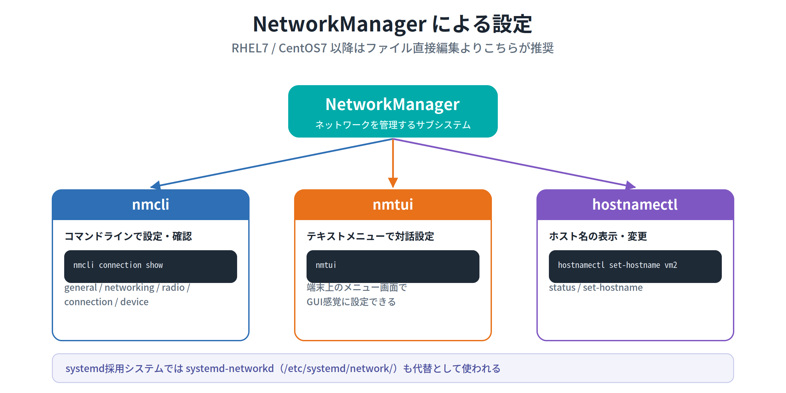

NetworkManagerでは、**nmcli** コマンドで設定・接続管理・状態確認を行います。書式は次のとおりです。

```bash
nmcli オブジェクト [コマンド]
```

「オブジェクト」は操作対象のカテゴリで、主に次のものがあります。**オブジェクト名は省略できます**（`networking` を `n` など）。**参照するだけなら一般ユーザー**でも実行できますが、**変更を伴う操作はroot権限**が必要です。

| オブジェクト | 役割 |
|---|---|
| **general** | NetworkManagerの状態・ホスト名など全般 |
| **networking** | ネットワーク管理全般（`connectivity check` で再確認） |
| **radio** | 無線（Wi-Fi / WWAN）の有効・無効 |
| **connection** | 接続の表示・追加・有効/無効 |
| **device** | デバイスの状態・接続/切断 |

```bash
$ nmcli general status              # NetworkManagerの状態を表示
# nmcli radio wifi on               # Wi-Fiを有効化
# nmcli connection show             # 接続の一覧（有線/無線）
# nmcli connection add type ethernet ifname enp0s3 con-name eth1   # 接続を追加
# nmcli connection modify eth1 ipv4.method auto                    # DHCPに設定
```

#### hostnamectl ─ ホスト名の表示・変更

ホスト名の設定には **hostnamectl** コマンドを使います。サブコマンドなし（または `status`）で関連情報を表示し、`set-hostname` で変更します。

```bash
$ hostnamectl                       # ホスト名と関連情報を表示
# hostnamectl set-hostname vm2      # ホスト名を vm2 に変更
```

| サブコマンド | 説明 |
|---|---|
| **status** | ホスト名と関連情報を表示（デフォルト） |
| **set-hostname ホスト名** | ホスト名を設定する |

> 参考：systemd採用システムでは、ネットワーク管理の仕組みとして **systemd-networkd**（設定は `/etc/systemd/network` 以下）もあり、NetworkManagerやnetplan（Ubuntu）の代替となります。

#### 📌 試験ポイント

| 問われ方 | 答え |
|---|---|
| RHEL/CentOSのネットワーク管理サブシステムは？ | **NetworkManager** |
| NetworkManagerを操作する主なコマンドは？ | **nmcli** |
| nmcliの書式は？ | **nmcli オブジェクト [コマンド]** |
| 接続一覧を表示するには？ | **nmcli connection show**（connは省略形） |
| nmcliで参照のみと変更、権限の違いは？ | **参照は一般ユーザー可・変更はroot** |
| テキストメニューで対話設定するコマンドは？ | **nmtui** |
| ホスト名を変更するコマンドは？ | **hostnamectl set-hostname ホスト名** |
| systemd採用システムの代替管理機構は？ | **systemd-networkd**（/etc/systemd/network） |

#### 📝 ここまでのまとめ

11.2では「設定の永続化」がテーマでした。**コマンド設定は再起動で消える**ので、残したいなら **設定ファイル**（Debian系=`/etc/network/interfaces`、Red Hat系=`ifcfg-eth0`）に書きます。**ホスト名は/etc/hostname、対応表は/etc/hosts** という役割の違いは頻出。そして最近の標準である **NetworkManager** は **nmcli**（`オブジェクト コマンド` の形）で操作し、ホスト名は **hostnamectl** で変える、という流れを押さえてください。次の11.3では、設定がうまくいかないときに使う「調査コマンド」を学びます。

---

## 11.3 ネットワークのトラブルシューティング

### ここで学ぶこと

- 「何を調べたいか」で使い分ける **トラブルシュート用コマンド** の全体像
- 死活確認の **ping**、経路調査の **traceroute / tracepath**、状態表示の **netstat**、通信テストの **nc**
- ルーティングの **route / ip**、インターフェースの **ifconfig / ip / ifup・ifdown**
- 旧コマンド（net-tools）と新コマンド（**ip・ss**）の対応関係

ネットワークのトラブルに対処するには、技術的な理解に加えて、状況を調べる **各種コマンド** の理解が欠かせません。まずは全体像をつかみましょう。

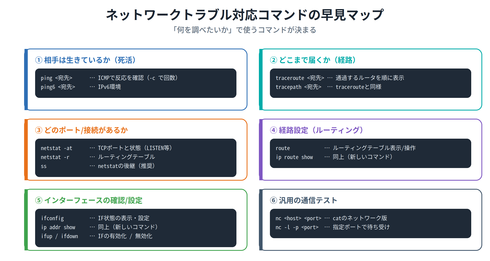

### 11.3.1 主なネットワーク設定・管理コマンド

#### ping ─ 相手が生きているか確認する

指定したホスト（ホスト名またはIPアドレス）に **ICMPパケット** を送り、その反応を表示します。たとえばWebページが表示されないとき、「サーバソフトがダウンしているのか、ホスト自体がダウンしているのか」を切り分けられます（ホストが動いていれば、Webサーバが落ちていても反応は返ります）。Linuxのpingは、回数を指定しないと **Ctrl+C を押すまで** 送り続けます。

```bash
# ping -c 4 www.lpi.org     # 4回だけICMPパケットを送る
```

| オプション | 説明 |
|---|---|
| **-c 回数** | 指定した回数だけICMPパケットを送信する |
| **-i 間隔** | 指定した間隔（秒）ごとに送信する（デフォルト1秒） |

出力の **ttl** は最大生存期間（通過できるルータ数）、**time** はレスポンス時間を表します。IPv6環境では **ping6** を使います。

#### traceroute / tracepath ─ どこまで届くか調べる

**traceroute** は、宛先までパケットが伝わる **経路（通過するルータ）を順に表示** します。pingでは「ホスト自体の問題か経路上の問題か」が判別できませんが、tracerouteならルータが順に表示されるため、**どこで反応が途切れたかで障害箇所を特定** できます。

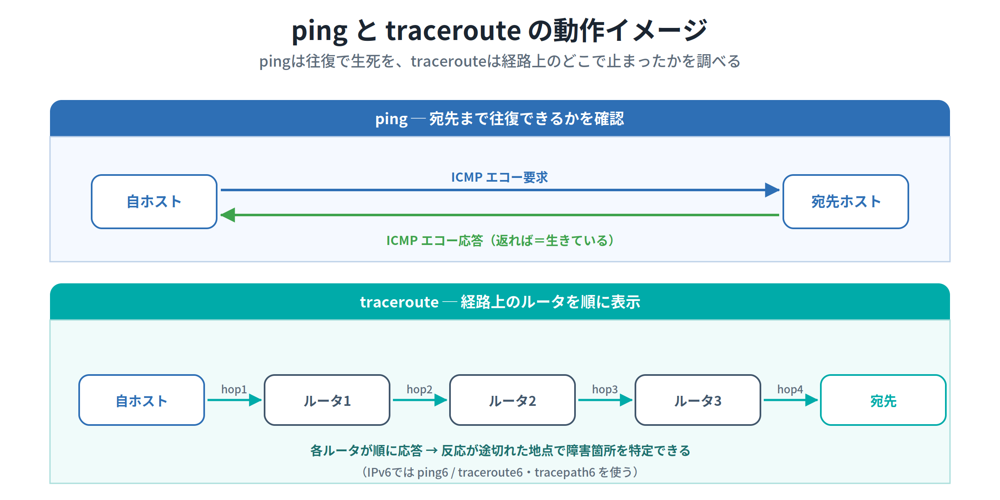

```bash
# traceroute pepper.lpic.jp     # 宛先までの経路を表示
```

**tracepath** もtracerouteと同様に経路を表示します。IPv6環境では **traceroute6 / tracepath6** を使います。

> 💡 **覚え方Hack ─ 「生きてる？＝ping、どこで止まった？＝traceroute」**
> まず ping で相手が応答するか確認。応答がなければ traceroute で「経路上のどこまでは届いているか」を調べる、という順番が定石です。離れたネットワークとの通信障害で「障害箇所の特定にもっとも役立つコマンド」を問われたら **traceroute** が正解です。

#### hostname ─ ホスト名の表示・変更

引数なしで現在のホスト名を表示し、ホスト名を指定すると変更します（変更できるのは **root のみ**）。

```bash
$ hostname                      # 現在のホスト名を表示
# hostname lpic.example.net     # ホスト名を変更
```

#### netstat ─ ポートや接続の状態を見る

ネットワークに関するさまざまな情報を表示します。**開いているポートの確認** によく使われ、どんなサービスが動いているか判断できます。

| オプション | 説明 |
|---|---|
| **-a** | すべてのソケット情報を表示 |
| **-i** | インターフェースの状態を表示 |
| **-n** | アドレスやポートを数値で表示（名前解決しない） |
| **-p** | PIDとプロセス名も表示 |
| **-r** | ルーティングテーブルを表示 |
| **-t** | TCPポートのみ |
| **-u** | UDPポートのみ |

```bash
$ netstat -at     # TCPポートと状態を表示
$ netstat -r      # ルーティングテーブルを表示
```

State欄が **LISTEN** は接続待ち受け中、**ESTABLISHED** は接続中を表します。

> 💡 **-n が効く場面** ─ netstatはデフォルトでポート番号やホスト名を名前解決して表示します。DNSに障害があると名前解決で表示が止まることがあるので、そんなときは **-n**（名前解決なし）を付けます。

#### nc（netcat）─ 汎用の通信テスト

`nc` は、テキストストリームにおける `cat` の **ネットワーク版** とも言えるコマンドで、通信の確認に使えます（`ncat` という名前のこともあります）。

| オプション | 説明 |
|---|---|
| **-l** | 指定したポートをリッスン（待ち受け）する |
| **-p ポート** | ポート番号を指定する |
| **-u** | UDPを利用する（デフォルトはTCP） |
| **-o ファイル** | 指定ファイルに出力する |

#### route ─ ルーティングテーブルの表示・操作

**ルーティング** とは、複数のネットワーク間でデータが正しく届くようにIPパケットの経路を制御することです。その情報が **ルーティングテーブル** で、`route` で表示・追加・削除します（引数なしの表示は `netstat -r` と同じ）。

```bash
# route add -net 192.168.0.0 netmask 255.255.255.0 gw 172.30.0.254   # 経路を追加
# route add default gw 172.30.0.1                                     # デフォルトGW設定
# route del -net 192.168.0.0 netmask 255.255.255.0 gw 172.30.0.254    # 経路を削除
```

ルーティングテーブルの **Flags** は経路の状態を表し、**U**=有効、**H**=宛先はホスト、**G**=ゲートウェイ使用、**!**=無効、を意味します。

> 💡 **Linuxをルータにする** ─ Linuxをルータとして使うには、異なるネットワーク間のパケット転送を許可する必要があります。`/proc/sys/net/ipv4/ip_forward` が **1** になっていることを確認します（0なら `echo 1 > /proc/sys/net/ipv4/ip_forward`）。

#### ip ─ 新しい統合コマンド

**ip** コマンドは、インターフェース・ルーティングテーブル・ARPテーブルなどを管理する、`route` や `ifconfig` を **合わせたような** コマンドです。書式は `ip 操作対象 [サブコマンド] [デバイス]`。

| 操作対象 | 説明 |
|---|---|
| **link** | データリンク層 |
| **addr** | IPアドレス |
| **route** | ルーティングテーブル |

サブコマンドは **show**（表示）と **add**（設定）が中心で、**省略すると show** とみなされます。

```bash
$ ip link show                          # データリンク層の情報を表示
$ ip route show                         # ルーティングテーブルを表示
$ ip addr show eth0                     # eth0のIPアドレスなどを表示
# ip addr add 192.168.11.12/24 dev eth0 # eth0にIPアドレスを設定
# ip route add default via 192.168.11.1 # デフォルトゲートウェイを設定
```

> ⚠ **頻出のコマンド形** ─ IPアドレスの設定は `ip addr add IPアドレス/マスク長 dev デバイス名` を **root権限** で実行します（例：`ip addr add 10.10.0.5/24 dev eth0`）。`ip set ...` や `ip eth0 ...` のような形は誤りです。

> 参考：RHEL7 / CentOS7 以降では `route`・`netstat`・`ifconfig` が廃止され、代わりに **ip** や **ss** を使うことが推奨されています。ただし **net-tools** パッケージを入れれば旧コマンドも利用できます。

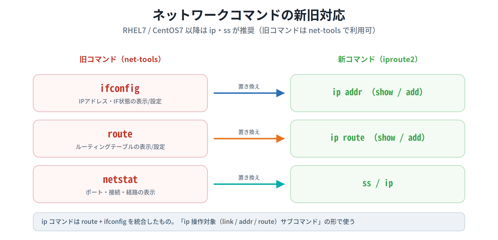

#### 📌 試験ポイント

| 問われ方 | 答え |
|---|---|
| ホストの死活をICMPで確認するコマンドは？ | **ping**（IPv6は ping6） |
| 経路上のルータを順に表示するコマンドは？ | **traceroute / tracepath**（IPv6は traceroute6 / tracepath6） |
| 障害箇所の特定にもっとも役立つコマンドは？ | **traceroute** |
| pingの「-c」「-i」の意味は？ | **-c=回数 / -i=送信間隔(秒)** |
| 開いているポートや接続状態を表示するのは？ | **netstat**（-t=TCP, -u=UDP, -r=経路, -n=名前解決なし） |
| ルーティングテーブルを表示する2つの方法は？ | **netstat -r / route** |
| Linuxをルータにする設定ファイルは？ | **/proc/sys/net/ipv4/ip_forward**（1にする） |
| ifconfigとrouteを統合した新しいコマンドは？ | **ip** |
| ipでIPアドレスを設定するコマンドは？ | **ip addr add IP/マスク dev デバイス** |
| RHEL7以降でnetstatの代わりに推奨されるのは？ | **ss** |

### 11.3.2 ネットワークインターフェースの設定

#### ifconfig ─ インターフェースの状態表示・設定

IPアドレスを確認するときによく使われるのが **ifconfig** です。引数なしで実行すると、有効な（アクティブな）インターフェースの状態を表示します。インターフェース名は、1番目が `eth0`、2番目が `eth1`（最近は `enp3s0` のようにデバイスに基づく命名も一般的）。

| パラメータ | 説明 |
|---|---|
| **IPアドレス** | IPアドレスを設定する |
| **netmask サブネットマスク** | サブネットマスクを設定する |
| **up** | インターフェースを有効化する |
| **down** | インターフェースを無効化する |

```bash
$ ifconfig                                       # アクティブなIFの状態を表示
# ifconfig eth0 192.168.0.50 netmask 255.255.255.0  # IPとマスクを設定
```

出力に出てくる **lo** は **ローカルループバックインターフェース**（自分自身を表す）で、IPアドレスは **127.0.0.1** です。なお、ifconfigで設定した値も **再起動すると失われます**（永続化はファイルへ）。

#### ifup / ifdown ─ インターフェースの有効化・無効化

指定したインターフェースを有効・無効にするには **ifup / ifdown** も使えます。

```bash
# ifup eth0      # eth0を有効化
# ifdown eth0    # eth0を無効化
```

> 参考：NetworkManagerを使う最近のディストリビューションでは、ifup / ifdown が利用できないことがあります。

#### 📌 試験ポイント

| 問われ方 | 答え |
|---|---|
| IFの状態表示・IP設定に使う旧来のコマンドは？ | **ifconfig** |
| ifconfigを引数なしで実行すると？ | **アクティブなIFの状態を表示** |
| ifconfigでIFを有効/無効にするパラメータは？ | **up / down** |
| ローカルループバックインターフェース名とIPは？ | **lo / 127.0.0.1** |
| IFを有効化・無効化する専用コマンドは？ | **ifup / ifdown** |
| ifconfigの設定は再起動でどうなる？ | **失われる**（永続化はファイルへ） |

#### 📝 ここまでのまとめ

11.3は「調べる・直す」コマンドの章でした。鉄則は **「生きてる？＝ping、どこで止まった？＝traceroute」**。ポートや接続は **netstat**（-tでTCP、-rで経路、-nで名前解決なし）、経路設定は **route**、インターフェースは **ifconfig** で扱い、これらを **統合・刷新** したのが **ip**（`ip addr` / `ip route` / `ip link`）と **ss** です。RHEL7以降は旧コマンドが ip・ss に置き換わった、という新旧の対応を押さえておけば得点源になります。最後の11.4では、IPアドレスと名前を結びつける **DNS** を学びます。

---

## 11.4 DNSの設定

### ここで学ぶこと

- 数値のIPアドレスと人間向けのホスト名を変換する **名前解決**（正引き・逆引き）の考え方
- ホスト名の構造（**FQDN**）と、ドメインの **階層構造**
- 参照先DNSを決める **/etc/resolv.conf**、解決手段の順序を決める **/etc/nsswitch.conf**
- systemd採用システムの **systemd-resolved**、調査コマンドの **host / dig**

### 11.4.1 DNSの概要

#### 名前解決 ─ 正引きと逆引き

TCP/IPネットワークでは機器を **IPアドレス** で識別しますが、数値は人間には扱いにくいので、**ホスト名** で指定できるようにしています。そこで、ホスト名とIPアドレスを相互に変換する必要が出てきます。少数なら `/etc/hosts` で処理できますが、数が多くなったり更新が頻繁になると現実的でなくなります。そこで使うのが **DNS（Domain Name System）** です。DNSサーバが、ホスト名とIPアドレスの変換サービスを提供します。

この変換を **名前解決** といい、**ホスト名 → IPアドレス** を求めることを **正引き**、その逆（**IPアドレス → ホスト名**）を **逆引き** といいます。

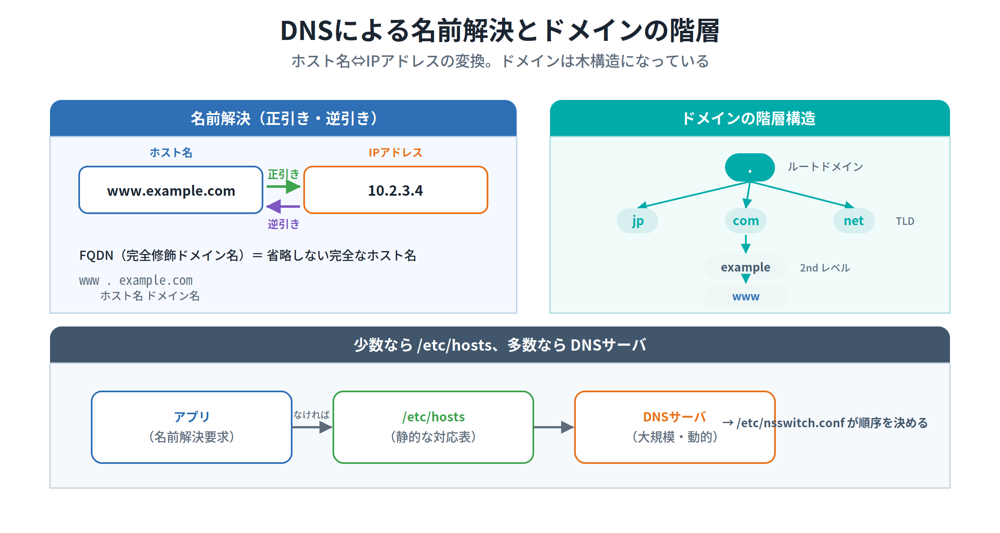

> 💡 **覚え方Hack ─ 「正引き＝名前から、逆引き＝番号から」**
> 電話帳で「名前から電話番号を調べる」のが正引き、「番号から持ち主を調べる」のが逆引き、とイメージすると覚えやすいです。`dig -x` や `host <IPアドレス>` は逆引きです。

#### FQDNとドメインの階層

ホスト名は `www.example.com` のように表します。これは「ホスト名」と「ドメイン名」に分けられます。ドメイン名はコンピュータが所属するネットワーク上の区域、その中の固有の名前がホスト名です。`www.example.com` のように **省略せず完全に表した名前** を **FQDN（Fully Qualified Domain Name：完全修飾ドメイン名）** といいます。

ドメインは **階層構造** になっていて、頂点を **ルートドメイン**（`.`）といい、その下に **トップレベルドメイン（TLD：jp, com, net など）**、**セカンドレベルドメイン** …と枝分かれしていきます。

#### 📌 試験ポイント

| 問われ方 | 答え |
|---|---|
| ホスト名とIPアドレスを変換する仕組みは？ | **DNS（Domain Name System）** |
| ホスト名⇔IPアドレスの変換を何という？ | **名前解決** |
| ホスト名→IPアドレスを求めることは？ | **正引き** |
| IPアドレス→ホスト名を求めることは？ | **逆引き** |
| 省略しない完全なホスト名を何という？ | **FQDN（完全修飾ドメイン名）** |
| ドメイン階層の頂点を何という？ | **ルートドメイン** |
| 少数のホストの名前解決に使えるファイルは？ | **/etc/hosts** |

### 11.4.2 DNSの設定ファイル

#### /etc/resolv.conf ─ 参照先DNSサーバ

DNSによる名前解決を使うには、「どこにあるDNSサーバを参照するか」を設定する必要があります。それを記述するのが **/etc/resolv.conf** です。

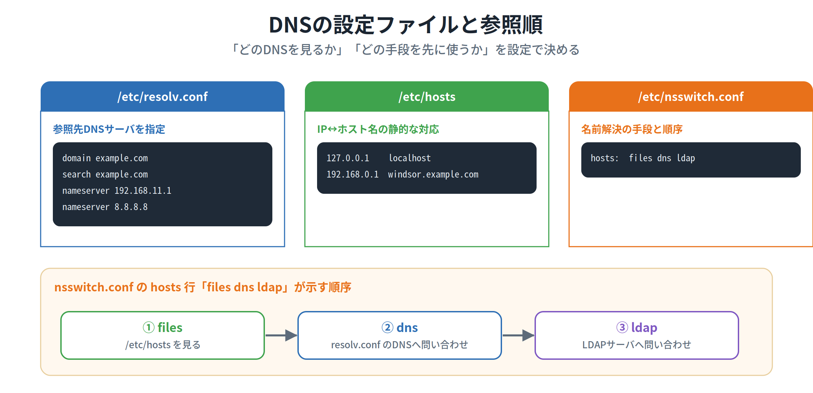

```
domain example.com
search example.com
nameserver 192.168.11.1
nameserver 8.8.8.8
```

- **domain** … このホストが属するドメイン名
- **search** … ドメイン名が省略された際に補完するドメイン名
- **nameserver** … 参照先DNSサーバのIPアドレス。複数指定する場合は1行ずつ書き、**最初のサーバから応答がなければ次のサーバ** に問い合わせます。

> ⚠ **domain と search の関係** ─ `domain` 行と `search` 行は **いずれか一方** を指定します。両方書いた場合は **最後に指定したもの** が有効になります。

#### /etc/nsswitch.conf ─ 名前解決の「手段と順序」

名前解決の手段は1つではありません。①`/etc/hosts` を使う、②DNSサーバに問い合わせる、③LDAPサーバに問い合わせる、などが考えられます。これらを **どの順序で使うか** を設定するのが **/etc/nsswitch.conf** です。

```
passwd:   files ldap
group:    files ldap
shadow:   files ldap
hosts:    files dns ldap
```

最終行の **hosts:** がホスト名の名前解決の順序です。この例では、まず `files`（/etc/hosts）→ 次に `dns`（DNSサーバ）→ 最後に `ldap`（LDAPサーバ）の順に問い合わせます。

> 💡 **覚え方Hack ─ 「files dns ldap」は左から順に試す**
> `hosts: files dns ldap` は「まず手元の/etc/hostsを見て、なければDNS、それでもなければLDAP」という優先順位そのもの。左にあるものほど先に使われる、と覚えてください。
>
> なお、`getent hosts` コマンドを使うと、この nsswitch.conf の順序に従ってホスト名の一覧・解決結果を取得できます。

#### 📌 試験ポイント

| 問われ方 | 答え |
|---|---|
| 参照先DNSサーバを設定するファイルは？ | **/etc/resolv.conf** |
| 参照先DNSサーバを記述する行は？ | **nameserver** |
| nameserverを複数書いたときの動作は？ | **上から順に、応答がなければ次へ** |
| 名前解決の手段と順序を決めるファイルは？ | **/etc/nsswitch.conf** |
| 「hosts: files dns ldap」の意味は？ | **/etc/hosts → DNS → LDAP の順で解決** |
| nsswitch.confの順序で名前解決するコマンドは？ | **getent hosts** |

### 11.4.3 systemd-resolved

#### systemd採用システムの名前解決

systemdを採用したディストリビューションでは、名前解決に **systemd-resolved** サービスが使われています。設定は **/etc/systemd/resolved.conf** ファイルで行います。

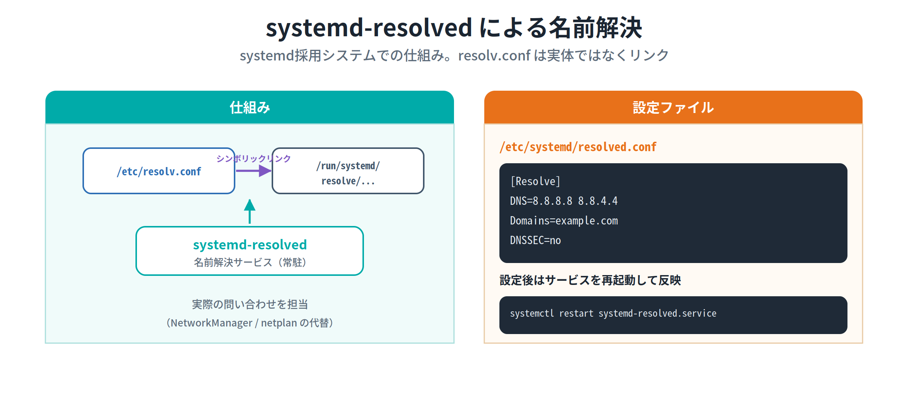

```
[Resolve]
DNS=8.8.8.8 8.8.4.4 2001:4860:4860::8888 2001:4860:4860::8844
Domains=example.com
DNSSEC=no
```

`[Resolve]` セクションに、`DNS=`（参照先DNSサーバ）、`Domains=`（ドメイン）などを記述します。設定を反映するにはサービスを再起動します。

```bash
# systemctl restart systemd-resolved.service
```

> ⚠ **頻出ポイント** ─ systemd採用システムでは、**/etc/resolv.conf は実体ファイルではなく、`/run` ディレクトリ以下のファイルへの「シンボリックリンク」** になっているのが一般的です。直接編集するのではなく、`resolved.conf` で設定する、という違いを押さえましょう。

#### 📌 試験ポイント

| 問われ方 | 答え |
|---|---|
| systemd採用システムの名前解決サービスは？ | **systemd-resolved** |
| systemd-resolvedの設定ファイルは？ | **/etc/systemd/resolved.conf** |
| 設定を書くセクション名は？ | **[Resolve]**（DNS= / Domains=） |
| 設定反映のためのコマンドは？ | **systemctl restart systemd-resolved.service** |
| systemd環境での/etc/resolv.confの実体は？ | **/run以下へのシンボリックリンク** |

### 11.4.4 DNS管理コマンド

#### host ─ 手軽に名前⇔IPを確認

DNSサーバを使ってホストやドメインの情報を表示します。デフォルトでは **ホスト名とIPアドレスの変換** を行います。

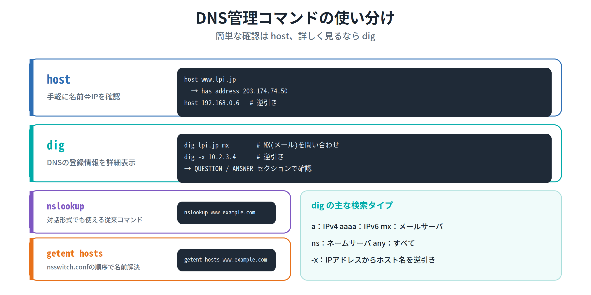

```bash
$ host www.lpi.jp        # 正引き → www.lpi.jp has address 203.174.74.50
$ host 192.168.0.6       # 逆引き → ... domain name pointer www.example.jp.
```

`-v`（詳細表示）オプションがあります。

#### dig ─ DNSの登録情報を詳しく調べる

DNSサーバに登録されている情報を詳細に表示できるのが **dig** です。知りたい情報は **検索タイプ** で指定します。書式は `dig [オプション] [@DNSサーバ名] ホストまたはドメイン名 [検索タイプ]`。

| オプション / 検索タイプ | 説明 |
|---|---|
| **-x** | IPアドレスからホスト名を検索（逆引き） |
| **a** | IPアドレス（IPv4） |
| **aaaa** | IPv6アドレス |
| **any** | すべての情報 |
| **mx** | メールサーバの情報 |
| **ns** | ネームサーバの情報 |

```bash
$ dig lpi.jp mx          # lpi.jpのメールサーバ情報を問い合わせ
$ dig -x 10.2.3.4        # 逆引き
```

digの出力では、問い合わせ内容が **QUESTIONセクション**、回答が **ANSWERセクション** に表示されます。

> 💡 **覚え方Hack ─ 「メールサーバを知りたい＝mx」**
> ドメインのメールサーバを問い合わせたいときは `dig <ドメイン> mx`。検索タイプの代表 **a（IPv4）/ aaaa（IPv6）/ mx（メール）/ ns（ネームサーバ）/ any（すべて）** はセットで覚えましょう。

#### nslookup / getent hosts

**nslookup** は対話形式でも使える従来からのDNS調査コマンドです。**getent hosts** は、前述のとおり `/etc/nsswitch.conf` の順序に従って名前解決を行います。

```bash
$ nslookup www.example.com
$ getent hosts www.example.com
```

#### 📌 試験ポイント

| 問われ方 | 答え |
|---|---|
| 手軽に名前⇔IPを確認するコマンドは？ | **host** |
| DNSの登録情報を詳細表示するコマンドは？ | **dig** |
| digで逆引きするオプションは？ | **-x** |
| digでメールサーバを問い合わせる検索タイプは？ | **mx** |
| digの主な検索タイプは？ | **a / aaaa / any / mx / ns** |
| digの問い合わせ内容・回答が出る場所は？ | **QUESTIONセクション / ANSWERセクション** |
| nsswitch.confの順序で名前解決するコマンドは？ | **getent hosts** |

#### 📝 ここまでのまとめ

11.4では、IPアドレスと名前を結ぶ **DNS** を学びました。**正引き（名前→IP）・逆引き（IP→名前）** の用語、**FQDN** とドメインの **階層構造** がまず基礎。設定では、参照先を決める **/etc/resolv.conf（nameserver行）** と、解決手段の順序を決める **/etc/nsswitch.conf（hosts: files dns ldap）** の役割分担が頻出です。systemd環境では **systemd-resolved**（resolv.confは/runへのリンク）。調査は **手軽なhost、詳しいdig（-xで逆引き、mx/ns等の検索タイプ）** を使い分けます。これで第11章の全範囲を学び終えました。

---

## 📝 全体まとめ ─ ここまでの学習内容

このセクションを終えた時点で、次のことができるようになっているはずです：

1. 通信の取り決めを **プロトコル** と呼び、最も一般的なプロトコル群が **TCP/IP** だと説明できる
2. TCP/IPが **OSI参照モデル（7階層）を4階層に集約** したものだと分かる
3. **TCP=コネクション型（信頼性高・再送・順序整列）** と **UDP=コネクションレス型（高速）** を区別できる
4. **IP=ルーティングを担うコネクションレス型**、**ICMP=ping/tracerouteで使う制御用** だと分かる
5. **IPv4は32ビット**（8ビット×4を「.」区切りの10進数）だと分かる
6. **サブネットマスク** がネットワーク部とホスト部を分け、論理積で **ネットワークアドレス** を求められると分かる
7. **ネットワークアドレスとブロードキャストアドレスはホストに割り当てられない** と分かる
8. クラス **A（0〜127）/ B（128〜191）/ C（192〜223）** と各マスクを区別できる
9. **プライベートアドレス（10 / 172.16〜31 / 192.168）** を暗記している
10. **CIDR** が1ビット単位で区切る仕組みで、`/26` が `255.255.255.192` だと分かる
11. **IPv6は128ビット**（16ビット×8ブロックの16進数）だと分かる
12. IPv6省略ルール（**先頭0省略・連続0は「::」で1か所だけ**）を説明できる
13. IPv6の **::1（ループバック）/ fe80::（リンクローカル）/ ff00::（マルチキャスト）** が分かる
14. **ポート** がアプリを識別し、**0〜1023がウェルノウンポート（IANA管理）** だと分かる
15. 主要ポート（**22 SSH / 23 Telnet / 25 SMTP / 53 DNS / 80 HTTP / 110 POP3 / 143 IMAP / 443 HTTPS**）を暗記している
16. サービス名とポートの対応が **/etc/services** にあると分かる
17. **コマンド設定は再起動で消え、永続化は設定ファイル** だと分かる
18. **/etc/hostname（ホスト名）/ /etc/hosts（IP↔名前の対応）** の役割の違いが分かる
19. Debian系 **/etc/network/interfaces**、Red Hat系 **ifcfg-eth0** を区別できる
20. **NetworkManager** を **nmcli（オブジェクト コマンド）** で操作できると分かる
21. ホスト名変更に **hostnamectl set-hostname** を使うと分かる
22. **ping（死活・ICMP・-c回数）** と **traceroute/tracepath（経路・障害箇所特定）** を使い分けられる
23. **netstat（-t/-u/-r/-n）** で開いているポートや経路を表示できると分かる
24. **route** でルーティングテーブルを操作し、`ip_forward=1` でルータ化できると分かる
25. **ip（addr / route / link）** が ifconfig+route を統合した新コマンドだと分かる
26. **ip addr add IP/マスク dev デバイス** でIPを設定できると分かる
27. **ifconfig（IF状態・lo=127.0.0.1）/ ifup・ifdown（有効化・無効化）** が分かる
28. RHEL7以降は **ip・ss** が推奨で、旧コマンドは net-tools で使えると分かる
29. **正引き（名前→IP）/ 逆引き（IP→名前）** と **FQDN・ドメイン階層** を説明できる
30. **/etc/resolv.conf（nameserver）/ /etc/nsswitch.conf（hosts: files dns ldap）** の役割を区別できる
31. **systemd-resolved（resolved.conf・resolv.confは/runへのリンク）** が分かる
32. **host（手軽）/ dig（-x逆引き・mx/ns等の検索タイプ）/ getent hosts** を使い分けられる

第11章は用語・数値・コマンドが多い章ですが、「**TCP/IPの4階層**」「**住所＝IPアドレスとサブネットマスク**」「**窓口＝ポート**」「**調べる＝ping/traceroute/ip**」「**名前解決＝DNSと設定ファイル**」という5つの軸で整理すれば、トピック109の得点源になります。

---

## 事前チェックリスト

研修当日の朝、これに自信を持って「✓」を付けられる状態が理想です。
分からない項目があれば、該当セクションに戻って読み直してください。

### TCP/IPの基礎（11.1）

- [ ] 通信の取り決めを **プロトコル** と呼ぶと分かる
- [ ] 最も一般的なプロトコル群が **TCP/IP** だと分かる
- [ ] TCP/IPが **4階層**（OSIは7階層）だと分かる
- [ ] **TCP=コネクション型**（信頼性高・再送・順序整列）だと分かる
- [ ] **UDP=コネクションレス型**（高速・ストリーミング）だと分かる
- [ ] **IP=ルーティングを担うコネクションレス型** だと分かる
- [ ] **ICMP=ping/tracerouteで使う制御用** だと分かる
- [ ] **IPv4は32ビット**（8ビット×4・10進数）だと分かる
- [ ] **サブネットマスク** が境界を決めると分かる
- [ ] 論理積で **ネットワークアドレス** を求めると分かる
- [ ] **ネットワーク/ブロードキャストアドレスはホストに使えない** と分かる
- [ ] クラス **A / B / C** の範囲とマスクを言える
- [ ] **プライベートアドレス（10 / 172.16〜31 / 192.168）** を暗記している
- [ ] **127** がループバックだと分かる
- [ ] **CIDR** が1ビット単位の区切りだと分かる
- [ ] `/26` が `255.255.255.192` だと分かる
- [ ] **IPv6は128ビット**（16進数・「:」区切り）だと分かる
- [ ] 省略ルール（**先頭0省略・「::」は1か所だけ**）が分かる
- [ ] **::1 / fe80:: / ff00::** の意味が分かる
- [ ] **ポート** がアプリを識別すると分かる
- [ ] **0〜1023＝ウェルノウンポート（IANA管理）** だと分かる
- [ ] **22/23/25/53/80/110/143/443** などの番号を言える
- [ ] **SNMP=161 / SNMP Trap=162** だと分かる
- [ ] サービス名とポートの対応が **/etc/services** だと分かる
- [ ] IPv6でポートを書くとき **[アドレス]:ポート** だと分かる

### ネットワークの設定（11.2）

- [ ] **コマンド設定は再起動で消える** と分かる
- [ ] 永続化は **設定ファイルに記述** すると分かる
- [ ] **/etc/hostname** がホスト名のファイルだと分かる
- [ ] **/etc/hosts** がIP↔名前の対応表（ホスト名設定ではない）だと分かる
- [ ] /etc/hostsの書式（**IP　ホスト名　別名**）が分かる
- [ ] Debian系 **/etc/network/interfaces** が分かる
- [ ] Red Hat系 **ifcfg-eth0** が分かる
- [ ] ifcfgの **BOOTPROTO（static/dhcp）** が分かる
- [ ] ネットワーク管理機構 **NetworkManager** が分かる
- [ ] **nmcli オブジェクト [コマンド]** の書式が分かる
- [ ] **nmcli connection show** で接続一覧を出せると分かる
- [ ] 参照は一般ユーザー可・**変更はroot** だと分かる
- [ ] 対話設定の **nmtui** が分かる
- [ ] **hostnamectl set-hostname** でホスト名を変えると分かる
- [ ] 代替機構 **systemd-networkd** が分かる

### ネットワークのトラブルシューティング（11.3）

- [ ] **ping** が死活確認（ICMP）だと分かる
- [ ] pingの **-c（回数）/ -i（間隔）** が分かる
- [ ] **traceroute / tracepath** が経路表示だと分かる
- [ ] 障害箇所の特定に **traceroute** がもっとも役立つと分かる
- [ ] IPv6では **ping6 / traceroute6 / tracepath6** だと分かる
- [ ] **hostname** でホスト名を表示・変更できると分かる
- [ ] **netstat** で開いているポート・接続を表示できると分かる
- [ ] netstatの **-t/-u/-r/-n** が分かる
- [ ] **LISTEN（待ち受け）/ ESTABLISHED（接続中）** が分かる
- [ ] **nc（netcat）** が通信テストに使えると分かる
- [ ] **route** でルーティングテーブルを操作できると分かる
- [ ] Flags **U/H/G/!** の意味が分かる
- [ ] ルータ化に **/proc/sys/net/ipv4/ip_forward** を1にすると分かる
- [ ] **ip** が ifconfig+route の統合コマンドだと分かる
- [ ] **ip addr / ip route / ip link** の使い分けが分かる
- [ ] **ip addr add IP/マスク dev デバイス** でIP設定できると分かる
- [ ] RHEL7以降は **ip・ss** が推奨だと分かる
- [ ] **ifconfig** がIF状態表示・IP設定だと分かる
- [ ] **lo=127.0.0.1**（ループバック）だと分かる
- [ ] **ifup / ifdown** でIFを有効/無効にできると分かる

### DNSの設定（11.4）

- [ ] 名前解決の仕組みが **DNS** だと分かる
- [ ] **正引き（名前→IP）/ 逆引き（IP→名前）** を区別できる
- [ ] 省略しない名前を **FQDN** と呼ぶと分かる
- [ ] ドメインが **階層構造**（ルート→TLD→…）だと分かる
- [ ] 少数なら **/etc/hosts** で名前解決できると分かる
- [ ] **/etc/resolv.conf** が参照先DNSの設定だと分かる
- [ ] **nameserver** 行の意味（複数は上から順）が分かる
- [ ] **domain と search はいずれか一方** だと分かる
- [ ] **/etc/nsswitch.conf** が解決手段の順序だと分かる
- [ ] **hosts: files dns ldap** が「左から順」だと分かる
- [ ] **getent hosts** がnsswitchの順で解決すると分かる
- [ ] **systemd-resolved** とその設定 **resolved.conf** が分かる
- [ ] systemd環境で **resolv.confは/runへのリンク** だと分かる
- [ ] **host** が手軽な名前⇔IP確認だと分かる
- [ ] **dig** が詳細表示で、**-x（逆引き）** が分かる
- [ ] dig検索タイプ **a / aaaa / mx / ns / any** が分かる
- [ ] digの **QUESTION / ANSWER** セクションが分かる

### コマンド総まとめ（暗記）

これらのコマンドを「見ただけで何をするか」答えられるようになっていれば理想です：

| コマンド | これは何? |
|---|---|
| `ping -c 4 www.example.com` | |
| `ping6 ::1` | |
| `traceroute pepper.example.jp` | |
| `tracepath cat.example.jp` | |
| `hostname` | |
| `hostname lpic.example.net` | |
| `hostnamectl set-hostname vm2` | |
| `netstat -at` | |
| `netstat -r` | |
| `netstat -an` | |
| `nc -l -p 12345` | |
| `nc host 12345 < data.txt` | |
| `route` | |
| `route add default gw 172.30.0.1` | |
| `route add -net 192.168.0.0 netmask 255.255.255.0 gw 172.30.0.254` | |
| `ip link show` | |
| `ip route show` | |
| `ip addr show eth0` | |
| `ip addr add 10.10.0.5/24 dev eth0` | |
| `ip route add default via 192.168.11.1` | |
| `ss` | |
| `ifconfig` | |
| `ifconfig eth0 192.168.0.50 netmask 255.255.255.0` | |
| `ifup eth0` / `ifdown eth0` | |
| `nmcli connection show` | |
| `nmcli connection add type ethernet ifname enp0s3 con-name eth1` | |
| `nmcli connection modify eth1 ipv4.method auto` | |
| `nmcli radio wifi on` | |
| `host www.lpi.jp` | |
| `host 192.168.0.6` | |
| `dig lpi.jp mx` | |
| `dig -x 10.2.3.4` | |
| `nslookup www.example.com` | |
| `getent hosts www.example.com` | |
| `echo 1 > /proc/sys/net/ipv4/ip_forward` | |

### 重要な記号・数値総まとめ（暗記）

数字やアドレスの暗記は第11章の得点に直結します。即答できるようにしておきましょう：

| 記号・数値 | これは何? |
|---|---|
| IPv4のビット数 | |
| IPv6のビット数 | |
| クラスAの範囲（先頭） | |
| クラスBの範囲（先頭） | |
| クラスCの範囲（先頭） | |
| クラスAのプライベートアドレス | |
| クラスBのプライベートアドレス | |
| クラスCのプライベートアドレス | |
| 127で始まるアドレス | |
| `/26` のサブネットマスク | |
| ウェルノウンポートの範囲 | |
| 22 / 23 のサービス | |
| 25 / 110 / 143 のサービス | |
| 53 のサービス | |
| 80 / 443 のサービス | |
| 161 / 162 のサービス | |
| IPv6ループバック（::1/128） | |
| IPv6リンクローカル（fe80::/10） | |
| IPv6マルチキャスト（ff00::/8） | |
| IPv6の「::」の使用回数制限 | |
| pingの `-c` / `-i` | |
| ping/tracerouteで使うプロトコル | |

### ファイル・パス総まとめ（暗記）

| パス | これは何? |
|---|---|
| `/etc/hostname` | |
| `/etc/hosts` | |
| `/etc/network/interfaces` | |
| `/etc/sysconfig/network-scripts/ifcfg-eth0` | |
| `/etc/services` | |
| `/etc/resolv.conf` | |
| `/etc/nsswitch.conf` | |
| `/etc/systemd/resolved.conf` | |
| `/etc/systemd/network` | |
| `/proc/sys/net/ipv4/ip_forward` | |

### 用語総まとめ（暗記）

これらの用語を「自分の言葉で説明できる」状態が目標：

- [ ] プロトコル
- [ ] TCP/IP
- [ ] OSI参照モデル
- [ ] コネクション型 / コネクションレス型
- [ ] TCP / UDP / IP / ICMP
- [ ] IPアドレス
- [ ] ネットワーク部 / ホスト部
- [ ] サブネットマスク
- [ ] ネットワークアドレス / ブロードキャストアドレス
- [ ] クラス（A / B / C）
- [ ] プライベートアドレス
- [ ] ローカルループバックアドレス
- [ ] CIDR
- [ ] IPv6 / プレフィックス / インターフェースID
- [ ] ユニキャスト / エニーキャスト / マルチキャスト
- [ ] ポート / ウェルノウンポート
- [ ] IANA
- [ ] NetworkManager / nmcli / nmtui
- [ ] hostnamectl
- [ ] systemd-networkd
- [ ] ルーティング / ルーティングテーブル / デフォルトゲートウェイ
- [ ] ソケット
- [ ] DNS / 名前解決
- [ ] 正引き / 逆引き
- [ ] FQDN / ドメイン / ルートドメイン
- [ ] systemd-resolved
- [ ] DNSSEC

---

## 研修当日に向けて

事前学習がきちんとできていれば、研修当日は以下の流れで進みます：

1. **おさらい**（このチェックリストの中から数問）
2. **Hackの説明**（覚え方のコツ、暗記時間）
3. **テスト**（実際の試験問題を含む）
4. **答え合わせ・おさらい**

第11章は「アドレスの数値」「ポート番号」「コマンドの使い分け」「設定ファイルのパス」など、**暗記が点数に直結** するテーマが多い章です。でも安心してください。バラバラに覚えるのではなく、「**住所（IPアドレス）→ 窓口（ポート）→ 設定（ファイル / NetworkManager）→ 調査（ping / traceroute / ip）→ 名前解決（DNS）**」という1本の流れに沿って整理すれば、どのコマンドや用語がどの段階の道具なのかが一気に見えてきます。「プライベートは10・172.16〜31・192.168」「pingは生死・tracerouteは経路」「files dns ldapは左から順」のように、この資料に散りばめたHack（覚え方のコツ）を手がかりに読み進めてください。

研修当日にいきなり知らないコマンドやアドレスが並ぶと焦ってしまうものです。事前にこの資料で予備知識を入れておけば、当日は **「あ、これ事前学習で見た」** という安心感を持ちながら進められます。
分からない部分があっても**慌てる必要はありません**。一度通読してから、チェックリストで自分のウィークポイントを把握しておけば、研修で確実に固められます。

頑張ってください。
