# 第12章：セキュリティ

> **この資料について**
> これは研修当日のための **予備知識** をまとめた資料です。
> 研修当日は **おさらい → 暗記のコツの説明 → テスト → 答え合わせ** という流れで進むため、当日「初めて聞く話」が出てこないように、ここで必要な前提をひと通り押さえておきます。
>
> Linuxを触ったことがなくても理解できるよう、できるだけ身近な例で書いています。
>
> **前提**
> この資料は、101編（第1章〜第5章）と102編の前半（とくに第11章 ネットワークの基礎）の知識があることを前提にしています。本章では、第4章で学んだ **SUID・SGID・スティッキービット**、第10章の **systemd / systemctl**、第11章の **ポート番号・ssh・netstat/ss** が再登場します。あやしい場合は先にそちらを確認してください。
>
> **この章の重要度について**
> 第12章は、LPIC-1 102試験の試験範囲「トピック110（セキュリティ）」に対応する重要章です。「スーパーサーバ（xinetd）」「TCP Wrapper の hosts.allow / hosts.deny」「開いているポートの確認」「SUID ファイルの検索」「chage によるパスワード管理」「su と sudo の違い」「OpenSSH（公開鍵認証・ホスト認証・ssh-agent）」「GnuPG による暗号化」は試験で確実に複数問出題されます。とくに **設定ファイルのパス・コマンドのオプション・公開鍵/秘密鍵の使い分け** は丸暗記レベルで覚える必要があります。
>
> **読み方の指針**
> 1. まずは1回ざっと通読してください（細かい暗記は不要）
> 2. 各セクションの「📌 試験ポイント」と「📝 ここまでのまとめ」を見直してください
> 3. 巻末の「事前チェックリスト」で自分の理解度を測ってください
> 4. 研修当日は、このチェックリストのおさらいから始まります

---

<!-- ## 目次

- [12.1 ホストレベルのセキュリティ](#121-ホストレベルのセキュリティ)
  - [12.1.1 スーパーサーバの設定と管理](#1211-スーパーサーバの設定と管理)
  - [12.1.2 xinetdの設定](#1212-xinetdの設定)
  - [12.1.3 TCP Wrapperによるアクセス制御](#1213-tcp-wrapperによるアクセス制御)
  - [12.1.4 開いているポートの確認](#1214-開いているポートの確認)
  - [12.1.5 SUIDが設定されているファイル](#1215-suidが設定されているファイル)
- [12.2 ユーザーに対するセキュリティ管理](#122-ユーザーに対するセキュリティ管理)
  - [12.2.1 パスワード管理](#1221-パスワード管理)
  - [12.2.2 ログインの禁止](#1222-ログインの禁止)
  - [12.2.3 ユーザーの切り替え](#1223-ユーザーの切り替え)
  - [12.2.4 sudo](#1224-sudo)
  - [12.2.5 システムリソースの制限](#1225-システムリソースの制限)
- [12.3 OpenSSH](#123-openssh)
  - [12.3.1 SSHのインストールと設定](#1231-sshのインストールと設定)
  - [12.3.2 ホスト認証](#1232-ホスト認証)
  - [12.3.3 公開鍵認証](#1233-公開鍵認証)
  - [12.3.4 SSHの活用](#1234-sshの活用)
- [12.4 GnuPGによる暗号化](#124-gnupgによる暗号化)
  - [12.4.1 鍵ペアの作成と失効証明書の作成](#1241-鍵ペアの作成と失効証明書の作成)
  - [12.4.2 共通鍵を使ったファイルの暗号化](#1242-共通鍵を使ったファイルの暗号化)
  - [12.4.3 公開鍵を使ったファイルの暗号化](#1243-公開鍵を使ったファイルの暗号化)
- [全体まとめ](#-全体まとめ--ここまでの学習内容)
- [事前チェックリスト](#事前チェックリスト)

--- -->

## 12.1 ホストレベルのセキュリティ

### ここで学ぶこと

- 複数のサーバを代表で監視する **スーパーサーバ（inetd / xinetd）** の仕組みと設定
- アクセス制御を集中管理する **TCP Wrapper**（/etc/hosts.allow と /etc/hosts.deny）
- 攻撃の入り口となる **開いているポートの確認方法**（netstat / ss / lsof / nmap / fuser）
- 権限昇格に悪用されうる **SUID が設定されたファイルの検索**

セキュリティは「外から守る」「内から守る」の両面が必要です。まずは、1台のホスト（サーバ）をどう守るかという **ホストレベルのセキュリティ** から見ていきます。

### 12.1.1 スーパーサーバの設定と管理

#### デーモンとスーパーサーバ

ネットワーク経由でサービスを提供するサーバは、**デーモン**（daemon）と呼ばれる常駐プログラムです。デーモンは常にメモリ上で待機し、クライアントからの要求を監視します。便利な反面、**使われていない間もメモリなどのリソースを消費** し続けます。デーモンの数が増えると、待機中のリソース消費も大きくなります。

これを解決するために生まれたのが **スーパーサーバ** です。**inetd** や **xinetd** といったスーパーサーバは、ほかのサーバプログラムに代わってサービス要求を監視し、接続が確立した時点で本来のサーバプログラムに要求を引き渡します。

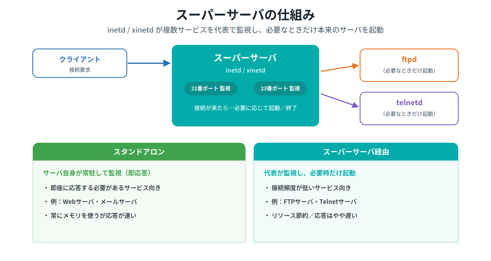

> 💡 **イメージ ─ スーパーサーバは「マンションの管理人」**
> 各部屋（サービス）に専属の受付を常駐させると人件費（リソース）がかさみます。代わりに1人の管理人（スーパーサーバ）が玄関で来客を受け、必要なときだけ該当の部屋の担当者（ftpd、telnetdなど）を呼び出す——これがスーパーサーバの発想です。

#### メリット・デメリットと使い分け

- **メリット**：必要なときだけ個々のサーバを起動するので、**リソースを効率的に使える**。また **TCP Wrapper** と組み合わせると、アクセス制御を集中管理できる。
- **デメリット**：呼び出しに時間がかかるため **応答が遅れる**。

そのため、すぐ応答する必要があるサーバ（**Webサーバ・メールサーバ**）は、スーパーサーバを介さず自分で要求を監視する **スタンドアロン** が適しています。一方、接続頻度が高くないサーバ（**FTPサーバ・Telnetサーバ**）は、スーパーサーバ経由に向いています。なお、スーパーサーバには inetd と xinetd があり、設定方法は大きく異なります。**たいていのディストリビューションでは xinetd が採用** されています。

#### 📌 試験ポイント

| 問われ方 | 答え |
|---|---|
| 常駐してサービスを提供するプログラムの呼び名は？ | **デーモン** |
| 複数のサーバを代表で監視する仕組みは？ | **スーパーサーバ（inetd / xinetd）** |
| スーパーサーバのメリットは？ | **リソースの効率化・アクセス制御の集中管理** |
| スーパーサーバのデメリットは？ | **応答が遅れる** |
| Webサーバ・メールサーバに適した方式は？ | **スタンドアロン** |
| FTP・Telnetなど接続頻度が低いサーバに適すのは？ | **スーパーサーバ経由** |

### 12.1.2 xinetdの設定

#### 2階建ての設定ファイル

xinetd の設定は、**全体的な設定** を行う `/etc/xinetd.conf` と、`/etc/xinetd.d` 以下にある **サービスごとの設定ファイル** の2階建てです。

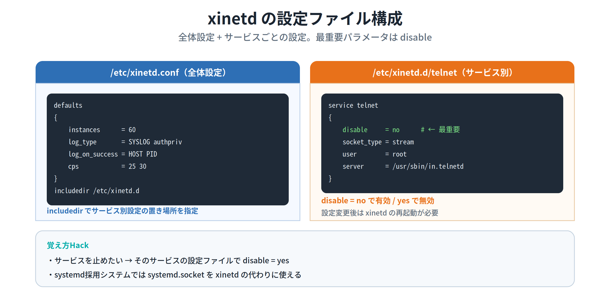

`/etc/xinetd.conf` の主なパラメータは次のとおりです。

| パラメータ | 説明 |
|---|---|
| **instances** | 各サービスの最大デーモン数 |
| **log_type** | ログの出力方法 |
| **log_on_success** | 接続を許可したときに記録する内容 |
| **log_on_failure** | 接続を拒否したときに記録する内容 |
| **cps** | 1秒間の最大接続数と、限度超過時の休止秒数 |
| **includedir** | サービスごとの設定ファイルを収めるディレクトリ |

`/etc/xinetd.d` 以下の設定ファイルは、`ftp` や `telnet` などサービス名がファイル名になっています。主なパラメータは次のとおりです。

| パラメータ | 説明 |
|---|---|
| **disable** | サービスの有効/無効（**no で有効**） |
| **socket_type** | 通信のタイプ（TCPは `stream`、UDPは `dgram`） |
| **user** | サービスを実行するユーザー名 |
| **server** | サーバプログラム（デーモン）へのフルパス |
| **server_args** | サーバプログラムに渡す引数 |
| **only_from** | 接続を許可する接続元 |
| **no_access** | 接続を拒否する接続元 |
| **access_times** | アクセスを許可する時間帯 |

> 💡 **覚え方Hack ─ 最重要は disable**
> サービスを止めたいときは、そのサービスの設定ファイルに `disable = yes` と書きます。逆に `disable = no` で有効。「**no で有効、yes で無効**」という逆向きの関係が引っかけポイントです。設定変更後は **xinetd の再起動が必要**（`# /etc/init.d/xinetd restart`）。

> 💡 systemd を採用したディストリビューションでは、xinetd の代わりに **systemd.socket**（`.socket` と `.service` のユニット）を使うこともできます。

#### 📌 試験ポイント

| 問われ方 | 答え |
|---|---|
| xinetd の全体設定ファイルは？ | **/etc/xinetd.conf** |
| サービスごとの設定ファイルの置き場所は？ | **/etc/xinetd.d ディレクトリ** |
| サービスを有効/無効にする最重要パラメータは？ | **disable**（no で有効） |
| socket_type の stream / dgram は？ | **stream=TCP / dgram=UDP** |
| 設定変更後に必要な操作は？ | **xinetd の再起動** |
| systemd環境での代替は？ | **systemd.socket** |

### 12.1.3 TCP Wrapperによるアクセス制御

#### tcpd と2つの設定ファイル

ネットワークサービスのアクセス制御を集中的に行うのが **TCP Wrapper** です。その本体である **tcpd** デーモンは、telnetd や ftpd などに代わってサービス要求を受け取り、設定に基づいてチェックし、許可された場合だけ本来のサーバへ処理を引き渡します。設定ファイルは **/etc/hosts.allow** と **/etc/hosts.deny** の2つです。

なお、TCP Wrapper のライブラリ **libwrap** を使うアプリ（**OpenSSHサーバ**、各種POP/IMAPサーバなど）は、tcpd がなくても TCP Wrapper の機能を使えます。

#### 評価の順序が超重要

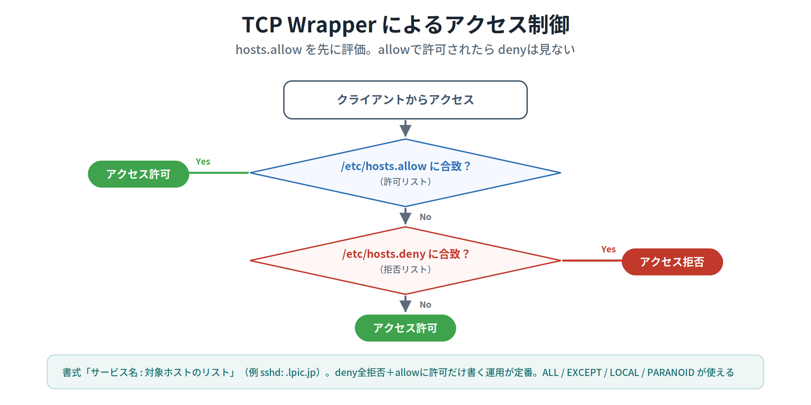

TCP Wrapper は次の順序で判定します。

1. まず **/etc/hosts.allow** をチェック。条件に合致すれば **その時点で許可**（hosts.deny は見ない）
2. allow に合致しなければ **/etc/hosts.deny** をチェック。合致すれば **拒否**
3. どちらにも合致しなければ **許可**

設定の書式は `サービス名 : 対象ホストのリスト` です。サービス名にはデーモン名（`sshd` など）、対象ホストにはホスト名・ドメイン名・IPアドレスの範囲を書きます。

```
# /etc/hosts.allow の例
sshd: .lpic.jp          # lpic.jp ドメインからのSSHを許可
ALL: 192.168.2.         # 192.168.2.0/24 からのすべてを許可

# /etc/hosts.deny の例
ALL: ALL                # すべてのホストのすべてのサービスを拒否
```

主なワイルドカードは次のとおりです。

| ワイルドカード | 説明 |
|---|---|
| **ALL** | すべてのサービスもしくはホスト |
| **A EXCEPT B** | B 以外の A |
| **LOCAL** | 「.」を含まないホスト（同一ネットワークセグメント内） |
| **PARANOID** | 逆引きしたホスト名と正引きしたIPが一致するか確認 |

> 💡 **覚え方Hack ─ 「allow が先、勝てば deny は見ない」**
> 試験頻出の鉄則は2つ。①**hosts.allow が hosts.deny より先に評価される**。②**allow で許可されたら deny はチェックされない**。この性質から、`hosts.deny` に `ALL: ALL`（全拒否）と書いた上で、`hosts.allow` に許可したいものだけ書く、という運用が定番です。どちらにも書かれていないホストは **許可** されます。

> ⚠ これらのファイルは、変更しても **システムやサービスの再起動なしで即有効** になります（xinetd とは異なる点）。

#### 📌 試験ポイント

| 問われ方 | 答え |
|---|---|
| アクセス制御を集中管理する仕組みは？ | **TCP Wrapper**（tcpd） |
| 設定ファイル2つは？ | **/etc/hosts.allow と /etc/hosts.deny** |
| 先に評価されるのは？ | **/etc/hosts.allow** |
| allow で許可されたら deny は？ | **チェックされない** |
| どちらにも合致しないホストは？ | **許可される** |
| 設定の書式は？ | **サービス名 : 対象ホストのリスト** |
| tcpdなしでもTCP Wrapperを使えるライブラリは？ | **libwrap** |
| 変更を反映するのに再起動は必要？ | **不要（即有効）** |

### 12.1.4 開いているポートの確認

#### 開いているポートは最小限に

サーバプロセスは特定のポートを開いて接続を待ち受けます。攻撃者は、開いているポートがわかれば、そこから情報収集や攻撃を試みます。したがって、**不要なポートは開けず、開いているポートは最小限** にとどめるのが鉄則です。

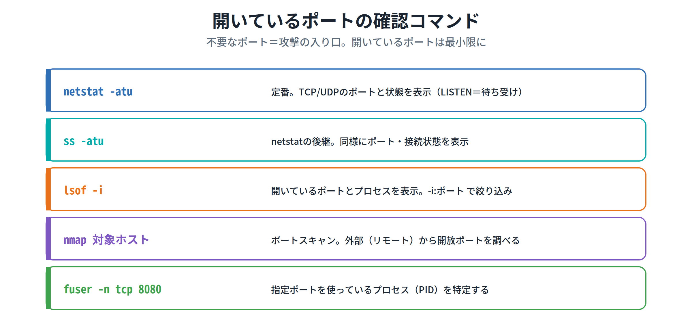

開いているポートを確認する主なコマンドは次のとおりです。

| コマンド | 役割 |
|---|---|
| **netstat -atu** | TCP/UDPのポートと状態（LISTEN＝待ち受け、ESTABLISHED＝接続中）を表示 |
| **ss -atu** | netstat の後継。同様にポート・接続状態を表示 |
| **lsof -i** | 開いているポートとプロセスを表示（`-i:ポート番号` で絞り込み） |
| **nmap 対象ホスト** | ポートスキャン。**外部（リモート）から** 開放ポートを調べる |
| **fuser -n tcp ポート** | 指定ポートを使っているプロセス（PID）を特定する |

> 💡 攻撃者がネットワーク経由で開放ポートを調べる行為を **ポートスキャン** といいます。攻撃の予備調査に使われますが、管理者が自分のサーバを点検するのにも使えます。`nmap` がその代表ツールです。

#### 📌 試験ポイント

| 問われ方 | 答え |
|---|---|
| 開いているポートを確認するコマンドは？ | **netstat / ss / lsof** |
| netstat の後継として推奨されるのは？ | **ss** |
| 開いているポートとプロセスを表示するのは？ | **lsof -i**（-i:ポートで絞り込み） |
| 外部からポートスキャンを行うコマンドは？ | **nmap** |
| 指定ポートを使うプロセスを特定するコマンドは？ | **fuser -n tcp ポート** |
| netstat の LISTEN / ESTABLISHED の意味は？ | **待ち受け中 / 接続中** |

### 12.1.5 SUIDが設定されているファイル

#### SUID の危険性と検索

所有者が root のプログラムに **SUID（Set User ID）** を設定すると、一般ユーザーが実行しても **root 権限で動作** します（第4章の復習）。便利な反面、不用意に設定すると、それを足がかりに一般ユーザーが root 権限を奪う恐れがあります。

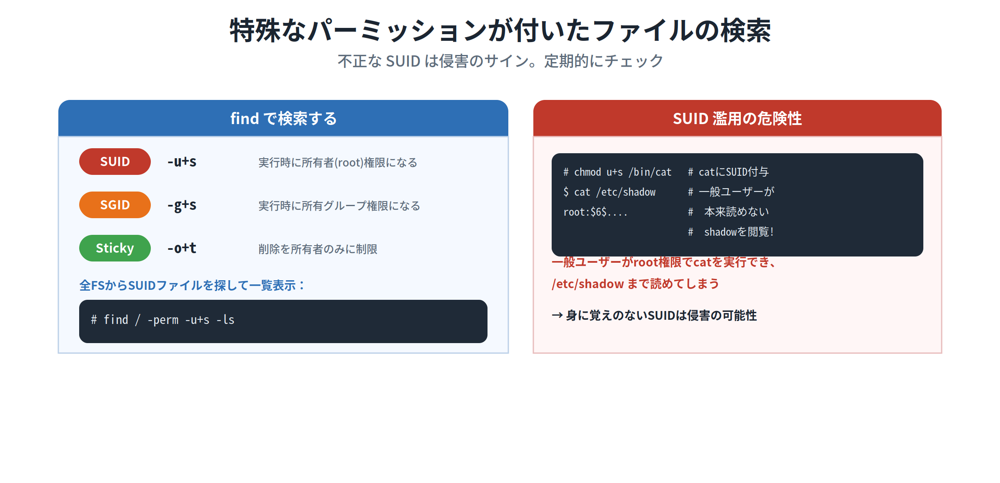

そのため、SUID が設定されたファイルを把握し、**身に覚えのない変更がないか定期的にチェック** することが重要です。検索は `find` コマンドで行います。

```bash
# find / -perm -u+s -ls      # SUIDが設定されたファイルを全FSから検索
```

`-u+s` の代わりに **-g+s** を指定すると **SGID**、**-o+t** を指定すると **スティッキービット** が設定されたファイルを検索できます。

> ⚠ **SUID 濫用の危険性** ─ たとえば `chmod u+s /bin/cat` で cat に SUID を付けると、一般ユーザーが root 権限で cat を実行でき、本来読めない `/etc/shadow` まで閲覧できてしまいます。**変更した覚えのないファイルに SUID が付いていたら、システムが侵害された可能性** を疑います。SUID を設定するファイルは最小限にとどめましょう。

#### 📌 試験ポイント

| 問われ方 | 答え |
|---|---|
| SUID付きファイルを検索するコマンドは？ | **find / -perm -u+s -ls** |
| SGID付きファイルを探す指定は？ | **-g+s** |
| スティッキービット付きを探す指定は？ | **-o+t** |
| SUIDを設定すると実行時の権限は？ | **ファイル所有者（rootなら root）の権限** |
| 身に覚えのないSUIDが意味することは？ | **システム侵害の可能性** |

#### 📝 ここまでのまとめ

12.1では、1台のホストを守る基本を学びました。**スーパーサーバ（xinetd）** は複数サービスを代表で監視してリソースを節約し、止めたいサービスは `disable = yes` にします。**TCP Wrapper** は `/etc/hosts.allow`（先に評価）と `/etc/hosts.deny` でアクセスを制御し、「**allow優先・許可されたらdenyは見ない**」が鉄則。攻撃の入り口になる **開いているポート** は netstat / ss / lsof / nmap / fuser で点検し、最小限に。そして **SUID付きファイル** は `find -perm -u+s` で定期チェック——という流れです。次の12.2では、ユーザー側のセキュリティ管理を見ていきます。

---

## 12.2 ユーザーに対するセキュリティ管理

### ここで学ぶこと

- パスワードに有効期限を設ける **chage** コマンドと、情報の保存先 **/etc/shadow**
- 不要なログインを禁止する2つの方法（**/etc/nologin** とログインシェルの変更）
- ユーザーを切り替える **su** と、コマンド単位で権限を与える **sudo** の違い
- 1ユーザーの暴走を防ぐ **ulimit** によるリソース制限

### 12.2.1 パスワード管理

#### chage で有効期限を設定する

パスワードに有効期限を設けると、ユーザーに **定期的なパスワード変更を強制** できます。設定は **chage** コマンドで行います。

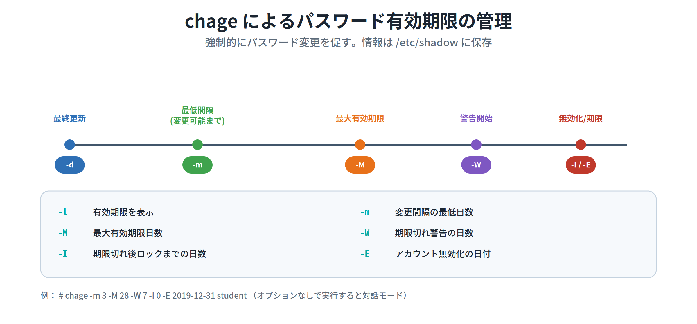

| オプション | 説明 |
|---|---|
| **-l** | パスワード／アカウントの有効期限を表示する |
| **-m 日数** | パスワード変更間隔の **最低** 日数 |
| **-M 日数** | パスワードの **最大** 有効期限日数 |
| **-d 日付** | パスワードの最終更新日 |
| **-W 日数** | 有効期限切れ警告を何日前から始めるか |
| **-I 日数** | 有効期限切れ後、ロックされるまでの日数 |
| **-E 日付** | アカウントを無効化する日付 |

オプションを付けずに実行すると **対話モード** になります。同じ設定はオプションでも指定できます。

```bash
# chage -m 3 -M 28 -W 7 -I 0 -E 2019-12-31 student
# chage -l student     # 設定内容を確認
```

> ⚠ **保存先に注意** ─ chage で設定した情報は、**シャドウパスワードを使っている場合は /etc/shadow ファイルに格納** されます。「パスワードの有効期限情報はどこに保存されるか？」と問われたら **/etc/shadow** です。

#### 📌 試験ポイント

| 問われ方 | 答え |
|---|---|
| パスワードの有効期限を表示・設定するコマンドは？ | **chage** |
| 有効期限を表示するオプションは？ | **-l** |
| 最低変更間隔／最大有効期限のオプションは？ | **-m / -M** |
| 期限切れ警告／無効化までの日数は？ | **-W / -I** |
| オプションなしで実行すると？ | **対話モードになる** |
| 有効期限情報の保存先は？ | **/etc/shadow** |

### 12.2.2 ログインの禁止

#### 全体を止めるか、個別に止めるか

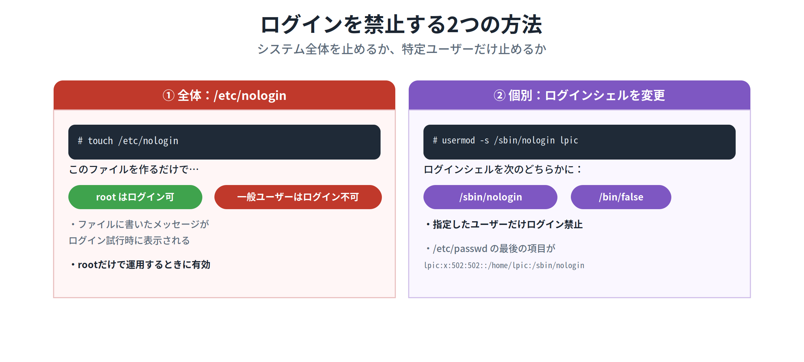

**① システム全体（root以外）を止める：/etc/nologin**
`/etc/nologin` ファイルを作成すると、**root 以外のログインが禁止** されます。ファイルにメッセージを書いておくと、ログイン試行時に表示されます。

```bash
# touch /etc/nologin
```

**② 特定ユーザーだけ止める：ログインシェルの変更**
メールサーバやFTPサーバなどでは、アカウントは必要でもシェルを使わせたくないことがあります。その場合、ログインシェルを **/bin/false** や **/sbin/nologin** に変更すると、そのユーザーのログインを禁止できます。

```bash
# usermod -s /sbin/nologin lpic
```

`/etc/passwd` の該当行は次のようになります（最後のフィールドがログインシェル）。

```
lpic:x:502:502::/home/lpic:/sbin/nologin
```

#### 📌 試験ポイント

| 問われ方 | 答え |
|---|---|
| root以外のログインを一括禁止するファイルは？ | **/etc/nologin** |
| /etc/nologin を作るとログインできるのは？ | **root のみ** |
| 特定ユーザーのログインを禁止するには？ | **ログインシェルを /sbin/nologin や /bin/false に変更** |
| ログインシェルを変更するコマンドは？ | **usermod -s** |
| ログインシェルは何ファイルのどこに記録される？ | **/etc/passwd の最後のフィールド** |

### 12.2.3 ユーザーの切り替え

#### su ─ 一時的に別ユーザーになる

常に root で作業するのは危険です。普段は一般ユーザーで作業し、必要なときだけ root になるのが適切です。**su** コマンドを使うと一時的に別のユーザーになれます。書式は `su [- [ユーザー名]]`。

```bash
$ su - fred      # fred になる（パスワードを入力）
$ id             # 切り替わったか確認
$ exit           # 元のユーザーに戻る
$ su -           # ユーザー名を省略すると root になる
```

> 💡 **覚え方Hack ─ 「-」があると環境が初期化される**
> `su - fred` のように **「-」を付ける** と、直接ログインしたときと同様に環境が初期化されます（カレントディレクトリが新ユーザーのホームに移り、環境変数もすべて初期化）。**「-」がなければ現在の環境のまま** ユーザーだけ切り替わります。ユーザー名を省略すると **root** になります（root から一般ユーザーになる場合はパスワード不要）。

#### 📌 試験ポイント

| 問われ方 | 答え |
|---|---|
| 一時的に別ユーザーになるコマンドは？ | **su** |
| `su -` の「-」の意味は？ | **環境を初期化（ログイン時と同じ状態）** |
| ユーザー名を省略するとどうなる？ | **root になる** |
| 元のユーザーに戻るには？ | **exit** |

### 12.2.4 sudo

#### コマンド単位で権限を委譲する

`su` で一度 root になると、そのユーザーは root にできることを **何でも** できてしまいます。**特定の管理者コマンドだけ** を許可したいときは **sudo** が使えます。任意の管理者コマンドを任意のユーザーに許可でき、**root のパスワードを教えなくてよい** のが大きなメリットです。

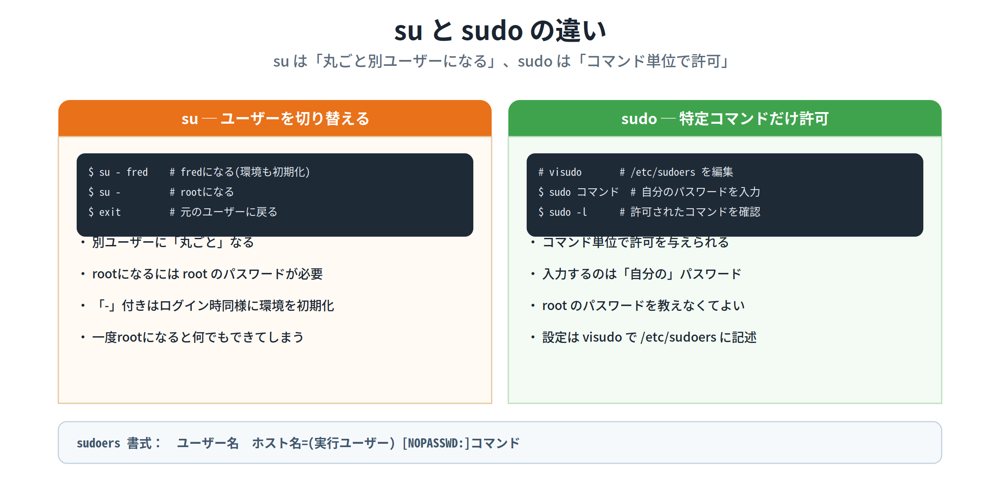

**設定**：root で **visudo** コマンドを実行すると、`/etc/sudoers` ファイルがエディタで開きます（直接編集してはいけません）。書式は次のとおりです。

```
ユーザー名 ホスト名=(実行ユーザー名) [NOPASSWD:]コマンド
```

```
# /etc/sudoers の例
student   ALL=(ALL) /sbin/shutdown      # shutdownのみ許可
student   ALL=(ALL) ALL                 # すべての管理コマンドを許可
%wheel    ALL=(ALL) NOPASSWD:ALL        # wheelグループにパスワードなしで全許可
```

**利用**：`sudo コマンド` の形で実行します。このとき入力するのは **root のパスワードではなく、実行している本人のパスワード** です。自分に許可されたコマンドは `sudo -l` で確認できます。

```bash
$ sudo /sbin/shutdown -h now     # 本人のパスワードを入力
$ sudo -l                        # 許可されたコマンドを表示
```

| オプション | 説明 |
|---|---|
| **-l** | 許可されているコマンドを表示する |
| **-i** | 変更先ユーザーでシェルを起動（ログイン処理を行う） |
| **-s** | 変更先ユーザーでシェルを起動する |
| **-u ユーザー** | root ではなく指定したユーザーでコマンドを実行する |

> 💡 **覚え方Hack ─ su と sudo の決定的な違い**
> **su** は「ユーザーごと丸ごと切り替える／root のパスワードが必要」。**sudo** は「コマンド単位で許可／本人のパスワードでよい」。設定ファイルは **visudo で開く /etc/sudoers**（エディタで直接開かない）という点も頻出です。

#### 📌 試験ポイント

| 問われ方 | 答え |
|---|---|
| 特定の管理コマンドだけ許可するコマンドは？ | **sudo** |
| sudoの設定を編集するコマンドは？ | **visudo** |
| sudoの設定ファイルは？ | **/etc/sudoers** |
| sudo実行時に入力するパスワードは？ | **本人（実行ユーザー）のパスワード** |
| 許可されたコマンドを確認するオプションは？ | **sudo -l** |
| sudoersの書式は？ | **ユーザー名 ホスト名=(実行ユーザー) [NOPASSWD:]コマンド** |

### 12.2.5 システムリソースの制限

#### ulimit で暴走を防ぐ

1人のユーザーがメモリを使い切ると、システムが停止に追い込まれることがあります。これを防ぐため、ユーザーが使えるリソースを制限するのが **ulimit** コマンドです。書式は `ulimit [オプション [リミット]]`。

| オプション | 説明 |
|---|---|
| **-a** | 制限の設定値をすべて表示する |
| **-c サイズ** | 生成されるコアファイルのサイズ |
| **-f サイズ** | シェルが生成できるファイルの最大サイズ（ブロック単位） |
| **-n 数** | 同時に開けるファイルの最大数 |
| **-u プロセス数** | 1ユーザーが利用できる最大プロセス数 |
| **-v サイズ** | シェルとその子プロセスが使える最大仮想メモリ |

```bash
$ ulimit -a      # 現在の制限値をすべて表示
```

#### 📌 試験ポイント

| 問われ方 | 答え |
|---|---|
| ユーザーのリソースを制限するコマンドは？ | **ulimit** |
| すべての設定値を表示するオプションは？ | **-a** |
| 同時に開けるファイル数を制限するのは？ | **-n** |
| 最大プロセス数を制限するのは？ | **-u** |
| コアファイルのサイズを制限するのは？ | **-c** |

#### 📝 ここまでのまとめ

12.2は「ユーザーをどう管理して守るか」でした。**chage** でパスワードに有効期限を設け（情報は **/etc/shadow**）、不要なログインは **/etc/nologin**（全体）やログインシェルの変更（個別）で止めます。権限の使い分けでは、**su**（丸ごと切り替え・rootパスワード必要）と **sudo**（コマンド単位・本人パスワード・visudo/sudoers）の違いが最重要。さらに **ulimit** で1ユーザーのリソース暴走を防ぎます。次の12.3では、安全なリモート接続の定番 **OpenSSH** を学びます。

---

## 12.3 OpenSSH

### ここで学ぶこと

- 平文の Telnet に対し、通信を暗号化する **SSH（OpenSSH）** の仕組みと **sshd_config**
- 接続先サーバの正当性を確認する **ホスト認証**（~/.ssh/known_hosts）
- パスワードに頼らない **公開鍵認証** の設定手順（ssh-keygen / authorized_keys）
- ファイルコピーの **scp**、鍵管理の **ssh-agent**、**ポート転送** などの活用

#### SSHとは ─ telnetの安全な代替

**SSH（Secure Shell）** は、リモートホスト間の通信に高いセキュリティを実現するものです。強力な認証と暗号化により、ファイル転送やリモート操作を安全に行えます。telnet では通信内容が **平文** なので盗聴でパスワードが判明しますが、SSH では経路が **暗号化** されるため安全です。Linuxでは、OpenBSDグループによる実装 **OpenSSH** が一般的に使われます。SSH には **バージョン1系と2系** があり、公開鍵暗号の認証アルゴリズムが異なります（v1=RSA1、v2=DSA/RSA）。互換性はありませんが、OpenSSHは両方に対応しています。

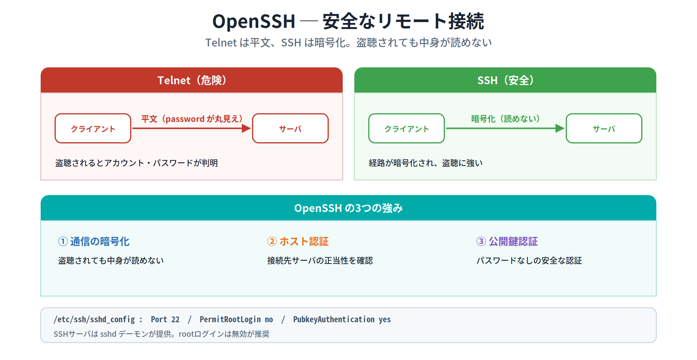

### 12.3.1 SSHのインストールと設定

#### ホスト鍵と sshd_config

OpenSSH をインストールすると、**ホストの公開鍵と秘密鍵** が作成されます。これらは後述のホスト認証に使われ、秘密鍵は決して外部に漏らさないように管理します。鍵ファイルは用途別に複数あります（例：`ssh_host_rsa_key`＝秘密鍵、`ssh_host_rsa_key.pub`＝公開鍵）。

SSHサーバの機能は **sshd** デーモンが提供し、設定ファイルは **/etc/ssh/sshd_config** です。主な設定項目は次のとおりです。

| 設定項目 | 説明 |
|---|---|
| **Port** | SSHで使うポート番号（デフォルト22） |
| **Protocol** | SSHのバージョン（1と2） |
| **HostKey** | ホストの秘密鍵ファイル |
| **PermitRootLogin** | root でのログインを許可するか |
| **PubkeyAuthentication** | v2 の公開鍵認証を使うか |
| **AuthorizedKeysFile** | 公開鍵を格納するファイル名 |
| **PermitEmptyPasswords** | 空パスワードを許可するか |
| **PasswordAuthentication** | パスワード認証を許可するか |
| **X11Forwarding** | X11転送を許可するか |

> ⚠ セキュリティ上、**PermitRootLogin no**（rootログイン禁止）、**PermitEmptyPasswords no**（空パスワード禁止）が推奨です。

sshd の起動は、systemd 採用システムでは `# systemctl start sshd.service`、SysVinit の Red Hat 系では `# /etc/init.d/sshd start`、Debian系では `# /etc/init.d/ssh start` です。

#### ssh コマンドで接続

```bash
$ ssh sv1.lpic.jp                # ホストに接続
$ ssh student@sv1.lpic.jp        # ユーザーを指定して接続
```

| オプション | 説明 |
|---|---|
| **-p ポート番号** | ポート番号を指定する |
| **-l ユーザー名** | 接続するユーザーを指定する |
| **-i ファイル名** | 秘密鍵ファイルを指定する |

#### 📌 試験ポイント

| 問われ方 | 答え |
|---|---|
| 暗号化された安全なリモート接続の仕組みは？ | **SSH（OpenSSH）** |
| SSHサーバを提供するデーモンは？ | **sshd** |
| sshdの設定ファイルは？ | **/etc/ssh/sshd_config** |
| SSHのデフォルトポートは？ | **22** |
| rootログインを禁止する設定は？ | **PermitRootLogin no** |
| ユーザーを指定して接続する書式は？ | **ssh ユーザー名@ホスト** |
| 接続時にポート/秘密鍵を指定するオプションは？ | **-p / -i** |

### 12.3.2 ホスト認証

#### 偽サーバへの接続を防ぐ

SSHでは、ユーザー認証に先立って、クライアントが **サーバの正当性を確認** する **ホスト認証** が行われます。接続のたびにサーバ固有のホスト認証鍵（公開鍵）がサーバから送られ、クライアントが保存しているサーバの公開鍵と比較して一致を確認します。

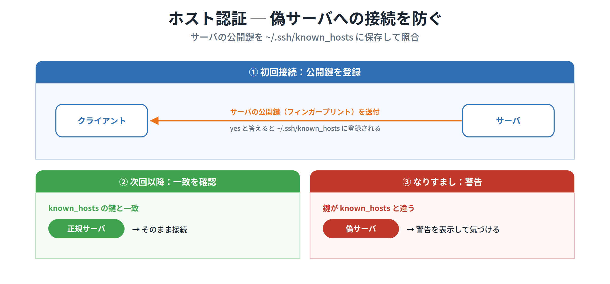

ただし **初回接続時** はサーバの公開鍵を持っていないため比較できず、「登録されていない」旨のメッセージが表示されます。ここで **yes** と答えると、サーバの公開鍵が **~/.ssh/known_hosts** に登録され、次回以降は表示されません。もし悪意ある者がサーバになりすますと、鍵が known_hosts の値と異なるため **警告が表示** され、誤接続の前に異常に気づけます。

> 💡 **覚え方Hack ─ ホスト認証＝known_hosts で照合**
> 「接続先サーバの公開鍵はどこに保存されるか？」の答えは **~/.ssh/known_hosts**。初回に登録し、次回以降は照合する、という流れを押さえましょう。フィンガープリント（指紋）で鍵の正当性を確認できます。

#### 📌 試験ポイント

| 問われ方 | 答え |
|---|---|
| 接続先サーバの正当性を確認する仕組みは？ | **ホスト認証** |
| サーバの公開鍵を保存するファイルは？ | **~/.ssh/known_hosts** |
| 初回接続時に yes と答えると？ | **サーバの公開鍵が known_hosts に登録される** |
| 鍵が known_hosts と異なると？ | **警告が表示される（なりすまし検知）** |

### 12.3.3 公開鍵認証

#### 鍵ペアを作り、公開鍵を預ける

ユーザー認証には、パスワード認証のほかに **公開鍵認証** があります。一対の **公開鍵と秘密鍵** を使い、あらかじめクライアント側ユーザーの **公開鍵をサーバに登録** しておきます。

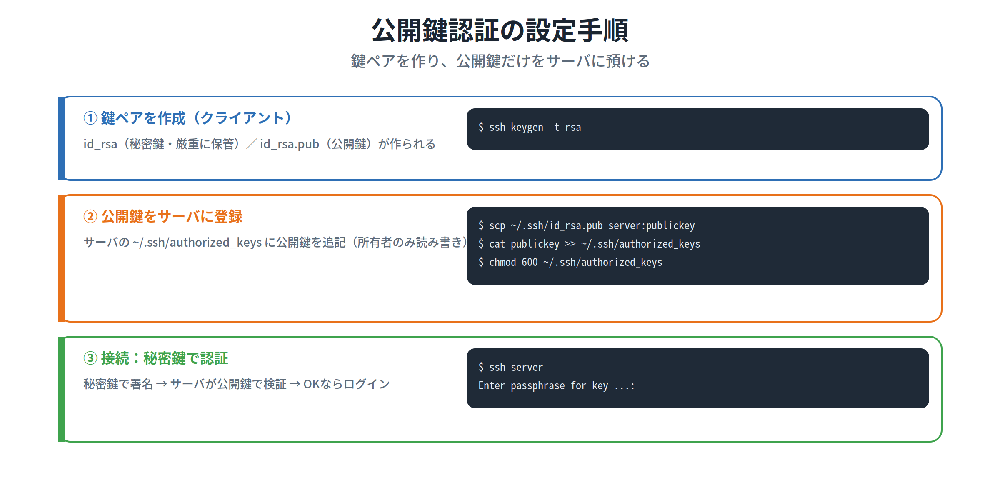

鍵ペアは **ssh-keygen** で作成します。

| オプション | 説明 |
|---|---|
| **-t タイプ** | 暗号化タイプ（rsa1 / rsa / dsa / ecdsa / ed25519） |
| **-p** | パスフレーズを変更する |
| **-f ファイル名** | 鍵ファイルを指定する |
| **-R ホスト名** | 指定ホストの鍵を known_hosts から削除する |
| **-b ビット長** | 鍵の長さを指定する（2048 など） |

```bash
$ ssh-keygen -t rsa      # 鍵ペアを作成（パスフレーズを設定）
```

作成される鍵ファイル名は、v2 RSA なら **id_rsa（秘密鍵）/ id_rsa.pub（公開鍵）**、v2 DSA なら id_dsa / id_dsa.pub、v1 なら identity / identity.pub です。続いて、作った公開鍵をサーバの **~/.ssh/authorized_keys** に追加します。

```bash
$ scp ~/.ssh/id_rsa.pub sv1.lpic.jp:publickey         # 公開鍵を転送
$ cat publickey >> ~/.ssh/authorized_keys             # authorized_keys に追記
$ chmod 600 ~/.ssh/authorized_keys                    # 所有者のみ読み書き
```

> ⚠ `authorized_keys` は **所有者のみが読み書きできる（600）** ようにします。他者に書き込み権限があると、勝手に鍵を登録されログインされる恐れがあります。設定後に接続すると、秘密鍵を守る **パスフレーズ** を尋ねられます。

> 💡 **覚え方Hack ─ 公開鍵は「サーバに置く」、秘密鍵は「手元で守る」**
> 鍵ファイルの行き先は混同しがち。**公開鍵（id_rsa.pub）はサーバの authorized_keys へ**、**秘密鍵（id_rsa）はクライアントで厳重に保管** します。なお `ssh-copy-id` コマンドを使うと、公開鍵の登録を簡単に行えます。

#### 📌 試験ポイント

| 問われ方 | 答え |
|---|---|
| 鍵ペアを作成するコマンドは？ | **ssh-keygen** |
| 暗号化タイプを指定するオプションは？ | **-t** |
| v2 RSA の秘密鍵／公開鍵のファイル名は？ | **id_rsa / id_rsa.pub** |
| 公開鍵を登録するサーバ側のファイルは？ | **~/.ssh/authorized_keys** |
| authorized_keys の適切な権限は？ | **600（所有者のみ読み書き）** |
| 公開鍵登録を簡単にするコマンドは？ | **ssh-copy-id** |

### 12.3.4 SSHの活用

#### scp・ssh-agent・ポート転送

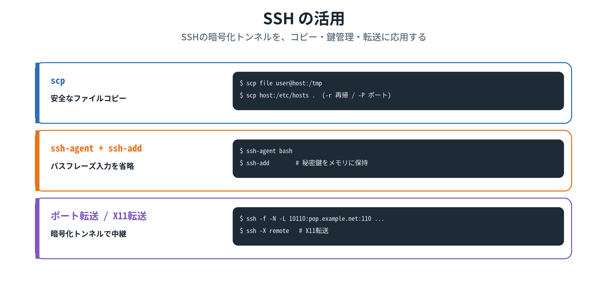

**scp ─ 安全なファイルコピー**：SSHの仕組みでホスト間のファイルを安全にコピーします。

```bash
$ scp /etc/hosts sv3.example.jp:/tmp       # ローカル→リモート
$ scp sv3.example.jp:/etc/hosts .          # リモート→ローカル
```

| オプション | 説明 |
|---|---|
| **-p** | パーミッションなどを保持してコピー |
| **-r** | ディレクトリを再帰的にコピー |
| **-P ポート番号** | ポート番号を指定する |

**ssh-agent ─ パスフレーズの入力を省略**：秘密鍵を使うたびにパスフレーズを聞かれる手間を省きます。ssh-agent はクライアント側で動くデーモンで、秘密鍵を **メモリ上に保持** します。

```bash
$ ssh-agent bash      # ssh-agentの子プロセスとしてシェルを起動
$ ssh-add             # 秘密鍵を登録（このときパスフレーズを入力）
$ ssh-add -l          # 保持している鍵の一覧を確認
```

**ポート転送（ポートフォワーディング）**：あるポートに来たTCPパケットを、SSHの安全な経路でリモートの任意ポートへ転送します。POP3やFTPなど暗号化されていない通信の安全性を高められます。

```bash
$ ssh -f -N -L 10110:pop.example.net:110 student@pop.example.net
```

`-f` はバックグラウンド実行、`-N` は転送のみを指示します。また、リモートのXクライアントをローカルで動かす **X11ポート転送** は、`sshd_config` に `X11Forwarding yes` を設定し、`ssh -X remote.example.net` のように接続します。

#### 📌 試験ポイント

| 問われ方 | 答え |
|---|---|
| SSHで安全にファイルコピーするコマンドは？ | **scp** |
| scp で再帰／ポート指定するオプションは？ | **-r / -P** |
| パスフレーズ入力を省略する仕組みは？ | **ssh-agent** |
| ssh-agent に秘密鍵を登録するコマンドは？ | **ssh-add** |
| 暗号化経路でポートを中継する機能は？ | **ポート転送（ssh -L）** |
| X11転送に必要なsshd_config設定は？ | **X11Forwarding yes** |

#### 📝 ここまでのまとめ

12.3では、安全なリモート接続 **OpenSSH** を学びました。平文の Telnet と違い通信を **暗号化** し、サーバは **sshd**（設定は **/etc/ssh/sshd_config**）が担います。**ホスト認証** は接続先の正当性を **~/.ssh/known_hosts** で照合し、**公開鍵認証** は **ssh-keygen** で鍵ペアを作り、公開鍵をサーバの **~/.ssh/authorized_keys** に登録します（秘密鍵は手元で厳重保管）。活用として **scp**（コピー）、**ssh-agent**（パスフレーズ省略）、**ポート転送**(-L) を押さえましょう。最後の12.4では、ファイル暗号化の **GnuPG** を学びます。

---

## 12.4 GnuPGによる暗号化

### ここで学ぶこと

- 公開鍵暗号でファイルを暗号化／復号・署名できる **GnuPG（gpg コマンド）**
- 鍵ペアの作成（**--full-generate-key**）と、万一に備える **失効証明書**（--gen-revoke）
- 手軽な **共通鍵暗号**（gpg -c）と、特定の相手だけが読める **公開鍵暗号**（gpg -e -r）

ファイルを暗号化したいとき、Linuxでは **GnuPG（GNU Privacy Guard）** が使えます。GnuPGは公開鍵暗号を使ってファイルの暗号化／復号や電子署名ができるオープンソースソフトで、暗号化ソフト **PGP** と互換性があります。操作には **gpg** コマンドを使います。

### 12.4.1 鍵ペアの作成と失効証明書の作成

#### 鍵ペアを作る

GnuPGを使うには、まず公開鍵と秘密鍵の **鍵ペア** を作成します。

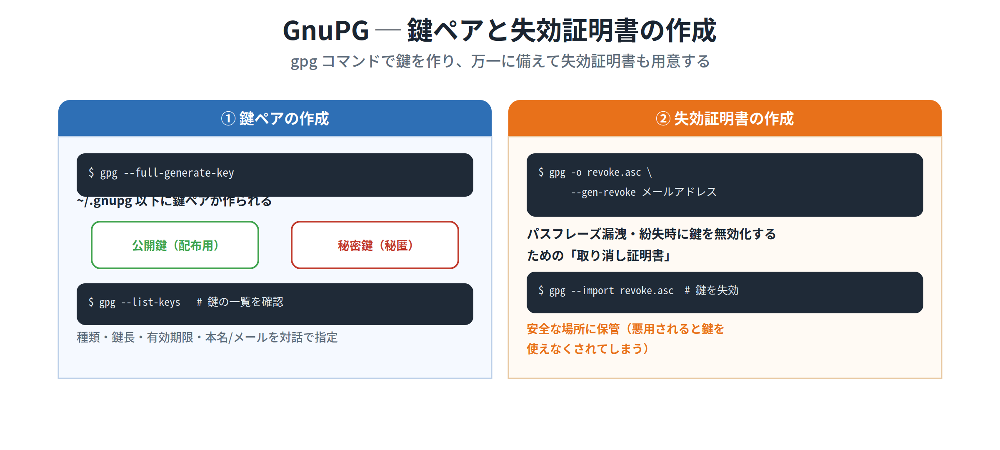

```bash
$ gpg --full-generate-key      # 鍵の種類・鍵長・有効期限・本名/メールを対話で指定
$ gpg --list-keys              # 作成した鍵の一覧を確認
```

実行すると **~/.gnupg** ディレクトリが作られ、その中に公開鍵のキーリングと秘密鍵のキーリングが格納されます。

#### 失効証明書を作る

次に **失効証明書** を作ります。これは、**パスフレーズが漏れたり忘れたりした際に、鍵を無効化（取り消し）するため** のものです。

```bash
$ gpg -o revoke.asc --gen-revoke fred@example.com    # 失効証明書を作成
$ gpg --import revoke.asc                             # 万一のとき鍵を失効させる
```

> ⚠ 作成した失効証明書は **安全な場所に保管** します。悪意ある者にアクセスされると、あなたの鍵を勝手に使えなくされてしまうためです。

#### 📌 試験ポイント

| 問われ方 | 答え |
|---|---|
| GnuPGを操作するコマンドは？ | **gpg** |
| GnuPGと互換性のある暗号化ソフトは？ | **PGP** |
| 鍵ペアを作成するコマンドは？ | **gpg --full-generate-key** |
| 鍵が格納されるディレクトリは？ | **~/.gnupg** |
| 鍵の一覧を確認するコマンドは？ | **gpg --list-keys** |
| 失効証明書を作るオプションは？ | **--gen-revoke** |
| 失効証明書を使って鍵を無効化するには？ | **gpg --import 失効証明書** |

### 12.4.2 共通鍵を使ったファイルの暗号化

#### もっとも手軽な暗号化

gpg でいちばん簡単なのは **共通鍵** を使った暗号化です。`-c` オプションで暗号化します。

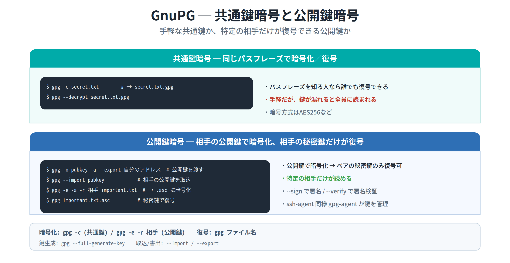

```bash
$ gpg -c secret.txt                # パスフレーズを2回入力 → secret.txt.gpg ができる
$ gpg --decrypt secret.txt.gpg     # 同じパスフレーズで復号
```

暗号化すると `secret.txt.gpg` が作られ、復号は **オプションなし**（または `--decrypt`）で行います。暗号方式は AES256 などです。

> ⚠ 共通鍵は手軽ですが、**パスフレーズを知る人なら誰でも復号** できてしまいます。特定の人だけが復号できるようにするには、次の公開鍵暗号を使います。

#### 📌 試験ポイント

| 問われ方 | 答え |
|---|---|
| 共通鍵でファイルを暗号化するオプションは？ | **gpg -c** |
| 暗号化ファイルを復号するには？ | **gpg（オプションなし）/ gpg --decrypt** |
| 共通鍵暗号の弱点は？ | **パスフレーズを知る人なら誰でも復号できる** |

### 12.4.3 公開鍵を使ったファイルの暗号化

#### 特定の相手だけが復号できる

公開鍵暗号では、**公開してよい公開鍵** と **秘匿する秘密鍵** をペアで使います。**公開鍵で暗号化したものは、ペアの秘密鍵でのみ復号** できます。これにより、特定の相手だけが読めるファイルを作れます。

**① 公開鍵のエクスポート／インポート**：受け取る側は自分の公開鍵を相手に渡し、送る側はそれをインポートします。

```bash
$ gpg -o pubkey -a --export fred@example.com     # 自分の公開鍵を書き出す
$ gpg --import pubkey                             # 受け取った公開鍵を取り込む
```

**② ファイルの暗号化／復号**：相手の公開鍵で暗号化し、相手は自分の秘密鍵で復号します。

```bash
$ gpg -e -a -r fred@example.com important.txt    # 相手の公開鍵で暗号化 → important.txt.asc
$ gpg important.txt.asc                           # 受け取った側が秘密鍵で復号
```

**③ ファイルの署名／検証**：署名すると、作成者が本人か・改ざんされていないかを確認できます。

```bash
$ gpg -o sample.sig --sign gpg.log     # ファイルに署名
$ gpg --verify sample.sig              # 署名を検証
```

> 💡 **覚え方Hack ─ 暗号化と復号のコマンド**
> **暗号化**：共通鍵なら `gpg -c`、公開鍵なら `gpg -e -r 相手`。**復号**：どちらも `gpg ファイル名`（オプションなし）。受け取った公開鍵の取り込みは `--import`、書き出しは `--export`。SSHの ssh-agent と同様に、秘密鍵を管理する **gpg-agent** もあります。

#### 📌 試験ポイント

| 問われ方 | 答え |
|---|---|
| 公開鍵で暗号化したファイルを復号できるのは？ | **ペアの秘密鍵だけ** |
| 公開鍵を書き出す／取り込むオプションは？ | **--export / --import** |
| 相手の公開鍵で暗号化するコマンドは？ | **gpg -e -r 相手のアドレス ファイル** |
| 暗号化ファイルを復号するコマンドは？ | **gpg ファイル名（オプションなし）** |
| ファイルに署名／署名を検証するオプションは？ | **--sign / --verify** |
| 秘密鍵を管理するエージェントは？ | **gpg-agent** |

#### 📝 ここまでのまとめ

12.4では、ファイル暗号化の **GnuPG（gpg）** を学びました。まず **gpg --full-generate-key** で鍵ペアを作り（保存先は **~/.gnupg**）、万一に備えて **--gen-revoke** で失効証明書を用意します。暗号化は、手軽だが鍵を知る全員が読める **共通鍵（gpg -c）** と、特定の相手だけが読める **公開鍵（gpg -e -r 相手）** の2方式。**復号はどちらも `gpg ファイル名`**、公開鍵の受け渡しは **--export / --import**、署名検証は **--sign / --verify** です。これで第12章、そして102編の全範囲を学び終えました。

---

## 📝 全体まとめ ─ ここまでの学習内容

このセクションを終えた時点で、次のことができるようになっているはずです：

1. 常駐プログラムを **デーモン** と呼び、リソースを消費すると分かる
2. **スーパーサーバ（inetd / xinetd）** が複数サービスを代表で監視する仕組みを説明できる
3. 即応答が必要なら **スタンドアロン**、頻度が低いなら **スーパーサーバ経由** と使い分けられる
4. xinetdの設定が **/etc/xinetd.conf** と **/etc/xinetd.d/** の2階建てだと分かる
5. サービスの有効/無効を **disable**（no で有効）で切り替えると分かる
6. **TCP Wrapper（tcpd）** が **/etc/hosts.allow / /etc/hosts.deny** でアクセス制御すると分かる
7. **allow が先に評価され、許可されたら deny は見ない** という順序を説明できる
8. どちらにも合致しないホストは **許可される** と分かる
9. ワイルドカード **ALL / EXCEPT / LOCAL / PARANOID** を区別できる
10. 開いているポートを **netstat / ss / lsof** で確認できると分かる
11. **nmap**（外部からのポートスキャン）と **fuser**（プロセス特定）を区別できる
12. **find / -perm -u+s -ls** で SUID 付きファイルを検索できると分かる
13. **-g+s（SGID）/ -o+t（スティッキー）** の検索指定が分かる
14. **chage** でパスワード有効期限を設定し、情報が **/etc/shadow** に保存されると分かる
15. chageの **-l / -m / -M / -W / -I / -E** を区別できる
16. **/etc/nologin** で root 以外のログインを禁止できると分かる
17. ログインシェルを **/sbin/nologin / /bin/false** にして個別に禁止できると分かる
18. **su**（丸ごと切り替え・rootパスワード必要・「-」で環境初期化）を説明できる
19. **sudo**（コマンド単位・本人パスワード・visudo/sudoers）を説明できる
20. sudoersの書式 **ユーザー ホスト=(実行ユーザー) [NOPASSWD:]コマンド** が分かる
21. **ulimit**（-a / -n / -u / -c など）でリソースを制限できると分かる
22. **SSH（OpenSSH）** が通信を暗号化し、telnet より安全だと説明できる
23. SSHサーバが **sshd**、設定が **/etc/ssh/sshd_config** だと分かる
24. **PermitRootLogin no** など主要な sshd_config 設定が分かる
25. **ホスト認証** がサーバの正当性を **~/.ssh/known_hosts** で照合すると分かる
26. **公開鍵認証** の手順（ssh-keygen → 公開鍵を authorized_keys へ → 秘密鍵で認証）を説明できる
27. 秘密鍵 **id_rsa** は手元、公開鍵 **id_rsa.pub** はサーバ、と区別できる
28. **scp**（安全コピー）・**ssh-agent / ssh-add**（パスフレーズ省略）・**ポート転送(-L)** を使える
29. **GnuPG（gpg）** で鍵ペアを **--full-generate-key**、失効証明書を **--gen-revoke** で作れると分かる
30. **共通鍵（gpg -c）** と **公開鍵（gpg -e -r 相手）** の暗号化を区別できる
31. 復号はどちらも **gpg ファイル名**、公開鍵の受け渡しは **--export / --import** だと分かる
32. 署名・検証が **--sign / --verify** だと分かる

第12章は「サーバを守る」「ユーザーを守る」「通信を守る」「ファイルを守る」という4つの守りの軸で整理すると、トピック110の得点源になります。

---

## 事前チェックリスト

研修当日の朝、これに自信を持って「✓」を付けられる状態が理想です。
分からない項目があれば、該当セクションに戻って読み直してください。

### ホストレベルのセキュリティ（12.1）

- [ ] 常駐プログラムを **デーモン** と呼ぶと分かる
- [ ] **スーパーサーバ（inetd / xinetd）** の仕組みが分かる
- [ ] メリット（リソース効率化・制御の集中）とデメリット（応答遅延）を言える
- [ ] **スタンドアロン**（Web/メール）との使い分けが分かる
- [ ] xinetd全体設定が **/etc/xinetd.conf** だと分かる
- [ ] サービス別設定が **/etc/xinetd.d/** にあると分かる
- [ ] **disable = no で有効、yes で無効** だと分かる
- [ ] socket_type の **stream=TCP / dgram=UDP** が分かる
- [ ] 設定変更後は **xinetd の再起動** が必要だと分かる
- [ ] systemd環境では **systemd.socket** が代替になると分かる
- [ ] **TCP Wrapper（tcpd）** がアクセス制御を集中管理すると分かる
- [ ] 設定ファイル **/etc/hosts.allow / /etc/hosts.deny** が分かる
- [ ] **allow が先に評価される** と分かる
- [ ] **allowで許可されたら denyは見ない** と分かる
- [ ] どちらにも合致しないホストは **許可** されると分かる
- [ ] 書式 **サービス名 : ホストのリスト** が分かる
- [ ] ワイルドカード **ALL / EXCEPT / LOCAL / PARANOID** が分かる
- [ ] **libwrap** を使うアプリ（OpenSSH等）が分かる
- [ ] 変更は **再起動なしで即有効** だと分かる
- [ ] 開いているポートを **netstat / ss / lsof** で確認できると分かる
- [ ] **LISTEN（待ち受け）/ ESTABLISHED（接続中）** が分かる
- [ ] **nmap** がポートスキャン（外部から）だと分かる
- [ ] **fuser -n tcp ポート** でプロセスを特定できると分かる
- [ ] **find / -perm -u+s -ls** でSUIDを検索できると分かる
- [ ] **-g+s（SGID）/ -o+t（スティッキー）** が分かる
- [ ] 身に覚えのないSUIDは **侵害のサイン** だと分かる

### ユーザーに対するセキュリティ管理（12.2）

- [ ] **chage** でパスワード有効期限を設定すると分かる
- [ ] chageの **-l / -m / -M / -W / -I / -E** が分かる
- [ ] オプションなしで **対話モード** になると分かる
- [ ] 有効期限情報が **/etc/shadow** に保存されると分かる
- [ ] **/etc/nologin** でroot以外のログインを禁止できると分かる
- [ ] ログインシェルを **/sbin/nologin / /bin/false** にすると個別禁止できると分かる
- [ ] ログインシェルの変更に **usermod -s** を使うと分かる
- [ ] ログインシェルが **/etc/passwd の最後のフィールド** だと分かる
- [ ] **su** で一時的に別ユーザーになれると分かる
- [ ] **su -** の「-」で環境が初期化されると分かる
- [ ] su でユーザー名を省略すると **root** になると分かる
- [ ] **sudo** がコマンド単位で権限を許可すると分かる
- [ ] sudoの設定は **visudo** で **/etc/sudoers** を編集すると分かる
- [ ] sudo実行時は **本人のパスワード** を入力すると分かる
- [ ] **sudo -l** で許可コマンドを確認できると分かる
- [ ] sudoersの書式（ユーザー ホスト=(実行ユーザー) コマンド）が分かる
- [ ] **NOPASSWD:** でパスワードなし実行になると分かる
- [ ] **ulimit** でリソースを制限できると分かる
- [ ] ulimitの **-a / -n / -u / -c** が分かる

### OpenSSH（12.3）

- [ ] **SSH** が通信を暗号化し telnet より安全だと分かる
- [ ] 代表的な実装が **OpenSSH** だと分かる
- [ ] SSHサーバが **sshd** だと分かる
- [ ] 設定ファイルが **/etc/ssh/sshd_config** だと分かる
- [ ] **Port（22）/ PermitRootLogin / PubkeyAuthentication** が分かる
- [ ] **ssh ユーザー@ホスト** で接続すると分かる
- [ ] sshの **-p / -l / -i** が分かる
- [ ] **ホスト認証** がサーバの正当性を確認すると分かる
- [ ] サーバの公開鍵が **~/.ssh/known_hosts** に保存されると分かる
- [ ] 初回は yes で登録、なりすましは警告、という流れが分かる
- [ ] **公開鍵認証** の仕組みが分かる
- [ ] 鍵ペアを **ssh-keygen** で作ると分かる
- [ ] **-t** で暗号化タイプを指定すると分かる
- [ ] 秘密鍵 **id_rsa** / 公開鍵 **id_rsa.pub** を区別できる
- [ ] 公開鍵を **~/.ssh/authorized_keys** に登録すると分かる
- [ ] authorized_keys の権限は **600** だと分かる
- [ ] **ssh-copy-id** で公開鍵登録を簡単にできると分かる
- [ ] **scp** が安全なファイルコピーだと分かる（-r / -P）
- [ ] **ssh-agent / ssh-add** でパスフレーズ入力を省けると分かる
- [ ] **ポート転送（ssh -L）** が暗号化トンネルだと分かる
- [ ] **X11Forwarding yes** とX11転送が分かる

### GnuPGによる暗号化（12.4）

- [ ] **GnuPG** を **gpg** コマンドで操作すると分かる
- [ ] **PGP** と互換性があると分かる
- [ ] 鍵ペアを **gpg --full-generate-key** で作ると分かる
- [ ] 鍵が **~/.gnupg** に保存されると分かる
- [ ] **gpg --list-keys** で鍵を確認できると分かる
- [ ] **--gen-revoke** で失効証明書を作ると分かる
- [ ] **gpg --import 失効証明書** で鍵を無効化できると分かる
- [ ] **共通鍵：gpg -c** で暗号化すると分かる
- [ ] 共通鍵は **パスフレーズを知る全員** が復号できると分かる
- [ ] **公開鍵：gpg -e -r 相手** で暗号化すると分かる
- [ ] 公開鍵で暗号化したものは **ペアの秘密鍵のみ** 復号できると分かる
- [ ] 復号は **gpg ファイル名**（オプションなし）だと分かる
- [ ] 公開鍵の **--export / --import** が分かる
- [ ] 署名 **--sign** ／ 検証 **--verify** が分かる
- [ ] **gpg-agent** が秘密鍵を管理すると分かる

### コマンド総まとめ（暗記）

これらのコマンドを「見ただけで何をするか」答えられるようになっていれば理想です：

| コマンド | これは何? |
|---|---|
| `/etc/init.d/xinetd restart` | |
| `netstat -atu` | |
| `ss -atu` | |
| `lsof -i` / `lsof -i:80` | |
| `nmap www.example.net` | |
| `fuser -n tcp 8080` | |
| `find / -perm -u+s -ls` | |
| `find / -perm -g+s -ls` | |
| `find / -perm -o+t -ls` | |
| `chage -l student` | |
| `chage -m 3 -M 28 -W 7 -I 0 -E 2019-12-31 student` | |
| `touch /etc/nologin` | |
| `usermod -s /sbin/nologin lpic` | |
| `su - fred` | |
| `su -` | |
| `visudo` | |
| `sudo /sbin/shutdown -h now` | |
| `sudo -l` | |
| `ulimit -a` | |
| `ssh student@sv1.lpic.jp` | |
| `ssh -p 2222 host` | |
| `ssh-keygen -t rsa` | |
| `scp file user@host:/tmp` | |
| `cat publickey >> ~/.ssh/authorized_keys` | |
| `chmod 600 ~/.ssh/authorized_keys` | |
| `ssh-agent bash` | |
| `ssh-add` / `ssh-add -l` | |
| `ssh -f -N -L 10110:pop.example.net:110 user@host` | |
| `ssh -X remote.example.net` | |
| `gpg --full-generate-key` | |
| `gpg --list-keys` | |
| `gpg -o revoke.asc --gen-revoke addr` | |
| `gpg -c secret.txt` | |
| `gpg --decrypt secret.txt.gpg` | |
| `gpg -o pubkey -a --export addr` | |
| `gpg --import pubkey` | |
| `gpg -e -a -r addr important.txt` | |
| `gpg important.txt.asc` | |
| `gpg --verify sample.sig` | |

### 重要な記号・数値・キーワード総まとめ（暗記）

| 記号・キーワード | これは何? |
|---|---|
| xinetd の `disable = no` | |
| socket_type の `stream` / `dgram` | |
| hosts.allow と hosts.deny の評価順 | |
| ワイルドカード `ALL` / `EXCEPT` / `LOCAL` / `PARANOID` | |
| `find -perm -u+s` / `-g+s` / `-o+t` | |
| chage の `-m` / `-M` / `-W` / `-I` / `-E` | |
| `su` と `su -` の違い | |
| sudo で入力するパスワード | |
| NOPASSWD: | |
| SSHのデフォルトポート | |
| `PermitRootLogin no` | |
| 秘密鍵 `id_rsa` / 公開鍵 `id_rsa.pub` | |
| authorized_keys の権限 `600` | |
| `ssh -L`（ポート転送） | |
| `gpg -c`（共通鍵）/ `gpg -e -r`（公開鍵） | |
| 公開鍵で暗号化 → 復号できる鍵 | |

### ファイル・パス総まとめ（暗記）

| パス | これは何? |
|---|---|
| `/etc/xinetd.conf` | |
| `/etc/xinetd.d/` | |
| `/etc/hosts.allow` | |
| `/etc/hosts.deny` | |
| `/etc/shadow` | |
| `/etc/nologin` | |
| `/etc/passwd`（ログインシェル） | |
| `/etc/sudoers` | |
| `/etc/ssh/sshd_config` | |
| `~/.ssh/known_hosts` | |
| `~/.ssh/authorized_keys` | |
| `~/.ssh/id_rsa` / `id_rsa.pub` | |
| `~/.gnupg` | |

### 用語総まとめ（暗記）

これらの用語を「自分の言葉で説明できる」状態が目標：

- [ ] デーモン
- [ ] スーパーサーバ / inetd / xinetd
- [ ] スタンドアロン
- [ ] TCP Wrapper / tcpd / libwrap
- [ ] ワイルドカード（ALL / EXCEPT / LOCAL / PARANOID）
- [ ] ポートスキャン / nmap
- [ ] SUID / SGID / スティッキービット
- [ ] パスワードの有効期限情報
- [ ] シャドウパスワード
- [ ] su / sudo / visudo
- [ ] ulimit / リソース
- [ ] SSH / OpenSSH / sshd
- [ ] ホスト認証 / known_hosts / フィンガープリント
- [ ] 公開鍵認証 / 公開鍵 / 秘密鍵 / パスフレーズ
- [ ] authorized_keys
- [ ] ssh-agent / ssh-add
- [ ] ポート転送（ポートフォワーディング）/ X11転送
- [ ] scp
- [ ] GnuPG / PGP / gpg
- [ ] 共通鍵暗号 / 公開鍵暗号
- [ ] 失効証明書
- [ ] 電子署名 / 検証
- [ ] gpg-agent

---

## 研修当日に向けて

事前学習がきちんとできていれば、研修当日は以下の流れで進みます：

1. **おさらい**（このチェックリストの中から数問）
2. **Hackの説明**（覚え方のコツ、暗記時間）
3. **テスト**（実際の試験問題を含む）
4. **答え合わせ・おさらい**

第12章は「設定ファイルのパス」「コマンドのオプション」「公開鍵と秘密鍵の役割」など、**暗記が点数に直結** するテーマが多い章です。でも安心してください。バラバラに覚えるのではなく、「**サーバを守る（xinetd・TCP Wrapper・ポート・SUID）→ ユーザーを守る（chage・nologin・su/sudo・ulimit）→ 通信を守る（OpenSSH）→ ファイルを守る（GnuPG）**」という4つの守りの流れに沿って整理すれば、どのコマンドや設定がどの段階の道具なのかが一気に見えてきます。「allow が先・許可されたら deny は見ない」「公開鍵はサーバに置く・秘密鍵は手元で守る」「暗号化は -c か -e、復号はどちらも gpg ファイル名」のように、この資料に散りばめたHack（覚え方のコツ）を手がかりに読み進めてください。

研修当日にいきなり知らないコマンドや設定が並ぶと焦ってしまうものです。事前にこの資料で予備知識を入れておけば、当日は **「あ、これ事前学習で見た」** という安心感を持ちながら進められます。
分からない部分があっても**慌てる必要はありません**。一度通読してから、チェックリストで自分のウィークポイントを把握しておけば、研修で確実に固められます。

第11章・第12章で、102試験の最後のトピックまで到達しました。ここまでの積み重ねは必ず力になっています。自信を持って本番に臨んでください。頑張ってください。
