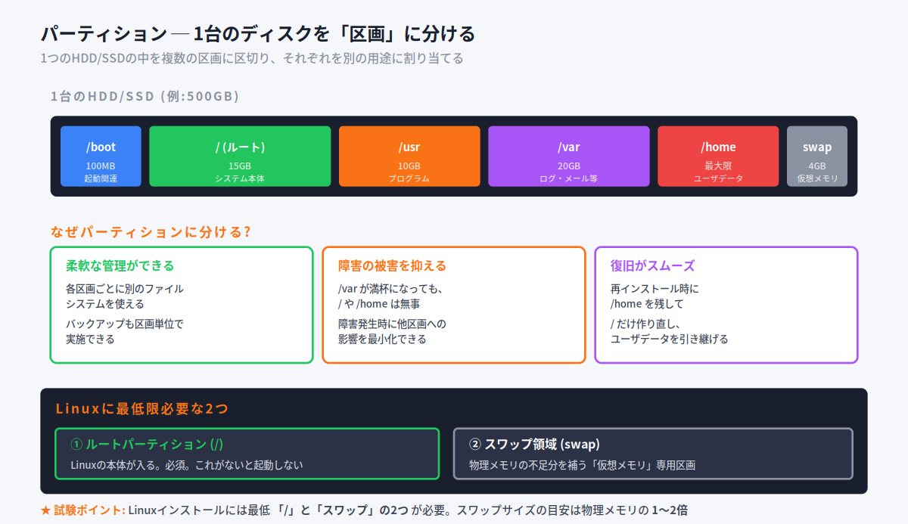
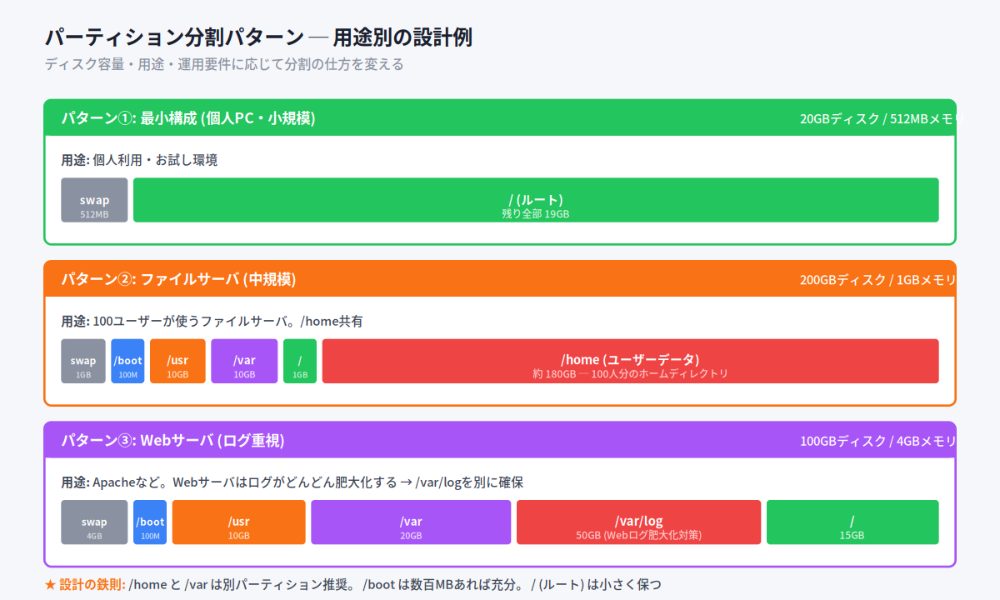
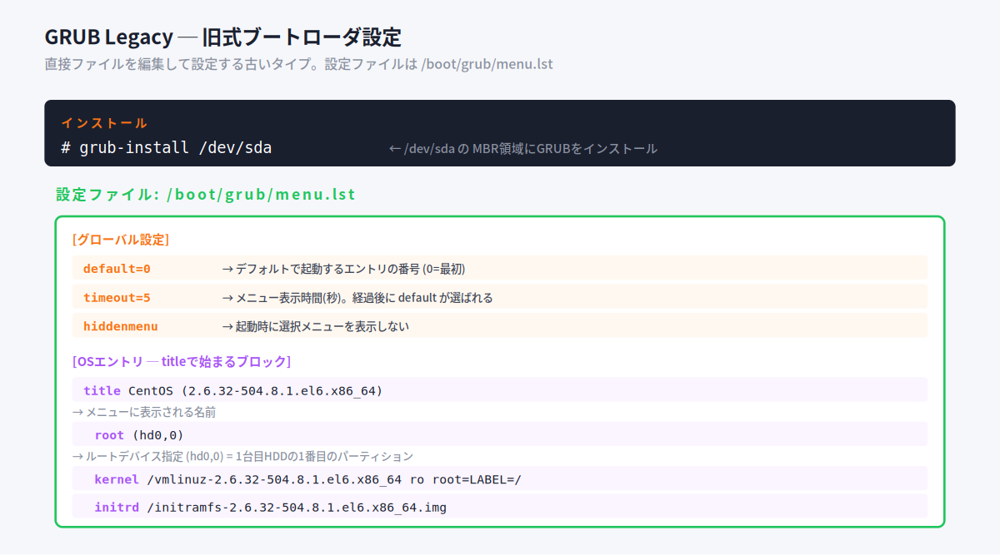
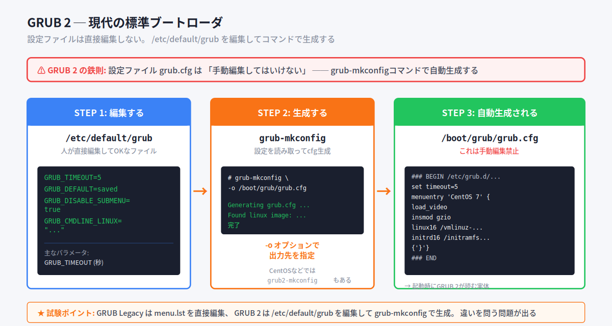
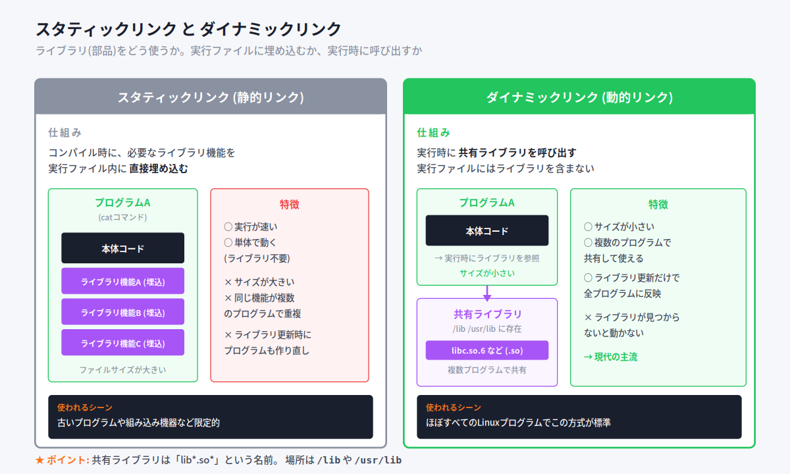
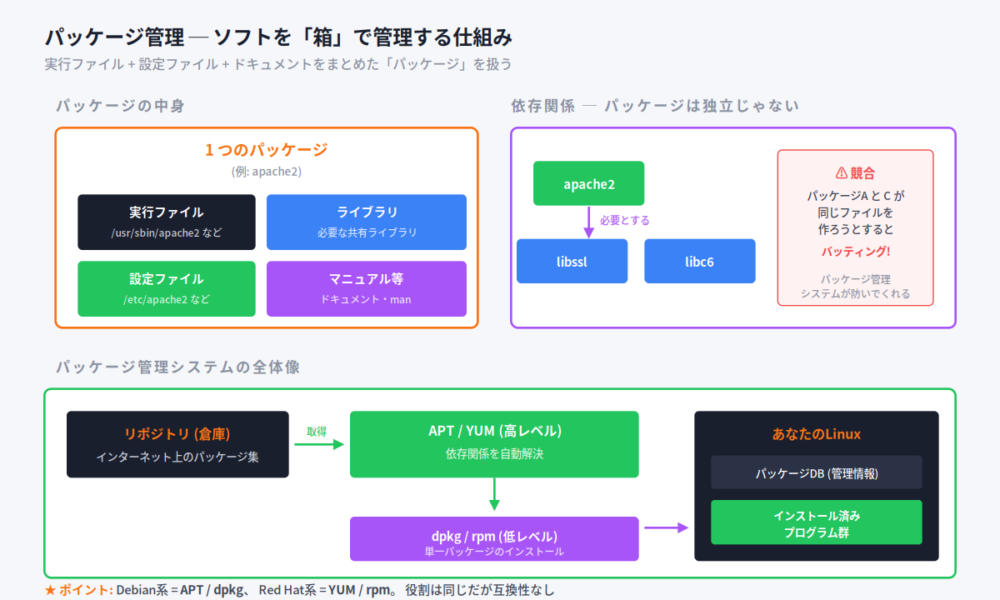
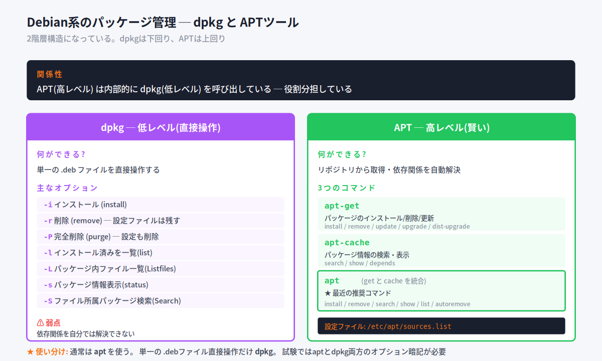
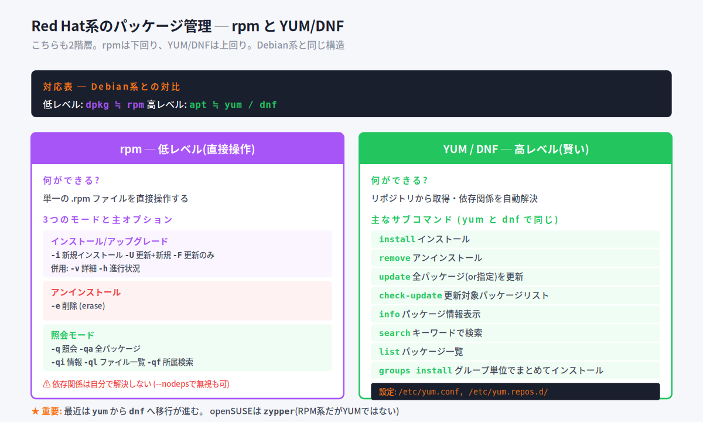
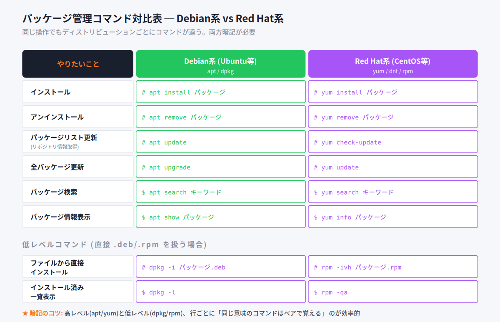
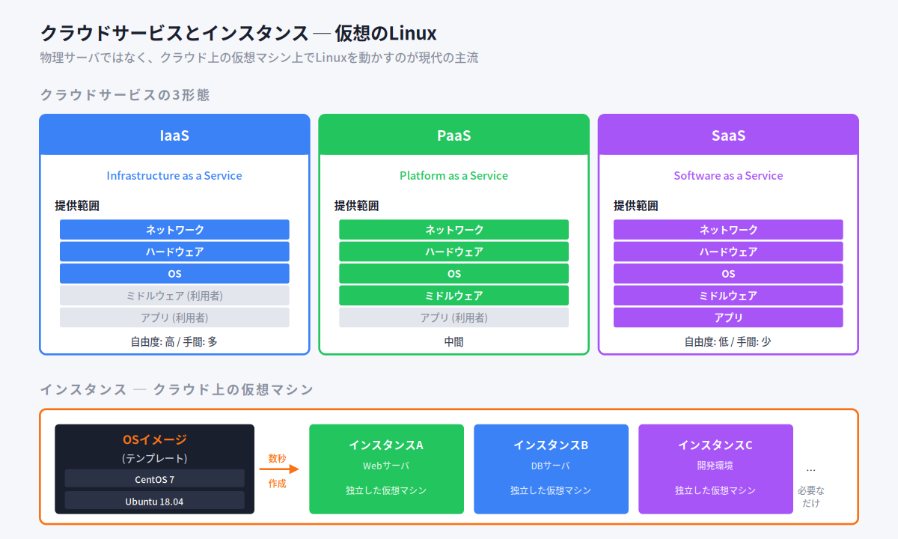

# 第2回：インストールとパッケージ管理

> **この資料について**
> これは研修当日のための **予備知識** をまとめた資料です。
> 研修当日は **おさらい → 暗記のコツの説明 → テスト → 答え合わせ** という流れで進むため、当日「初めて聞く話」が出てこないように、ここで必要な前提をひと通り押さえておきます。
>
> Linuxを触ったことがなくても理解できるよう、できるだけ身近な例で書いています。
>
> **前提**
> この資料は **第1章（システムアーキテクチャ）の知識があること** を前提に書かれています。BIOS/UEFI、ブートローダ、カーネル、init/systemd などの基本用語がわからない場合は、先に第1章の事前学習資料を確認してください。
>
> **読み方の指針**
> 1. まずは1回ざっと通読してください（細かい暗記は不要）
> 2. 各セクションの「📌 試験ポイント」と「📝 ここまでのまとめ」を見直してください
> 3. 巻末の「事前チェックリスト」で自分の理解度を測ってください
> 4. 研修当日は、このチェックリストのおさらいから始まります

---

<!-- ## 目次

- [2.1 ハードディスクのレイアウト設計](#_21-ハードディスクのレイアウト設計)
  - [2.1.1 Linuxインストールに必要なパーティション](#_211-linuxインストールに必要なパーティション)
  - [2.1.2 パーティションのレイアウト設計](#_212-パーティションのレイアウト設計)
- [2.2 ブートローダのインストール](#_22-ブートローダのインストール)
  - [2.2.1 GRUB のインストール](#_221-grub-のインストール)
  - [2.2.2 GRUB Legacy の設定](#_222-grub-legacy-の設定)
  - [2.2.3 GRUB 2 の設定](#_223-grub-2-の設定)
  - [2.2.4 ブートオプションの指定](#_224-ブートオプションの指定)
- [2.3 共有ライブラリ管理](#_23-共有ライブラリ管理)
  - [2.3.1 スタティックリンクとダイナミックリンク](#_231-スタティックリンクとダイナミックリンク)
  - [2.3.2 必要な共有ライブラリの確認](#_232-必要な共有ライブラリの確認)
- [2.4 Debian パッケージの管理](#_24-debian-パッケージの管理)
  - [2.4.1 パッケージ管理とは](#_241-パッケージ管理とは)
  - [2.4.2 dpkg コマンドを用いたパッケージ管理](#_242-dpkg-コマンドを用いたパッケージ管理)
  - [2.4.3 apt-get コマンド](#_243-apt-get-コマンド)
  - [2.4.4 apt-cache コマンド と apt コマンド](#_244-apt-cache-コマンド-と-apt-コマンド)
- [2.5 RPM パッケージの管理](#_25-rpm-パッケージの管理)
  - [2.5.1 RPM パッケージ](#_251-rpm-パッケージ)
  - [2.5.2 rpm コマンドの利用](#_252-rpm-コマンドの利用)
  - [2.5.3 YUM](#_253-yum)
  - [2.5.4 dnf コマンド](#_254-dnf-コマンド)
  - [2.5.5 Zypper を使ったパッケージ管理](#_255-zypper-を使ったパッケージ管理)
- [2.6 仮想化のゲストOSとしての Linux](#_26-仮想化のゲストosとしての-linux)
  - [2.6.1 クラウドサービスとインスタンス](#_261-クラウドサービスとインスタンス)
  - [2.6.2 インスタンスの初期化](#_262-インスタンスの初期化)
- [事前チェックリスト](#事前チェックリスト)

-->

---

## 2.1 ハードディスクのレイアウト設計

### ここで学ぶこと

Linuxをインストールするとき、ハードディスクを **どう区画分けするか**(=パーティション設計)を決める必要があります。「全部1つの区画でいいんじゃないの?」と思うかもしれませんが、運用していると「あ、ここを分けておくべきだった」と痛い目を見る場面が結構あります。

このセクションでは、なぜ分けるのか、どう分けるのが定石なのか、を学びます。LPIC試験では「最低限必要なパーティションは?」「スワップ領域はどのくらい?」「/varを別パーティションにする理由は?」といった形で問われます。

### 2.1.1 Linuxインストールに必要なパーティション

#### パーティションとは

**パーティション** = 1つのハードディスクを **複数の区画に区切る** こと。区切られた各区画も「パーティション」と呼びます。



1つのHDD/SSDを、用途別に複数の区画に分けて、それぞれを別のディレクトリに割り当てて使います。

#### Linuxに最低限必要な2つのパーティション

Linuxをインストールするには、**少なくとも次の2つ** が必要です：

1. **ルートパーティション (/)** ─ Linuxの本体が入る。これがないと起動しない
2. **スワップ領域** ─ 仮想メモリ用の区画

> 💡 **スワップ領域とは?**
> 物理メモリが足りなくなったとき、ディスクの一部を「メモリの延長」として使う仕組みです。メモリのフリをするディスク領域、と思ってください。
> 速度はメモリよりずっと遅いですが、メモリ不足で動作不能になるよりはマシ、という保険のような役割です。

#### スワップ領域のサイズ

教科書的な目安は **物理メモリの 1〜2倍**。たとえば物理メモリ1GBなら、スワップ領域も1〜2GB確保します。

ただし最近は物理メモリが充分大きい（16GB以上が一般的）ため、メモリと同程度や半分でも問題ないことが多いです。

#### なぜ分割するのか?

最低限は「/」と「swap」の2つですが、実際は **もっと分割する** のが推奨されます。理由は3つ：

1. **柔軟な管理ができる** ─ 各区画に別のファイルシステムを使え、バックアップも区画単位で実施できる
2. **障害の被害を抑える** ─ 1つの区画が満杯/壊れても他に影響しにくい
3. **復旧がスムーズ** ─ 再インストール時にユーザデータ(/home)を残せる

#### 別パーティションにすると良いディレクトリ

| ディレクトリ | なぜ分けるか |
|---|---|
| **/home** | ユーザーデータ。再インストール時に残せる。多人数で使う場合は専用区画必須 |
| **/var** | ログ・メールスプール等で **更新頻度が高い**。肥大化してシステム全体に影響を与えないため |
| **/usr** | プログラム・ライブラリ。NFS経由で読み込み専用マウントできてセキュリティ向上 |
| **/boot** | カーネルや起動関連。RAID構成ではディスク先頭に必要なこともある |
| **/(ルート)** | 上記以外の本体。なるべく小さく保つ(障害復旧が容易) |
| **EFIシステムパーティション(ESP)** | UEFIシステムでは必要。FATでフォーマットされ、ブートローダが入る |

> 💡 **/varが肥大化したらどうなる?** たとえばWebサーバのログファイル(`/var/log`)がディスクを使い切ると、ログだけでなく **システム全体が書き込みできなくなって停止** します。これは怖い。だから/varは別区画に分けるのが鉄則。

#### 📌 試験ポイント

| 問われ方 | 答え |
|---|---|
| Linuxインストールに最低必要な区画は? | **ルートパーティション(/)** と **スワップ領域** |
| スワップ領域のサイズの目安は? | 物理メモリの **1〜2倍** |
| /var を別区画にすべき理由は? | ログ等の肥大化からシステム全体を守るため |
| /usr の特徴は? | 読み込み専用マウント可能でセキュリティ向上 |
| UEFI環境で必要な区画は? | **EFIシステムパーティション(ESP)** |

### 2.1.2 パーティションのレイアウト設計

#### 設計の考慮点

パーティションのレイアウトを決めるとき、次を考慮します：

- **システムの用途**(個人PC、サーバ、Webサーバ等)
- **ディスクの容量**
- **バックアップの方法**

具体的なパターンを3つ見てみましょう：



##### パターン① 最小構成 (個人PC・小規模)

20GBディスク・512MBメモリで個人利用するなら：
- スワップ: 512MB(物理メモリと同程度)
- /(ルート): 残り全部(19GB)

シンプル。/homeも/varも分けない。

##### パターン② ファイルサーバ (中規模)

200GBディスク・1GBメモリ、100人ユーザーのファイルサーバなら：
- スワップ: 1GB
- /boot: 100MB
- /usr: 10GB
- /var: 10GB
- /(ルート): 1GB
- **/home: 約180GB** ← ユーザデータがここ集中

「ユーザーが触る場所」(/home)に容量を集中。

##### パターン③ Webサーバ (ログ重視)

100GBディスク・4GBメモリ、Apache等のWebサーバなら：
- スワップ: 4GB
- /boot: 100MB
- /usr: 10GB
- /var: 20GB
- **/var/log: 50GB** ← Webサーバのログが肥大化する想定で大きめに分ける
- /(ルート): 15GB

「ログがどんどん増える」用途に対応した設計。

#### LVM(参考)

最近は **LVM(論理ボリューム管理)** という、より柔軟にディスクを管理する仕組みも使われます。複数の物理ディスクを「ボリュームグループ」として束ね、そこから「論理ボリューム」を切り出して使う方式です。

LPIC-1では概要のみ。詳細はLPIC-2の出題範囲。

#### 📌 試験ポイント

| 問われ方 | 答え |
|---|---|
| 用途が異なるディレクトリは? | **別パーティション** に配置 |
| /(ルート)の容量は? | なるべく **小さく** (障害復旧が容易) |
| /home を別にするメリットは? | 再インストール時に環境を引き継げる |

---

## 2.2 ブートローダのインストール

### ここで学ぶこと

第1章の起動シーケンス(BIOS→ブートローダ→カーネル...)で出てきた **ブートローダ** を、ここでは深掘りします。LinuxのブートローダはほぼすべてGRUB。GRUB Legacy(旧)とGRUB 2(現代)の違いと設定方法を押さえます。

### 2.2.1 GRUB のインストール

#### GRUBとは

**GRUB**(GRand Unified Bootloader)はLinuxの代表的なブートローダです。多機能で、ほぼすべてのLinuxディストリビューションで標準採用されています。

GRUBの特徴：

- **多数のファイルシステムを認識可能** (HDDの中身を読める)
- **シェル機能搭載** で、起動時にコマンドによる高度な管理が可能
- 2つのバージョン: **GRUB Legacy**(古い・バージョン0.9x系) と **GRUB 2**(現代・1.9x系)

#### GRUBをインストールする

`grub-install` コマンドで、起動デバイスにGRUBを書き込みます：

```bash
# grub-install /dev/sda
```

これで `/dev/sda` の **MBR**(Master Boot Record, ディスク先頭部分)にGRUBが書き込まれます。電源を入れたとき、BIOS/UEFIはここからGRUBを読み込むので、これでLinux起動の準備が整います。

> 💡 **MBR** = ハードディスクの先頭にある特別なセクタ。ブートローダが書き込まれる場所として歴史的に決まっています。BIOSは電源投入時、ここを読みに行く約束になっています。

### 2.2.2 GRUB Legacy の設定

#### 設定ファイルの場所

**GRUB Legacy**(旧バージョン)では、設定ファイルは **`/boot/grub/menu.lst`** です。これを直接エディタで編集して設定します。



> 💡 ディストリビューションによっては `/boot/grub/grub.conf` という名前のこともあります。

#### 主なパラメータ

設定ファイルの中身で重要なものは：

**[グローバル設定]**

| パラメータ | 意味 |
|---|---|
| `default` | デフォルトで起動するエントリの番号(0=最初) |
| `timeout` | メニュー表示時間(秒)。経過後にdefaultが選ばれる |
| `hiddenmenu` | 起動時に選択メニューを表示しない |
| `splashimage` | メニュー表示時の背景画像 |

**[OSエントリ ─ titleで始まるブロック]**

| パラメータ | 意味 |
|---|---|
| `title` | メニューに表示されるエントリ名 |
| `root` | ルートデバイスの指定(例: `(hd0,0)` = 1台目HDDの1番目のパーティション) |
| `kernel` | 起動するカーネルイメージファイルと起動オプション |
| `initrd` | 初期RAMディスク(initramfs)ファイル |
| `chainloader` | 指定セクタの読み込みと実行(他のOS起動時に使う) |

#### 設定ファイルの例

```
default=0
timeout=5
hiddenmenu

title CentOS (2.6.32-504.8.1.el6.x86_64)
    root (hd0,0)
    kernel /vmlinuz-2.6.32-504.8.1.el6.x86_64 ro root=LABEL=/
    initrd /initramfs-2.6.32-504.8.1.el6.x86_64.img
```

これは「タイムアウト5秒、デフォルトは1番目(CentOSカーネル2.6.32-504.8.1)を起動」という設定です。

#### 📌 試験ポイント

| 問われ方 | 答え |
|---|---|
| GRUB Legacyの設定ファイル | **/boot/grub/menu.lst** |
| (hd0,0) は何? | 1台目HDDの1番目のパーティション |

### 2.2.3 GRUB 2 の設定

#### GRUB 2 は設定方法が違う

**GRUB 2** では、設定ファイルが`/boot/grub/grub.cfg`に変わりましたが、ここで **重要な違い** があります：

> ⚠ **GRUB 2 の鉄則: grub.cfg は手動編集してはいけない**

GRUB 2 では、こんな流れで設定します：



##### 3ステップ

**STEP 1**: **`/etc/default/grub`** を編集する（これは人が直接編集してOK）

例：
```
GRUB_TIMEOUT=5
GRUB_DEFAULT=saved
GRUB_DISABLE_SUBMENU=true
GRUB_CMDLINE_LINUX="..."
```

主なパラメータ：

| パラメータ | 意味 |
|---|---|
| `GRUB_TIMEOUT` | 起動メニューのタイムアウト秒数 |
| `GRUB_DEFAULT` | デフォルトで起動するエントリ(saved=保存された選択) |
| `GRUB_CMDLINE_LINUX` | カーネルに渡す起動オプション |

> ⚠ 「=」の前後にはスペースを入れない (`GRUB_TIMEOUT = 5` はNG、`GRUB_TIMEOUT=5` が正しい)

**STEP 2**: **`grub-mkconfig`** コマンドで設定ファイルを生成

```bash
# grub-mkconfig -o /boot/grub/grub.cfg
```

`-o` オプションで出力先を指定します。CentOS系では `grub2-mkconfig` というコマンド名のこともあります。

**STEP 3**: **`/boot/grub/grub.cfg`** が自動生成される

これが起動時に実際にGRUB 2が読む実体ファイル。中身は複雑なので、手で書く・編集することはしません。

#### 📌 試験ポイント

| 問われ方 | 答え |
|---|---|
| GRUB 2 の設定ファイル | `/boot/grub/grub.cfg` (ただし自動生成) |
| GRUB 2 で人が編集するファイル | **/etc/default/grub** |
| 設定変更後に実行するコマンド | **grub-mkconfig**(または grub2-mkconfig) |
| 出力先指定のオプション | **-o** |

### 2.2.4 ブートオプションの指定

起動時に、システムの動作を変えるための **ブートオプション** を一時的に指定できます。

#### やり方

GRUBの起動メニュー画面で **「E」キー** を押すと、起動オプションを編集できる画面が表示されます。たとえば：

```
grub append> ro root=/dev/VolGroup00/LogVol00 rhgb quiet
```

ここに追加のオプションを書いて Enter キーで起動できます。

#### 代表的なブートオプション

| パラメータ | 意味 |
|---|---|
| `root=デバイス` | ルートパーティションとしてマウントするデバイス |
| `nousb` | USBデバイスを使用しない |
| **`single`** | **シングルユーザーモード** で起動する |
| `1〜5` | 指定したランレベルで起動する |

#### 使用例

「シングルユーザーモードで起動したい」(パスワード忘れの復旧など) → 末尾に `single` を追加：

```
grub append> ro root=/dev/VolGroup00/LogVol00 rhgb quiet single
```

#### 📌 試験ポイント

| 問われ方 | 答え |
|---|---|
| ブートオプションを編集するキー | **E** |
| シングルユーザーモードで起動するオプション | **single** または **1** |

---

## 2.3 共有ライブラリ管理

### ここで学ぶこと

「ライブラリ」=プログラムの **部品** のことです。よく使う機能を別ファイルにまとめて、複数のプログラムから共有できるようにしたものを **共有ライブラリ** と呼びます。ここでは仕組みとコマンドを学びます。

### 2.3.1 スタティックリンクとダイナミックリンク

#### リンクとは

C言語などで作られたプログラムは、基本機能以外はライブラリの機能を呼び出して動きます。**ライブラリの機能をプログラムに紐付ける作業** が「リンク」です。

リンクには2つのやり方があります：



#### スタティックリンク(静的リンク)

- コンパイル時に、ライブラリの機能を **実行ファイルに直接埋め込む**
- 結果: 実行ファイルは「全部入り」で、単体で動く

メリット：
- 単体で完結(ライブラリ不要)
- 実行が速い

デメリット：
- ファイルサイズが大きい
- 同じ機能が複数のプログラムで重複してメモリ・ディスクを無駄遣い
- ライブラリ更新時に全プログラム再コンパイルが必要

#### ダイナミックリンク(動的リンク)

- 実行時に、必要な **共有ライブラリ** を呼び出す
- 実行ファイルにはライブラリの中身は含まない

メリット：
- ファイルサイズが小さい
- 複数のプログラムでライブラリを共有できる(メモリ・ディスクの節約)
- ライブラリ更新だけで全プログラムに反映される

デメリット：
- ライブラリが見つからないと動かない

**現代のLinuxではほぼすべてのプログラムがダイナミックリンク** で作られています。

#### 共有ライブラリの形式

共有ライブラリは「**lib〜.so〜**」という名前で、`/lib` や `/usr/lib` ディレクトリに置かれます。

例：
- `libc.so.6` ─ C言語標準ライブラリ
- `libreadline.so.5` ─ 行編集ライブラリ

> 💡 「.so」は **Shared Object** の略。Windowsで言う「.dll」(Dynamic Link Library)と似た存在。

#### 📌 試験ポイント

| 問われ方 | 答え |
|---|---|
| ライブラリを実行ファイルに埋め込む方式 | **スタティックリンク(静的リンク)** |
| 実行時にライブラリを呼び出す方式 | **ダイナミックリンク(動的リンク)** |
| 共有ライブラリの名前パターン | **lib〜.so〜** |
| 共有ライブラリの場所 | **/lib**, **/usr/lib** |

### 2.3.2 必要な共有ライブラリの確認

#### lddコマンド

実行ファイルが必要とする共有ライブラリを調べるには **`ldd`** コマンドを使います。

```bash
$ ldd /bin/cat
        linux-vdso.so.1 =>  (0x00007fff545fe000)
        libc.so.6 => /lib64/libc.so.6 (0x00007fe41b479000)
        /lib64/ld-linux-x86-64.so.2 (0x00007fe41b84c000)
```

→ `/bin/cat` は `libc.so.6` を必要としていることが分かります。

#### 実行時にライブラリをロードする仕組み

プログラム実行時、**`ld.so`**(リンカ/ローダ)が必要なライブラリを探してロードします。検索順は：

1. **環境変数 `LD_LIBRARY_PATH`** に指定されたパス(最優先)
2. **キャッシュファイル `/etc/ld.so.cache`** に登録されたパス
3. デフォルトの `/lib` と `/usr/lib`

#### /etc/ld.so.conf と ldconfig

`/lib`, `/usr/lib` 以外のディレクトリも検索対象にしたい場合、**`/etc/ld.so.conf`** にパスを書きます：

```
/usr/lib64/iscsi
/usr/lib64/mysql
```

ただし、プログラムを起動するたびにこれを毎回読むのは非効率なので、内容は **キャッシュ** されます。キャッシュは **`/etc/ld.so.cache`** というバイナリファイルで、**`ldconfig`** コマンドで再構築します：

```bash
# ldconfig
```

> ⚠ 共有ライブラリを追加・変更したら、必ず `ldconfig` を実行してキャッシュを更新する。

#### LD_LIBRARY_PATH 環境変数

特定のユーザーやセッションだけで追加ライブラリパスを使いたい場合は、環境変数 `LD_LIBRARY_PATH` を使います：

```bash
$ export LD_LIBRARY_PATH=$LD_LIBRARY_PATH:/home/student/mylib
```

#### 📌 試験ポイント

| 問われ方 | 答え |
|---|---|
| 実行ファイルが必要なライブラリを表示 | **ldd** |
| 共有ライブラリの追加検索パス設定 | **/etc/ld.so.conf** |
| キャッシュファイル | **/etc/ld.so.cache** |
| キャッシュを再構築するコマンド | **ldconfig** |
| 追加検索パスを指定する環境変数 | **LD_LIBRARY_PATH** |
| 共有ライブラリをリンクするローダ | **ld.so** |

---

## 2.4 Debian パッケージの管理

### ここで学ぶこと

**パッケージ** = ソフトウェアを「箱」にまとめたもの。実行ファイル・設定ファイル・ドキュメントなどが全部入っています。これを管理する仕組みを **パッケージ管理システム** と呼びます。

LinuxにはDebian系(Ubuntu等)とRed Hat系(CentOS等)の2大派閥があり、パッケージ管理の方式が違います。まずはDebian系から見ていきましょう。

### 2.4.1 パッケージ管理とは

#### パッケージの中身



1つのパッケージには、そのソフトを動かすために必要なすべてが詰まっています：

- 実行ファイル
- 必要なライブラリの情報
- 設定ファイル
- マニュアル・ドキュメント

#### パッケージ管理システムが解決する問題

##### 依存関係

「パッケージAは パッケージBがないと動かない」という関係を **依存関係** と呼びます。たとえばApacheウェブサーバは、SSLライブラリやC標準ライブラリに依存しています。

##### 競合関係

「パッケージAとパッケージCは同じファイルを作ろうとするので共存できない」という関係を **競合** と呼びます。

パッケージ管理システムは、これらを **自動で監視** し、問題があれば警告を出してくれます。

#### Linuxの2大パッケージ管理

| 系統 | 形式 | 代表ディストリビューション | 低レベル | 高レベル |
|---|---|---|---|---|
| **Debian系** | deb形式 | Debian, Ubuntu | **dpkg** | **APT (apt/apt-get/apt-cache)** |
| **Red Hat系** | RPM形式 | RHEL, CentOS, Fedora, openSUSE | **rpm** | **YUM, DNF, Zypper** |

> ⚠ **両者は互換性なし**。.debファイルをRed Hatに入れることはできませんし、.rpmファイルをDebianに入れることもできません。

#### リポジトリ

**リポジトリ** = パッケージが集積されたサーバ。インターネット上にあって、高レベルツール(APT/YUM)はそこから自動的にパッケージをダウンロードしてくれます。

#### 📌 試験ポイント

| 問われ方 | 答え |
|---|---|
| Debian系のパッケージ形式 | **deb形式(.deb)** |
| Red Hat系のパッケージ形式 | **RPM形式(.rpm)** |
| Debian系の低レベルコマンド | **dpkg** |
| Debian系の高レベルツール | **APT (apt-get, apt-cache, apt)** |
| パッケージが集積された場所 | **リポジトリ** |

### 2.4.2 dpkg コマンドを用いたパッケージ管理

#### dpkgとは

**dpkg** は、Debian系で **.debファイルを直接操作** する低レベルコマンドです。



#### Debianパッケージのファイル名形式

```
tree_1.6.0-1_i386.deb
 ①    ② ③  ④  ⑤
```

① パッケージ名 / ② バージョン / ③ Debianリビジョン / ④ アーキテクチャ / ⑤ 拡張子

#### dpkgの主なオプション

書式: `dpkg [オプション] アクション`

| オプション | 意味 |
|---|---|
| **`-i`** (`--install`) | パッケージをインストールする |
| **`-r`** (`--remove`) | 設定ファイルを残してアンインストール |
| **`-P`** (`--purge`) | 設定ファイルも含めて完全にアンインストール |
| **`-l`** (`--list`) | インストール済みパッケージを表示 |
| **`-L`** (`--listfiles`) | 指定パッケージのファイル一覧 |
| **`-s`** (`--status`) | パッケージの情報を表示 |
| **`-S`** (`--search`) | 指定したファイルがどのパッケージのものか検索 |
| `--unpack` | パッケージを展開する(インストールはしない) |
| `--configure` | 展開されたパッケージを構成する |

#### 実行例

インストール：
```bash
# dpkg -i apache2_2.4.29-1ubuntu4.5_amd64.deb
```

完全削除(設定ファイルも消す)：
```bash
# dpkg --purge apache2
```

設定ファイルを残して削除：
```bash
# dpkg -r apache2
```

ファイルがどのパッケージから来たか調査：
```bash
$ dpkg -S '*/apache2'
apache2: /etc/apache2
apache2, apache2-data: /usr/share/apache2
```

インストール済み全パッケージを一覧：
```bash
$ dpkg -l
```

#### dpkgの弱点

**dpkg は依存関係を自分では解決できません**。依存パッケージが足りないとエラーで止まります。だから普段は dpkg を直接使わず、APTツール経由でインストールします。

#### dpkg-reconfigure

インストール後に、パッケージの対話的な設定をやり直したいときに使います：

```bash
# dpkg-reconfigure postfix
```

#### 📌 試験ポイント

| 問われ方 | 答え |
|---|---|
| .debファイルを直接扱うコマンド | **dpkg** |
| インストールオプション | **-i** |
| 完全削除(設定ごと) | **-P (--purge)** |
| インストール済み一覧 | **-l (--list)** |
| パッケージ内ファイル一覧 | **-L (--listfiles)** |
| ファイルの所属パッケージ検索 | **-S (--search)** |

### 2.4.3 apt-get コマンド

#### APTとは

**APT** (Advanced Packaging Tool) は、依存関係の自動解決と、インターネット経由の最新パッケージ取得ができる **高レベル** パッケージ管理ツールです。

dpkgの上に乗っかって、賢く動いてくれます。

#### apt-getの構文

書式: `apt-get [オプション] サブコマンド パッケージ名`

#### 主なサブコマンド

| サブコマンド | 意味 |
|---|---|
| **`install`** | パッケージをインストール/アップグレード |
| **`remove`** | パッケージをアンインストール |
| **`update`** | パッケージデータベースを更新(リポジトリ情報を取得) |
| **`upgrade`** | 全パッケージを更新(他パッケージは削除しない) |
| **`dist-upgrade`** | 全パッケージを更新(他パッケージ削除を伴うことも) |
| `clean` | 過去に取得して保持していたパッケージファイルを削除 |

#### 主なオプション

| オプション | 意味 |
|---|---|
| `-d` | ダウンロードのみ(インストールしない) |
| `-s` | システムを変更せずに動作シミュレート |

#### 実行例

リポジトリ情報を更新：
```bash
# apt-get update
```

パッケージをインストール(依存関係も自動解決)：
```bash
# apt-get install apache2
```

パッケージをアンインストール：
```bash
# apt-get remove apache2
```

システムを最新にアップグレード：
```bash
# apt-get upgrade            # 削除を伴わない
# apt-get dist-upgrade       # 必要なら削除も伴う
```

#### sources.list ─ リポジトリ設定

APTがどのリポジトリから取得するかは **`/etc/apt/sources.list`** に書かれています：

```
deb http://archive.ubuntu.com/ubuntu bionic main restricted
deb-src http://archive.ubuntu.com/ubuntu bionic main restricted
```

書式：
```
deb URL バージョン名 セクション
```

セクション例：
- `main` - 公式サポート
- `universe` - コミュニティメンテナンス
- `restricted` - プロプライエタリドライバ
- `multiverse` - 法的に制限されたソフト

#### 📌 試験ポイント

| 問われ方 | 答え |
|---|---|
| パッケージリスト更新 | `apt-get update` |
| パッケージインストール | `apt-get install パッケージ名` |
| パッケージアンインストール | `apt-get remove パッケージ名` |
| 削除を伴わない更新 | `apt-get upgrade` |
| 削除を伴う更新 | `apt-get dist-upgrade` |
| APTの設定ファイル | **/etc/apt/sources.list** |

### 2.4.4 apt-cache コマンド と apt コマンド

#### apt-cache

**apt-cache** はパッケージ情報の **検索・照会** 専用コマンドです。インストール済みでなくても情報を見られます。

| サブコマンド | 意味 |
|---|---|
| `search キーワード` | キーワードを含むパッケージを検索 |
| `show パッケージ名` | パッケージの一般情報を表示 |
| `showpkg パッケージ名` | 詳細情報を表示 |
| `depends パッケージ名` | 依存関係を表示 |

例：
```bash
$ apt-cache search apache2
apache2 - Apache HTTP サーバ
apache2-bin - Apache HTTP Server (modules and other binary files)
```

#### apt コマンド (最近の推奨)

`apt-get` と `apt-cache` の機能を統合した、**より使いやすいコマンド** が **`apt`** です。最近のディストリビューションでは `apt` の使用が推奨されています。

書式: `apt [オプション] サブコマンド`

| サブコマンド | 意味 |
|---|---|
| `update` | パッケージリスト更新 |
| `install` | インストール |
| `remove` | 削除(設定残す) |
| `purge` | 完全削除 |
| `upgrade` | アップグレード |
| `full-upgrade` | メジャーバージョンを含むアップグレード |
| `show` | 情報表示 |
| `list` | 一覧 |
| `list --installed` | インストール済み一覧 |
| `list --upgradable` | 更新可能なパッケージ一覧 |
| `search` | 全文検索 |
| `depends` | 依存関係を表示 |
| **`autoremove`** | 不要になったパッケージを自動削除 |

| オプション | 意味 |
|---|---|
| `-y` | 問い合わせに自動でyesと答える |
| `-d` | ダウンロードのみ |

#### 実行例

```bash
# apt update              # リポジトリ情報を更新
# apt install apache2     # インストール
# apt search ruby         # 検索
# apt autoremove          # 不要パッケージを掃除
```

#### 📌 試験ポイント

| 問われ方 | 答え |
|---|---|
| パッケージ情報検索 | `apt-cache search` または `apt search` |
| パッケージ情報表示 | `apt-cache show` または `apt show` |
| apt-get と apt-cache を統合 | **apt** |
| 自動で yes と答えるオプション | **-y** |
| 不要パッケージの自動削除 | **autoremove** |

---

## 2.5 RPM パッケージの管理

### ここで学ぶこと

Red Hat系(CentOS, Fedora, RHEL等)で使われる **RPM パッケージ管理** を学びます。構造はDebian系と似ていて、**低レベル(rpm)** と **高レベル(yum/dnf/zypper)** の2階層構造です。

### 2.5.1 RPM パッケージ

#### RPMとは

**RPM** = Red Hat社が開発したパッケージ管理システム(RPM Package Manager)。現在では多くのRed Hat系ディストリビューションで採用されています。

#### RPMパッケージのファイル名形式

```
bash-4.2.46-30.el7.x86_64.rpm
 ①    ②    ③    ④      ⑤
```

① パッケージ名 / ② バージョン / ③ リリース番号 / ④ アーキテクチャ / ⑤ 拡張子

### 2.5.2 rpm コマンドの利用

#### rpmコマンドの3つのモード

`rpm` コマンドには大きく3つのモードがあり、それぞれにオプションがあります：



#### インストール/アップグレードモード

| オプション | 意味 |
|---|---|
| **`-i`** (`--install`) | 新規インストール |
| **`-U`** (`--upgrade`) | アップグレード(なければインストール) |
| **`-F`** (`--freshen`) | アップグレード(なければインストールしない) |

併用オプション：

| オプション | 意味 |
|---|---|
| **`-v`** | 詳細表示 |
| **`-h`** (`--hash`) | 進行状況を「#」で表示 |
| `--nodeps` | 依存関係を無視 |
| `--force` | 既存ファイルを上書き |
| `--test` | テスト実行のみ |

実行例：
```bash
# rpm -ivh zsh-5.0.2-28.el7.x86_64.rpm
Preparing...        ############### [100%]
Updating / installing...
   1:zsh-5.0.2-28.el7  ############### [100%]
```

> 💡 **`-U` と `-F` の違い**:
> - `-U`: パッケージがなければ新規インストール、あればアップグレード
> - `-F`: パッケージがなければ何もしない、あればアップグレードのみ
>
> 試験で「アップグレードのみを行う」と問われたら `-F` が答え。

#### アンインストールモード

| オプション | 意味 |
|---|---|
| **`-e`** (`--erase`) | アンインストール |
| `--nodeps` | 依存関係を無視 |

実行例：
```bash
# rpm -e httpd
```

#### 照会モード(query)

| オプション | 意味 |
|---|---|
| **`-q`** | 照会(基本) |
| **`-qa`** | インストール済みすべてのパッケージを表示 |
| **`-qf ファイル名`** | 指定ファイルを含むパッケージを表示 |
| **`-qi パッケージ名`** | パッケージの情報を表示 |
| **`-ql パッケージ名`** | パッケージに含まれるファイル一覧 |
| **`-qp パッケージファイル`** | 対象を **未インストールの.rpmファイル** に指定 |
| `-qR` | 依存ファイルを表示 |
| `-qc` | 設定ファイルのみ |
| `-qd` | ドキュメントのみ |
| `--changelog` | 変更履歴 |

実行例：
```bash
# vim関連パッケージを検索
# rpm -qa | grep vim

# bashパッケージの情報を表示
$ rpm -qi bash

# /bin/bash がどのパッケージから来たか
$ rpm -qf /bin/bash
bash-4.2.46-30.el7.x86_64

# インストール前のRPMファイルの中身を見る
$ rpm -qlp bash-4.2.46-30.el7.x86_64.rpm
```

> 💡 オプションの組み合わせは試験頻出。`-qa` `-qi` `-ql` `-qf` `-qlp` あたりを反射的に思い出せるように。

#### パッケージの署名確認

```bash
$ rpm --checksig httpd-2.4.6-80.el7.centos.1.x86_64.rpm
```

または `-K` オプションでも同じです。

#### パッケージの展開

RPMをインストールせず、中身だけ取り出すには `rpm2cpio` と `cpio` の組み合わせ：

```bash
$ rpm2cpio tree-1.6.0-10.el7.x86_64.rpm | cpio -id
```

#### 📌 試験ポイント

| 問われ方 | 答え |
|---|---|
| .rpmファイルを直接扱うコマンド | **rpm** |
| インストール | **-i** |
| アップグレード(新規も) | **-U** |
| アップグレードのみ | **-F** |
| アンインストール | **-e** |
| 進行状況表示 | **-h** |
| インストール済み一覧 | **-qa** |
| パッケージ情報表示 | **-qi** |
| 含まれるファイル一覧 | **-ql** |
| ファイルの所属パッケージ | **-qf** |

### 2.5.3 YUM

#### YUMとは

**YUM** (Yellow dog Updater, Modified) は、Red Hat系の **高レベル** パッケージ管理ツール。APTに相当する位置づけです。

#### YUMの設定ファイル

| ファイル | 役割 |
|---|---|
| `/etc/yum.conf` | 全体設定 |
| `/etc/yum.repos.d/` | リポジトリ情報の設定ファイル群 |

例：
```bash
$ ls /etc/yum.repos.d/
CentOS-Base.repo  CentOS-Sources.repo  epel.repo
```

#### yum コマンドの主なサブコマンド

| サブコマンド | 意味 |
|---|---|
| **`install パッケージ名`** | インストール |
| **`remove パッケージ名`** | アンインストール |
| **`update [パッケージ名]`** | アップデート(指定なしで全件) |
| **`check-update`** | アップデート対象パッケージリスト |
| **`info パッケージ名`** | 情報表示 |
| **`list`** | 全パッケージ情報をリスト |
| **`search キーワード`** | 検索 |
| `repolist` | リポジトリ一覧 |
| `groups list` | パッケージグループ一覧 |
| **`groups install グループ名`** | グループ単位でまとめてインストール |

#### 実行例

```bash
# yum check-update            # 更新対象を確認
# yum update                  # 全部更新
# yum install ruby            # rubyをインストール
# yum remove emacs            # emacsをアンインストール
$ yum info bash               # 情報表示
$ yum search ruby             # 検索
# yum groups install "GNOME Desktop"  # グループ単位インストール
```

> 💡 オプション `-y` を付けると問い合わせに自動でyesと答えます: `yum install -y ruby`

#### パッケージグループ

RPMには「**パッケージグループ**」という概念があり、関連パッケージをまとめて扱えます。「GUI環境一式」「開発ツール一式」のような単位です。

```bash
$ yum groups list
Available Environment Groups:
   Minimal Install
   Infrastructure Server
   Server with GUI
   GNOME Desktop
...
```

#### 📌 試験ポイント

| 問われ方 | 答え |
|---|---|
| YUMリポジトリの設定 | **/etc/yum.repos.d/** |
| パッケージインストール | `yum install` |
| 全パッケージアップデート | `yum update` |
| 自動でyes | **-y** |
| グループインストール | `yum groups install` |

### 2.5.4 dnf コマンド

#### dnf とは

**dnf** (Dandified YUM) は、**YUMの後継** として開発されたコマンドです。基本的な使い方は yum とほぼ同じで、サブコマンドもほとんど同じです。

Fedoraでは Fedora 22 以降、CentOS でも 8 以降は dnf がメインになっています。

#### 主なサブコマンド

yum とほぼ同じ：
- `install`, `remove`, `upgrade`(update), `info`, `list`, `search`, `check-update`, `clean`, `history`, `updateinfo`

#### 📌 試験ポイント

「YUM の後継は?」 → **dnf**

### 2.5.5 Zypper を使ったパッケージ管理

#### zypper とは

**openSUSE** や **SUSE Linux Enterprise** で使われる、Red Hat系のパッケージ(RPM形式)を扱うツール。yumとは別の体系です。

#### 主なサブコマンド

| サブコマンド | 短縮形 | 意味 |
|---|---|---|
| `install パッケージ名` | `in` | インストール |
| `remove パッケージ名` | `rm` | アンインストール |
| `info パッケージ名` | - | 情報表示 |
| `update` | `up` | システム全体をアップデート |
| `update パッケージ名` | `up` | 指定パッケージをアップデート |
| `list-updates` | `lu` | アップデート対象リスト |
| `dist-upgrade` | `dup` | ディストリビューションアップグレード |
| `search キーワード` | `se` | 検索 |

実行例：
```bash
# zypper in git              # gitをインストール
# zypper in yast*            # yast で始まるパッケージを全部
```

#### 📌 試験ポイント

| 問われ方 | 答え |
|---|---|
| openSUSE のパッケージ管理コマンド | **zypper** |
| zypper のインストール | `zypper install` または `zypper in` |

### 📝 パッケージ管理コマンド総まとめ

ここまでたくさん出てきたので、対比表で整理：



「やりたいこと」と「Debian系のコマンド」「Red Hat系のコマンド」をペアで覚えるのが効率的。

---

## 2.6 仮想化のゲストOSとしての Linux

### ここで学ぶこと

最近のLinuxサーバは、物理マシンに直接インストールするより **クラウド上の仮想マシン** で動かすことが圧倒的に多くなっています。LPIC試験でも、クラウド関連の用語が出題されます。実務的な詳細は問われませんが、概念と用語を押さえる必要があります。

### 2.6.1 クラウドサービスとインスタンス

#### クラウドサービスとは

物理的なサーバを買ってきて社内に置く代わりに、**他社が提供する仮想サーバを借りて使う** 形態です。代表サービス：

- AWS (Amazon Web Services)
- Microsoft Azure
- Google Cloud Platform (GCP)

#### クラウドサービスの3形態 (IaaS / PaaS / SaaS)



サービス提供者がどこまで面倒を見てくれるかで3階層に分類されます：

##### IaaS (Infrastructure as a Service)

提供されるのは「**インフラ部分**」 = ネットワーク + ハードウェア + OS まで。
ミドルウェアやアプリは利用者が自分で入れる。

→ **自由度: 高** / 手間: 多
→ Linux上で何をやってもいい

##### PaaS (Platform as a Service)

IaaS + **アプリケーション実行環境(ミドルウェア)** まで提供。
開発環境やDBがすぐ使える状態で提供される。

→ 中間
→ アプリだけ開発すればOK

##### SaaS (Software as a Service)

すべて(アプリまで)提供される。利用者は **完成品のアプリを使うだけ**。

→ 自由度: 低 / 手間: 少
→ 例: Gmail, Office 365

> 💡 LPICで主に扱うのは **IaaS**(Linuxを操作する場面)です。

#### オンプレミス

クラウドの対義語。**実際の物理サーバを社内やデータセンタに置いて運用** することを **オンプレミス**(on-premises) と呼びます。

#### インスタンス

**インスタンス** = クラウド上で動いている **個々の仮想マシン** のこと。「ソフトウェアで構成されたコンピュータ」と考えてください。

物理サーバへのLinuxインストールには十数分かかりますが、インスタンスは **OSイメージから数秒〜数十秒で作成** できるのがクラウドの強みです。

#### OSイメージ

インスタンスを作る元になる **テンプレート**。「CentOS 7 イメージ」「Ubuntu 18.04 イメージ」のような、起動可能なOSの雛形ファイルです。

このイメージから何個でもインスタンスをコピーして作れます。

#### クラウド関連の主な用語

LPIC試験で出る用語：

| 用語 | 説明 |
|---|---|
| **インスタンス** | クラウド上で動作する個々の仮想マシン |
| **OSイメージ** | インスタンスのテンプレートとなるディスクイメージ |
| **ゲストOS** | 仮想マシンにインストールされたOS |
| **ブロックストレージ** | 仮想的なディスクストレージ。簡単に容量追加可能 |
| **コンテナ** | 独立したOSのように扱える軽量なアプリケーション実行環境 |
| **アプライアンスコンテナ** | Webサーバ/DB等が組み込まれた状態のコンテナイメージ |
| **ゲストドライバ** | 仮想マシンにインストールするデバイスドライバ |

#### 📌 試験ポイント

| 問われ方 | 答え |
|---|---|
| クラウドの3形態 | **IaaS / PaaS / SaaS** |
| ネットワーク+ハード+OSを提供 | **IaaS** |
| クラウド上の個々の仮想マシン | **インスタンス** |
| インスタンスの雛形 | **OSイメージ** |
| 物理サーバ運用の対義語 | **オンプレミス** |
| 軽量な仮想実行環境 | **コンテナ** |

### 2.6.2 インスタンスの初期化

#### 課題: テンプレートからのコピーだと重複する

OSイメージから新しいインスタンスを作るとき、**ただテンプレートをコピーしただけ** では、本来サーバごとに異なるはずの情報が重複してしまいます：

- ホスト名(ホストの名前)
- SSH ホストキー(暗号化通信の鍵)

これでは複数のサーバを区別できないし、セキュリティ上もまずい。

#### Cloud-init

この問題を解決するのが **Cloud-init** という仕組みです。

Cloud-initは多くのOSイメージにあらかじめ組み込まれていて、**インスタンスの初回起動時** に設定(ユーザーデータ)に基づいて適切な初期設定を行います。

設定できる主な項目：

- **ホスト名**
- **SSH 公開鍵**(ログインに使うもの)
- 一般ユーザー作成
- インストールするパッケージ

これで「テンプレートからコピーした直後にホスト名が同じ」という問題が解決します。

#### D-Bus マシン ID

個々のインスタンスを **一意に識別** するためにも仕組みがあります：

- **D-Bus マシン ID**: インスタンスごとに異なるIDが割り当てられる
- 格納場所: **`/etc/machine-id`**

```bash
$ cat /etc/machine-id
0826355f7b90c2c924f95e5ddfdfe26d
```

> 💡 同じOSイメージから作ったインスタンスでも、それぞれに違うmachine-idが割り当てられて区別できます。

#### 📌 試験ポイント

| 問われ方 | 答え |
|---|---|
| インスタンス初回起動時に初期化する仕組み | **Cloud-init** |
| Cloud-initで設定できる項目 | ホスト名、SSH公開鍵、ユーザー、パッケージ等 |
| インスタンスの一意な識別子 | **D-Bus マシン ID** |
| マシンIDの格納場所 | **/etc/machine-id** |

---

## 📝 全体まとめ ─ ここまでの学習内容

このセクションを終えた時点で、次のことができるようになっているはずです：

1. **パーティション設計** で最低必要な2区画（/ と swap）を言える
2. **スワップ領域** の役割とサイズの目安（物理メモリの 1〜2倍）を言える
3. **/var, /home, /usr, /boot** の役割を区別できる
4. **GRUB Legacy と GRUB 2** の設定方法の違いを説明できる（直接編集 vs `/etc/default/grub` + `grub-mkconfig`）
5. **ブートオプション** をGRUB起動時に指定できる
6. **スタティックリンクとダイナミックリンク** の違いを説明できる
7. **共有ライブラリ** の確認(`ldd`)・キャッシュ更新(`ldconfig`)ができる
8. **環境変数 `LD_LIBRARY_PATH`** の役割がわかる
9. **dpkg / apt** と **rpm / yum / dnf / zypper** の役割（低レベル/高レベル）を理解している
10. **Debian系と Red Hat系の主要コマンド** をペアで対比できる
11. **依存関係・リポジトリ** の概念を説明できる
12. **IaaS / PaaS / SaaS** の違いを説明できる
13. **インスタンス・OSイメージ・Cloud-init** の役割を理解している
14. **D-Bus マシンID** (`/etc/machine-id`) の意味がわかる

これらができていれば、研修当日のテストで困ることはほぼないはずです。

---

## 事前チェックリスト

研修当日の朝、これに自信を持って「✓」を付けられる状態が理想です。
分からない項目があれば、該当セクションに戻って読み直してください。

### パーティション設計（2.1）

- [ ] Linuxインストールに最低必要な区画2つ（**/** と **swap**）を言える
- [ ] スワップ領域のサイズの目安（物理メモリの **1〜2倍**）を言える
- [ ] /var を別パーティションにする理由を説明できる
- [ ] /home を別パーティションにするメリットを説明できる
- [ ] /boot, /usr, /var, /home の役割をそれぞれ説明できる
- [ ] EFIシステムパーティション（ESP）が何か説明できる
- [ ] LVMの概要（ボリュームグループ → 論理ボリューム）を一言で言える

### ブートローダ（2.2）

- [ ] **GRUB** がLinuxの代表的ブートローダだと分かる
- [ ] `grub-install /dev/sda` で何が起きるかわかる
- [ ] **MBR** が何か説明できる
- [ ] GRUB Legacy の設定ファイル（**/boot/grub/menu.lst**）を言える
- [ ] GRUB Legacy の `(hd0,0)` が何を指すか説明できる
- [ ] GRUB 2 で人が編集するファイル（**/etc/default/grub**）を言える
- [ ] GRUB 2 の設定反映に使うコマンド（**grub-mkconfig -o**）を言える
- [ ] GRUB 2 の grub.cfg を **直接編集してはいけない** と分かる
- [ ] 起動時に **E キー** でブートオプションを編集できると知っている
- [ ] **single** オプションでシングルユーザーモードに入れると分かる

### 共有ライブラリ（2.3）

- [ ] **スタティックリンク**（埋め込み）と **ダイナミックリンク**（実行時参照）の違いを説明できる
- [ ] 共有ライブラリの命名規則（**lib〜.so〜**）を言える
- [ ] 共有ライブラリの主な配置場所（**/lib**, **/usr/lib**）を言える
- [ ] **`ldd`** で実行ファイルが必要なライブラリを表示できる
- [ ] **`/etc/ld.so.conf`** に追加検索パスを記述すると分かる
- [ ] **`ldconfig`** でキャッシュ（/etc/ld.so.cache）を再構築すると分かる
- [ ] 環境変数 **`LD_LIBRARY_PATH`** の役割を説明できる
- [ ] `ld.so` が共有ライブラリのリンカ/ローダだと分かる

### Debianパッケージ管理（2.4）

- [ ] **dpkg** が低レベル、**APT** が高レベルだと分かる
- [ ] APT の3コマンド（**apt-get / apt-cache / apt**）の使い分けが分かる
- [ ] `dpkg -i パッケージ.deb` でインストールできる
- [ ] **`-r`** (remove設定残す) と **`-P`** (purge完全削除) を区別できる
- [ ] `dpkg -l` で全パッケージ一覧、`dpkg -L パッケージ名` でファイル一覧
- [ ] `dpkg -S ファイル名` でファイルの所属パッケージ検索
- [ ] `apt-get install / remove / update / upgrade / dist-upgrade` の意味を区別できる
- [ ] **upgrade** と **dist-upgrade** の違いを説明できる
- [ ] APTの設定ファイル（**/etc/apt/sources.list**）を言える
- [ ] `apt search` でパッケージ検索、`apt show` で情報表示
- [ ] **`autoremove`** で不要パッケージを掃除できる
- [ ] **`-y`** オプションで自動 yes 回答できる

### RPMパッケージ管理（2.5）

- [ ] **rpm** が低レベル、**yum/dnf/zypper** が高レベルだと分かる
- [ ] rpm のインストール（**-i**）、アップグレード（**-U**）、アップグレードのみ（**-F**）を区別できる
- [ ] **`-U` と `-F` の違い**（-F はパッケージがないと何もしない）を説明できる
- [ ] rpm の**進行状況表示オプション**（**-h**）を知っている
- [ ] rpm のアンインストール（**-e**）を知っている
- [ ] rpm 照会モード（**-q**, **-qa**, **-qi**, **-ql**, **-qf**, **-qlp**, **-qR**）の意味を区別できる
- [ ] `rpm --checksig` または `-K` で署名確認
- [ ] `rpm2cpio` + `cpio` でRPMの展開だけできる
- [ ] yum の主要サブコマンド（install / remove / update / check-update / info / search / list）を知っている
- [ ] YUM のリポジトリ設定ディレクトリ（**/etc/yum.repos.d/**）を言える
- [ ] **`yum groups install`** でグループ単位インストールできる
- [ ] **dnf** が yum の後継だと知っている
- [ ] **zypper** が openSUSE 用と知っている

### 仮想化とクラウド（2.6）

- [ ] **IaaS / PaaS / SaaS** の違いを説明できる
- [ ] IaaS で提供される範囲（ネットワーク / ハード / OS）を言える
- [ ] **オンプレミス** がクラウドの対義語だと分かる
- [ ] **インスタンス** がクラウド上の仮想マシンと分かる
- [ ] **OSイメージ** がインスタンスのテンプレートだと分かる
- [ ] インスタンスは数秒〜数十秒で作れると知っている
- [ ] **Cloud-init** の役割（インスタンスの初期化）を説明できる
- [ ] Cloud-init で設定できる項目（ホスト名・SSH公開鍵・ユーザー・パッケージ）を挙げられる
- [ ] **D-Bus マシン ID** の格納場所（**/etc/machine-id**）を言える
- [ ] **コンテナ** が仮想マシンより軽量なアプリ実行環境だと分かる

### コマンド総まとめ（暗記）

これらのコマンドを「見ただけで何をするか」答えられるようになっていれば理想です：

| コマンド | これは何? |
|---|---|
| `grub-install /dev/sda` | |
| `grub-mkconfig -o /boot/grub/grub.cfg` | |
| `ldd /bin/cat` | |
| `ldconfig` | |
| `dpkg -i パッケージ.deb` | |
| `dpkg -P パッケージ名` | |
| `dpkg -l` | |
| `dpkg -L パッケージ名` | |
| `dpkg -S /path/to/file` | |
| `apt update` | |
| `apt install パッケージ名` | |
| `apt remove パッケージ名` | |
| `apt upgrade` | |
| `apt-get dist-upgrade` | |
| `apt search キーワード` | |
| `apt show パッケージ名` | |
| `apt autoremove` | |
| `rpm -ivh パッケージ.rpm` | |
| `rpm -Uvh パッケージ.rpm` | |
| `rpm -Fvh パッケージ.rpm` | |
| `rpm -e パッケージ名` | |
| `rpm -qa` | |
| `rpm -qi パッケージ名` | |
| `rpm -ql パッケージ名` | |
| `rpm -qf /path/to/file` | |
| `rpm -qlp パッケージ.rpm` | |
| `yum install パッケージ名` | |
| `yum remove パッケージ名` | |
| `yum update` | |
| `yum check-update` | |
| `yum info パッケージ名` | |
| `yum search キーワード` | |
| `yum groups install "グループ名"` | |
| `dnf install パッケージ名` | |
| `zypper install パッケージ名` | |
| `cat /etc/machine-id` | |

### ファイル・ディレクトリ総まとめ（暗記）

| パス | これは何? |
|---|---|
| `/boot/grub/menu.lst` | |
| `/boot/grub/grub.cfg` | |
| `/etc/default/grub` | |
| `/lib`, `/usr/lib` | |
| `/etc/ld.so.conf` | |
| `/etc/ld.so.cache` | |
| `/etc/apt/sources.list` | |
| `/var/cache/apt/archives` | |
| `/etc/yum.conf` | |
| `/etc/yum.repos.d/` | |
| `/etc/machine-id` | |
| 環境変数 `LD_LIBRARY_PATH` | |

### 用語総まとめ（暗記）

これらの用語を「自分の言葉で説明できる」状態が目標：

- [ ] パーティション
- [ ] スワップ領域 / 仮想メモリ
- [ ] ルートパーティション
- [ ] EFIシステムパーティション (ESP)
- [ ] LVM
- [ ] MBR / GPT
- [ ] GRUB Legacy / GRUB 2
- [ ] ブートオプション
- [ ] シングルユーザーモード
- [ ] スタティックリンク / ダイナミックリンク
- [ ] 静的ライブラリ / 共有ライブラリ
- [ ] ld.so / ldconfig
- [ ] LD_LIBRARY_PATH
- [ ] パッケージ
- [ ] パッケージ管理システム
- [ ] 依存関係 / 競合関係
- [ ] リポジトリ
- [ ] deb形式 / RPM形式
- [ ] dpkg / APT (apt / apt-get / apt-cache)
- [ ] rpm / YUM / DNF / Zypper
- [ ] IaaS / PaaS / SaaS
- [ ] オンプレミス
- [ ] インスタンス
- [ ] OSイメージ
- [ ] ゲストOS
- [ ] コンテナ
- [ ] Cloud-init
- [ ] D-Bus マシンID

---

## 研修当日に向けて

事前学習がきちんとできていれば、研修当日は以下の流れで進みます：

1. **おさらい**（このチェックリストの中から数問）
2. **Hackの説明**（覚え方のコツ、暗記時間）
3. **テスト**（実際の試験問題を含む）
4. **答え合わせ・おさらい**

研修当日にいきなり知らない言葉が並ぶと焦ってしまうものです。事前にこの資料で予備知識を入れておけば、当日は **「あ、これ事前学習で見た」** という安心感を持ちながら進められます。
分からない部分があっても**慌てる必要はありません**。一度通読してから、チェックリストで自分のウィークポイントを把握しておけば、研修で確実に固められます。

頑張ってください。
