# 第3回：GNUとUNIXコマンド

> **この資料について**
> これは研修当日のための **予備知識** をまとめた資料です。
> 研修当日は **おさらい → 暗記のコツの説明 → テスト → 答え合わせ** という流れで進むため、当日「初めて聞く話」が出てこないように、ここで必要な前提をひと通り押さえておきます。
>
> Linuxを触ったことがなくても理解できるよう、できるだけ身近な例で書いています。
>
> **前提**
> この資料は **第1章（システムアーキテクチャ）・第2章（インストールとパッケージ管理）の知識があること** を前提に書かれています。シェルやコマンドの基本がまだあやしい場合は、先にそちらを確認してください。
>
> **この章の重要度について**
> 第3章は、LPIC-1の中でも **特に出題数が多い最重要章** です。コマンドとオプションの暗記が中心になりますが、ただ丸暗記するのではなく「なぜそうなるのか」を理解しておくと、ひっかけ問題にも対応できます。分量は多いですが、ここを固めれば合格がぐっと近づきます。
>
> **読み方の指針**
> 1. まずは1回ざっと通読してください（細かい暗記は不要）
> 2. 各セクションの「📌 試験ポイント」と「📝 ここまでのまとめ」を見直してください
> 3. 巻末の「事前チェックリスト」で自分の理解度を測ってください
> 4. 研修当日は、このチェックリストのおさらいから始まります

---

<!-- ## 目次

- [3.1 コマンドライン操作](#31-コマンドライン操作)
  - [3.1.1 シェル](#311-シェル)
  - [3.1.2 シェルの基本操作と設定](#312-シェルの基本操作と設定)
  - [3.1.3 シェル変数と環境変数](#313-シェル変数と環境変数)
  - [3.1.4 環境変数 PATH](#314-環境変数-path)
  - [3.1.5 コマンドの実行](#315-コマンドの実行)
  - [3.1.6 引用符](#316-引用符)
  - [3.1.7 コマンド履歴](#317-コマンド履歴)
  - [3.1.8 マニュアルの参照](#318-マニュアルの参照)
  - [3.1.9 ファイル操作コマンド](#319-ファイル操作コマンド)
  - [3.1.10 メタキャラクタの利用](#3110-メタキャラクタの利用)
- [3.2 パイプとリダイレクト](#32-パイプとリダイレクト)
  - [3.2.1 標準入出力](#321-標準入出力)
  - [3.2.2 パイプ](#322-パイプ)
  - [3.2.3 リダイレクト](#323-リダイレクト)
- [3.3 テキスト処理フィルタ](#33-テキスト処理フィルタ)
  - [3.3.1 テキストフィルタコマンド](#331-テキストフィルタコマンド)
  - [3.3.2 ファイルのチェックサム](#332-ファイルのチェックサム)
- [3.4 正規表現を使ったテキスト検索](#34-正規表現を使ったテキスト検索)
  - [3.4.1 正規表現](#341-正規表現)
  - [3.4.2 grep コマンド](#342-grep-コマンド)
  - [3.4.3 sed コマンド](#343-sed-コマンド)
- [3.5 ファイルの基本的な編集](#35-ファイルの基本的な編集)
  - [3.5.1 エディタの基本](#351-エディタの基本)
  - [3.5.2 vi エディタの基本](#352-vi-エディタの基本)
- [事前チェックリスト](#事前チェックリスト)

-->

---

## 3.1 コマンドライン操作

### ここで学ぶこと

Linuxの操作は、基本的に **コマンドを文字で打ち込む** ことで行います。WindowsやMacのようにマウスでアイコンをクリックするのではなく、キーボードから命令文を入力していくスタイルです。

このセクションでは、その命令を受け付けてくれる **シェル** という仕組みと、効率よくコマンドを打つためのテクニックを学びます。LPIC試験では、シェルの種類、変数、PATH、引用符、コマンド履歴、マニュアルの調べ方、ファイル操作コマンドなど、幅広く問われます。

### 3.1.1 シェル

#### シェルとは ─ あなたとLinuxの「通訳」

あなたがキーボードで `ls` と打つと、ファイルの一覧が表示されます。このとき、あなたの入力を受け取って、対応するプログラムを探して実行し、結果を返してくれているのが **シェル(shell)** です。

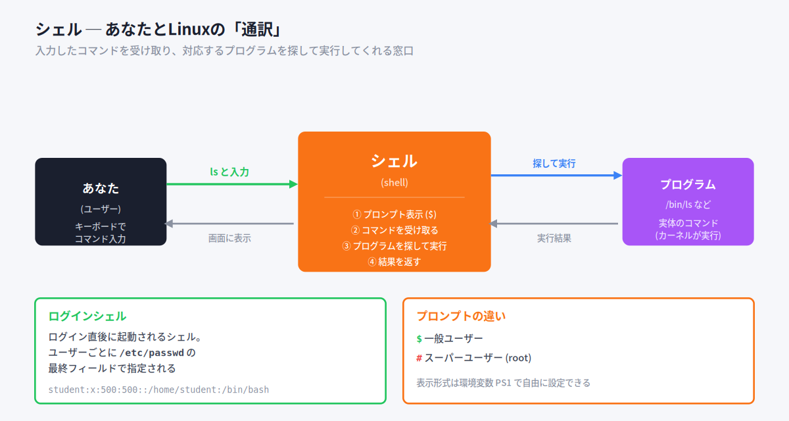

例えるなら、シェルは **レストランのウェイター** のようなものです。あなた（客）が「これください」と注文すると、ウェイター（シェル）がキッチン（プログラム）に伝えて、出来上がった料理（結果）をテーブルに運んでくれます。あなたが直接キッチンに入る必要はありません。

> 💡 「シェル(shell)」は「貝殻」という意味。OSの中核(カーネル)を包む殻のように外側にあって、ユーザーとの窓口になることからこう呼ばれます。

#### シェルの種類

シェルには複数の種類があり、好みに応じて選べます。大きく **Bourne系** と **C系** の2系統に分かれます。

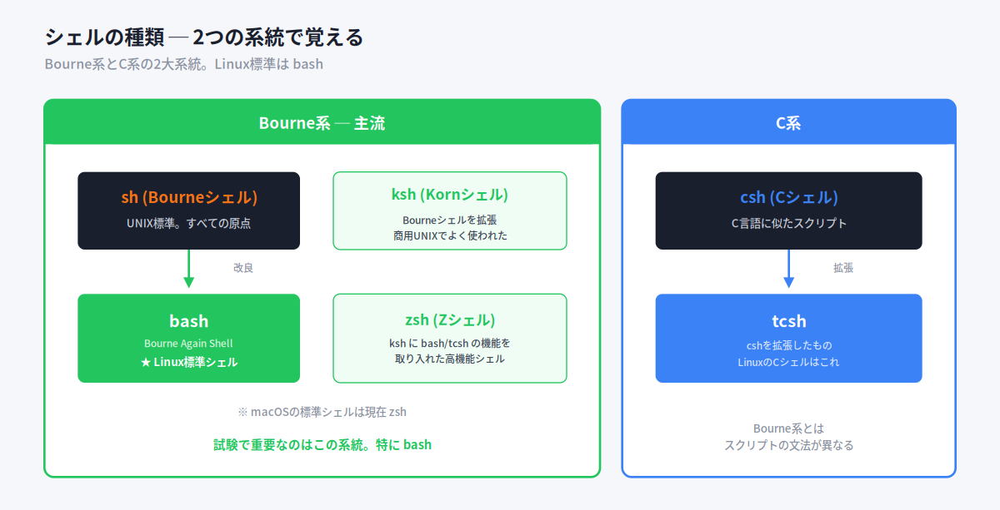

| 系統 | シェル | 特徴 |
|---|---|---|
| **Bourne系** | **sh** (Bourneシェル) | UNIX標準。すべての原点 |
| | **bash** (Bourne Again Shell) | shを改良。**Linuxの標準シェル** |
| | **ksh** (Kornシェル) | shを拡張。商用UNIXでよく使われた |
| | **zsh** (Zシェル) | kshにbash/tcshの機能を取り入れた高機能シェル |
| **C系** | **csh** (Cシェル) | C言語に似たスクリプトが使える |
| | **tcsh** | cshを拡張。LinuxのCシェルはこれ |

試験で特に重要なのは **bash**。Linuxのほとんどのディストリビューションで標準シェルになっています。

> 💡 利用可能なシェルは `/etc/shells` ファイルで確認できます。デフォルトシェルの変更は `chsh` コマンドで行います。

#### ログインシェルとプロンプト

システムにログインした直後に起動されるシェルを **ログインシェル** と呼びます。ユーザーごとのログインシェルは **`/etc/passwd`** ファイルの最終フィールドに記述されています。

```
student:x:500:500::/home/student:/bin/bash
                                  ↑ここがログインシェル
```

ログインすると、シェルは **プロンプト** という記号を表示して入力を待ちます。

| プロンプト | 意味 |
|---|---|
| `$` | 一般ユーザー |
| `#` | スーパーユーザー(root) |

プロンプトの表示形式は環境変数 **PS1** で自由に設定できます。例えば `[lpic@centos tmp]$` のように、ユーザー名・ホスト名・カレントディレクトリを表示することもできます。

> 💡 **カレントディレクトリ** = いま自分が作業している場所のディレクトリ。「カレント(current)」は「現在の」という意味です。

#### 📌 試験ポイント

| 問われ方 | 答え |
|---|---|
| Linux標準のシェルは? | **bash** |
| ログインシェルが記述されるファイルは? | **/etc/passwd** (最終フィールド) |
| 一般ユーザーのプロンプト記号は? | **$** |
| rootのプロンプト記号は? | **#** |
| プロンプトの表示形式を設定する環境変数は? | **PS1** |

---

### 3.1.2 シェルの基本操作と設定

#### ここで学ぶこと

bashには、コマンド入力を楽にするための便利機能がたくさんあります。これを知っているかどうかで作業効率が大きく変わります。試験でも「このキー操作は何をする?」という形でよく問われます。

#### ショートカットは「4グループ」で覚える

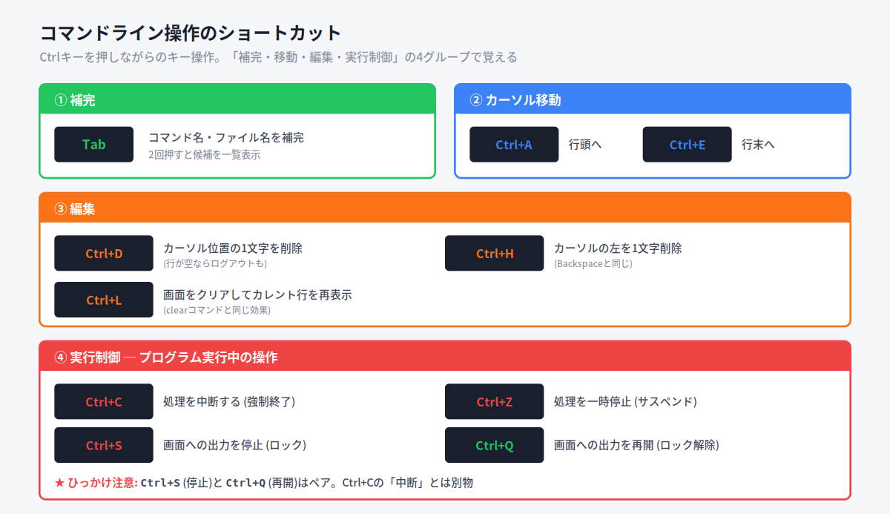

bashの操作は **補完・カーソル移動・編集・実行制御** の4グループに分けると覚えやすくなります。

##### ① 補完（Tabキー）

`linuxp` まで打って **Tab** キーを押すと、残りを自動補完してくれます。これを **補完機能** といいます。候補が複数ある場合は、Tabを2回押すと候補が一覧表示されます。

> 💡 補完は入力ミスを減らす強い味方。長いファイル名も数文字打ってTabで一発です。

##### ② カーソル移動

| キー | 動作 |
|---|---|
| **Ctrl+A** | 行頭へ移動 |
| **Ctrl+E** | 行末へ移動 |

長いコマンドを打ったあと、先頭を直したいときに便利です。

##### ③ 編集

| キー | 動作 |
|---|---|
| **Ctrl+D** | カーソル位置の1文字を削除（行が空ならログアウト） |
| **Ctrl+H** | カーソルの左を1文字削除（Backspaceと同じ） |
| **Ctrl+L** | 画面をクリアしてカレント行を再表示 |

##### ④ 実行制御（プログラム実行中の操作）

| キー | 動作 |
|---|---|
| **Ctrl+C** | 処理を中断する（強制終了） |
| **Ctrl+Z** | 処理を一時停止する（サスペンド） |
| **Ctrl+S** | 画面への出力を停止（ロック） |
| **Ctrl+Q** | 画面への出力を再開（ロック解除） |

> ⚠ **ひっかけ注意**: `Ctrl+S`(停止)と`Ctrl+Q`(再開)はペアです。うっかりCtrl+Sを押して「画面が固まった!」と思ったら、Ctrl+Qで復活します。Ctrl+Cの「中断」とは別物なので混同しないように。

#### ディレクトリを表すメタキャラクタ

bashでは、ディレクトリを表す特殊記号が使えます。

| 記号 | 意味 |
|---|---|
| `~` | ホームディレクトリ |
| `.` | カレントディレクトリ |
| `..` | 1つ上のディレクトリ |

例えばカレントディレクトリが `/home/student/work/lpic` のとき：
- `~` → `/home/student`
- `.` → `/home/student/work/lpic`
- `..` → `/home/student/work`
- `~/tmp` → `/home/student/tmp`

#### 📌 試験ポイント

| 問われ方 | 答え |
|---|---|
| コマンド補完のキーは? | **Tab** |
| 行頭・行末への移動は? | **Ctrl+A** / **Ctrl+E** |
| 処理を中断するキーは? | **Ctrl+C** |
| 処理を一時停止するキーは? | **Ctrl+Z** |
| ホームディレクトリを表す記号は? | **~** |
| 1つ上のディレクトリを表す記号は? | **..** |

---

### 3.1.3 シェル変数と環境変数

#### ここで学ぶこと

シェルは、ユーザーの情報（ホームディレクトリ、ログイン名など）を **変数** に保存しています。変数には「シェル変数」と「環境変数」の2種類があり、その違いが試験でよく問われます。

#### 2つの変数の違いは「子に引き継がれるか」

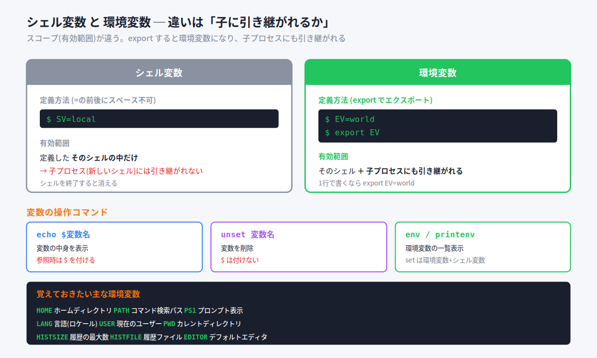

変数は **有効範囲(スコープ)** によって2種類に分かれます。

| 種類 | 有効範囲 |
|---|---|
| **シェル変数** | 定義した **そのシェルの中だけ**。子プロセスには引き継がれない |
| **環境変数** | そのシェル **＋ 子プロセス(新しいシェル)にも引き継がれる** |

身近な例えで言うと：
- **シェル変数** = 自分のメモ帳。自分だけが見られる
- **環境変数** = 家族の伝言板。子ども（子プロセス）にも見える

#### 変数の定義と参照

```bash
$ SV=local        # 変数を定義（=の前後にスペースを入れない!）
$ echo $SV        # 参照するときは $ を付ける
local
```

> ⚠ **超重要なルール**:
> - 定義するとき → `$` を **付けない** (`VAR=linux`)
> - 参照するとき → `$` を **付ける** (`echo $VAR`)
>
> `$VAR=linux` や `echo VAR` は間違い。ここはひっかけ頻出です。

#### export で環境変数にする

シェル変数を環境変数にするには **export** コマンドを使います。

```bash
$ EV=world        # まず変数を定義
$ export EV       # exportで環境変数に昇格
```

`export EV=world` のように1行でまとめて書くこともできます。

#### 変数の操作コマンド

| コマンド | 動作 |
|---|---|
| `echo $変数名` | 変数の中身を表示（参照時は $ を付ける） |
| `unset 変数名` | 変数を削除（$ は付けない） |
| `env` / `printenv` | 環境変数の一覧を表示 |
| `set` | 環境変数 **と** シェル変数の両方を表示 |

#### 主な環境変数

試験でよく問われる環境変数です。

| 環境変数 | 意味 |
|---|---|
| **HOME** | カレントユーザーのホームディレクトリ |
| **PATH** | コマンドを検索するディレクトリリスト |
| **PS1** | プロンプトの表示文字列 |
| **PS2** | 複数行入力時のプロンプト |
| **LANG** | 言語処理方式（ロケール） |
| **USER** | 現在のユーザー名 |
| **PWD** | カレントディレクトリ |
| **HISTSIZE** | コマンド履歴の最大数 |
| **HISTFILE** | コマンド履歴を格納するファイル |
| **EDITOR** | デフォルトのエディタのパス |
| **TERM** | 端末の種類 |

#### 📌 試験ポイント

| 問われ方 | 答え |
|---|---|
| シェル変数を環境変数にするコマンドは? | **export** |
| 変数を削除するコマンドは? | **unset** |
| 環境変数だけを一覧表示するコマンドは? | **env** または **printenv** |
| 環境変数とシェル変数を両方表示するコマンドは? | **set** |
| 変数定義時に = の前後はどうする? | **スペースを入れない** |
| 変数を参照するときは? | 先頭に **$** を付ける |

---

### 3.1.4 環境変数 PATH

#### ここで学ぶこと

コマンドを打ったとき、Linuxはどうやってそのコマンドの実体を見つけているのか? その鍵が環境変数 **PATH** です。「コマンドが見つからない(command not found)」というエラーの仕組みも、ここを理解すれば腑に落ちます。

#### 内部コマンドと外部コマンド

コマンドには2種類あります。

| 種類 | 説明 | 例 |
|---|---|---|
| **内部コマンド** | シェル自体に組み込まれている | cd, echo, export, history |
| **外部コマンド** | 独立したプログラムとして存在する | ls(/bin/ls), cp, useradd |

内部コマンドは探す必要がありませんが、**外部コマンドはどこにあるか探す必要があります**。

#### PATH ─ コマンドの「探し場所リスト」

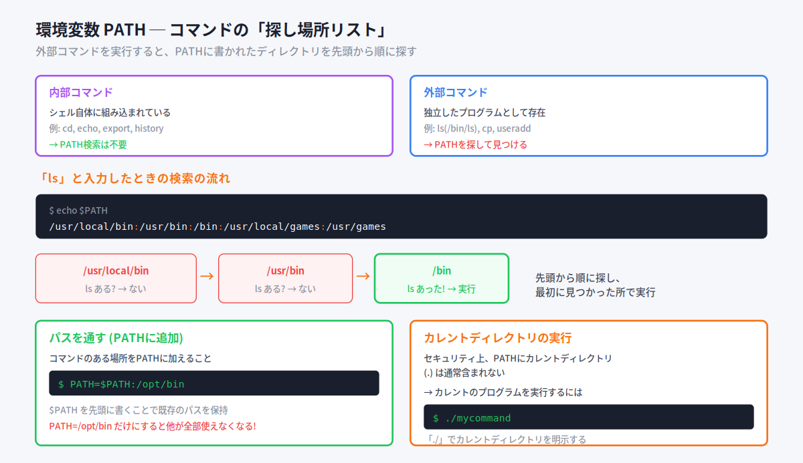

外部コマンドを打つと、シェルは環境変数 **PATH** に書かれたディレクトリを **先頭から順に** 探します。

```bash
$ echo $PATH
/usr/local/bin:/usr/bin:/bin:/usr/local/games:/usr/games
```

`ls` と打つと、`/usr/local/bin` → `/usr/bin` → `/bin` … と順に探し、最初に見つかった場所で実行します。`:` (コロン) でディレクトリが区切られています。

例えるなら、PATHは **「行きつけのお店リスト」**。「ラーメン食べたい」と思ったら、リストの上から順にお店を探して、最初に見つかったお店に入る、というイメージです。

#### パスを通す

コマンドのある場所をPATHに追加することを **「パスを通す」** といいます。

```bash
$ PATH=$PATH:/opt/bin     # 末尾に /opt/bin を追加
```

> ⚠ `$PATH` を先頭に書くのがポイント。これで **既存のパスを保持** したまま追加できます。もし `PATH=/opt/bin` だけにすると、他のパスが全部消えて `ls` すら使えなくなります（絶対パスを指定すれば使えますが）。

#### カレントディレクトリのプログラム実行

セキュリティ上の理由から、PATHには通常 **カレントディレクトリ(.)が含まれません**。そのため、カレントディレクトリにあるプログラムを実行するには `./` を明示します。

```bash
$ ./mycommand     # カレントディレクトリの mycommand を実行
```

> 💡 なぜカレントディレクトリを含めないのか? もし含めると、悪意ある人が `ls` という名前の偽プログラムをディレクトリに置いておき、あなたが `ls` と打った瞬間に偽物が実行される、という攻撃が可能になってしまうからです。

#### 絶対パスと相対パス

| 種類 | 説明 | 例 |
|---|---|---|
| **絶対パス** | ルート(/)から始まる完全な道順 | `/usr/sbin/useradd` |
| **相対パス** | カレントディレクトリ(.)を基点とした道順 | `./mycommand`, `../work` |

PATHが通っていない場所のコマンドでも、絶対パスを指定すれば実行できます（実行権限があれば）。

```bash
$ /usr/sbin/useradd -D     # 絶対パスで直接実行
```

#### 📌 試験ポイント

| 問われ方 | 答え |
|---|---|
| コマンドの検索パスを保持する環境変数は? | **PATH** |
| PATHの区切り文字は? | **:** (コロン) |
| PATHにパスを追加する書き方は? | **PATH=$PATH:追加ディレクトリ** |
| カレントディレクトリのプログラムを実行するには? | **./プログラム名** |
| cd は内部コマンド? 外部コマンド? | **内部コマンド** |

---

### 3.1.5 コマンドの実行

#### ここで学ぶこと

コマンドは1つずつ打つだけでなく、複数を組み合わせて実行できます。`;` `&&` `||` などの記号で、実行のされ方が変わります。

#### コマンドラインの構成

```
コマンド  オプション  引数
  ls       -l      /home
```

- **コマンド** … 実行するプログラム
- **オプション** … 動作を指示するスイッチ（`-` や `--` に続けて指定）
- **引数** … コマンドに渡す値

#### 複数コマンドの実行制御

| 書き方 | 動作 |
|---|---|
| `コマンド1 ; コマンド2` | 1の成否に関わらず、続けて2を実行 |
| `コマンド1 && コマンド2` | 1が **成功したときだけ** 2を実行 |
| `コマンド1 \|\| コマンド2` | 1が **失敗したときだけ** 2を実行 |
| `(コマンド1 ; コマンド2)` | まとめて1つのグループとして実行 |
| `{ コマンド1 ; コマンド2 ; }` | 現在のシェル内でまとめて実行 |

例で見てみましょう。

```bash
$ pwd; ls                          # pwdの後、必ずlsも実行
$ ls prog/ruby && pwd              # ls が成功したらpwdを実行
$ cat temp || echo "file not found" # cat が失敗したらメッセージ表示
$ (date; pwd; ls) > kekka.log      # 3つの結果をまとめてファイルに保存
```

> 💡 **覚え方**: `&&` は「アンド = 〜かつ成功なら次へ」、`||` は「オア = 〜じゃなかったら次へ」。日本語の「&&=そして」「||=または」のニュアンスで覚えると忘れにくいです。

#### 📌 試験ポイント

| 問われ方 | 答え |
|---|---|
| 成否に関わらず順に実行する記号は? | **;** |
| 前のコマンドが成功したときだけ実行する記号は? | **&&** |
| 前のコマンドが失敗したときだけ実行する記号は? | **\|\|** |
| コマンドをグループ化する記号は? | **( )** |

---

### 3.1.6 引用符

#### ここで学ぶこと

シェルでは、引用符の種類によって「文字をどう解釈するか」が変わります。3種類の引用符の違いは、試験で必ずと言っていいほど問われます。

#### 3種類の引用符 ─ どこまで「展開」するか

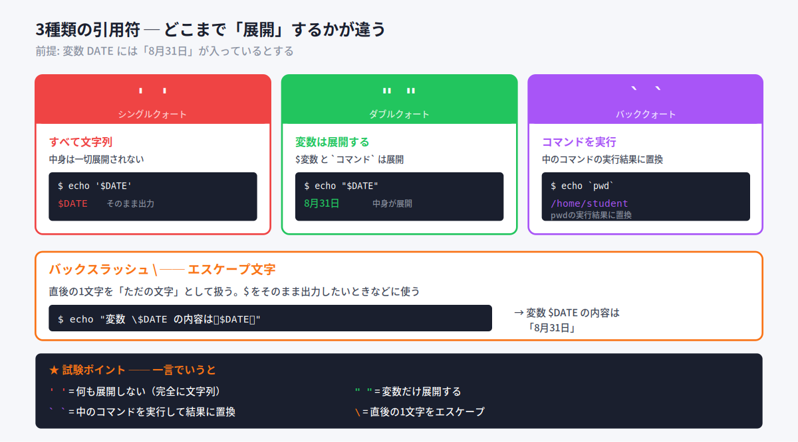

前提として、変数 `DATE` に「8月31日」が入っているとします。

| 引用符 | 名前 | 動作 |
|---|---|---|
| `' '` | シングルクォート | **すべて文字列**。中身は一切展開しない |
| `" "` | ダブルクォート | **変数を展開する**（`$変数` と `` `コマンド` `` を展開） |
| `` ` ` `` | バッククォート | **中のコマンドを実行** して結果に置き換える |

実例：

```bash
$ echo '$DATE'           # シングル → 展開しない
$DATE

$ echo "$DATE"           # ダブル → 変数を展開
8月31日

$ echo `pwd`             # バック → pwdを実行した結果に置換
/home/student
```

身近な例えで言うと：
- `' '`（シングル）= **「そのまま読み上げて」**。書いてある通りに出す
- `" "`（ダブル）= **「変数だけ中身に置き換えて読み上げて」**
- `` ` ` ``（バック）= **「中の命令を実行して、その答えを言って」**

#### バックスラッシュ（エスケープ文字）

`\`（バックスラッシュ）は、**直後の1文字を「ただの文字」として扱う** 記号です。`$` をそのまま出力したいときなどに使います。

```bash
$ echo "変数 \$DATE の内容は「$DATE」です。"
変数 $DATE の内容は「8月31日」です。
```

> 💡 バックスラッシュ `\` は、日本語環境では **円マーク `¥`** として表示されます。LPI試験のPCはWindowsなので、試験では「¥」をバックスラッシュとして読んでください。

#### 📌 試験ポイント

| 問われ方 | 答え |
|---|---|
| 何も展開しない引用符は? | **' '** (シングルクォート) |
| 変数を展開する引用符は? | **" "** (ダブルクォート) |
| コマンドを実行して結果に置換する引用符は? | **` `** (バッククォート) |
| 直後の1文字をエスケープする記号は? | **\** (バックスラッシュ) |

---

### 3.1.7 コマンド履歴

#### ここで学ぶこと

一度打ったコマンドは履歴として保存され、再利用できます。長いコマンドを打ち直す手間が省けます。

#### 履歴の操作

| 操作 | 動作 |
|---|---|
| `history` | コマンド履歴を一覧表示 |
| `↑` (Ctrl+P) | 1つ前のコマンドを表示 |
| `↓` (Ctrl+N) | 1つ次のコマンドを表示 |
| `!履歴番号` | その番号のコマンドを実行 |
| `!!` | 直前のコマンドを再実行 |
| `!文字列` | その文字列で始まる最新のコマンドを実行 |
| `!?文字列` | その文字列を含む最新のコマンドを実行 |

例：

```bash
$ !5        # 履歴番号5番のコマンドを実行
$ !!        # 直前のコマンドをもう一度
$ !cat      # catで始まる最新のコマンドを実行
```

#### 履歴の保存場所と設定

| 項目 | 内容 |
|---|---|
| 保存ファイル | `~/.bash_history` |
| ファイルを変更する環境変数 | **HISTFILE** |
| 履歴を残す数 | **HISTSIZE** / **HISTFILESIZE** (デフォルト1000) |

> 💡 `↑`キーを連打して過去のコマンドを呼び出すのは、日常操作で最も使うテクニックの一つです。

#### 📌 試験ポイント

| 問われ方 | 答え |
|---|---|
| 履歴を一覧表示するコマンドは? | **history** |
| 直前のコマンドを再実行するには? | **!!** |
| 履歴番号5を実行するには? | **!5** |
| 履歴が保存されるファイルは? | **~/.bash_history** |
| 履歴の最大数を設定する環境変数は? | **HISTSIZE** |

---

### 3.1.8 マニュアルの参照

#### ここで学ぶこと

コマンドの使い方を忘れたとき、Linuxには **man（マニュアル）** という調べる仕組みがあります。man の使い方とセクション番号は試験頻出です。

#### man コマンド

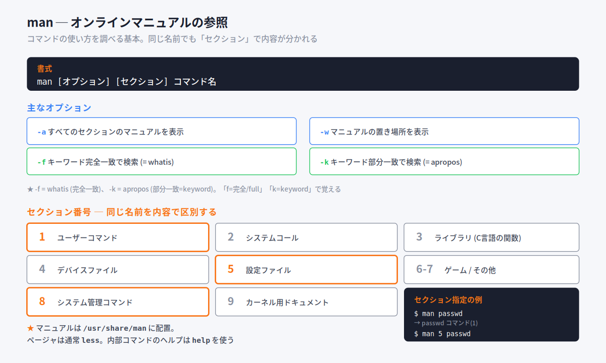

```bash
$ man ls       # lsコマンドのマニュアルを表示
$ man man      # manコマンド自身のマニュアル
```

マニュアルは `/usr/share/man` に置かれ、通常 **less** というページャ（1画面ずつ表示するプログラム）で表示されます。

主なオプション：

| オプション | 動作 |
|---|---|
| `-a` | すべてのセクションのマニュアルを表示 |
| `-f` | キーワード **完全一致** で検索（= **whatis** コマンド） |
| `-k` | キーワード **部分一致** で検索（= **apropos** コマンド） |
| `-w` | マニュアルの置き場所を表示 |

> 💡 **覚え方**: `-f` = whatis（完全/full一致）、`-k` = apropos（keyword部分一致）。「f=full、k=keyword」で区別。

#### セクション番号 ─ 同じ名前を内容で区別

同じ名前でも内容が違うマニュアルがあります（例: `passwd` コマンドと `/etc/passwd` ファイル）。これを **セクション番号** で区別します。

| セクション | 内容 |
|---|---|
| **1** | ユーザーコマンド |
| 2 | システムコール |
| 3 | ライブラリ（C言語の関数） |
| 4 | デバイスファイル |
| **5** | 設定ファイル |
| 6 | ゲーム |
| 7 | その他 |
| **8** | システム管理コマンド |
| 9 | カーネル用ドキュメント |

例えば `passwd` には、コマンド(1)とファイル(5)の2つのマニュアルがあります。

```bash
$ man passwd       # → passwdコマンド(セクション1)が表示される
$ man 5 passwd     # → /etc/passwdファイル(セクション5)が表示される
```

セクションを指定しないと、最初に見つかったものが表示されます。

#### less の操作

man の表示に使われる less の主なキー操作：

| キー | 動作 |
|---|---|
| `Space` / `f` | 1画面下へ |
| `b` | 1画面上へ |
| `/文字列` | 下方向に検索 |
| `?文字列` | 上方向に検索 |
| `q` | 終了 |

> 💡 シェルの **内部コマンド** の説明は man では出ません。`help` コマンドを使います（例: `help cd`）。

#### 📌 試験ポイント

| 問われ方 | 答え |
|---|---|
| /etc/passwd のマニュアルを見るには? | **man 5 passwd** |
| キーワード完全一致の検索オプションは? | **-f** (= whatis) |
| キーワード部分一致の検索オプションは? | **-k** (= apropos) |
| マニュアルの置き場所は? | **/usr/share/man** |
| 内部コマンドのヘルプを見るコマンドは? | **help** |
| man のデフォルトページャは? | **less** |

---

### 3.1.9 ファイル操作コマンド

#### ここで学ぶこと

ファイルやディレクトリのコピー・移動・削除は、Linux操作の基本中の基本です。コマンドだけでなく、オプションまでしっかり覚えましょう。

#### ファイル操作コマンド早見表

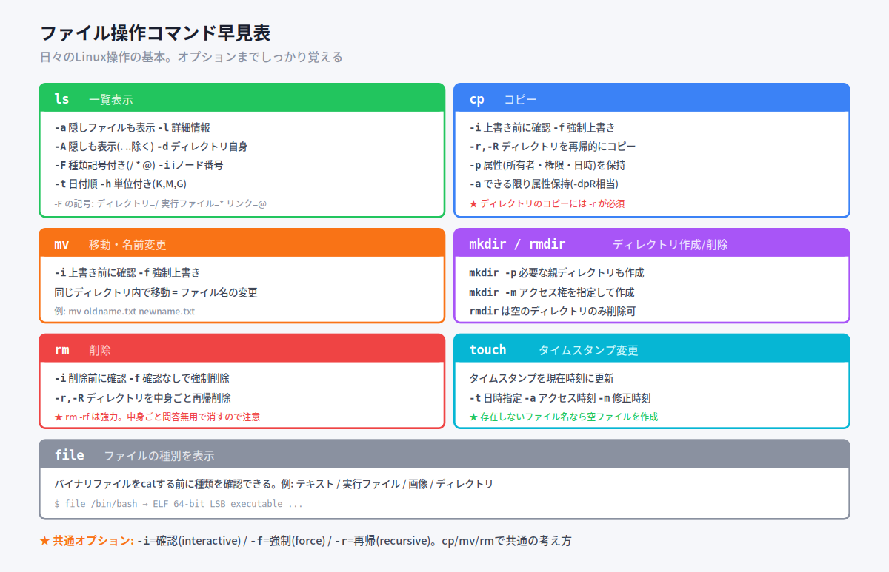

#### ls ─ 一覧表示

| オプション | 動作 |
|---|---|
| `-a` | 隠しファイル（`.`で始まる）も表示 |
| `-A` | 隠しも表示するが `.` と `..` は除く |
| `-l` | 詳細情報を表示 |
| `-d` | ディレクトリ自身の情報を表示 |
| `-F` | 種類記号を付ける（ディレクトリ=`/` 実行ファイル=`*` リンク=`@`） |
| `-i` | iノード番号を表示 |
| `-t` | 日付順に表示 |
| `-h` | 単位付きで表示（K, M, G） |

#### cp ─ コピー

| オプション | 動作 |
|---|---|
| `-i` | 上書き前に確認 |
| `-f` | 強制上書き |
| `-r`, `-R` | ディレクトリを再帰的にコピー |
| `-p` | 属性（所有者・権限・日時）を保持 |
| `-a` | できる限り属性を保持（-dpR相当） |

> ⚠ **ディレクトリのコピーには `-r` が必須**。付けないとエラーになります。属性を保持したままコピーするには `-p` が必要。

#### mv ─ 移動・名前変更

| オプション | 動作 |
|---|---|
| `-i` | 上書き前に確認 |
| `-f` | 強制上書き |

同じディレクトリ内で移動すると、結果的に **ファイル名の変更** になります。

```bash
$ mv oldname.txt newname.txt    # 名前を変更
```

#### mkdir / rmdir ─ ディレクトリ作成・削除

| コマンド・オプション | 動作 |
|---|---|
| `mkdir -p` | 必要な親ディレクトリも同時に作成 |
| `mkdir -m` | アクセス権を指定して作成 |
| `rmdir` | **空の** ディレクトリを削除 |
| `rmdir -p` | 複数階層の空ディレクトリを削除 |

```bash
$ mkdir -p top/second/third    # 親がなくてもまとめて作成
```

#### rm ─ 削除

| オプション | 動作 |
|---|---|
| `-i` | 削除前に確認 |
| `-f` | 確認なしで強制削除 |
| `-r`, `-R` | ディレクトリを中身ごと再帰的に削除 |

> ⚠ `rm -rf` は中身を問答無用で消す強力なコマンド。便利ですが、打ち間違えると大事故になります。

#### touch ─ タイムスタンプ変更

ファイルのタイムスタンプを現在時刻（または指定時刻）に変更します。

| オプション | 動作 |
|---|---|
| `-t` | 日時を指定（`[[CC]YY]MMDDhhmm[.SS]`） |
| `-a` | アクセス時刻だけ変更 |
| `-m` | 修正時刻だけ変更 |

> 💡 **存在しないファイル名を指定すると、空のファイルが作られます**。「空ファイルをサッと作る」用途でもよく使われます。

#### file ─ ファイルの種別を表示

ファイルが何なのか（テキスト・実行ファイル・画像など）を表示します。バイナリファイルを誤って `cat` する前の確認に便利です。

```bash
$ file /bin/bash
/bin/bash: ELF 64-bit LSB executable, ...    # 実行ファイル
```

#### 📌 試験ポイント

| 問われ方 | 答え |
|---|---|
| 隠しファイルも表示するlsオプションは? | **-a** |
| ディレクトリをコピーするのに必須のオプションは? | **-r** (または -R) |
| コピー時に属性を保持するオプションは? | **-p** |
| 親ディレクトリも同時に作るmkdirオプションは? | **-p** |
| ディレクトリを中身ごと削除するには? | **rm -r** |
| 空のディレクトリだけ削除するコマンドは? | **rmdir** |
| 空ファイルを作るのに使えるコマンドは? | **touch** |
| ファイルの種別を調べるコマンドは? | **file** |

---

### 3.1.10 メタキャラクタの利用

#### ここで学ぶこと

複数のファイルをまとめて扱いたいとき、**メタキャラクタ**（ワイルドカード）が役立ちます。「`.txt` で終わるファイル全部」のような指定ができます。

#### メタキャラクタとは

メタキャラクタは、ファイル名のパターンを表す特殊記号です。

| 記号 | 意味 | 例 |
|---|---|---|
| `*` | **0文字以上** の任意の文字列 | `a*` → a, ab, abc, aaaa |
| `?` | **任意の1文字** | `a?` → aa, ab, a1（aやabcは×） |
| `[ ]` | `[ ]`内のいずれか1文字 | `a[bcd]` → ab, ac, ad |
| `{ }` | `,`で区切られた文字列 | `test{1,2}` → test1, test2 |

`[ ]` では範囲指定もできます。
- `[a-z]` → アルファベット小文字
- `[0-9]` → 数字すべて
- `[!abc]` → a, b, c 以外の1文字（先頭の `!` で否定）

```bash
$ ls *.txt      # .txt で終わるファイルをすべて表示
$ ls a*         # a で始まるファイルをすべて表示
```

> 💡 **重要な仕組み**: メタキャラクタは **シェルが展開してから** コマンドに渡されます。`ls *.txt` と打つと、シェルがまず `ls a.txt b.txt c.txt` のように展開し、それからlsを実行します。ls自身がメタキャラクタを解釈しているわけではありません。

メタキャラクタを通常の文字として使いたい場合は、直前に `\` を置きます（`\*` でアスタリスク文字そのもの）。

#### 📌 試験ポイント

| 問われ方 | 答え |
|---|---|
| 0文字以上の文字列を表すメタキャラクタは? | **\*** |
| 任意の1文字を表すメタキャラクタは? | **?** |
| 範囲指定に使う記号は? | **[ ]** |
| メタキャラクタを展開するのは誰? | **シェル**（コマンドではない） |

---

## 3.2 パイプとリダイレクト

### ここで学ぶこと

Linuxの強力さの源は、**小さなコマンドを組み合わせて複雑な処理を作れる** ことです。その組み合わせを可能にするのが「パイプ」と「リダイレクト」。この仕組みはLinuxの哲学そのものなので、しっかり理解しましょう。

### 3.2.1 標準入出力

#### 3つのデータの流れ（ストリーム）

Linuxでは、データの入出力を **ストリーム（流れ）** として扱います。キーボードからの入力も、画面への出力も、ファイルの読み書きも、すべて同じ「流れ」として統一的に扱うのが特徴です。

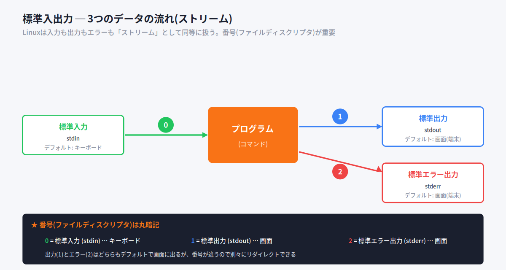

ストリームには3つの基本があり、それぞれに **番号（ファイルディスクリプタ）** が付いています。

| 番号 | 名前 | 略称 | デフォルト |
|---|---|---|---|
| **0** | 標準入力 | stdin | キーボード |
| **1** | 標準出力 | stdout | 画面（端末） |
| **2** | 標準エラー出力 | stderr | 画面（端末） |

> 💡 **番号は丸暗記必須**。0=入力、1=出力、2=エラー。この番号がリダイレクトのときに効いてきます。出力(1)とエラー(2)はどちらもデフォルトで画面に出ますが、番号が違うので別々に扱えます。

#### 📌 試験ポイント

| 問われ方 | 答え |
|---|---|
| 標準入力の番号は? | **0** |
| 標準出力の番号は? | **1** |
| 標準エラー出力の番号は? | **2** |
| 標準入力のデフォルトは? | **キーボード** |
| 標準出力のデフォルトは? | **画面（端末）** |

---

### 3.2.2 パイプ

#### パイプとは ─ コマンドの出力を次のコマンドへ

**パイプ（`|`）** は、あるコマンドの **標準出力** を、次のコマンドの **標準入力** に渡す仕組みです。

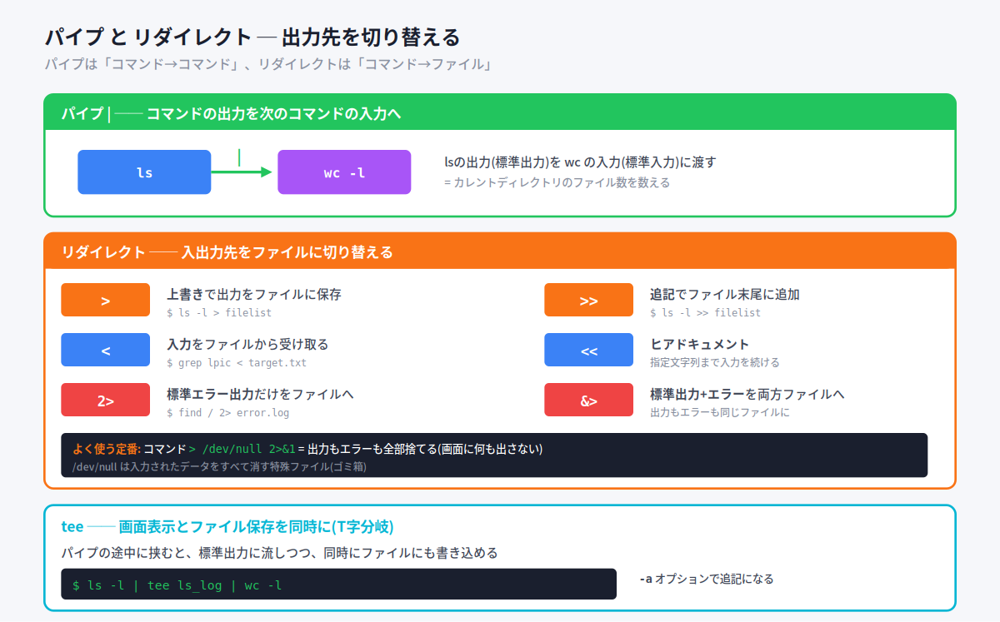

```bash
$ ls | wc -l
      71
```

この例では、`ls` の出力（ファイル一覧）を `wc -l`（行数を数える）に渡しています。結果として「カレントディレクトリのファイル数」が分かります。

例えるなら、パイプは **工場のベルトコンベア**。1台目の機械（ls）が作ったものを、ベルトコンベア（|）で2台目の機械（wc）に流して、さらに加工する、というイメージです。

```bash
$ dmesg | less     # dmesgの大量出力を1画面ずつ表示
```

#### tee ─ 画面表示とファイル保存を同時に

普通のパイプだと、データは次のコマンドへ流れていくだけです。でも「画面にも表示しつつ、ファイルにも保存したい」ときがあります。そこで使うのが **tee** です。

teeは入力を **T字型に分岐** させ、ファイルと標準出力の両方に流します。

```bash
$ ls -l | tee ls_log | wc -l   # ls_logに保存しつつ、wcにも渡す
```

| オプション | 動作 |
|---|---|
| `-a` | 上書きではなく追記する |

> 💡 「tee」という名前は、配管のT字管（Tee）に由来。流れを2方向に分けるイメージそのものです。

#### 📌 試験ポイント

| 問われ方 | 答え |
|---|---|
| コマンドの出力を次のコマンドに渡す記号は? | **\|** (パイプ) |
| パイプが渡すのは何? | 標準出力 → 次のコマンドの標準入力 |
| 画面表示とファイル保存を同時に行うコマンドは? | **tee** |
| tee で追記するオプションは? | **-a** |

---

### 3.2.3 リダイレクト

#### リダイレクトとは ─ 入出力先をファイルに切り替える

**リダイレクト** は、コマンドの入力元や出力先を **ファイルに切り替える** 仕組みです。「画面に出す代わりにファイルに保存」「キーボードの代わりにファイルから入力」ができます。

#### 出力のリダイレクト

| 記号 | 動作 |
|---|---|
| `>` | 標準出力をファイルに保存（**上書き**） |
| `>>` | 標準出力をファイルに **追記** |

```bash
$ ls -l > filelist     # 結果をfilelistに保存（上書き）
$ ls -l >> filelist    # 結果をfilelistの末尾に追記
```

> ⚠ `>` は **上書き**。既存のファイルがあると中身が消えて新しい内容に置き換わります。消したくない場合は `>>`（追記）を使います。

#### 入力のリダイレクト

| 記号 | 動作 |
|---|---|
| `<` | 標準入力をファイルから受け取る |
| `<<` | ヒアドキュメント（指定文字列まで入力を続ける） |

```bash
$ grep "lpic" < target.txt > result.txt   # 入力も出力もファイル
```

**ヒアドキュメント** は、指定した終了文字列が現れるまで入力を続ける機能です。短いファイルをエディタなしで作れます。

```bash
$ cat > sample.txt << EOF
> LPI
> Linux
> EOF
```

この例では `EOF` が入力されるまでの内容が sample.txt に書き込まれます。

#### エラー出力のリダイレクト

| 記号 | 動作 |
|---|---|
| `2>` | 標準エラー出力だけをファイルへ |
| `&>` | 標準出力 **と** エラー出力を両方同じファイルへ |

```bash
$ find / -name "*.tmp" 2> error.log   # エラーだけerror.logに保存
```

ここで `2` が効いてきます。標準エラー出力の番号が2なので、`2>` で「2番だけ」をリダイレクトできるわけです。

#### よく使う定番

```bash
$ コマンド > /dev/null 2>&1
```

これは「出力もエラーも全部捨てる（画面に何も出さない）」という定番の書き方です。

- `/dev/null` … 入力されたデータをすべて消す特殊ファイル（ゴミ箱のような存在）
- `2>&1` … 標準エラー出力(2)を標準出力(1)と同じ場所へ

> 💡 `/dev/null` は「ブラックホール」とも呼ばれます。ここに送られたデータは消えてなくなります。「ログは要らないけどエラーで画面が荒れるのは困る」ときに重宝します。

#### リダイレクトとパイプの違い（まとめ）

- **パイプ `|`** … コマンド → **コマンド**（出力を次のコマンドに渡す）
- **リダイレクト `>`** … コマンド → **ファイル**（出力先をファイルに変える）

#### 📌 試験ポイント

| 問われ方 | 答え |
|---|---|
| 標準出力を上書き保存する記号は? | **>** |
| 標準出力を追記する記号は? | **>>** |
| 標準入力をファイルから受け取る記号は? | **<** |
| ヒアドキュメントの記号は? | **<<** |
| 標準エラー出力だけをファイルへ送る記号は? | **2>** |
| データを捨てる特殊ファイルは? | **/dev/null** |
| 出力もエラーも捨てる定番は? | **> /dev/null 2>&1** |

---

## 3.3 テキスト処理フィルタ

### ここで学ぶこと

Linuxには、テキストを加工する小さなコマンドがたくさんあります。これらは **フィルタ** と呼ばれ、パイプでつなげて使うことで強力なデータ処理ができます。一つひとつは単純ですが、組み合わせると料理の調味料のように効いてきます。

> 💡 **フィルタ** とは、テキストを読み込んで何らかの処理をして出力するプログラムのこと。「入力を受けて、加工して、出す」のが共通の動きです。

### 3.3.1 テキストフィルタコマンド

#### フィルタコマンド地図

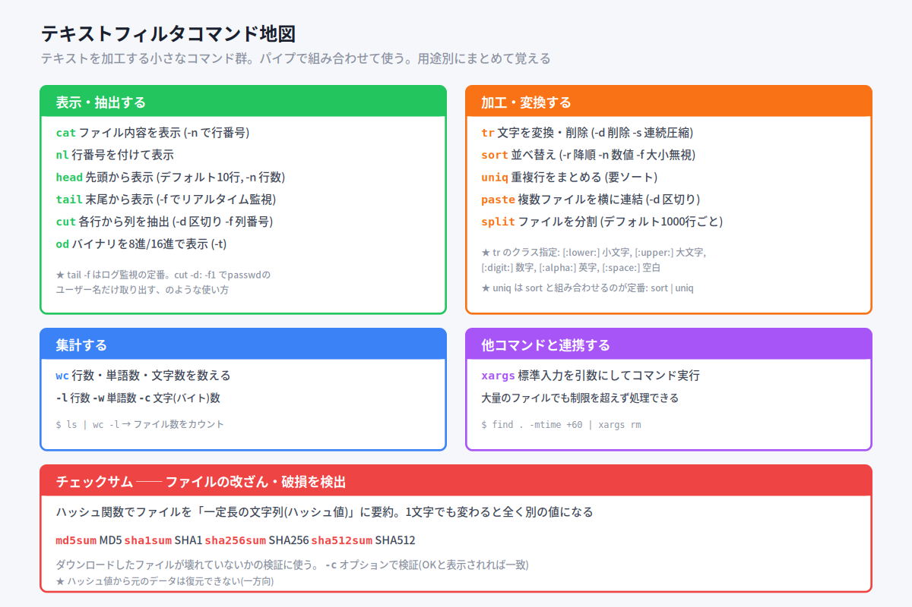

数が多いので、用途別に整理して覚えましょう。

#### 表示・抽出系

| コマンド | 動作 | 主なオプション |
|---|---|---|
| **cat** | ファイル内容を表示 | `-n` 行番号を付ける |
| **nl** | 行番号を付けて表示 | `-b` 形式指定 |
| **head** | 先頭を表示（デフォルト10行） | `-n 行数`, `-c バイト数` |
| **tail** | 末尾を表示（デフォルト10行） | `-n 行数`, `-f` リアルタイム監視 |
| **cut** | 各行から列を抽出 | `-d 区切り`, `-f 列番号`, `-c 文字位置` |
| **od** | バイナリを8進/16進で表示 | `-t c/o/x` 出力形式 |

```bash
$ tail -f /var/log/messages     # ログをリアルタイム監視（Ctrl+Cで終了）
$ cut -d: -f6 /etc/passwd       # :区切りの6番目のフィールドを抽出
```

> 💡 `tail -f` はログ監視の超定番。新しい行が追加されるたびにリアルタイムで表示し続けます。サーバ管理では毎日使うレベルです。
>
> 💡 `cut` の `-d` は区切り文字（デリミタ）、`-f` は何番目のフィールドかを指定。`-c` は文字位置で抽出します。

#### 加工・変換系

| コマンド | 動作 | 主なオプション |
|---|---|---|
| **tr** | 文字を変換・削除 | `-d` 削除, `-s` 連続を1つに圧縮 |
| **sort** | 並べ替え（デフォルト昇順） | `-r` 降順, `-n` 数値順, `-f` 大小無視, `-b` 行頭空白無視 |
| **uniq** | 重複行をまとめる | （要ソート） |
| **paste** | 複数ファイルを横に連結 | `-d` 区切り文字 |
| **split** | ファイルを分割（デフォルト1000行） | `-行数` |

```bash
$ cat /etc/hosts | tr 'a-z' 'A-Z'    # 小文字を大文字に変換
$ tr -d : < file1                     # : を削除
$ sort file | uniq                    # ソートしてから重複を除く
```

`tr` ではクラス指定が使えます。

| クラス | 意味 |
|---|---|
| `[:lower:]` | 英小文字 |
| `[:upper:]` | 英大文字 |
| `[:digit:]` | 数字 |
| `[:alpha:]` | 英字 |
| `[:alnum:]` | 英数字 |
| `[:space:]` | スペース |

> 💡 **uniqは要注意**: 重複を除けるのは「隣り合った行」だけです。だから先に `sort` で並べてから `uniq` に渡すのが定番。`sort | uniq` はセットで覚えましょう。

#### 集計系

| コマンド | 動作 |
|---|---|
| **wc** | 行数・単語数・文字数を数える |

| オプション | 動作 |
|---|---|
| `-l` | 行数 |
| `-w` | 単語数 |
| `-c` | 文字（バイト）数 |

```bash
$ ls | wc -l     # ファイル数をカウント
```

#### 連携系

| コマンド | 動作 |
|---|---|
| **xargs** | 標準入力を引数にしてコマンドを実行 |

```bash
$ find . -mtime +60 -type f | xargs rm    # 60日以上前のファイルを削除
```

xargsの利点は、**ファイルが大量にあっても処理できる** こと。`rm *` だと「引数が多すぎる」エラーになる場合でも、xargsなら制限を超えないよう適切に分割して処理してくれます。

> 💡 `find ... -exec rm {} \;` と `find ... | xargs rm` はほぼ同じ結果になります。xargsの方が大量ファイルに強いです。

#### 📌 試験ポイント

| 問われ方 | 答え |
|---|---|
| ファイル末尾をリアルタイム監視するには? | **tail -f** |
| 区切り文字を指定して列を抽出するcutオプションは? | **-d** と **-f** |
| 小文字を大文字に変換するコマンドは? | **tr** |
| 並べ替えを降順にするsortオプションは? | **-r** |
| 数値として並べ替えるsortオプションは? | **-n** |
| 重複行をまとめるコマンドは?（前提は?） | **uniq**（事前にsortが必要） |
| 行数を数えるwcオプションは? | **-l** |
| 標準入力を引数にしてコマンド実行するのは? | **xargs** |

---

### 3.3.2 ファイルのチェックサム

#### ここで学ぶこと

ダウンロードしたファイルが壊れていないか、改ざんされていないかを確認する方法です。**ハッシュ値** という仕組みを使います。

#### ハッシュ値とチェックサム

**ハッシュ関数** を使うと、ファイルを **一定の長さの文字列（ハッシュ値）** に要約できます。「ファイルの内容を一定の長さに要約する」と考えてください。

ハッシュ値には次の性質があります。
- ファイルサイズに関わらず、ハッシュ値の長さは同じ
- 元のファイルを **少しでも変えると、ハッシュ値が大きく変化** する
- ハッシュ値から元のデータは **復元できない**（一方向）

この性質を使って、ファイルが改ざん・破損していないか（=チェックサム）を確認できます。

| コマンド | ハッシュ関数 |
|---|---|
| **md5sum** | MD5 |
| **sha1sum** | SHA1 |
| **sha256sum** | SHA256 |
| **sha512sum** | SHA512 |

```bash
$ sha1sum sample.txt
1014c8812720619a5a6bcd189e5d7f5d16276d86  sample.txt

$ echo "a" >> sample.txt    # 1文字追加すると…
$ sha1sum sample.txt
1cae0ff2f749d3eed680ebec9d047f8caec919f4  sample.txt   # 全く別の値に!
```

`-c` オプションを使うと、配布元が用意したハッシュ値ファイルと照合して検証できます。

```bash
$ sha256sum -c httpd-2.4.37.tar.bz2.sha256
httpd-2.4.37.tar.bz2: OK    # 一致すればOK
```

> 💡 例えるなら、ハッシュ値は **ファイルの「指紋」**。同じファイルなら必ず同じ指紋になり、1文字でも違えば指紋も変わります。ダウンロードしたファイルの指紋が配布元の指紋と一致すれば「途中で壊れていない・改ざんされていない」と分かります。

#### 📌 試験ポイント

| 問われ方 | 答え |
|---|---|
| MD5のハッシュ値を出すコマンドは? | **md5sum** |
| SHA256のハッシュ値を出すコマンドは? | **sha256sum** |
| ハッシュ値を検証するオプションは? | **-c** |
| ハッシュ値から元データは復元できる? | **できない**（一方向） |

---

## 3.4 正規表現を使ったテキスト検索

### ここで学ぶこと

**正規表現** は、文字列のパターンを表現する記法です。「数字3桁＋ハイフン＋数字4桁（=郵便番号）」のような複雑な条件で検索できます。grep・sed・viなど多くの場面で使われる、Linuxの必須スキルです。

### 3.4.1 正規表現

#### 正規表現とは

正規表現（Regular Expression）は、特定の条件を持つ文字列を抽象的に表現する記法です。例えば次のような検索がしたいとき：

- 「a」で始まる5文字で、2文字目が3・5・7のいずれか → `a[357]...`
- 行末の文字が「;」である → `;$`
- 行頭は数字、行末は小文字 → `^[0-9].*[a-z]$`

これを実現するのが正規表現です。

#### メタキャラクタと正規表現は別物（最重要）

ここで超重要な注意点があります。シェルの **メタキャラクタ** と **正規表現** は、同じ記号でも意味が違うことがあります。特に `*` の意味が真逆なので、混同しないようにしましょう。

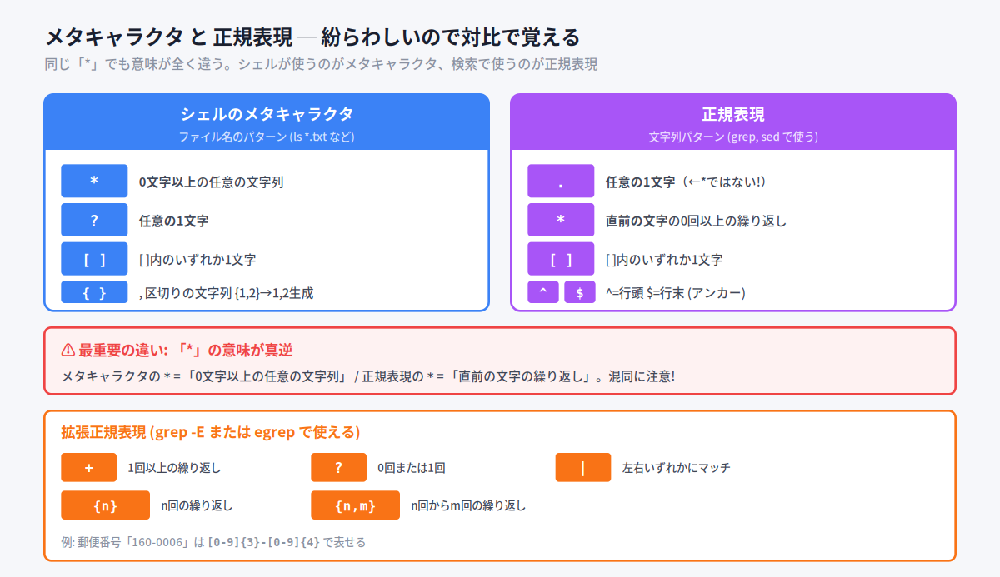

| 記号 | メタキャラクタ（シェル） | 正規表現（grep等） |
|---|---|---|
| `*` | **0文字以上の任意の文字列** | **直前の文字** の0回以上の繰り返し |
| `.` | （特に意味なし） | **任意の1文字** |
| `?` | 任意の1文字 | （基本正規表現では特殊な意味なし） |

> ⚠ **最重要**: メタキャラクタの `*` =「何でもいい文字列」、正規表現の `*` =「直前の文字の繰り返し」。例えば正規表現 `ab*` は「a」「ab」「abb」…にマッチします（bが0回以上）。

#### 正規表現チートシート（基本）

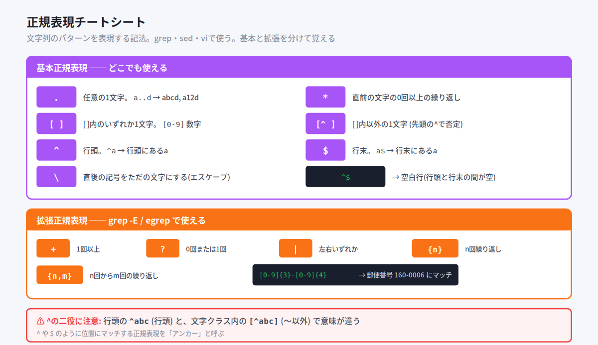

| 記号 | 意味 |
|---|---|
| `.` | 任意の1文字（`a..d` → abcd, a12d） |
| `*` | 直前の文字の0回以上の繰り返し |
| `[ ]` | `[ ]`内のいずれか1文字（`[0-9]`=数字, `[a-z]`=小文字） |
| `[^ ]` | `[ ]`内 **以外** の1文字（先頭の `^` で否定） |
| `^` | 行頭（`^a` → 行頭にあるa） |
| `$` | 行末（`a$` → 行末にあるa） |
| `\` | 直後の記号をただの文字にする（エスケープ） |

> ⚠ **`^` の二役に注意**: 行頭を表す `^abc` と、文字クラス内で否定を表す `[^abc]`（〜以外）で意味が違います。`^` や `$` のように位置にマッチする正規表現を **アンカー** と呼びます。
>
> 💡 `^$` は「行頭と行末の間に何もない」= **空白行** を表します。

#### 繰り返しと拡張正規表現

`*` で繰り返しを表せますが、より細かい指定は **拡張正規表現** で行います。拡張正規表現は `grep -E` または `egrep` で使えます。

| 記号 | 意味 |
|---|---|
| `+` | 直前の文字の **1回以上** の繰り返し |
| `?` | 直前の文字の **0回または1回** |
| `|` | 左右いずれかにマッチ |
| `{n}` | 直前の文字の **n回** の繰り返し |
| `{n,m}` | 直前の文字の **n回からm回** の繰り返し |

```
郵便番号「160-0006」→ [0-9]{3}-[0-9]{4}
```

特殊文字（`*` など）を文字として使いたい場合は、前に `\` を置きます。`a\*` は「a*」という文字列そのものを表します。

#### 📌 試験ポイント

| 問われ方 | 答え |
|---|---|
| 正規表現で任意の1文字を表すのは? | **.** （ピリオド） |
| 正規表現で直前の文字の繰り返しを表すのは? | **\*** |
| 行頭・行末を表すのは? | **^** / **$** |
| 文字クラス内で否定を表すのは? | **[^ ]** |
| 拡張正規表現で1回以上の繰り返しは? | **+** |
| メタキャラクタと正規表現で意味が真逆の記号は? | **\*** |

---

### 3.4.2 grep コマンド

#### grep ─ パターンにマッチする行を探す

**grep** は、ファイルやテキストの中から、正規表現にマッチする行を探して表示するコマンドです。

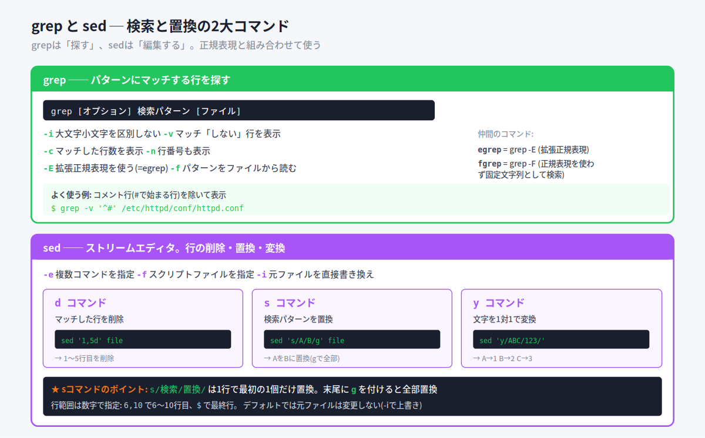

```
書式: grep [オプション] 検索パターン [ファイル]
```

| オプション | 動作 |
|---|---|
| `-i` | 大文字小文字を区別しない |
| `-v` | パターンにマッチ **しない** 行を表示 |
| `-c` | マッチした行数を表示 |
| `-n` | 行番号も表示 |
| `-E` | 拡張正規表現を使う（= egrep） |
| `-f` | 検索パターンをファイルから読み込む |

```bash
$ grep -i ab sample.txt          # ab, Ab, aB, AB すべてにマッチ
$ grep -v '^#' httpd.conf        # コメント行(#で始まる行)を除いて表示
```

> 💡 `grep -v '^#'` は設定ファイルを見るときの定番。コメント行を除いて、実際に効いている設定だけを表示できます。正規表現を `' '` で囲むのは、シェルのメタキャラクタとして解釈されるのを防ぐためです。

#### grepの仲間

| コマンド | 内容 |
|---|---|
| **egrep** | `grep -E` と同じ。拡張正規表現が使える |
| **fgrep** | `grep -F` と同じ。正規表現を使わず固定文字列として検索 |

```bash
$ egrep '\s(22|53)/tcp' /etc/services   # 22/tcp または 53/tcp を検索
$ fgrep '.*' sample.txt                  # 「.*」という文字列そのものを検索
```

#### 📌 試験ポイント

| 問われ方 | 答え |
|---|---|
| パターンにマッチする行を探すコマンドは? | **grep** |
| 大文字小文字を区別しないオプションは? | **-i** |
| マッチしない行を表示するオプションは? | **-v** |
| マッチした行数を表示するオプションは? | **-c** |
| 拡張正規表現を使うオプションは? | **-E**（または egrep） |
| 固定文字列で検索するコマンドは? | **fgrep**（grep -F） |

---

### 3.4.3 sed コマンド

#### sed ─ ストリームエディタ

**sed**（Stream Editor）は、テキストストリームに対して **削除・置換・変換** などの編集を行うコマンドです。エディタを開かずに、コマンドラインで一括編集できます。

```
書式: sed [オプション] コマンド [ファイル]
```

| オプション | 動作 |
|---|---|
| `-e` | 複数のコマンドを指定（コマンドごとに -e が必要） |
| `-f` | コマンドを書いたスクリプトファイルを指定 |
| `-i` | 処理結果で元ファイルを **直接書き換え** |

sedで使う主なコマンド：

| コマンド | 動作 |
|---|---|
| **d** | マッチした行を削除 |
| **s** | パターンに基づいて置換（gスイッチで全部置換） |
| **y** | 文字を1対1で変換 |

#### d コマンド（削除）

```bash
$ sed '1,5d' file1.txt > file2.txt   # 1〜5行目を削除して保存
```

行範囲は `6,10`（6〜10行目）のように指定します。最終行は `$` で表します。

#### s コマンド（置換）

最もよく使うのが置換です。`s/検索パターン/置換パターン/` という形で書きます。

```bash
$ sed 's/linux/LINUX/' file1.txt     # 各行の最初の linux を LINUX に
$ sed 's/linux/LINUX/g' file1.txt    # 行内のすべての linux を LINUX に
```

> ⚠ **sコマンドの最重要ポイント**: `s/A/B/` は各行で **最初の1個だけ** 置換します。行内のすべてを置換したいときは、末尾に **g**（global）を付けます。

```bash
$ sed '1,5s/^/>/' /etc/passwd        # 1〜5行目の行頭に > を追加
```

#### y コマンド（文字変換）

`y/検索文字/置換文字/` で、文字を1対1で変換します。検索文字と置換文字は同じ長さにする必要があります。

```bash
$ sed 'y/ABC/123/' sample.txt        # A→1, B→2, C→3 に変換
```

#### 📌 試験ポイント

| 問われ方 | 答え |
|---|---|
| ストリームエディタのコマンドは? | **sed** |
| 行を削除するsedコマンドは? | **d** |
| 置換するsedコマンドは? | **s** |
| 行内すべてを置換するには? | 末尾に **g** を付ける |
| 文字を1対1で変換するsedコマンドは? | **y** |
| 元ファイルを直接書き換えるオプションは? | **-i** |
| 1〜5行目を対象にするには? | コマンドの前に **1,5** |

---

## 3.5 ファイルの基本的な編集

### ここで学ぶこと

Linuxの設定はテキストファイルで管理されることが多く、それを編集する **エディタ** の操作は管理者に必須のスキルです。特に **vi** はほぼすべてのLinux環境にあるので、最低限の操作は覚えておく必要があります。

### 3.5.1 エディタの基本

#### なぜエディタが必要か

Linuxでシステムやサービスの設定を変更する方法は、大きく2種類あります。

1. **設定ファイル（テキストファイル）を編集する** ← UNIX系で古くからの方法
2. コマンドを実行する

コマンドで設定する場合でも、裏では設定ファイルを書き換えていることが多くあります。だから **テキストファイルを編集する能力** はLinux管理に欠かせません。

#### 主なエディタ

| エディタ | 特徴 |
|---|---|
| **vi / Vim** | UNIX系標準。ほぼすべての環境にある。操作が独特 |
| **nano** | 操作が簡単。画面に操作ガイドが出る。Ubuntu標準 |
| **Emacs** | 高機能・拡張性が高い。開発環境としても使われる |

> 💡 **Vim**（Vi IMproved）は vi を改良・拡張したもの。多くのディストリビューションでは vi と打つと Vim が起動します。

#### デフォルトエディタの指定

環境変数 **EDITOR** にエディタのパスを設定すると、デフォルトエディタを指定できます。`crontab` や `visudo` などのコマンドは、このEDITORで指定されたエディタを起動します。

```bash
$ export EDITOR=/usr/bin/vim    # デフォルトエディタをVimに
```

#### 📌 試験ポイント

| 問われ方 | 答え |
|---|---|
| UNIX系で標準的に使われるエディタは? | **vi**（Vim） |
| viを改良・拡張したものは? | **Vim** |
| Ubuntu標準の簡単なエディタは? | **nano** |
| デフォルトエディタを指定する環境変数は? | **EDITOR** |

---

### 3.5.2 vi エディタの基本

#### viの最大の特徴 ─ 2つのモード

viを使う上で最も重要なのが **モードの概念** です。viには2つのモードがあり、これを切り替えながら使います。

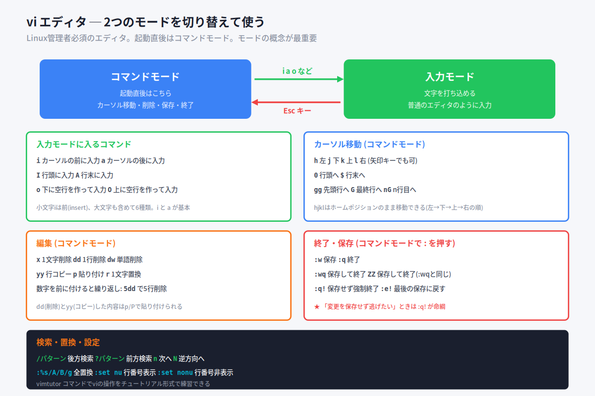

| モード | 役割 |
|---|---|
| **コマンドモード** | 起動直後はこちら。カーソル移動・削除・保存・終了 |
| **入力モード** | 文字を打ち込める。普通のエディタのように入力 |

> ⚠ **超重要**: viを起動すると **コマンドモード** から始まります。この状態でいきなり文字を打っても、文字は入力されずコマンドとして解釈されてしまいます。文字を入力するには、まず入力モードに切り替える必要があります。

身近な例えで言うと、viは **2つのギアを持つ車** のようなもの。「移動・操作ギア（コマンドモード）」と「執筆ギア（入力モード）」を切り替えながら運転します。

#### モードの切り替え

| 操作 | 切り替え |
|---|---|
| `i` `a` `o` など | コマンドモード → 入力モード |
| **Esc** キー | 入力モード → コマンドモード |

#### viの起動

```bash
$ vi ファイル名        # ファイルを開く（なければ新規作成）
$ vi -R ファイル名     # 読み取り専用で開く
```

#### 入力モードに入るコマンド

| コマンド | 動作 |
|---|---|
| `i` | カーソルの **前** に入力（insert） |
| `a` | カーソルの **後** に入力（append） |
| `I` | 行頭に入力 |
| `A` | 行末に入力 |
| `o` | 下に空行を作って入力 |
| `O` | 上に空行を作って入力 |

> 💡 まずは `i`（前に入力）と `a`（後に入力）の2つを覚えれば十分。残りは余裕ができてから。

#### カーソル移動（コマンドモード）

| コマンド | 動作 |
|---|---|
| `h` `j` `k` `l` | 左・下・上・右（矢印キーでも可） |
| `0` | 行頭へ |
| `$` | 行末へ |
| `gg` | ファイルの先頭行へ |
| `G` | ファイルの最終行へ |
| `nG` / `:n` | n行目へ |

> 💡 `hjkl` は左・下・上・右の順。キーボードのホームポジションから手を離さずに移動できるのがviの設計思想です。

#### 編集（コマンドモード）

| コマンド | 動作 |
|---|---|
| `x` | カーソル位置の1文字を削除 |
| `X` | カーソル位置の手前の文字を削除 |
| `dd` | カレント行を削除 |
| `dw` | カーソル位置から単語末まで削除 |
| `yy` | カレント行をコピー（バッファに） |
| `p` / `P` | バッファの内容を下/上に貼り付け |
| `r` | カーソル位置の1文字を置換 |

数字を前に付けると繰り返せます。`5dd` で5行削除、`20x` で20文字削除。

#### 終了・保存（コマンドモードで `:` を押す）

| コマンド | 動作 |
|---|---|
| `:w` | 上書き保存 |
| `:q` | 終了（編集していれば確認される） |
| `:wq` | 保存して終了 |
| `ZZ` | 保存して終了（:wqと同じ） |
| `:q!` | 保存せず強制終了 |
| `:e!` | 最後に保存した内容に戻す |

> ⚠ **`:q!` は命綱**。「色々いじったけど保存せずに逃げたい!」というとき、これで変更を破棄して終了できます。viで困ったらまず Esc → `:q!` を思い出してください。

#### 検索・置換・設定

| コマンド | 動作 |
|---|---|
| `/パターン` | 後方（下方向）に検索 |
| `?パターン` | 前方（上方向）に検索 |
| `n` / `N` | 次を検索 / 逆方向に検索 |
| `:%s/A/B/g` | ファイル全体でAをBに置換 |
| `:set nu` | 行番号を表示 |
| `:set nonu` | 行番号を非表示 |
| `:set ts=4` | タブ幅を指定 |

> 💡 `vimtutor` コマンドを実行すると、viの操作をチュートリアル形式で練習できます（25〜30分）。実際に手を動かすのが習得の近道です。

#### 📌 試験ポイント

| 問われ方 | 答え |
|---|---|
| viの2つのモードは? | **コマンドモード** と **入力モード** |
| 起動直後はどちらのモード? | **コマンドモード** |
| 入力モードからコマンドモードに戻すには? | **Esc** キー |
| カーソルの前に入力するコマンドは? | **i** |
| 1行削除するコマンドは? | **dd** |
| 行をコピーするコマンドは? | **yy** |
| 保存して終了するには? | **:wq** または **ZZ** |
| 保存せず強制終了するには? | **:q!** |
| 全体置換するには? | **:%s/A/B/g** |
| 行番号を表示するには? | **:set nu** |

---

## 📝 全体まとめ ─ ここまでの学習内容

このセクションを終えた時点で、次のことができるようになっているはずです：

1. **シェル** の役割を説明でき、Linux標準が **bash** だと分かる
2. **ログインシェル** が `/etc/passwd` で指定されると分かる
3. **コマンドライン操作のショートカット**（Tab, Ctrl+A/E/C/Z など）を区別できる
4. **シェル変数と環境変数** の違い（exportで子に引き継がれる）を説明できる
5. **主な環境変数**（HOME, PATH, PS1, LANG など）の意味を答えられる
6. **環境変数PATH** の検索の仕組みと「パスを通す」方法を説明できる
7. **コマンドの実行制御**（`;` `&&` `||`）を区別できる
8. **3種類の引用符**（`' '` `" "` `` ` ` ``）の違いを説明できる
9. **コマンド履歴**（history, `!!`, `!番号`）を使える
10. **man** の使い方とセクション番号（1, 5, 8 など）を理解している
11. **ファイル操作コマンド**（ls, cp, mv, rm, mkdir, touch, file）とオプションを区別できる
12. **メタキャラクタ**（`*` `?` `[ ]`）でファイルをまとめて扱える
13. **標準入出力** の3つの番号（0=入力, 1=出力, 2=エラー）を答えられる
14. **パイプ** `|` と **tee** の役割を説明できる
15. **リダイレクト**（`>` `>>` `<` `2>` `&>`）を区別できる
16. **テキストフィルタ**（cat, head, tail, cut, tr, sort, uniq, wc, xargs など）を使える
17. **チェックサム**（md5sum, sha*sum）の用途を説明できる
18. **正規表現** の基本（`.` `*` `[ ]` `^` `$`）と拡張（`+` `?` `|` `{n}`）を区別できる
19. **メタキャラクタと正規表現で `*` の意味が違う** ことを理解している
20. **grep**（-i, -v, -c, -E）で検索できる
21. **sed**（d, s, y コマンド、`s/A/B/g`）で編集できる
22. **vi** の2モードと基本操作（i, dd, yy, :wq, :q!）を理解している

第3章は覚える量が多いですが、ここを固めればLPIC-1合格の大きな山を越えられます。

---

## 事前チェックリスト

研修当日の朝、これに自信を持って「✓」を付けられる状態が理想です。
分からない項目があれば、該当セクションに戻って読み直してください。

### コマンドライン操作（3.1）

- [ ] シェルがユーザーとプログラムの「通訳」だと説明できる
- [ ] Linux標準シェルが **bash** だと言える
- [ ] Bourne系（sh, bash, ksh, zsh）とC系（csh, tcsh）を区別できる
- [ ] ログインシェルが **/etc/passwd** に書かれていると言える
- [ ] プロンプト `$`（一般）と `#`（root）の違いが分かる
- [ ] プロンプトを設定する環境変数が **PS1** だと言える
- [ ] Tab補完が使える
- [ ] Ctrl+A（行頭）/ Ctrl+E（行末）が分かる
- [ ] Ctrl+C（中断）/ Ctrl+Z（一時停止）が分かる
- [ ] Ctrl+S（停止）/ Ctrl+Q（再開）のペアが分かる
- [ ] `~` `.` `..` のディレクトリ記号が分かる
- [ ] シェル変数と環境変数の違いを説明できる
- [ ] **export** で環境変数にすると分かる
- [ ] 変数定義時に = の前後にスペースを入れないと知っている
- [ ] 変数参照時は **$** を付けると知っている
- [ ] **unset** で変数を削除すると分かる
- [ ] env / printenv / set の違いが分かる
- [ ] 主な環境変数（HOME, PATH, PS1, LANG, USER, PWD）を説明できる
- [ ] 内部コマンドと外部コマンドの違いが分かる
- [ ] 環境変数 **PATH** の検索の仕組みを説明できる
- [ ] 「パスを通す」（PATH=$PATH:dir）の書き方が分かる
- [ ] カレントディレクトリのプログラムを **./** で実行すると分かる
- [ ] 絶対パスと相対パスを区別できる
- [ ] `;` `&&` `||` の実行制御の違いを説明できる
- [ ] 3種類の引用符 `' '` `" "` `` ` ` `` の違いを説明できる
- [ ] バックスラッシュ `\` がエスケープ文字だと分かる
- [ ] history / `!!` / `!番号` でコマンド履歴を使える
- [ ] 履歴ファイルが **~/.bash_history** だと言える
- [ ] HISTSIZE / HISTFILE の役割が分かる
- [ ] man の基本的な使い方が分かる
- [ ] man の `-f`（=whatis）/ `-k`（=apropos）を区別できる
- [ ] manのセクション番号（1, 5, 8 など）が分かる
- [ ] `man 5 passwd` でファイルのマニュアルが見られると分かる
- [ ] 内部コマンドのヘルプは **help** だと分かる
- [ ] ls のオプション（-a, -l, -d, -F, -i, -t, -h）を区別できる
- [ ] cp のオプション（-i, -f, -r, -p, -a）を区別できる
- [ ] ディレクトリのコピーには **-r** が必須だと分かる
- [ ] mv が移動と名前変更に使えると分かる
- [ ] mkdir **-p** で親も作ると分かる
- [ ] rm **-r** で中身ごと削除、rmdir は空のみと区別できる
- [ ] touch でタイムスタンプ変更・空ファイル作成ができると分かる
- [ ] file でファイル種別を確認できると分かる
- [ ] メタキャラクタ `*` `?` `[ ]` `{ }` の意味を区別できる
- [ ] メタキャラクタを展開するのは **シェル** だと分かる

### パイプとリダイレクト（3.2）

- [ ] 標準入出力の番号（0=入力, 1=出力, 2=エラー）を言える
- [ ] パイプ `|` がコマンドの出力を次のコマンドに渡すと分かる
- [ ] **tee** で画面表示とファイル保存を同時にできると分かる
- [ ] `>`（上書き）と `>>`（追記）を区別できる
- [ ] `<`（入力）と `<<`（ヒアドキュメント）が分かる
- [ ] `2>`（エラー出力）の意味が分かる
- [ ] `/dev/null` がデータを捨てる特殊ファイルだと分かる
- [ ] `> /dev/null 2>&1` の意味が分かる

### テキスト処理フィルタ（3.3）

- [ ] cat, nl で内容・行番号を表示できると分かる
- [ ] head / tail で先頭・末尾を表示でき、**tail -f** が監視だと分かる
- [ ] cut の **-d**（区切り）/ **-f**（列）が分かる
- [ ] tr で文字変換・削除ができると分かる
- [ ] sort の -r（降順）/ -n（数値）が分かる
- [ ] **uniq は事前にsortが必要** だと分かる
- [ ] wc の -l（行）/ -w（語）/ -c（文字）が分かる
- [ ] xargs で標準入力を引数にできると分かる
- [ ] チェックサムの md5sum / sha*sum が分かる
- [ ] ハッシュ値が一方向（復元不可）だと分かる

### 正規表現とテキスト検索（3.4）

- [ ] 正規表現の `.`（任意1文字）が分かる
- [ ] 正規表現の `*`（直前の繰り返し）が分かる
- [ ] **メタキャラクタと正規表現で `*` の意味が違う** と分かる
- [ ] `^`（行頭）/ `$`（行末）のアンカーが分かる
- [ ] `[^ ]`（否定）と `^`（行頭）の違いが分かる
- [ ] 拡張正規表現 `+` `?` `|` `{n}` が分かる
- [ ] grep の -i, -v, -c, -n, -E を区別できる
- [ ] egrep（=grep -E）/ fgrep（=grep -F）が分かる
- [ ] sed の d（削除）/ s（置換）/ y（変換）が分かる
- [ ] sed の `s/A/B/g` の **g** で全置換になると分かる
- [ ] sed の **-i** で元ファイルを書き換えると分かる
- [ ] sed の行範囲指定（`1,5` `$`）が分かる

### ファイルの編集（3.5）

- [ ] vi / Vim / nano / Emacs を区別できる
- [ ] デフォルトエディタが環境変数 **EDITOR** で決まると分かる
- [ ] viの2モード（コマンド / 入力）を説明できる
- [ ] 起動直後は **コマンドモード** だと分かる
- [ ] Esc で入力モードからコマンドモードに戻ると分かる
- [ ] i / a で入力モードに入ると分かる
- [ ] hjkl のカーソル移動が分かる
- [ ] x / dd / yy / p の編集コマンドが分かる
- [ ] :wq / ZZ（保存して終了）が分かる
- [ ] **:q!**（保存せず終了）が分かる
- [ ] `:%s/A/B/g`（全置換）が分かる
- [ ] `:set nu`（行番号表示）が分かる

### コマンド総まとめ（暗記）

これらのコマンドを「見ただけで何をするか」答えられるようになっていれば理想です：

| コマンド | これは何? |
|---|---|
| `echo $PATH` | |
| `export VAR=値` | |
| `unset VAR` | |
| `env` / `printenv` | |
| `set` | |
| `history` | |
| `!!` / `!5` | |
| `man 5 passwd` | |
| `whatis` / `apropos` | |
| `help cd` | |
| `ls -la` | |
| `ls -F` | |
| `cp -rp src dst` | |
| `mv old new` | |
| `mkdir -p a/b/c` | |
| `rm -rf dir` | |
| `rmdir dir` | |
| `touch file` | |
| `file /bin/bash` | |
| `ls *.txt` | |
| `ls \| wc -l` | |
| `tee file` | |
| `ls > file` | |
| `ls >> file` | |
| `cmd 2> err.log` | |
| `cmd > /dev/null 2>&1` | |
| `cat -n file` | |
| `head -5 file` | |
| `tail -f file` | |
| `cut -d: -f1 file` | |
| `tr 'a-z' 'A-Z'` | |
| `sort -rn file` | |
| `sort file \| uniq` | |
| `wc -l file` | |
| `find . \| xargs rm` | |
| `sha256sum -c file` | |
| `grep -i word file` | |
| `grep -v '^#' file` | |
| `egrep` / `fgrep` | |
| `sed '1,5d' file` | |
| `sed 's/A/B/g' file` | |
| `sed -i 's/A/B/g' file` | |
| `vi file` | |
| `vimtutor` | |

### 重要な記号・キー総まとめ（暗記）

| 記号・キー | これは何? |
|---|---|
| `Tab` | |
| `Ctrl+A` / `Ctrl+E` | |
| `Ctrl+C` / `Ctrl+Z` | |
| `Ctrl+S` / `Ctrl+Q` | |
| `~` / `.` / `..` | |
| `$変数名` | |
| `;` / `&&` / `\|\|` | |
| `' '` / `" "` / `` ` ` `` | |
| `\`（バックスラッシュ） | |
| `\|`（パイプ） | |
| `>` / `>>` | |
| `<` / `<<` | |
| `2>` / `&>` | |
| `/dev/null` | |
| `.`（正規表現） | |
| `*`（正規表現） | |
| `^` / `$`（正規表現） | |
| `[^ ]` | |
| `i` / `a`（vi） | |
| `dd` / `yy` / `p`（vi） | |
| `:wq` / `:q!`（vi） | |
| `Esc`（vi） | |

### ファイル・パス総まとめ（暗記）

| パス | これは何? |
|---|---|
| `/etc/passwd` | |
| `/etc/shells` | |
| `~/.bash_history` | |
| `/usr/share/man` | |
| `/bin/ls` | |
| `/dev/null` | |

### 用語総まとめ（暗記）

これらの用語を「自分の言葉で説明できる」状態が目標：

- [ ] シェル
- [ ] bash / sh / csh / tcsh / ksh / zsh
- [ ] ログインシェル
- [ ] プロンプト / PS1
- [ ] カレントディレクトリ
- [ ] シェル変数 / 環境変数
- [ ] スコープ（有効範囲）
- [ ] export / unset
- [ ] 内部コマンド / 外部コマンド
- [ ] PATH / パスを通す
- [ ] 絶対パス / 相対パス
- [ ] オプション / 引数
- [ ] 引用符（シングル / ダブル / バック）
- [ ] エスケープ文字
- [ ] コマンド履歴
- [ ] man / セクション / whatis / apropos
- [ ] ページャ / less
- [ ] メタキャラクタ（ワイルドカード）
- [ ] iノード
- [ ] タイムスタンプ
- [ ] 標準入力 / 標準出力 / 標準エラー出力
- [ ] ファイルディスクリプタ
- [ ] ストリーム
- [ ] パイプ
- [ ] リダイレクト
- [ ] ヒアドキュメント
- [ ] フィルタ
- [ ] チェックサム / ハッシュ値
- [ ] 正規表現 / 拡張正規表現
- [ ] アンカー
- [ ] grep / egrep / fgrep
- [ ] sed / ストリームエディタ
- [ ] vi / Vim / nano / Emacs
- [ ] コマンドモード / 入力モード

---

## 研修当日に向けて

事前学習がきちんとできていれば、研修当日は以下の流れで進みます：

1. **おさらい**（このチェックリストの中から数問）
2. **Hackの説明**（覚え方のコツ、暗記時間）
3. **テスト**（実際の試験問題を含む）
4. **答え合わせ・おさらい**

第3章は覚えることが多く、最初は圧倒されるかもしれません。でも安心してください。コマンドやオプションは「実際に使うシーン」とセットで覚えると、ぐっと定着します。この資料では各コマンドに身近な例えや使用シーンを添えてあるので、丸暗記ではなく「なるほど、こういうときに使うのか」と納得しながら読み進めてください。

研修当日にいきなり知らない言葉が並ぶと焦ってしまうものです。事前にこの資料で予備知識を入れておけば、当日は **「あ、これ事前学習で見た」** という安心感を持ちながら進められます。
分からない部分があっても**慌てる必要はありません**。一度通読してから、チェックリストで自分のウィークポイントを把握しておけば、研修で確実に固められます。

頑張ってください。
