# 第4章：ファイルとプロセスの管理

> **この資料について**
> これは研修当日のための **予備知識** をまとめた資料です。
> 研修当日は **おさらい → 暗記のコツの説明 → テスト → 答え合わせ** という流れで進むため、当日「初めて聞く話」が出てこないように、ここで必要な前提をひと通り押さえておきます。
>
> Linuxを触ったことがなくても理解できるよう、できるだけ身近な例で書いています。
>
> **前提**
> この資料は **第1章(システムアーキテクチャ)・第2章(インストールとパッケージ管理)・第3章(GNUとUNIXコマンド)の知識があること** を前提に書いています。シェル、コマンドの基本操作、`ls -l`、リダイレクト、パイプなどはひと通り理解している前提で進みます。あやしい場合は先にそちらを確認してください。
>
> **この章の重要度について**
> 第4章は、第3章と並んでLPIC-1で非常によく出る章です。「アクセス権(パーミッション)」「プロセス管理」は実務でも頻繁に使う知識で、試験でも複数問は確実に出題されます。記号(rwx)と数値(421)の変換、シグナル番号、ジョブの状態、ナイス値などは丸暗記レベルで覚える必要があります。
>
> **読み方の指針**
> 1. まずは1回ざっと通読してください(細かい暗記は不要)
> 2. 各セクションの「📌 試験ポイント」と「📝 ここまでのまとめ」を見直してください
> 3. 巻末の「事前チェックリスト」で自分の理解度を測ってください
> 4. 研修当日は、このチェックリストのおさらいから始まります

---

<!-- ## 目次

- [4.1 基本的なファイル管理](#41-基本的なファイル管理)
  - [4.1.1 ファイルの圧縮、解凍](#411-ファイルの圧縮解凍)
  - [4.1.2 圧縮ファイルの閲覧](#412-圧縮ファイルの閲覧)
  - [4.1.3 アーカイブの作成、展開](#413-アーカイブの作成展開)
- [4.2 パーミッションの設定](#42-パーミッションの設定)
  - [4.2.1 所有者](#421-所有者)
  - [4.2.2 アクセス権](#422-アクセス権)
  - [4.2.3 SUID、SGID](#423-suidsgid)
  - [4.2.4 スティッキービット](#424-スティッキービット)
  - [4.2.5 デフォルトのアクセス権](#425-デフォルトのアクセス権)
- [4.3 ファイルの所有者管理](#43-ファイルの所有者管理)
  - [4.3.1 所有者の変更](#431-所有者の変更)
  - [4.3.2 グループの変更](#432-グループの変更)
- [4.4 ハードリンクとシンボリックリンク](#44-ハードリンクとシンボリックリンク)
  - [4.4.1 ハードリンク](#441-ハードリンク)
  - [4.4.2 シンボリックリンク](#442-シンボリックリンク)
  - [4.4.3 リンクの作成](#443-リンクの作成)
  - [4.4.4 リンクのコピー](#444-リンクのコピー)
- [4.5 プロセス管理](#45-プロセス管理)
  - [4.5.1 プロセスの監視](#451-プロセスの監視)
  - [4.5.2 プロセスの終了](#452-プロセスの終了)
  - [4.5.3 ジョブ管理](#453-ジョブ管理)
  - [4.5.4 システムの状況把握](#454-システムの状況把握)
  - [4.5.5 端末の活用](#455-端末の活用)
- [4.6 プロセスの実行優先度](#46-プロセスの実行優先度)
  - [4.6.1 コマンド実行時 ─ nice](#461-コマンド実行時--nice)
  - [4.6.2 実行中プロセス ─ renice](#462-実行中プロセス--renice)
- [事前チェックリスト](#事前チェックリスト) -->

---

## 4.1 基本的なファイル管理

### ここで学ぶこと

ファイルを「圧縮」してサイズを小さくしたり、複数のファイルを1つにまとめて「アーカイブ」を作ったりする操作です。Linuxでは、ソフトウェアの配布、バックアップ、ネットワーク経由の転送など、あらゆる場面で圧縮・アーカイブが使われています。

ややこしいのは、**「圧縮」と「アーカイブ」は別の操作** だということ。Linuxでは伝統的に、これを別々のコマンドで行います。

- **圧縮**(gzip/bzip2/xz) … ファイルのサイズを小さくする
- **アーカイブ**(tar) … 複数のファイルを1つにまとめる

実務では「tarでアーカイブ → 同時に圧縮」とセットで使うのが普通です。

### 4.1.1 ファイルの圧縮、解凍

#### 3種類の圧縮コマンド

Linuxでファイルを圧縮するには、主に3つのコマンドがあります。

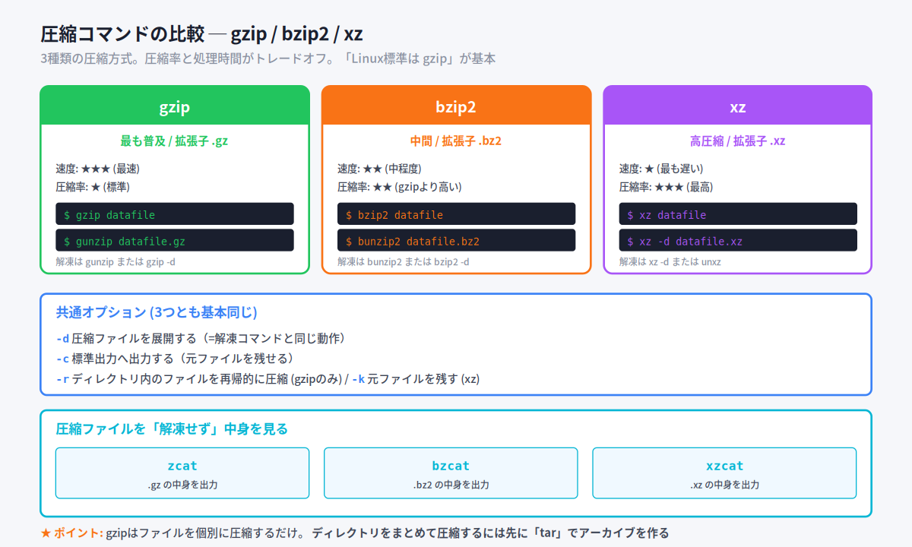

| コマンド | 拡張子 | 特徴 |
|---|---|---|
| **gzip** | `.gz` | 最も普及。速いが圧縮率は控えめ |
| **bzip2** | `.bz2` | 中間。gzipより圧縮率が高いが時間がかかる |
| **xz** | `.xz` | 最高圧縮率。ただし最も時間がかかる |

身近な例えで言うと、3つは **荷物の梱包方法の違い** に似ています。gzipは「サッと適度に圧縮」、bzip2は「もう少し時間をかけてしっかり」、xzは「徹底的に小さく」というイメージです。

#### 基本的な使い方

3つともほぼ同じインターフェースです。

```bash
$ gzip datafile        # → datafile.gz になる(元ファイルは消える)
$ bzip2 datafile       # → datafile.bz2 になる
$ xz datafile          # → datafile.xz になる
```

> ⚠ **元ファイルは消えるのが原則**。残したい場合は `-c`(標準出力に出す)を使ってリダイレクトで保存します。
>
> ```bash
> $ gzip -c datafile > datafile.gz    # 元ファイルを残したまま圧縮
> ```

#### 主なオプション(3つとも基本同じ)

| オプション | 動作 |
|---|---|
| `-d` | 圧縮ファイルを展開する(解凍コマンドと同じ動作) |
| `-c` | 標準出力へ出力する |
| `-r` | ディレクトリ内のファイルを再帰的に圧縮(gzipのみ) |
| `-k` | 元ファイルを残す(xz) |

#### 解凍は専用コマンドでも可

それぞれに専用の解凍コマンドがあります。

| 圧縮コマンド | 専用解凍コマンド |
|---|---|
| `gzip` | **gunzip** (`= gzip -d`) |
| `bzip2` | **bunzip2** (`= bzip2 -d`) |
| `xz` | **unxz** (`= xz -d`) |

```bash
$ gunzip datafile.gz      # gzip -d と同じ
$ bunzip2 datafile.bz2    # bzip2 -d と同じ
$ unxz datafile.xz        # xz -d と同じ
```

> 💡 **覚え方Hack**: 解凍コマンドは「un + 元コマンド」の形(bzip2 → bunzip2、xz → unxz)。gzipだけ「gunzip」と「un」が後ろからきます。

#### 📌 試験ポイント

| 問われ方 | 答え |
|---|---|
| 最も普及している圧縮コマンドは? | **gzip** (拡張子 .gz) |
| 最も圧縮率が高いコマンドは? | **xz** |
| 圧縮ファイルを展開する共通オプションは? | **-d** |
| 圧縮時に元ファイルを残すには? | gzipなら `-c`+リダイレクト、xzなら `-k` |
| .bz2 を解凍するコマンドは? | **bunzip2** または **bzip2 -d** |

---

### 4.1.2 圧縮ファイルの閲覧

#### 解凍せず中身を見たい

圧縮ファイルをわざわざ解凍しなくても、中身のテキストを見られるコマンドがあります。これは便利な機能で、覚えておくと役立ちます。

| コマンド | 用途 |
|---|---|
| **zcat** | .gz の中身を出力 |
| **bzcat** | .bz2 の中身を出力 |
| **xzcat** | .xz の中身を出力 |

```bash
$ bzcat sample.bz2    # 解凍せずに中身を表示
```

> 💡 普通の `cat` の親戚と思えばOK。「z付きcat」=「圧縮対応cat」のような関係です。
>
> 💡 ログファイルがgzip圧縮されていることがあります(例: `/var/log/messages.1.gz`)。そんなときに `zcat` がそのまま使えると非常に便利です。

#### 📌 試験ポイント

| 問われ方 | 答え |
|---|---|
| gzip圧縮ファイルの中身を解凍せずに見るには? | **zcat** |
| bzip2圧縮ファイルの中身を解凍せずに見るには? | **bzcat** |
| xz圧縮ファイルの中身を解凍せずに見るには? | **xzcat** |

---

### 4.1.3 アーカイブの作成、展開

#### アーカイブとは

複数のファイルやディレクトリを **1つのファイルにまとめた** ものを **アーカイブ(書庫)** と呼びます。日本語の「書庫」のイメージそのままです。

ディレクトリ単位で圧縮したい場合、まずアーカイブを作る必要があります。Linuxの圧縮コマンド(gzip等)は単一ファイルしか扱えないからです。

#### tar コマンド

ファイルやディレクトリを1つのアーカイブにまとめたり、展開したりするコマンドが **tar** です。tar単体は圧縮しませんが、オプションで同時に圧縮もできます。

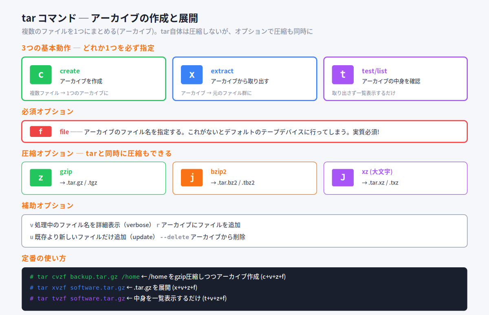

##### 3つの基本動作(必ずどれか1つ指定)

| オプション | 動作 |
|---|---|
| **c** | **c**reate(作成) ─ 新規アーカイブを作る |
| **x** | e**x**tract(取り出す) ─ アーカイブを展開する |
| **t** | **t**est/list ─ アーカイブの中身を一覧表示する(展開しない) |

> 💡 **覚え方Hack**: c=create、x=extract、t=tell(中身を教えて)。x は extract から取った2文字目で、cと並んで似た役目をします。

##### 必須オプション

| オプション | 動作 |
|---|---|
| **f** | **f**ile ─ アーカイブのファイル名を指定 |

> ⚠ `-f` は実質必須です。指定しないと「デフォルトのテープデバイス」に向かってしまい、ふつうは何も起きないか、エラーになります。実務では必ず付けるものと覚えておきましょう。

##### 圧縮オプション ─ tarで同時に圧縮もできる

| オプション | 圧縮形式 | 拡張子 |
|---|---|---|
| **z** | gzip | .tar.gz / .tgz |
| **j** | bzip2 | .tar.bz2 / .tbz2 |
| **J** (大文字) | xz | .tar.xz / .txz |

> ⚠ **大文字Jはxz**。小文字jはbzip2。「Jはアルファベットでxに近いから(?)xz」と覚えると忘れにくいです。

##### 補助オプション

| オプション | 動作 |
|---|---|
| `v` | **v**erbose ─ 処理中のファイル名を詳細表示 |
| `r` | アーカイブにファイルを追加 |
| `u` | **u**pdate ─ 既存より新しいファイルだけ追加 |
| `--delete` | アーカイブからファイルを削除 |

#### 定番の使い方

実務で覚えておくと便利な組み合わせです。

```bash
# /home ディレクトリを gzip 圧縮しつつアーカイブに(c+v+z+f)
# tar cvzf backup.tar.gz /home

# software.tar.gz を展開する(x+v+z+f)
# tar xvzf software.tar.gz

# software.tar.gz の中身を確認するだけ(t+v+z+f)
# tar tvzf software.tar.gz
```

> 💡 **覚え方Hack**: tarのオプションは **「-」を省略できる** のが特徴(他のコマンドと違う)。たとえば `tar cvzf` でも `tar -cvzf` でも同じ動作。試験ではどちらの書き方も出ます。
>
> 💡 「**cvzf** で作る、**xvzf** で展開、**tvzf** で確認」── この3つを呪文のように覚えておくと実務で困りません。

#### cpio コマンド ─ もう一つのアーカイブ方式

tar以外にも **cpio** というアーカイブツールがあります。標準入力からファイル名を受け取って処理するのが特徴です。

| フラグ | 動作 |
|---|---|
| `-o` | アーカイブを作成(**o**utput) |
| `-i` | アーカイブからファイルを抽出(**i**nput) |
| `-p` | 別ディレクトリにコピー |

```bash
# カレントディレクトリ以下を /tmp/backup にバックアップ
$ ls | cpio -o > /tmp/backup
```

> 💡 cpio は tar より歴史が古いコマンドですが、いまでも各所で使われています。tarと違って「ファイル名のリストを標準入力で受け取る」スタイルなので、`find`と組み合わせやすいのが特徴です。

#### dd コマンド ─ デバイスをそのままコピー

**dd** は、入力ファイルから読み込んだデータを出力ファイルに書き出すコマンドです。これだけ聞くと普通のコピーと変わりませんが、 **デバイスファイルもそのまま扱える** のが大きな違いです。

| オプション | 動作 |
|---|---|
| `if=入力ファイル` | **i**nput **f**ile ─ 入力元 |
| `of=出力ファイル` | **o**utput **f**ile ─ 出力先 |
| `bs=バイト数` | **b**lock **s**ize ─ ブロックサイズ |
| `count=回数` | 回数分のブロックをコピー |

```bash
# /dev/sdb の内容をそのまま /dev/sdc にコピー(ディスククローン)
# dd if=/dev/sdb of=/dev/sdc
```

これにより、パーティション情報やファイルシステムごとディスクを丸ごとコピーできます。

> 💡 ddは「ディスクのバックアップ」「ISOイメージのUSB書き込み」などで活躍します。ただし出力先を間違えると **データが完全に消える** ので、`if=`と`of=`の指定は慎重に。
>
> 💡 オプションの書き方が独特(`-` を使わず `=` で指定)なのも試験で問われやすいポイントです。

#### 📌 試験ポイント

| 問われ方 | 答え |
|---|---|
| アーカイブを作成するtarオプションは? | **c** (create) |
| アーカイブを展開するtarオプションは? | **x** (extract) |
| アーカイブの中身を一覧表示するtarオプションは? | **t** |
| アーカイブのファイル名を指定するオプションは? | **f** |
| gzip圧縮を同時に行うtarオプションは? | **z** (小文字) |
| bzip2圧縮を同時に行うtarオプションは? | **j** |
| xz圧縮を同時に行うtarオプションは? | **J** (大文字) |
| デバイスを丸ごとコピーできるコマンドは? | **dd** |
| ddの入力・出力指定は? | **if=** / **of=** |

#### 📝 ここまでのまとめ

- 圧縮は **gzip / bzip2 / xz**。拡張子は `.gz` `.bz2` `.xz`
- 解凍コマンドは **gunzip / bunzip2 / unxz**(または `-d`)
- 解凍せず中身を見るには **zcat / bzcat / xzcat**
- アーカイブは **tar**。基本動作は **c/x/t**、ファイル指定は **f**、圧縮は **z/j/J**
- デバイス丸ごとコピーは **dd**(if= / of=)

---

## 4.2 パーミッションの設定

### ここで学ぶこと

Linuxのファイル・ディレクトリには「誰に何を許可するか」を決める **アクセス権(パーミッション)** が設定されています。Linuxを管理する上で **最重要の概念の一つ** で、試験でも複数問は確実に出ます。

「rwx の記号で表す方法」と「3桁の数値で表す方法」の **両方を読み書きできる** ようになるのがこのセクションのゴールです。

### 4.2.1 所有者

#### ファイルには「持ち主」がある

Linuxでは、ファイルやディレクトリを作成すると、 **作成したユーザーが所有者** として設定されます。同時に、そのユーザーが所属するプライマリグループが、ファイルの **所有グループ** になります。

身近な例えで言うと、ファイルは **誰かの所有物** として登録されます。「ユーザーlpicが作ったファイル」なら所有者はlpic、その人が属する「linuxグループ」が所有グループ、というわけです。

```bash
$ ls -l
-rw-r--r-- 1 lpic linux 0 Jun 27 22:00 testfile
              ↑    ↑
           所有者 所有グループ
```

`ls -l` の出力で、左から3番目と4番目のフィールドに表示されているのが所有者と所有グループです。

#### 📌 試験ポイント

| 問われ方 | 答え |
|---|---|
| ファイルを作成すると所有者は? | **作成したユーザー** |
| 所有グループは? | 作成したユーザーの **プライマリグループ** |
| 所有者を確認するコマンドは? | `ls -l` |

---

### 4.2.2 アクセス権

#### 3者に対する3種類の権限

アクセス権(パーミッション)は、**「3者に対する3種類の権限」** を表します。

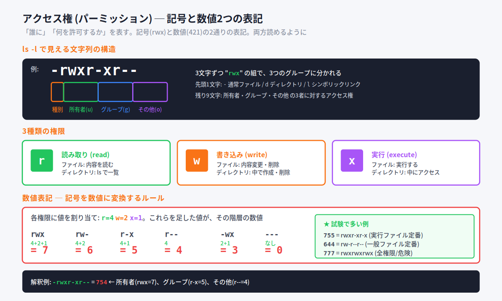

##### 3者(誰に対して)

| 対象 | 記号 | 意味 |
|---|---|---|
| 所有者 | **u** | user (owner) |
| グループ | **g** | group |
| その他のユーザー | **o** | other |
| 全員 | **a** | all |

##### 3種類の権限(何を)

| 権限 | 記号 | ファイルへの効果 | ディレクトリへの効果 |
|---|---|---|---|
| 読み取り | **r** | 内容を読む | 中のファイル一覧を `ls` |
| 書き込み | **w** | 内容変更・削除 | 中でファイルを作成・削除 |
| 実行 | **x** | 実行する | 中にアクセスする |

> 💡 ディレクトリの **x(実行権)** は「中に入る権限」と覚えるとよいでしょう。これがないと `cd` で入ることも、中のファイルを開くこともできません。

#### ls -l の表示の構造

`ls -l` で表示される左端の10文字には、すべての情報が詰まっています。

```
- rwx r-x r--
↑ ↑↑↑ ↑↑↑ ↑↑↑
種別 所有者 グループ その他
```

- **先頭1文字** … ファイルの種別
  - `-` 通常ファイル
  - `d` ディレクトリ
  - `l` シンボリックリンク
- **残り9文字** … 3文字ずつ3グループに分かれ、それぞれ「所有者」「グループ」「その他」の権限

例えば `-rwxr-xr--` なら：
- ファイル種別: 通常ファイル
- 所有者: 読み取り・書き込み・実行 (rwx)
- グループ: 読み取り・実行 (r-x)
- その他: 読み取りのみ (r--)

#### 数値表記 ─ 「421ルール」で記号を数値に

アクセス権は数値でも表現できます。各権限に値を割り当てて、足し算します。

| 権限 | 数値 |
|---|---|
| r (読み取り) | **4** |
| w (書き込み) | **2** |
| x (実行) | **1** |

各階層ごとに、持っている権限の値を **足し算** すれば、その階層の数値になります。

| 記号 | 計算 | 数値 |
|---|---|---|
| `rwx` | 4+2+1 | **7** |
| `rw-` | 4+2 | **6** |
| `r-x` | 4+1 | **5** |
| `r--` | 4 | **4** |
| `-wx` | 2+1 | **3** |
| `---` | なし | **0** |

3つの階層の数値を並べると、3桁の数値になります。

```
記号: rwx r-x r--
数値:  7   5   4   → 754
```

> 💡 **覚え方Hack**: 「**4-2-1ルール**」── 順番は **r=4, w=2, x=1**。 「**421**(よん・に・いち)」のリズムで覚えれば一生忘れません。

#### よく使う数値

| 数値 | 記号 | 用途 |
|---|---|---|
| **644** | `rw-r--r--` | 一般ファイル定番 |
| **755** | `rwxr-xr-x` | 実行ファイル・ディレクトリ定番 |
| **777** | `rwxrwxrwx` | 全権限(セキュリティ上は危険) |
| **600** | `rw-------` | 所有者のみ読み書き(秘密鍵など) |

#### アクセス権の変更 ─ chmodコマンド

アクセス権を変更するには **chmod** コマンドを使います。指定方法は2通りあります。

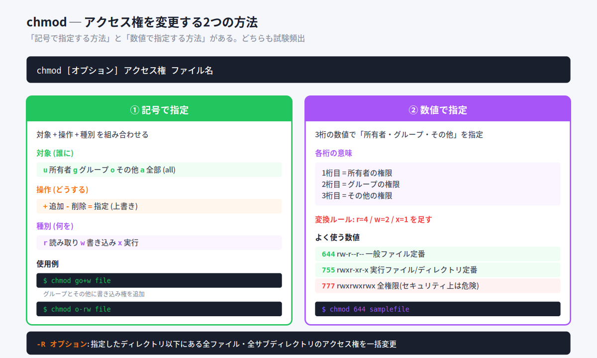

##### ① 記号で指定

「対象 + 操作 + 種別」を組み合わせます。

| 操作 | 動作 |
|---|---|
| `+` | 権限を追加 |
| `-` | 権限を削除 |
| `=` | 権限を指定(上書き) |

```bash
# グループとその他に書き込み権を追加
$ chmod go+w samplefile

# その他から読み取りと書き込み権を削除
$ chmod o-rw samplefile

# 所有者の権限を rwx に指定(他は変更しない)
$ chmod u=rwx samplefile
```

##### ② 数値で指定

3桁の数値で「所有者・グループ・その他」を指定します。これは **変更前の状態に関わらず上書き** します。

```bash
$ chmod 644 samplefile     # rw-r--r-- に設定
$ chmod 755 samplefile     # rwxr-xr-x に設定
```

##### 主なオプション

| オプション | 動作 |
|---|---|
| `-R` | 指定したディレクトリ以下にある全ファイル・全サブディレクトリを一括変更(再帰的) |

> 💡 ディレクトリと中身を一括で権限変更したいときは `chmod -R 755 dir/` のように使います。

#### 📌 試験ポイント

| 問われ方 | 答え |
|---|---|
| アクセス権を変更するコマンドは? | **chmod** |
| 数値表記でrの値は? | **4** |
| 数値表記でwの値は? | **2** |
| 数値表記でxの値は? | **1** |
| `rwxr-xr--` を数値で表すと? | **754** |
| `chmod 644` は記号でいうと? | `rw-r--r--` |
| ディレクトリの中身も一括変更するには? | **-R** オプション |
| 記号表記で全員(all)を表すのは? | **a** |

---

### 4.2.3 SUID、SGID

#### 特殊なアクセス権

通常のアクセス権(rwx)に加えて、特殊な権限が3種類あります。**SUID / SGID / スティッキービット** です。これらは「通常権限とは別の桁」で管理されます。

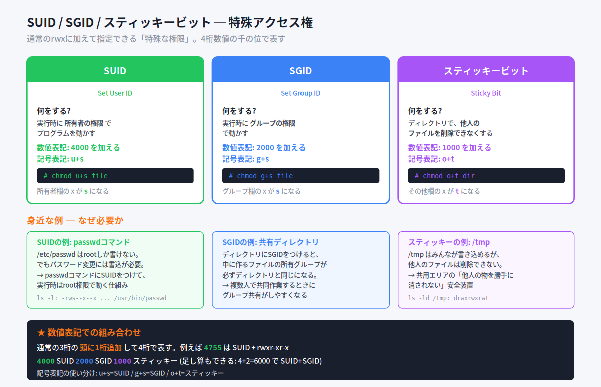

#### SUID (Set User ID)

##### 何をするもの?

SUIDが設定された実行ファイルを実行すると、**実行者ではなく所有者の権限** でプログラムが動きます。

身近な例えで言うと、「**所有者のパスポートを借りて実行する**」ようなイメージです。普段は自分の権限でしか動けないところを、SUIDがあると一時的に所有者の権限になれます。

##### なぜ必要か ─ passwdコマンドの仕組み

代表例が `passwd` コマンドです。

```bash
$ ls -l /etc/passwd
-rw-r--r-- 1 root root 1504 Jan 14 06:13 /etc/passwd
```

このファイルは **rootしか書き込めません**。しかし、一般ユーザーが `passwd` でパスワード変更すると、結果は `/etc/passwd` に書き込まれます。なぜか?

```bash
$ ls -l `which passwd`
-rws--x--x 1 root bin 3964 Mar 9 21:00 /usr/bin/passwd
   ↑
   ここが s になっている = SUID が設定されている
```

`passwd` コマンドにはSUIDが設定されており、所有者はroot。だから一般ユーザーが実行しても **root権限で動く** → `/etc/passwd` に書き込める、というわけです。

##### 設定方法

| 方法 | 書き方 |
|---|---|
| 記号 | `chmod u+s file` |
| 数値 | 通常3桁の頭に **4000** を加える(例: `chmod 4711 file`) |

設定すると、所有者の `x` の位置が `s` に変わります(`-rws--x--x`)。

#### SGID (Set Group ID)

##### 何をするもの?

SUIDのグループ版です。実行時に **グループの権限** で動作します。さらに、ディレクトリに設定すると別の便利な効果があります。

##### ディレクトリのSGID ─ グループ共有が楽になる

ディレクトリにSGIDを設定すると、**その中に作られるファイルの所有グループが、ディレクトリと同じグループになります**。

```bash
# /home/share に所有グループ「developers」と SGID を設定
# chgrp developers /home/share
# chmod g+s /home/share
```

これで「/home/share の中で誰がファイルを作っても、グループは必ず developers」になります。複数人で共有作業するときに非常に便利です。

##### 設定方法

| 方法 | 書き方 |
|---|---|
| 記号 | `chmod g+s file` |
| 数値 | 通常3桁の頭に **2000** を加える |

設定するとグループの `x` の位置が `s` に変わります。

#### 📌 試験ポイント

| 問われ方 | 答え |
|---|---|
| SUIDの数値は? | **4000** |
| SGIDの数値は? | **2000** |
| SUIDの記号表記は? | **u+s** |
| SGIDの記号表記は? | **g+s** |
| passwdコマンドにSUIDがあるのはなぜ? | **/etc/passwd への書き込みに root権限が必要だから** |
| ディレクトリにSGIDを設定する効果は? | 中で作られるファイルの所有グループが、そのディレクトリと同じになる |

---

### 4.2.4 スティッキービット

#### 何をするもの?

スティッキービットは **ディレクトリに設定して、他人のファイルを削除できないようにする** 仕組みです。

#### /tmp が代表例

```bash
$ ls -ld /tmp
drwxrwxrwt 10 root root 1024 Jul 8 16:03 /tmp
         ↑
         ここが t になっている = スティッキービットあり
```

`/tmp` は **誰でも書き込めるディレクトリ** ですが、スティッキービットが設定されているため、**自分以外のユーザーが作成したファイルは削除できません**。

例えるなら、銭湯の脱衣所のロッカーのようなものです。誰でもロッカーを使える(書き込みOK)けれど、他人のロッカーは開けられない(削除NG)。共有エリアでお互いの邪魔をしないための安全装置です。

#### 設定方法

| 方法 | 書き方 |
|---|---|
| 記号 | `chmod o+t directory` |
| 数値 | 通常3桁の頭に **1000** を加える |

設定するとその他の `x` の位置が `t` に変わります。

#### 特殊権限まとめ

| 権限 | 数値 | 記号 | 効果 |
|---|---|---|---|
| **SUID** | 4000 | u+s | 実行時に所有者の権限になる |
| **SGID** | 2000 | g+s | 実行時にグループの権限になる/ディレクトリで共有 |
| **スティッキー** | 1000 | o+t | 共有ディレクトリで他人のファイル削除を禁止 |

> 💡 4桁数値の足し算もできます。例: **4755** = SUID + rwxr-xr-x、**6755** = SUID + SGID + rwxr-xr-x

#### 📌 試験ポイント

| 問われ方 | 答え |
|---|---|
| スティッキービットの数値は? | **1000** |
| スティッキービットの記号は? | **o+t** |
| /tmp に設定されているのは? | スティッキービット |
| スティッキービットの効果は? | 他人のファイルを削除できなくする |
| SUID + 755 を数値で表すと? | **4755** |

---

### 4.2.5 デフォルトのアクセス権

#### umask ─ 引き算で初期権限が決まる

新しいファイルやディレクトリを作ると、自動的にアクセス権が設定されます。この **初期アクセス権** を決めているのが **umask** です。


#### 計算ルール

| 種類 | ベース値 | 計算 |
|---|---|---|
| ファイル | **666** | 666 − umask = 初期権限 |
| ディレクトリ | **777** | 777 − umask = 初期権限 |

- **ファイル**: ベースが666 (rw-rw-rw-)。実行権が最初から付かない理由は「テキストファイルなど普通のファイルに実行権は不要だから」
- **ディレクトリ**: ベースが777 (rwxrwxrwx)。中に入るには実行権が必要なため

例: `umask = 022` の場合
- ファイル: `666 - 022 = 644` (rw-r--r--)
- ディレクトリ: `777 - 022 = 755` (rwxr-xr-x)

#### umaskコマンド

```bash
$ umask          # 現在のumask値を確認
0002             # 4桁表示。下3桁(002)を見ればOK

$ umask 027      # umask値を 027 に変更
```

> 💡 一般ユーザーのumaskは多くのディストリビューションで **022** または **002**。rootはより厳しい **022** が一般的です。

#### よく見るumask値

| umask値 | ファイル | ディレクトリ | 用途 |
|---|---|---|---|
| **022** | 644 | 755 | 一般的なデフォルト |
| **002** | 664 | 775 | グループ共有作業向き |
| **027** | 640 | 750 | 厳しめ(その他に何も与えない) |
| **077** | 600 | 700 | 最厳(所有者のみ) |

> 💡 **覚え方Hack**: 「umaskは **引き算** の値」── 「これだけ権限を **削る** よ」というマスクだと思えばOK。022 なら「グループとその他からwだけ削る」というイメージです。

#### 📌 試験ポイント

| 問われ方 | 答え |
|---|---|
| 新規作成ファイルの権限を決めるコマンドは? | **umask** |
| ファイルのベース値は? | **666** |
| ディレクトリのベース値は? | **777** |
| umask=022 のときファイルの権限は? | **644** |
| umask=022 のときディレクトリの権限は? | **755** |
| ファイルになぜ実行権が最初から付かない? | 普通のファイルに実行権は不要だから |

#### 📝 ここまでのまとめ

- **アクセス権** は所有者(u)・グループ(g)・その他(o)の3者に、r(4)・w(2)・x(1)の3種類の権限を設定
- 数値は **421ルール** で足し算 → 例: rwx=7, rw-=6, r-x=5
- 変更は **chmod**。記号(`u+w`)と数値(`644`)の2通り
- 特殊権限: **SUID(4000)/SGID(2000)/スティッキー(1000)**
- 初期権限は **umask** で決まる。ファイルは666から、ディレクトリは777から引く

---

## 4.3 ファイルの所有者管理

### ここで学ぶこと

ファイルへのアクセス許可は「アクセス権」と「所有者・所有グループ」の組み合わせで決まります。所有者を変えるには **chown**、所有グループを変えるには **chgrp** を使います。

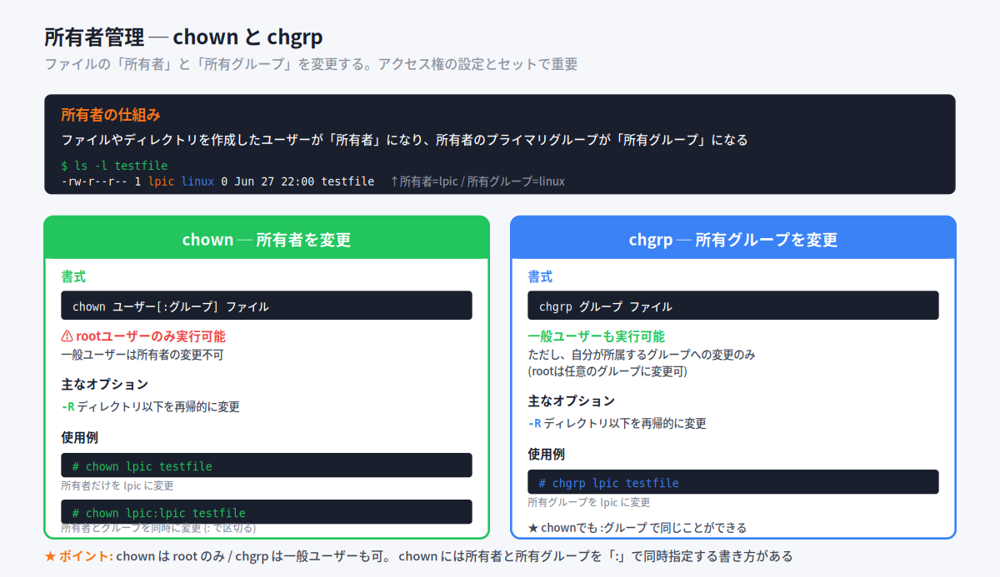

### 4.3.1 所有者の変更

#### chown コマンド

所有者を変更するコマンドが **chown** (change owner)です。

```
書式: chown [オプション] ユーザー[:グループ] ファイル名やディレクトリ名
```

| オプション | 動作 |
|---|---|
| `-R` | 指定したディレクトリと中のファイルを再帰的に変更 |

> ⚠ **chown は root ユーザーのみ実行可能**。一般ユーザーは所有者の変更ができません。

#### 使用例

```bash
# 所有者だけを lpic に変更
# chown lpic testfile

# 所有者と所有グループを同時に変更(: で区切る)
# chown lpic:lpic testfile
```

ユーザーは名前でもユーザーIDでも指定できます。所有者とグループは `:` で繋いで一度に指定できるのが便利です。

> 💡 古い書き方では `:` の代わりに `.` (ドット)を使うこともあります(例: `chown lpic.lpic testfile`)。新しいシステムでは `:` が標準です。

#### 📌 試験ポイント

| 問われ方 | 答え |
|---|---|
| 所有者を変更するコマンドは? | **chown** |
| chown を実行できるのは? | **rootユーザーのみ** |
| 所有者とグループを同時に変更するには? | `chown ユーザー:グループ ファイル` |
| ディレクトリ以下を一括変更するには? | **-R** オプション |

---

### 4.3.2 グループの変更

#### chgrp コマンド

所有グループだけを変更するコマンドが **chgrp** (change group)です。

```
書式: chgrp [オプション] グループ ファイル名やディレクトリ名
```

| オプション | 動作 |
|---|---|
| `-R` | 指定したディレクトリと中のファイルを再帰的に変更 |

> 💡 **chgrp は一般ユーザーでも実行可能**。ただし、自分が所属しているグループへの変更だけです。rootならどのグループにも変更可。

#### 使用例

```bash
# 所有グループを lpic に変更
$ chgrp lpic testfile
```

> 💡 同じことは `chown :lpic testfile` (ユーザー名なし、コロンの後ろにグループ名)でも可能です。chownで両方できるので、chgrpを使わなくても困らない場合が多いです。

#### chown と chgrp の使い分け

| やりたいこと | コマンド |
|---|---|
| 所有者だけ変える | `chown ユーザー file` |
| 所有グループだけ変える | `chgrp グループ file` または `chown :グループ file` |
| 両方変える | `chown ユーザー:グループ file` |

#### 📌 試験ポイント

| 問われ方 | 答え |
|---|---|
| 所有グループを変更するコマンドは? | **chgrp** |
| 一般ユーザーが chgrp で変更できるグループは? | 自分が所属しているグループだけ |
| chownでグループだけ変更するには? | `chown :グループ file` |

#### 📝 ここまでのまとめ

- **chown** … 所有者を変更(rootのみ)
- **chgrp** … 所有グループを変更(自分の所属グループへなら一般ユーザーも可)
- 両方とも **-R** でディレクトリ以下を再帰的に変更できる
- chown には所有者とグループを `:` で同時指定する書き方がある

---

## 4.4 ハードリンクとシンボリックリンク

### ここで学ぶこと

ファイルに **別名** を付け、複数の名前で同一のファイルにアクセスできる仕組みです。Linuxには2種類のリンクがあり、その違いが試験頻出ポイントです。

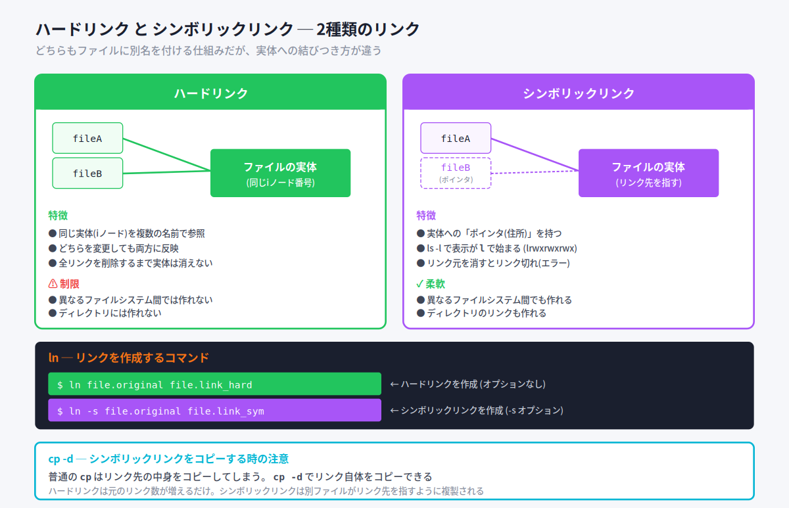

### 4.4.1 ハードリンク

#### iノードの仕組みから理解する

ファイルをディスクに保存すると、Linuxは **iノード番号** という重複しない番号を割り当てます。iノードには次のような情報が格納されています。

- ファイル種別
- ファイルサイズ
- アクセス権
- 所有者
- リンク数
- ディスク上の物理的な保存場所

私たちが「ファイル名」と呼んでいるのは、実は **iノードに対する名札** のようなものです。同じiノードに対して複数の名札を付けることができ、これが **ハードリンク** です。

#### ハードリンクの特徴

身近な例えで言うと、ハードリンクは **同じ家に複数の表札を立てる** ようなもの。表札はいくつあっても、指している家は同じです。

- 元のファイルとハードリンクは **完全に対等** (区別がつかない)
- どちらを変更しても **両方に反映される** (実体は1つ)
- すべてのリンクを削除するまで実体は消えない

```bash
$ ls -li
129851 -rw-r--r-- 3 lpic lpic 1433 Jul 17 13:22 file.org
129851 -rw-r--r-- 3 lpic lpic 1433 Jul 17 13:22 file2
129851 -rw-r--r-- 3 lpic lpic 1433 Jul 17 13:22 file3
   ↑                ↑
iノード番号(同じ)  リンク数=3
```

`-i` オプションで `ls` するとiノード番号が見えます。同じiノードを3つの名前で参照していることが分かります。

#### ハードリンクの制限

| 制限 | 理由 |
|---|---|
| 異なるファイルシステム間では作れない | iノードはファイルシステムごとに管理されているため |
| ディレクトリには作れない | ファイルシステムのループを防ぐため |

> ⚠ この2つの制限はそれぞれ試験頻出。「ハードリンクはディレクトリには作れない」「ハードリンクは別ファイルシステムには作れない」と覚えておきましょう。

---

### 4.4.2 シンボリックリンク

#### ポインタを持つ別ファイル

**シンボリックリンク** はもう1つのリンクの仕組みで、**リンク元の場所(パス)を指し示すポインタ** を中身として持つ別ファイルです。

身近な例えで言うと、シンボリックリンクは **「あの家はここにあるよ」という案内板** のようなものです。案内板自体は別のものですが、書かれた住所をたどると本体にたどり着きます。

#### シンボリックリンクの特徴

- リンク自体は独立したファイル(iノードは別)
- リンク元を消すと **リンク切れ(エラー)** になる
- `ls -l` で表示すると先頭が **l** で始まる(`lrwxrwxrwx`)

```bash
$ ls -l
-rw-r--r-- 2 lpic lpic 128 Jun 28 12:20 file.original
lrwxrwxrwx 1 lpic lpic  12 Jun 28 12:21 file.link_sym -> file.original
↑
シンボリックリンクは l で始まる
```

> 💡 シンボリックリンクの表示は `lrwxrwxrwx` という固定のアクセス権ですが、実際のアクセス権はリンク元ファイルのものが適用されます。表示はあくまで形式的なものです。

#### シンボリックリンクの柔軟さ

| 特徴 | 説明 |
|---|---|
| 異なるファイルシステム間でもOK | ポインタを持つだけなので |
| ディレクトリのリンクもOK | 制限なく作れる |

> 💡 WindowsのショートカットやmacOSのエイリアスがシンボリックリンクに相当します。日常的に「リンクを作る」と言われたら、たいていシンボリックリンクのことです。

#### ハードリンク vs シンボリックリンク 早見表

| 項目 | ハードリンク | シンボリックリンク |
|---|---|---|
| iノード | **同じ** | **別々** |
| 別ファイルシステム | ✗ 不可 | ✓ 可能 |
| ディレクトリ | ✗ 不可 | ✓ 可能 |
| 元を消すと? | 残っていれば実体は維持 | リンク切れ |
| `ls -l` の先頭 | `-` (通常ファイルと同じ) | `l` |

---

### 4.4.3 リンクの作成

#### ln コマンド

リンクを作成するには **ln** コマンドを使います。デフォルトではハードリンクが作成され、シンボリックリンクを作るには **-s** オプションを使います。

```
書式: ln [オプション] リンク元(実体) リンクファイル
```

| オプション | 動作 |
|---|---|
| `-s` | **s**ymbolic ─ シンボリックリンクを作成 |

```bash
# ハードリンクを作成(オプションなし)
$ ln file.original file.link_hard

# シンボリックリンクを作成(-s)
$ ln -s file.original file.link_sym
```

> 💡 **覚え方Hack**: 「ハードはオプションなし、ソフト(シンボリック)は -s」。「**s**oft = **s**ymbolic」と覚えても良いでしょう。

#### リンクの確認

```bash
$ ls -li
255 -rw-r--r-- 2 lpic lpic 128 Jun 28 12:20 file.original
255 -rw-r--r-- 2 lpic lpic 128 Jun 28 12:20 file.link_hard
278 lrwxrwxrwx 1 lpic lpic  12 Jun 28 12:21 file.link_sym -> file.original
```

- ハードリンクは **iノード番号が同じ** (255)
- シンボリックリンクは **別のiノード番号** (278)、表示が `l` で始まる

---

### 4.4.4 リンクのコピー

#### cp と シンボリックリンクの落とし穴

シンボリックリンクを `cp` でコピーすると、デフォルトでは **リンク先のファイル内容がコピー** されてしまいます。「リンク自体」をコピーしたい場合は **-d** オプションを使います。

```bash
$ cp file.link_sym file.link2      # リンク先の内容がコピーされる(通常ファイルに)
$ cp -d file.link_sym file.link3   # リンク自体がコピーされる(シンボリックリンクのまま)
```

| オプション | 動作 |
|---|---|
| `-d` | シンボリックリンクをそのままコピー(リンク先ではなくリンク自体) |

> 💡 ハードリンクは元々「同じ実体」なので、`cp` の動作は単純(普通のファイルとして扱える)。シンボリックリンクは「ポインタ」なので、`-d` の有無で挙動が変わります。

#### リンクのまとめ

| 操作 | コマンド |
|---|---|
| ハードリンク作成 | `ln 元 リンク名` |
| シンボリックリンク作成 | `ln -s 元 リンク名` |
| シンボリックリンク自体をコピー | `cp -d リンク 新リンク` |

#### 📌 試験ポイント

| 問われ方 | 答え |
|---|---|
| リンクを作成するコマンドは? | **ln** |
| ハードリンクの作成方法は? | `ln 元 リンク名` (オプションなし) |
| シンボリックリンクの作成方法は? | `ln -s 元 リンク名` |
| ハードリンクが作れない場所は? | **別のファイルシステム、ディレクトリ** |
| シンボリックリンクが `ls -l` で先頭につく文字は? | **l** |
| iノード番号が同じになるのは? | **ハードリンク** |
| シンボリックリンク自体をコピーするには? | `cp -d` |

#### 📝 ここまでのまとめ

- **ハードリンク**: 同じiノードを複数の名前で参照。別ファイルシステム不可、ディレクトリ不可
- **シンボリックリンク**: パスを指すポインタ。別ファイルシステムもディレクトリもOK
- 作成は **ln** (シンボリックは `-s` を付ける)
- シンボリックリンクのコピーは **cp -d** でリンク自体を複製できる

---

## 4.5 プロセス管理

### ここで学ぶこと

Linuxで実行されている **プロセス(動作中のプログラム)** を観察・操作する方法を学びます。プロセスの確認、終了、フォアグラウンド/バックグラウンド切り替え、システム状況の把握など、サーバ管理に必須の知識が詰まったセクションです。

### 4.5.1 プロセスの監視

#### プロセスとは

**プロセス** = 動作中のプログラムを、OSが管理する基本単位です。

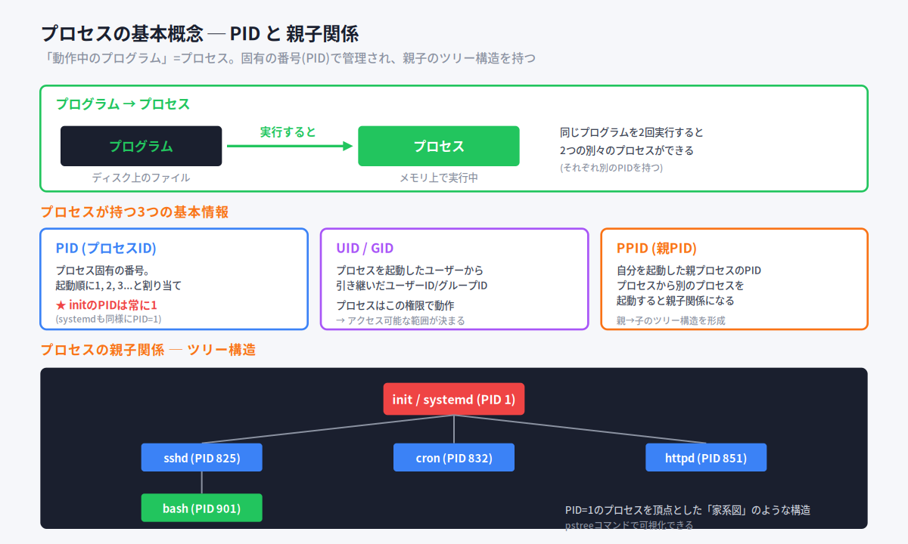

プログラムはディスク上のファイルですが、実行するとメモリに読み込まれて動き出します。この「動いている状態」がプロセスです。

身近な例えで言うと、プログラムは **レシピ(料理本のページ)**、プロセスは **実際に料理を作っている状態** に似ています。同じレシピから2人が同時に料理を始めれば、別々の作業として進みます(2つのプロセス)。

#### プロセスが持つ3つの基本情報

| 情報 | 説明 |
|---|---|
| **PID** | プロセス固有のID番号。起動順に1から割り当てられる |
| **UID / GID** | 起動したユーザーから引き継いだユーザーID/グループID |
| **PPID** | 親プロセスのPID |

> ⚠ **PID=1 は init / systemd**。Linuxが起動するとき最初に起動するプロセスで、すべてのプロセスの親(または祖先)になります。これは丸暗記レベルで覚えてください。

#### プロセスの親子関係

プロセスから別のプロセスを起動すると、**親子関係** ができます。すべてのプロセスをたどっていくと、最終的にPID=1のinit/systemdにたどり着く **ツリー構造** になっています。

#### プロセスを見るコマンド ─ ps / top / pstree

プロセスを観察する3つのコマンドがあり、用途で使い分けます。

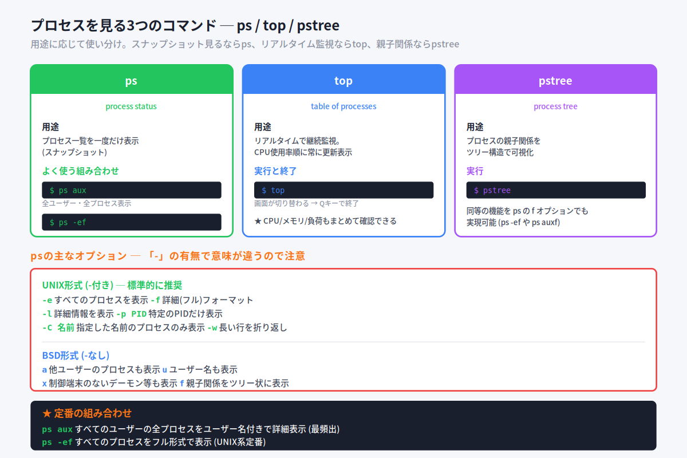

##### ps ─ 一度だけ表示(スナップショット)

ps(process status) は、その瞬間のプロセス一覧を1回だけ表示します。継続監視ではなく、ある時点での状態を見るコマンドです。

```
書式: ps [オプション]
```

> ⚠ **ps コマンドはオプションが特殊**。「-」付きのUNIX形式と、「-」なしのBSD形式があり、意味も書き方も違います。

##### UNIX形式オプション(- 付き) ─ 推奨

| オプション | 動作 |
|---|---|
| `-e` | すべてのプロセスを表示 |
| `-f` | 詳細(フル)フォーマットで表示 |
| `-l` | 詳細情報(long)を表示 |
| `-p PID` | 特定のPIDだけ表示 |
| `-C プロセス名` | 指定した名前のプロセスのみ表示 |
| `-w` | 長い行を折り返し |

##### BSD形式オプション(- なし)

| オプション | 動作 |
|---|---|
| `a` | 他ユーザーのプロセスも表示 |
| `u` | ユーザー名も表示 |
| `x` | 制御端末のないデーモン等も表示 |
| `f` | 親子関係をツリー状に表示 |

##### 定番の組み合わせ

```bash
$ ps aux       # 全ユーザー・全プロセスをユーザー名付きで表示(最頻出)
$ ps -ef       # 全プロセスをフル形式で表示(UNIX系定番)
```

> 💡 `ps aux` と `ps -ef` はほぼ同じ結果を出します。どちらの形式でも答えられるようにしておきましょう。

##### top ─ リアルタイム監視

top は **画面が切り替わって、継続的にプロセスを表示** するコマンドです。CPU使用率順に並び、何秒かおきに自動更新されます。

```bash
$ top
（画面が切り替わる）
top - 03:44:19 up 9:20, 2 users, load average: 0.00, 0.01, 0.05
Tasks: 113 total, 2 running, 111 sleeping, ...
%Cpu(s): 0.0 us, 0.0 sy, ...
```

Qキーで終了します。

> 💡 topの画面では、上部にシステム全体の負荷(CPU/メモリ/負荷)、下部に各プロセスの情報が表示されます。リアルタイム監視のため、サーバの調子が悪いときの定番ツールです。

##### pstree ─ 親子関係をツリーで可視化

pstree は、プロセスの親子関係を **ツリー構造** で表示します。「どのプロセスがどのプロセスから起動されたか」が一目で分かります。

```bash
$ pstree
systemd ─┬─ NetworkManager ─┬─ dhclient
         │                  └─ 3*[{NetworkManager}]
         ├─ sshd ─── sshd ─── bash
         ├─ httpd ─── 5*[httpd]
        ...
```

`ps -ef` の f オプションでも同様の情報が得られますが、見やすさで pstree が便利です。

#### 📌 試験ポイント

| 問われ方 | 答え |
|---|---|
| 動作中のプロセスを一度だけ表示するコマンドは? | **ps** |
| リアルタイムで継続監視するコマンドは? | **top** |
| プロセスの親子関係をツリーで表示するコマンドは? | **pstree** |
| PID=1のプロセスは? | **init** または **systemd** |
| すべてのプロセスを表示するps -eオプションは? | **-e** (BSDでは `a` と `x`) |
| ps aux の意味は? | a=全ユーザー、u=ユーザー名表示、x=デーモンも表示 |
| topを終了するキーは? | **Q** |

---

### 4.5.2 プロセスの終了

#### kill コマンドとシグナル

プロセスを終了させるには **kill** コマンドを使います。killは「殺す」という強い名前ですが、実際には **「シグナル(メッセージ)を送る」** コマンドです。シグナルの種類によって、プロセスの挙動が変わります。

```
書式: kill -[シグナル名またはシグナルID] PID
```

#### シグナルとは

**シグナル** はプロセスに送られる短いメッセージです。プロセスはシグナルを受け取ると、その種類に応じた動作(終了・再起動・一時停止など)を行います。シグナルには **番号と名前** の両方があり、どちらでも指定できます。

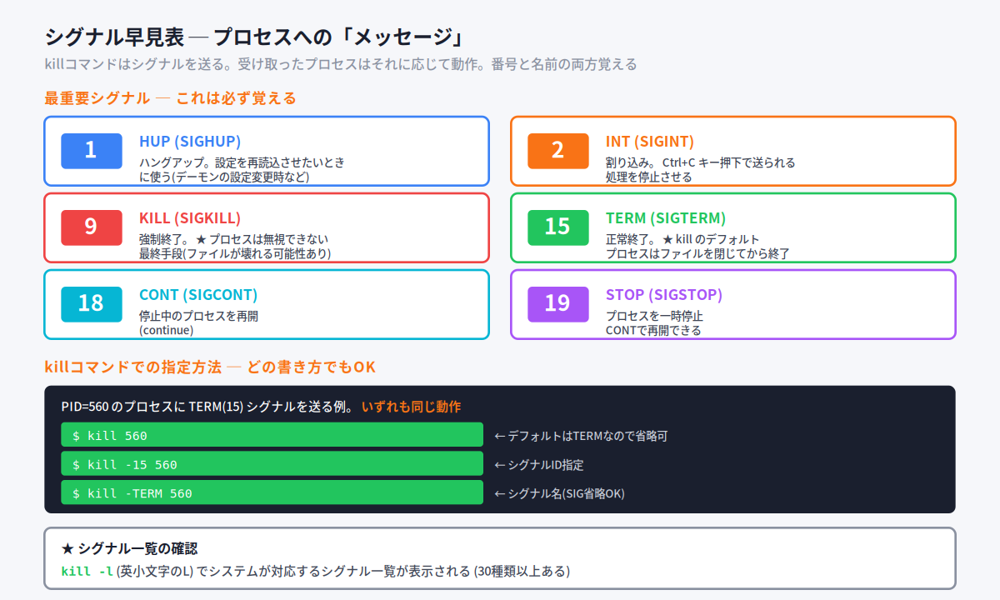

#### 主要シグナル(必ず覚える)

| シグナル名 | 番号 | 動作 |
|---|---|---|
| **HUP** | 1 | ハングアップ。設定の再読み込みに使う |
| **INT** | 2 | 割り込み(Ctrl+Cで送られる) |
| **KILL** | 9 | 強制終了(無視できない) |
| **TERM** | 15 | 正常終了(killのデフォルト) |
| **CONT** | 18 | 停止中のプロセスを再開 |
| **STOP** | 19 | 一時停止 |

> ⚠ **9と15の違いは超頻出**。
> - **TERM(15)** = 正常終了。プロセスはファイルを閉じる時間をもらえる
> - **KILL(9)** = 強制終了。プロセスは抵抗できない。ただしファイルが壊れる可能性あり

例えるなら：
- TERM(15) = 「そろそろ閉店ですよ」とお願いする
- KILL(9) = いきなり電源を抜く

通常はTERM、それでダメなときの最終手段がKILLです。

#### シグナルの指定方法

killコマンドでは、いくつかの書き方ができます。**いずれも同じ動作** です。

```bash
$ kill 560              # デフォルトはTERM(15)なので省略可
$ kill -15 560          # シグナルID指定
$ kill -TERM 560        # シグナル名指定(SIG省略OK)
$ kill -SIGTERM 560     # フル名指定
$ kill -s TERM 560      # -s オプション形式
```

> 💡 シグナル一覧を見るには `kill -l`(英小文字のL)を実行します。30種類以上あります。

#### HUPの実用例

`HUP` は本来「端末切断」を意味しますが、実際には **デーモンの設定再読み込み** によく使われます。

```bash
# httpdの設定ファイルを変更したあと、再読み込みさせる
# kill -HUP $(pgrep httpd)
```

これでhttpdを停止せずに設定変更を反映できます。

#### 複数プロセスをまとめて指定

```bash
$ kill 570 571        # PID 570と571のプロセスに同時にシグナルを送る
```

#### プロセス名で指定する仲間コマンド

PIDが分からなくても、**プロセス名で指定して終了** させるコマンドがあります。

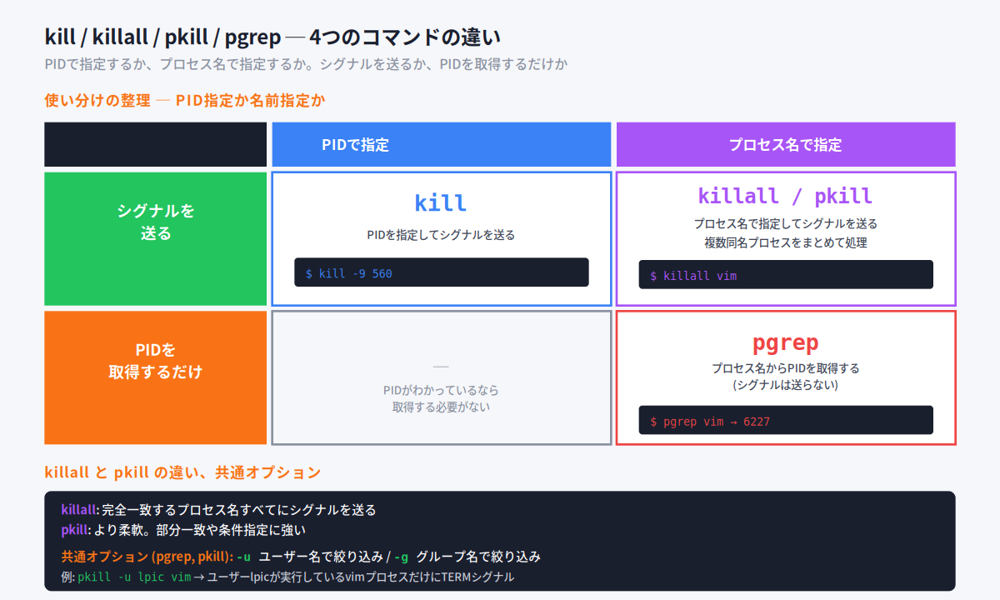

| コマンド | 指定方法 | 動作 |
|---|---|---|
| **kill** | PID | シグナルを送る |
| **killall** | プロセス名 | 同名のプロセスすべてにシグナルを送る |
| **pkill** | プロセス名 | より柔軟な指定(部分一致など) |
| **pgrep** | プロセス名 | 一致するプロセスのPIDを取得するだけ(シグナルは送らない) |

```bash
$ killall vim           # すべてのvimプロセスにTERMシグナル
$ pkill -u lpic vim     # ユーザーlpicが実行中のvimプロセスにTERM
$ pgrep vim             # vimプロセスのPIDを表示(終了はしない)
```

##### pgrep / pkill の主なオプション

| オプション | 動作 |
|---|---|
| `-u ユーザー名` | プロセスの実行ユーザーで絞り込み |
| `-g グループ名` | プロセスの実行グループで絞り込み |

> 💡 **覚え方Hack**: `pgrep` は「process + grep」、つまり「プロセスを grep する」(検索するだけ)。`pkill` は「process + kill」で実際に終了させます。grepとkillが頭に付くのが目印。

#### 📌 試験ポイント

| 問われ方 | 答え |
|---|---|
| プロセスにシグナルを送るコマンドは? | **kill** |
| killのデフォルトシグナルは? | **TERM (15)** |
| プロセスを強制終了するシグナルは? | **KILL (9)** |
| Ctrl+Cで送られるシグナルは? | **INT (2)** |
| 設定再読み込みによく使われるシグナルは? | **HUP (1)** |
| シグナル一覧を表示するには? | **kill -l** |
| プロセス名で指定して終了させるコマンドは? | **killall** または **pkill** |
| プロセス名からPIDを取得するコマンドは? | **pgrep** |
| ユーザーで絞り込むpgrep/pkillオプションは? | **-u** |

---

### 4.5.3 ジョブ管理

#### ジョブとプロセスの違い

**ジョブ** = ユーザーがコマンドやプログラムをシェル上で実行するひとまとまりの処理単位。1つのコマンドも、パイプでつないだ複数のコマンドも、1つのジョブとして扱われます。

ジョブは2つの状態で実行できます。

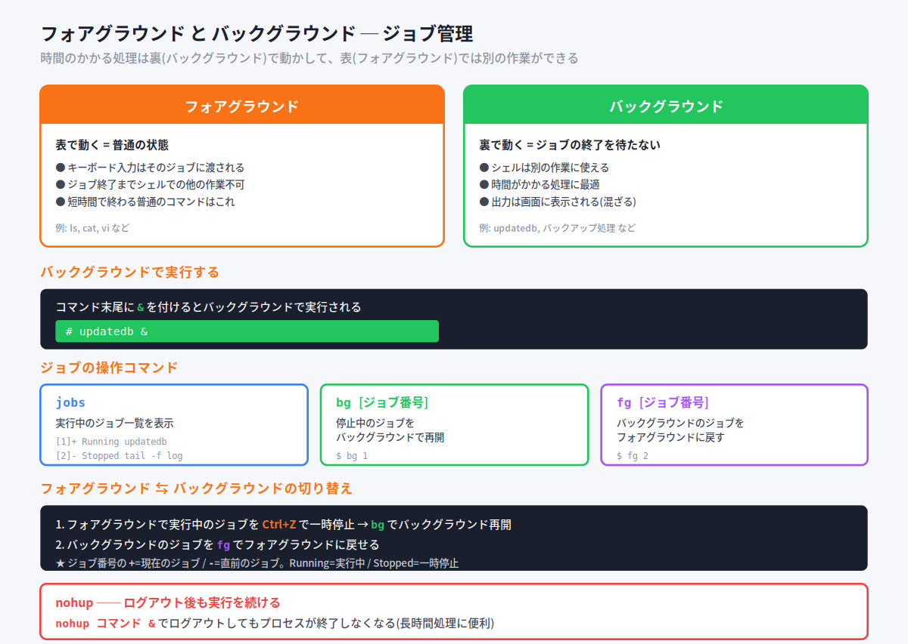

| 状態 | 説明 |
|---|---|
| **フォアグラウンド** | 表で動く。キーボード入力はそのジョブに渡され、終了までシェルでの他作業不可 |
| **バックグラウンド** | 裏で動く。シェルは別の作業に使える |

身近な例えで言うと：
- **フォアグラウンド** = 今やっている作業(画面の前にいる)
- **バックグラウンド** = 裏で勝手に進めてもらう作業(洗濯機を回しながら別のことをする)

#### バックグラウンドで実行する ─ &

コマンド末尾に **&** を付けると、バックグラウンドで実行されます。

```bash
# updatedb &           # updatedbをバックグラウンドで実行
[1] 12345              # → ジョブ番号と PID が表示される
```

#### ジョブの操作コマンド

##### jobs ─ ジョブ一覧

```bash
# jobs
[1]+ Running    updatedb
[2]  Stopped    tail -f /var/log/secure
[3]- Running    less /etc/xinetd.conf
```

`[ ]` 内の数値がジョブ番号です。

| 記号 | 意味 |
|---|---|
| `+` | 現在実行中のジョブ |
| `-` | 直前に実行されたジョブ |
| `Running` | バックグラウンドで実行中 |
| `Stopped` | 一時停止中 |

##### bg / fg ─ 状態を切り替える

| コマンド | 動作 |
|---|---|
| `bg [ジョブ番号]` | 停止中のジョブをバックグラウンドで再開 |
| `fg [ジョブ番号]` | バックグラウンドのジョブをフォアグラウンドに戻す |

#### フォアグラウンドからバックグラウンドへの流れ

すでにフォアグラウンドで動いているジョブをバックグラウンドにするには、次の2ステップです。

```bash
# tail -f /var/log/messages       # フォアグラウンドで実行中
（Ctrl+Z を押して一時停止）
[1]+ Stopped   tail -f /var/log/messages
# bg 1                            # バックグラウンドで再開
[1]+ tail -f /var/log/messages &
```

> 💡 **覚え方Hack**: Ctrl+Z で一時停止 → bg でバックグラウンド再開、というセット動作です。「&を付け忘れた!」というときの救済策にもなります。

#### nohup ─ ログアウトしても実行を続ける

通常、ログアウトすると **そのシェルから起動したプロセスは終了** します。ログアウト後も実行を続けたい場合は **nohup** を使います。

```
書式: nohup コマンド
```

```bash
# 長時間処理をログアウト後も続ける
# nohup updatedb &
```

> 💡 「**nohup** = **no hup**」つまり「HUPシグナル(ハングアップ=端末切断)を無視する」という意味。これでログアウトのHUPを受けても終了しません。長時間バッチに最適。

#### 📌 試験ポイント

| 問われ方 | 答え |
|---|---|
| バックグラウンドで実行するには? | コマンド末尾に **&** を付ける |
| ジョブ一覧を表示するコマンドは? | **jobs** |
| ジョブをフォアグラウンドに戻すコマンドは? | **fg** |
| ジョブをバックグラウンドで再開するコマンドは? | **bg** |
| フォアグラウンドのジョブを一時停止するキーは? | **Ctrl+Z** |
| ログアウト後も実行を続けるコマンドは? | **nohup** |
| jobsの `+` 記号の意味は? | **現在実行中のジョブ** |
| jobsの `Stopped` の意味は? | **実行を一時停止中** |

---

### 4.5.4 システムの状況把握

#### 状況確認の4つのコマンド

システムの状況を把握するには、用途に応じて以下のコマンドを使い分けます。

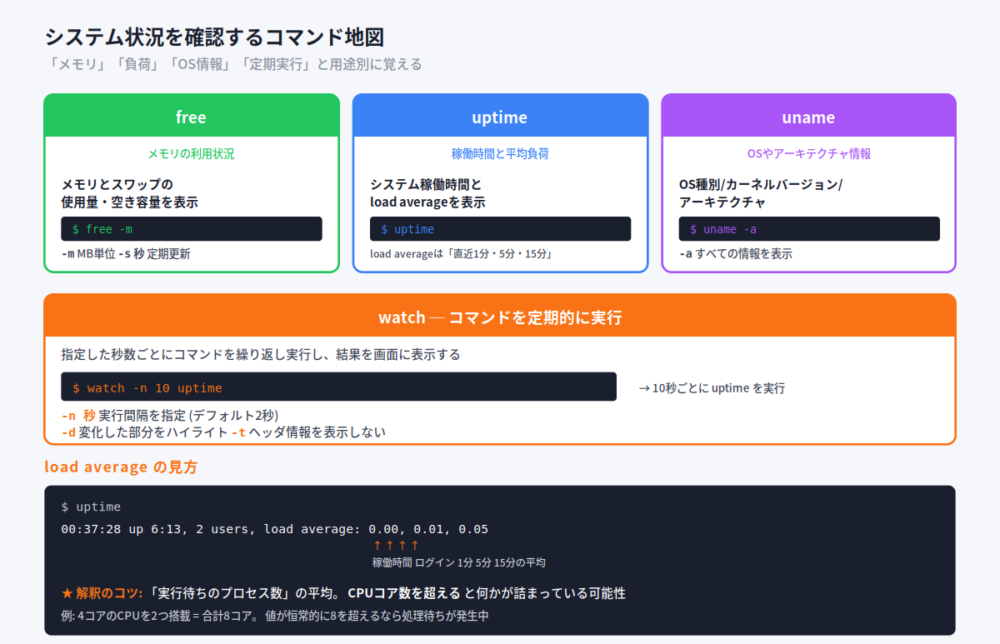

##### free ─ メモリの状況

メモリとスワップの使用量を確認します。

```
書式: free [オプション]
```

| オプション | 動作 |
|---|---|
| `-m` | MB単位で表示 |
| `-s 秒` | 指定間隔で繰り返し表示 |

```bash
$ free -m
              total  used   free   shared  buff/cache  available
Mem:            992    99    288        6         603         682
Swap:           819     0    819
```

> 💡 ディスク読み書きの性能を上げるため、空きメモリは **バッファキャッシュ** として活用されます。`free`の出力では `buff/cache` がそれにあたり、これを差し引いた `available` が実際の利用可能量です。

##### uptime ─ 稼働時間と負荷

システムの稼働時間と平均負荷を表示します。

```bash
$ uptime
 00:37:28 up 6:13, 2 users, load average: 0.00, 0.01, 0.05
```

**load average** は「実行待ちのプロセス数の平均」で、3つの数値はそれぞれ **直近1分・5分・15分** の平均です。

> ⚠ **判断の目安**: load average が **CPUのコア数を超える** と、何かが処理待ちになっている可能性があります。
> 例: 4コアCPU × 2基 = 合計8コアのサーバなら、値が8を恒常的に超えていれば負荷が高すぎる、と判断できます。

##### uname ─ システム情報

OSやアーキテクチャの情報を表示します。

```
書式: uname [オプション]
```

```bash
$ uname
Linux

$ uname -a
Linux centos7.example.com 3.10.0-862.el7.x86_64 #1 SMP Fri Apr 20 ...
```

| オプション | 動作 |
|---|---|
| `-a` | すべての情報を表示(all) |

> 💡 `uname -a` だけ覚えておけば、ホスト名・カーネルバージョン・アーキテクチャすべてが分かります。

##### watch ─ コマンドを定期的に実行

watch を使うと、コマンドを **指定した秒数ごとに繰り返し実行** できます。

```
書式: watch [オプション] コマンド
```

| オプション | 動作 |
|---|---|
| `-n 秒` | 実行間隔を指定(デフォルト2秒) |
| `-d` | 変化した部分をハイライト |
| `-t` | ヘッダ情報を表示しない |

```bash
$ watch -n 10 uptime    # 10秒ごとに uptime を実行
```

> 💡 watchは「状況を観察し続けたい」ときに便利。例えば `watch -n 1 free -m` でメモリ使用量を毎秒監視できます。

#### 📌 試験ポイント

| 問われ方 | 答え |
|---|---|
| メモリの使用状況を確認するコマンドは? | **free** |
| メモリをMB単位で表示するfreeオプションは? | **-m** |
| システムの稼働時間と負荷を表示するコマンドは? | **uptime** |
| load averageの3つの数字は何の平均? | **直近1分・5分・15分** |
| OS情報を表示するコマンドは? | **uname** |
| ホスト名・カーネルバージョンなど全部を表示するunameオプションは? | **-a** |
| コマンドを定期的に実行するコマンドは? | **watch** |
| watchのデフォルト実行間隔は? | **2秒** |

---

### 4.5.5 端末の活用

#### tmux ─ 1つの端末で複数のセッション

サーバ管理では、端末エミュレータでネットワーク経由のサーバ操作が一般的です。**tmux** や **screen** は、1つの端末で **複数のウィンドウや作業セッションを切り替えて使えるソフトウェア** です(ターミナルマルチプレクサ)。

身近な例えで言うと、tmuxは **1台のモニターに複数のデスクトップを持つ仮想画面** のようなものです。さらに「席を立ってもデスクトップはそのまま残り、戻ってきたら続きから作業できる」という機能(デタッチ/アタッチ)があります。

#### tmuxの構成

```
ターミナル
 └─ セッション
     └─ ウィンドウ
         └─ ペイン
```

| 単位 | 説明 |
|---|---|
| **セッション** | 作業全体の単位。複数持てる |
| **ウィンドウ** | セッション内の「タブ」のようなもの |
| **ペイン** | ウィンドウを分割した区画 |

#### プレフィックスキー

tmuxの操作は **プレフィックスキー** を押してから次のキーを押す形式です。デフォルトでは **Ctrl+B** がプレフィックスです。

#### ウィンドウ操作

| 操作 | キー |
|---|---|
| 新規ウィンドウを作成 | Ctrl+B → **c** (create) |
| ウィンドウ一覧を表示 | Ctrl+B → **w** (window list) |
| 番号で切り替え | Ctrl+B → **0-9** |
| 次のウィンドウへ | Ctrl+B → **n** (next) |
| 前のウィンドウへ | Ctrl+B → **p** (previous) |
| ウィンドウを削除 | Ctrl+B → **&** |

#### セッション操作 ─ デタッチとアタッチ

tmuxの最大の魅力は **デタッチ/アタッチ** です。作業状態を保ったままセッションから抜けて(デタッチ)、後で再接続(アタッチ)できます。

| 操作 | 方法 |
|---|---|
| デタッチ | Ctrl+B → **d** |
| セッション一覧 | `tmux ls` |
| アタッチ | `tmux attach` または `tmux attach -t 番号` |
| 新規セッション | `tmux new-session` |
| セッションを削除 | `tmux kill-session` |
| 全セッション削除 | `tmux kill-server` |

> 💡 **使い方の例**: 帰宅前に Ctrl+B → d でデタッチ。翌朝、別のPCから `ssh` でサーバに入り、`tmux attach` で前日の作業を続きから再開できます。長時間のビルドやデータ処理を「途中でも安全に席を離れられる」のが大きな利点です。

#### 📌 試験ポイント

| 問われ方 | 答え |
|---|---|
| ターミナルマルチプレクサのコマンドは? | **tmux** または **screen** |
| tmuxのプレフィックスキーは? | **Ctrl+B** |
| tmuxで新規ウィンドウを作るキーは? | Ctrl+B → **c** |
| 作業状態を保ったまま終了する操作は? | **デタッチ** (Ctrl+B → d) |
| デタッチしたセッションに再接続するコマンドは? | **tmux attach** |
| セッション一覧を表示するコマンドは? | **tmux ls** |

#### 📝 ここまでのまとめ

- プロセスは **PID/UID/PPID** で管理される。 PID=1 は init/systemd
- 観察コマンド: **ps**(スナップショット) / **top**(リアルタイム) / **pstree**(親子関係)
- 終了は **kill** + シグナル。重要シグナル: **HUP=1 / INT=2 / KILL=9 / TERM=15**
- プロセス名で操作: **killall / pkill / pgrep**
- ジョブ管理: **&** でBG、**jobs** で一覧、**bg/fg** で切り替え、**Ctrl+Z** で一時停止、**nohup** でログアウト後も継続
- 状況確認: **free**(メモリ) / **uptime**(負荷) / **uname**(OS情報) / **watch**(定期実行)
- 端末活用: **tmux** でセッション・デタッチ/アタッチ

---

## 4.6 プロセスの実行優先度

### ここで学ぶこと

- CPUは有限な資源で、たくさんのプロセスがその取り合いをしていること
- **ナイス値(nice値)** という「優先度の指標」の意味と範囲(-20〜19)
- これから起動するコマンドに優先度を付ける **nice**
- すでに動いているプロセスの優先度を変える **renice**
- 「優先度を上げる(高優先化)操作はrootだけ」という重要ルール

CPUは1つ(またはコア数分)しかないのに、サーバ上では何十・何百ものプロセスが「自分を動かしてほしい」と待っています。OSはこれらに少しずつ順番にCPUを割り当てていますが、その **割り当ての優先順位を人間が調整できる** 仕組みがナイス値です。

身近な例えで言うと、**スーパーのレジ待ちの行列** を思い浮かべてください。普通はみんな同じように並びますが、「お急ぎの方どうぞ」と前に通してもらえる人もいれば、「私は急がないので、お先にどうぞ」と後ろに譲る人もいます。ナイス値はこの **「譲り具合」** を数字で表したものです。

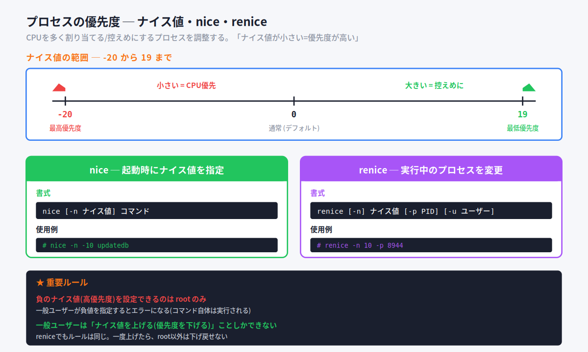

#### ナイス値の範囲と意味

ナイス値は **-20 から 19** までの整数で表され、**数字が小さいほど優先度が高い(CPUを多くもらえる)** という、少し直感に反するルールになっています。

| ナイス値 | 意味 |
|---|---|
| **-20** | 最高優先度(CPUを最優先でもらう) |
| **0** | 通常(デフォルト値) |
| **19** | 最低優先度(他に譲って控えめに動く) |

> 💡 **覚え方Hack ─ 「niceは親切さ」**
> nice = 英語で「親切な」。**親切な人ほど他人に順番を譲る** ので、自分は後回し=優先度が低くなります。つまり **ナイス値が大きい(=とても親切)ほど優先度は低い**。逆にナイス値が小さい(マイナス=不親切で図々しい)ほど、自分が先にCPUをもらう=優先度が高い、と覚えると数字の向きを間違えません。

> ⚠ **数字の向きが超頻出の引っかけポイント**。「ナイス値が大きいほど優先度が高い」は **誤り**。正しくは **小さいほど高優先**(-20が最強)です。

### 4.6.1 コマンド実行時 ─ nice

#### nice コマンド

**nice** は、**これからコマンドを起動するときに、あらかじめナイス値を指定する** コマンドです。「最初から控えめに動かしたい(または優先的に動かしたい)」ときに使います。

```
書式: nice -n ナイス値 コマンド
```

```bash
$ nice -n 10 updatedb          # updatedbをナイス値10(控えめ)で起動
$ nice updatedb                # -nを省略すると +10 が付く(デフォルト)
$ nice -n -5 important_job      # ナイス値-5(高優先)で起動 ※rootのみ
```

ポイントを整理します。

- **デフォルトのナイス値は0**。ただし `nice` を **値を指定せずに** コマンドに付けると、ナイス値 **+10** で起動します(0からの相対加算)
- `nice -n 値` で起動すると、そのプロセスは指定したナイス値で動き始めます
- **負の値(高優先化)を指定できるのはrootだけ**。一般ユーザーが負の値を指定するとエラーになります(コマンド自体は通常のナイス値で実行されることが多い)

> 💡 **nice単体で現在の値を確認**
> 引数を付けずに `nice` とだけ実行すると、現在のシェルのナイス値(通常は **0**)が表示されます。

> 💡 **`-n` の値は「相対的な加算」**
> `nice -n 5 コマンド` は、厳密には「現在のナイス値(通常0)に **5を足した値**」で起動するという意味です。普段はナイス値0から始めるので「5で起動」と考えてほぼ問題ありませんが、後述の `renice` が **絶対値で設定** するのとは仕組みが違う、という点だけ頭の片隅に置いておきましょう。

#### 📌 試験ポイント

| 問われ方 | 答え |
|---|---|
| コマンドを優先度付きで起動するコマンドは? | **nice** |
| niceでナイス値を指定するオプションは? | **-n** |
| ナイス値の範囲は? | **-20 〜 19** |
| ナイス値のデフォルトは? | **0** |
| 優先度が高いのはナイス値が大きい方?小さい方? | **小さい方**(-20が最高優先) |
| `nice` を値なしでコマンドに付けると? | ナイス値 **+10** で起動 |
| 負のナイス値を指定できるのは? | **rootのみ** |

### 4.6.2 実行中プロセス ─ renice

#### renice コマンド

**renice** は、**すでに動いているプロセス** のナイス値をあとから変更するコマンドです。「`re`(再び)+ `nice`」で「ナイス値を付け直す」と読めます。

```
書式: renice -n ナイス値 -p PID
      renice -n ナイス値 -u ユーザー名
      renice -n ナイス値 -g グループ名
```

```bash
$ renice -n 10 -p 8944         # PID 8944 のプロセスをナイス値10に変更
$ renice -n 5 -u lpic          # ユーザーlpicの全プロセスをナイス値5に
$ renice -n -10 -p 8944        # ナイス値-10(高優先)に変更 ※rootのみ
```

| オプション | 指定対象 |
|---|---|
| **-p PID** | プロセスID(デフォルトの指定方法。`-p`は省略可) |
| **-u ユーザー名** | そのユーザーの全プロセス |
| **-g グループ名** | そのグループの全プロセス |

> 💡 **niceとreniceの値の違い**
> `nice -n 値` は「今の値に **足す**(相対)」のに対し、`renice -n 値` は「ナイス値を **その値そのものに設定する**(絶対値)」という違いがあります。例えば `renice -n 10 -p 8944` は、元の値が何であれPID 8944 のナイス値を **きっかり10にする** という意味です。

#### ★最重要ルール ─ 上げるのは誰でも、下げるのはrootだけ

ナイス値の変更には、試験で必ず問われる重要な制限があります。

- **一般ユーザーは「ナイス値を上げる(=優先度を下げる)」ことしかできない**
- **ナイス値を下げる(=優先度を上げる/高優先化する)操作は、rootだけが可能**
- 一般ユーザーは **一度上げたナイス値を、元に戻すこともできない**(下げる=高優先化に当たるため)

つまり、一般ユーザーは「自分のプロセスを控えめにする(他に譲る)」のは自由ですが、「自分のプロセスをもっと優先させる(横入りさせる)」ことはできません。これは、一般ユーザーが好き勝手に高優先化してサーバ全体を独占しないための仕組みです。

> 💡 **覚え方Hack ─ 「譲るのは自由、横入りはrootだけ」**
> 行列で「お先にどうぞ」と後ろに下がる(ナイス値を上げる=優先度を下げる)のは誰でもできます。でも「ちょっと前に入れて」と割り込む(ナイス値を下げる=高優先化)には、特別な許可=root権限が要る、と覚えましょう。

> 💡 **topからもreniceできる**
> 実行中の `top` の画面で **r** キーを押すと、対象PIDとナイス値を入力して、その場でreniceと同じ変更ができます(「renice」のr)。

#### 📌 試験ポイント

| 問われ方 | 答え |
|---|---|
| 実行中プロセスのナイス値を変更するコマンドは? | **renice** |
| PIDを指定するオプションは? | **-p** |
| ユーザー単位で指定するオプションは? | **-u** |
| グループ単位で指定するオプションは? | **-g** |
| 一般ユーザーができるのは値を上げる/下げる? | **上げる**(=優先度を下げる)のみ |
| ナイス値を下げて高優先化できるのは? | **rootのみ** |
| 一般ユーザーは上げたナイス値を元に戻せる? | **戻せない**(下げる操作=root権限が必要) |
| topの画面でreniceするキーは? | **r** |

#### 📝 ここまでのまとめ

- **ナイス値** はプロセスのCPU優先度を表す指標。範囲は **-20〜19**、**小さいほど高優先**、デフォルトは **0**
- **nice -n 値 コマンド** = これから起動するコマンドにナイス値を指定
- **renice -n 値 -p PID** = 実行中プロセスのナイス値を変更(`-u`ユーザー単位、`-g`グループ単位も可)
- niceは「今の値に足す(相対)」、reniceは「その値に設定(絶対値)」
- **負のナイス値(高優先化)を扱えるのはrootだけ**。一般ユーザーは優先度を下げる(値を上げる)ことしかできず、戻すこともできない

---

## 📝 全体まとめ ─ ここまでの学習内容

このセクションを終えた時点で、次のことができるようになっているはずです：

1. **3種類の圧縮コマンド**（gzip < bzip2 < xz、後ろほど高圧縮・低速）を区別できる
2. **解凍コマンド**（gunzip / bunzip2 / unxz）と、解凍せず閲覧する **zcat / bzcat / xzcat** を区別できる
3. **tar** の3兄弟（**c**=作成 / **x**=展開 / **t**=一覧）と、**f**（ファイル指定）が必須だと分かる
4. tarの圧縮オプション（**z**=gzip / **j**=bzip2 / **J**=xz）を区別できる
5. **cpio** と **dd**（デバイスを丸ごとコピー）の用途を説明できる
6. ファイルには **所有者(ユーザー)・グループ** という持ち主があると分かる
7. アクセス権が **所有者(u)・グループ(g)・その他(o)** の3者 × **読み(r)・書き(w)・実行(x)** の3種類で決まると分かる
8. **421ルール**（r=4, w=2, x=1）で記号と数値を相互変換できる
9. `ls -l` の **先頭10文字**（ファイル種別＋rwx×3）の構造を読める
10. **chmod** を記号(u+x など)と数値(755 など)の両方で使える
11. **SUID(4000) / SGID(2000) / スティッキービット(1000)** の意味と数値を答えられる
12. **/tmp** がスティッキービットの代表例で、他人のファイルを消せない仕組みだと分かる
13. **umask** が「引き算で初期権限を決める」仕組みだと説明できる（ファイル666・ディレクトリ777が起点）
14. 所有者を変える **chown**、グループを変える **chgrp**、`chown user:group` の書き方が分かる
15. **iノード** の仕組みと、**ハードリンク**（同じ実体を指す分身）の特徴・制限を説明できる
16. **シンボリックリンク**（パスを指すショートカット）との違いを説明できる
17. リンク作成の **ln**（ハードリンク）/ **ln -s**（シンボリックリンク）を区別できる
18. プロセスが **PID / UID / PPID** で管理され、**PID=1 が init/systemd** だと分かる
19. プロセス観察の **ps（一瞬）/ top（リアルタイム）/ pstree（親子関係）** を区別できる
20. **kill** がシグナルを送るコマンドで、主要シグナル（**HUP=1 / INT=2 / KILL=9 / TERM=15**）を覚えている
21. **9(KILL)と15(TERM)の違い**（強制終了 vs 正常終了・デフォルト）を説明できる
22. プロセス名で操作する **killall / pkill / pgrep** を区別できる
23. **ジョブ管理**（`&` でBG、jobs、bg/fg、Ctrl+Z、nohup）を説明できる
24. 状況確認の **free / uptime / uname / watch** と、端末活用の **tmux** が分かる
25. **ナイス値**（-20〜19、小さいほど高優先、デフォルト0）と **nice / renice** を区別でき、**高優先化はrootのみ** だと分かる

第4章はコマンドも数値も多いですが、「記号⇄数値の変換」「シグナル番号」「ナイス値の向き」を固めれば、LPIC-1の得点源になります。

---

## 事前チェックリスト

研修当日の朝、これに自信を持って「✓」を付けられる状態が理想です。
分からない項目があれば、該当セクションに戻って読み直してください。

### 基本的なファイル管理（4.1）

- [ ] 圧縮率の大小（gzip < bzip2 < xz）を言える
- [ ] 圧縮コマンド（gzip / bzip2 / xz）を区別できる
- [ ] 解凍コマンド（gunzip / bunzip2 / unxz）が分かる
- [ ] `-d` オプションで解凍できると分かる
- [ ] 解凍せず中身を見る zcat / bzcat / xzcat が分かる
- [ ] zless / zmore / zgrep の「z付き」の意味が分かる
- [ ] アーカイブと圧縮の違いを説明できる
- [ ] tar の **c / x / t** の役割を区別できる
- [ ] tar の **f** がアーカイブファイル指定で必須だと分かる
- [ ] tar の **z（gzip）/ j（bzip2）/ J（xz）** を区別できる
- [ ] `tar czf a.tar.gz dir` / `tar xzf a.tar.gz` / `tar tzf a.tar.gz` が読める
- [ ] **v**（経過表示）オプションが分かる
- [ ] cpio がもう一つのアーカイブ方式だと分かる
- [ ] dd がデバイスを丸ごとコピーする（if= / of= / bs=）と分かる

### パーミッションの設定（4.2）

- [ ] ファイルに所有者(ユーザー)とグループがあると分かる
- [ ] アクセス権が **u / g / o** の3者に対して設定されると分かる
- [ ] **r（読み）/ w（書き）/ x（実行）** の3種類を区別できる
- [ ] ディレクトリに対する r / w / x の意味の違いが分かる
- [ ] `ls -l` の先頭文字（- / d / l など）でファイル種別を読める
- [ ] rwxの並び（所有者→グループ→その他）の順番が分かる
- [ ] **421ルール**（r=4, w=2, x=1）で記号⇄数値を変換できる
- [ ] 755 / 644 / 700 などのよく使う数値の意味が分かる
- [ ] chmod を記号（u+x, go-w, a=r など）で使える
- [ ] chmod を数値（chmod 755 file）で使える
- [ ] chmod の **-R**（再帰）が分かる
- [ ] **SUID（4000）** の意味（実行時に所有者の権限になる）が分かる
- [ ] **SGID（2000）** の意味が分かる
- [ ] **スティッキービット（1000）** の意味が分かる
- [ ] **/tmp** がスティッキービットの代表例だと分かる
- [ ] 特殊権限を数値で付ける（chmod 4755 など）方法が分かる
- [ ] SUIDが付くと実行権の位置が **s** で表示されると分かる
- [ ] **umask** が初期権限を「引き算」で決めると分かる
- [ ] ファイルの起点は **666**、ディレクトリは **777** だと分かる
- [ ] umask 022 のとき、ファイルが644・ディレクトリが755になると分かる

### ファイルの所有者管理（4.3）

- [ ] 所有者を変えるコマンドが **chown** だと分かる
- [ ] グループを変えるコマンドが **chgrp** だと分かる
- [ ] `chown user:group file` で所有者とグループを同時に変えられると分かる
- [ ] chown / chgrp の **-R**（再帰）が分かる
- [ ] 所有者の変更は基本 **root** が行うと分かる

### ハードリンクとシンボリックリンク（4.4）

- [ ] **iノード** がファイルの実体を管理する仕組みだと分かる
- [ ] **ハードリンク** が同じiノードを指す「分身」だと分かる
- [ ] ハードリンクは元を消しても実体が残ると分かる
- [ ] ハードリンクは **同じファイルシステム内** でしか作れないと分かる
- [ ] ハードリンクは **ディレクトリには作れない** と分かる
- [ ] **シンボリックリンク** がパスを指す「ショートカット」だと分かる
- [ ] シンボリックリンクは別ファイルシステム・ディレクトリにも作れると分かる
- [ ] リンク元を消すとシンボリックリンクは無効（リンク切れ）になると分かる
- [ ] **ln**（ハードリンク）と **ln -s**（シンボリックリンク）を区別できる
- [ ] `ls -l` でシンボリックリンクが `l` と `->` で表示されると分かる

### プロセス管理（4.5）

- [ ] プロセスが **PID / UID / PPID** を持つと分かる
- [ ] **PID=1** が init / systemd だと分かる
- [ ] **ps**（スナップショット）の代表オプション（aux / ef）が分かる
- [ ] **top**（リアルタイム監視）が分かる
- [ ] **pstree**（親子関係をツリー表示）が分かる
- [ ] **kill** がシグナルを送るコマンドだと分かる
- [ ] killのデフォルトが **TERM(15)** だと分かる
- [ ] 主要シグナル **HUP=1 / INT=2 / KILL=9 / TERM=15** を覚えている
- [ ] **9(KILL)と15(TERM)の違い** を説明できる
- [ ] **kill -l** でシグナル一覧が見られると分かる
- [ ] プロセス名で操作する **killall / pkill / pgrep** を区別できる
- [ ] **pgrep** はPIDを返すだけ（終了しない）と分かる
- [ ] ジョブとプロセスの違いが分かる
- [ ] **&** でバックグラウンド実行になると分かる
- [ ] **jobs / bg / fg** の役割を区別できる
- [ ] **Ctrl+Z** で一時停止（停止状態）になると分かる
- [ ] **nohup** でログアウト後も実行を続けられると分かる
- [ ] **free（メモリ）/ uptime（負荷）/ uname（OS情報）/ watch（定期実行）** を区別できる
- [ ] **tmux** のデタッチ（Ctrl+B→d）/ アタッチ（tmux attach）が分かる

### プロセスの実行優先度（4.6）

- [ ] **ナイス値** がCPU優先度の指標だと分かる
- [ ] ナイス値の範囲が **-20〜19** だと言える
- [ ] **小さいほど高優先**（-20が最高）だと分かる
- [ ] デフォルトのナイス値が **0** だと分かる
- [ ] **nice -n 値 コマンド** で起動時に優先度を指定できると分かる
- [ ] **renice -n 値 -p PID** で実行中プロセスを変更できると分かる
- [ ] renice の **-u（ユーザー）/ -g（グループ）** が分かる
- [ ] **負のナイス値（高優先化）はrootのみ** だと分かる
- [ ] 一般ユーザーは優先度を下げる（値を上げる）ことしかできないと分かる

### コマンド総まとめ（暗記）

これらのコマンドを「見ただけで何をするか」答えられるようになっていれば理想です：

| コマンド | これは何? |
|---|---|
| `gzip file` / `gunzip file.gz` | |
| `bzip2 file` / `bunzip2 file.bz2` | |
| `xz file` / `unxz file.xz` | |
| `zcat file.gz` | |
| `tar czf a.tar.gz dir` | |
| `tar xzf a.tar.gz` | |
| `tar tzf a.tar.gz` | |
| `tar xjf a.tar.bz2` | |
| `tar xJf a.tar.xz` | |
| `dd if=/dev/sda of=disk.img` | |
| `ls -l` | |
| `chmod 755 file` | |
| `chmod u+x file` | |
| `chmod -R 644 dir` | |
| `chmod 4755 file` | |
| `umask` / `umask 022` | |
| `chown user file` | |
| `chown user:group file` | |
| `chgrp group file` | |
| `chown -R user dir` | |
| `ln file link` | |
| `ln -s file link` | |
| `ps aux` / `ps -ef` | |
| `top` | |
| `pstree` | |
| `kill 1234` | |
| `kill -9 1234` | |
| `kill -HUP 1234` | |
| `kill -l` | |
| `killall vim` | |
| `pkill -u lpic vim` | |
| `pgrep vim` | |
| `cmd &` | |
| `jobs` | |
| `fg %1` / `bg %1` | |
| `nohup cmd &` | |
| `free -h` | |
| `uptime` | |
| `uname -a` | |
| `watch -n 1 cmd` | |
| `nice -n 10 cmd` | |
| `renice -n 10 -p 1234` | |

### 重要な記号・数値総まとめ（暗記）

数字の暗記は第4章の得点に直結します。即答できるようにしておきましょう：

| 記号・数値 | これは何? |
|---|---|
| `r` = ? / `w` = ? / `x` = ? | |
| `4` / `2` / `1` の足し算 | |
| `7` / `6` / `5` / `4` / `0`（数値→rwx） | |
| `644` / `755` / `700` / `777` | |
| `SUID` の数値 | |
| `SGID` の数値 | |
| `スティッキービット` の数値 | |
| `4755` / `2755` / `1777` | |
| ファイルの起点 `666` / ディレクトリの起点 `777` | |
| `umask 022` の結果 | |
| `s`（実行権位置の表示） | |
| `HUP` の番号 | |
| `INT` の番号 | |
| `KILL` の番号 | |
| `TERM` の番号 | |
| `CONT` / `STOP` の番号 | |
| ナイス値の範囲（最小〜最大） | |
| ナイス値のデフォルト | |
| `Ctrl+Z`（ジョブ） | |
| `Ctrl+B → d`（tmux） | |

### ファイル・パス総まとめ（暗記）

| パス | これは何? |
|---|---|
| `/tmp` | |
| `/etc/passwd` | |
| `/dev/sda` | |
| `/dev/null` | |
| `/usr/bin/passwd`（SUIDの例） | |

### 用語総まとめ（暗記）

これらの用語を「自分の言葉で説明できる」状態が目標：

- [ ] 圧縮 / アーカイブ
- [ ] gzip / bzip2 / xz
- [ ] tar / cpio / dd
- [ ] 所有者（ユーザー）/ グループ / その他
- [ ] アクセス権（パーミッション）
- [ ] 読み取り(r) / 書き込み(w) / 実行(x)
- [ ] 421ルール
- [ ] 記号表記 / 数値表記
- [ ] chmod / 再帰(-R)
- [ ] SUID / SGID
- [ ] スティッキービット
- [ ] umask
- [ ] chown / chgrp
- [ ] iノード
- [ ] ハードリンク / シンボリックリンク
- [ ] リンク切れ
- [ ] ln / ln -s
- [ ] プロセス / PID / UID / PPID
- [ ] init / systemd
- [ ] 親プロセス / 子プロセス
- [ ] ps / top / pstree
- [ ] シグナル
- [ ] HUP / INT / KILL / TERM / CONT / STOP
- [ ] kill / killall / pkill / pgrep
- [ ] ジョブ
- [ ] フォアグラウンド / バックグラウンド
- [ ] jobs / fg / bg
- [ ] nohup
- [ ] free / uptime / uname / watch
- [ ] ターミナルマルチプレクサ / tmux
- [ ] デタッチ / アタッチ
- [ ] ナイス値
- [ ] nice / renice

---

## 研修当日に向けて

事前学習がきちんとできていれば、研修当日は以下の流れで進みます：

1. **おさらい**（このチェックリストの中から数問）
2. **Hackの説明**（覚え方のコツ、暗記時間）
3. **テスト**（実際の試験問題を含む）
4. **答え合わせ・おさらい**

第4章は「記号と数値の変換」「シグナル番号」「ナイス値の向き」など、暗記が点数に直結するテーマが多い章です。でも安心してください。どれも **理屈とセットで覚えれば丸暗記より速く・確実に定着** します。「rwxは4・2・1の足し算」「nice値は親切な人ほど後回し」のように、この資料に散りばめたHack(覚え方のコツ)を手がかりに読み進めてください。

研修当日にいきなり知らない言葉や数字が並ぶと焦ってしまうものです。事前にこの資料で予備知識を入れておけば、当日は **「あ、これ事前学習で見た」** という安心感を持ちながら進められます。
分からない部分があっても**慌てる必要はありません**。一度通読してから、チェックリストで自分のウィークポイントを把握しておけば、研修で確実に固められます。

頑張ってください。
