# 第5章：デバイスとLinuxファイルシステム

> **この資料について**
> これは研修当日のための **予備知識** をまとめた資料です。
> 研修当日は **おさらい → 暗記のコツの説明 → テスト → 答え合わせ** という流れで進むため、当日「初めて聞く話」が出てこないように、ここで必要な前提をひと通り押さえておきます。
>
> Linuxを触ったことがなくても理解できるよう、できるだけ身近な例で書いています。
>
> **前提**
> この資料は **第1章(システムアーキテクチャ)・第2章(インストールとパッケージ管理)・第3章(GNUとUNIXコマンド)・第4章(ファイルとプロセスの管理)の知識があること** を前提に書いています。とくに第4章で学んだ **iノード・パーミッション・ハードリンク/シンボリックリンク** は本章でも再登場します。あやしい場合は先にそちらを確認してください。
>
> **この章の重要度について**
> 第5章は、LPIC-1の試験範囲「トピック104(デバイス、Linuxファイルシステム、ファイルシステム階層標準)」に対応する重要章です。「パーティションの種類」「ファイルシステムの作成コマンド」「マウントと/etc/fstab」「FHSのディレクトリの役割」「ファイル検索コマンドの使い分け」は試験で確実に複数問出題されます。デバイスファイル名(/dev/sdaなど)、特殊権限ならぬ各コマンドのオプション、/etc/fstabの6項目などは丸暗記レベルで覚える必要があります。
>
> **読み方の指針**
> 1. まずは1回ざっと通読してください(細かい暗記は不要)
> 2. 各セクションの「📌 試験ポイント」と「📝 ここまでのまとめ」を見直してください
> 3. 巻末の「事前チェックリスト」で自分の理解度を測ってください
> 4. 研修当日は、このチェックリストのおさらいから始まります

---

<!-- ## 目次

- [5.1 パーティションとファイルシステムの作成](#51-パーティションとファイルシステムの作成)
  - [5.1.1 ハードディスク](#511-ハードディスク)
  - [5.1.2 パーティションの種類](#512-パーティションの種類)
  - [5.1.3 ルートファイルシステム](#513-ルートファイルシステム)
  - [5.1.4 パーティション管理コマンド](#514-パーティション管理コマンド)
  - [5.1.5 ファイルシステムの作成](#515-ファイルシステムの作成)
- [5.2 ファイルシステムの管理](#52-ファイルシステムの管理)
  - [5.2.1 ディスクの利用状況の確認](#521-ディスクの利用状況の確認)
  - [5.2.2 ファイルシステムのチェック](#522-ファイルシステムのチェック)
  - [5.2.3 ファイルシステムの管理](#523-ファイルシステムの管理)
  - [5.2.4 XFS](#524-xfs)
- [5.3 ファイルシステムのマウントとアンマウント](#53-ファイルシステムのマウントとアンマウント)
  - [5.3.1 マウントの仕組み](#531-マウントの仕組み)
  - [5.3.2 /etc/fstabファイル](#532-etcfstabファイル)
  - [5.3.3 マウントとアンマウント](#533-マウントとアンマウント)
- [5.4 ファイルの配置と検索](#54-ファイルの配置と検索)
  - [5.4.1 FHS](#541-fhs)
  - [5.4.2 ファイルの検索](#542-ファイルの検索)
- [事前チェックリスト](#事前チェックリスト) -->

---

## 5.1 パーティションとファイルシステムの作成

### ここで学ぶこと

- ディスク(ハードディスクやSSD)をLinuxがどう扱うか
- ディスクを区切る **パーティション** と、その種類(基本・拡張・論理)
- ディスク上のデータをファイルとして扱う **ファイルシステム** という仕組み
- 新しいディスクを使えるようにするまでの **3ステップ**(パーティション作成 → ファイルシステム作成 → マウント)

新品のディスクは、買ってきたままでは使えません。Linuxで使えるようにするには、おおまかに次の3ステップを踏みます。

1. ディスクを区画に区切る(**パーティションの作成**)
2. その区画に「ファイルとして管理する仕組み」を入れる(**ファイルシステムの作成**)
3. その仕組みをディレクトリツリーにつなげる(**マウント**)

身近な例えで言うと、**引っ越したばかりの何もない部屋(=ディスク)** を考えてください。まず部屋を仕切り壁で区切って「寝室」「書斎」などの区画(=パーティション)を作り、次に各部屋に「本棚や引き出し」(=ファイルシステム)を設置して物を整理できるようにし、最後に玄関からその部屋へ通じる「扉」(=マウント)をつけて、はじめて生活できるようになります。この章は、その一連の作業を扱います。

### 5.1.1 ハードディスク

#### ディスクの接続規格

ハードディスクやSSDをコンピュータにつなぐ規格には、いくつかの種類があります。試験では「名前と特徴」を区別できれば十分です。

| 規格 | 特徴 |
|---|---|
| **SATA** (Serial ATA) | 現在主流。かつてのIDEより高速で、ほとんどのPCに搭載 |
| **SAS** (Serial Attached SCSI) | SATAより高速・高信頼。主にサーバ用途。高価 |
| **SCSI** | ディスク・DVD・テープなど多様な周辺機器を接続する規格。高速・拡張性が高い。専用のホストアダプタ(SCSIカード)が必要 |
| **USB** | ポピュラーな接続規格。外付けで手軽に使える |

#### デバイスファイル ─ ディスクを「ファイル」として扱う

Linuxの大きな特徴のひとつが、**デバイス(ハードウェア)をファイルとして扱う** という考え方です。ハードディスクやDVDドライブ、シリアルポートといったデバイスには、それぞれ対応する **デバイスファイル** が `/dev` ディレクトリ以下に用意されています。

デバイスファイルとは、デバイスの入出力を扱うための **特殊なファイル** です。普通のファイルと同じように読み書きでき、デバイスファイルへ **書き込む** とデバイスへの **出力** に、デバイスファイルを **読み込む** とデバイスからの **入力** になります。「ディスクもキーボードもファイル」という統一的な見方ができるのがLinux(UNIX)の思想です。

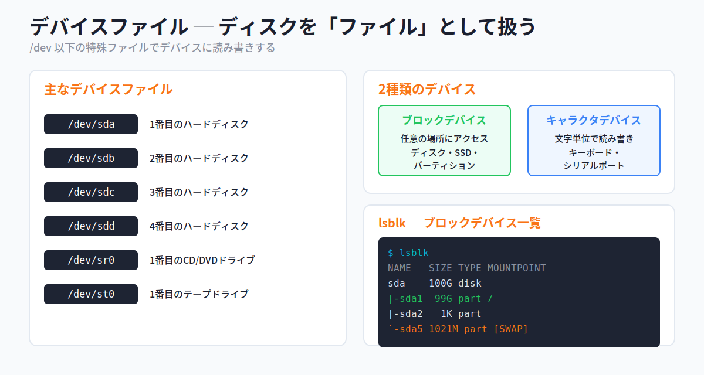

主なデバイスファイルは丸暗記しておきましょう。とくにハードディスクの `/dev/sda`, `/dev/sdb`, ... の並びは頻出です。

| デバイスファイル | 説明 |
|---|---|
| **/dev/sda** | 1番目のハードディスク |
| **/dev/sdb** | 2番目のハードディスク |
| **/dev/sdc** | 3番目のハードディスク |
| **/dev/sdd** | 4番目のハードディスク |
| **/dev/sr0** | 1番目のCD/DVDドライブ |
| **/dev/st0** | 1番目のテープドライブ |

> 💡 **覚え方Hack ─ 「sd + a, b, c...」**
> ハードディスク(やSSD)は `sd`(SCSI Disk由来)に、見つかった順で `a, b, c, d` のアルファベットが付きます。1台目が `a`、2台目が `b`。後で出てくる **パーティション番号(sda1, sda2...)** と混同しないように、「アルファベット=ディスクそのもの」「数字=その中の区画」と整理しておきましょう。

#### ブロックデバイスとキャラクタデバイス

Linuxが扱うデバイスは、データの読み書きの仕方によって2種類に分かれます。

- **ブロックデバイス**: メディア上の **任意の場所** にまとめて(ブロック単位で)アクセスできるデバイス。ハードディスク・SSD・パーティションなど
- **キャラクタデバイス**: **文字単位** で順番にデータを読み書きするデバイス。キーボード・シリアルポートなど

ここでは「**ディスクやパーティションはブロックデバイス**」と知っていれば十分です。

#### lsblk ─ ブロックデバイスの一覧

システムにあるブロックデバイス(ディスクやパーティション)の一覧は、**lsblk** コマンドで確認できます。ディスクの下にパーティションがぶら下がる、親子関係のツリーで表示されます。

```bash
$ lsblk
NAME   MAJ:MIN RM  SIZE RO TYPE MOUNTPOINT
sr0     11:0    1 1024M  0 rom
sda    253:0    0  100G  0 disk
|-sda1 253:1    0   99G  0 part /
|-sda2 253:2    0    1K  0 part
`-sda5 253:5    0 1021M  0 part [SWAP]
```

#### 📌 試験ポイント

| 問われ方 | 答え |
|---|---|
| 1番目のハードディスクのデバイスファイルは? | **/dev/sda** |
| 2番目・3番目のハードディスクは? | **/dev/sdb** / **/dev/sdc** |
| 1番目のCD/DVDドライブは? | **/dev/sr0** |
| 現在主流のディスク接続規格は? | **SATA** |
| ディスクやパーティションはどちらのデバイス? | **ブロックデバイス** |
| 文字単位で読み書きするデバイスは? | **キャラクタデバイス** |
| ブロックデバイス一覧を表示するコマンドは? | **lsblk** |

### 5.1.2 パーティションの種類

#### 1台のディスクを複数の区画に分ける

1台のディスクは、複数の論理的な区画 = **パーティション** に分割して使えます。各パーティションには **異なるファイルシステムを作成** できます。BIOS(MBR)ベースのシステムでは、パーティションには3つの種類があります。

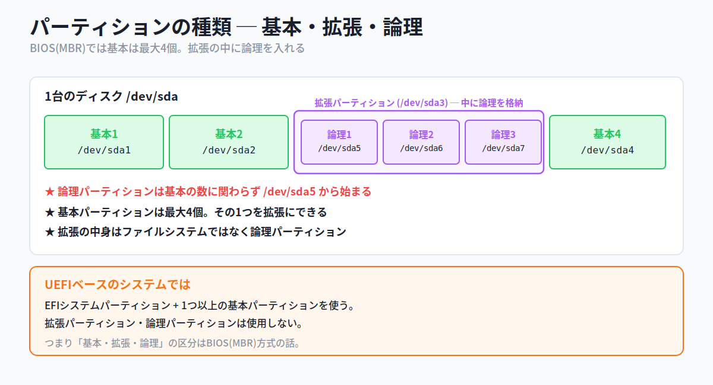

- **基本パーティション**: ディスクに **最大4個** 作成できる。中にファイルシステムを格納する。`/dev/sda` なら `/dev/sda1`〜`/dev/sda4`
- **拡張パーティション**: 基本パーティションのうち **1つを拡張パーティションにできる**。中にはファイルシステムではなく **論理パーティション** を格納する
- **論理パーティション**: 拡張パーティションの中に作るパーティション。デバイスファイル名は、**作成済み基本パーティションの数に関わらず `/dev/sda5` 以降** になる

> ⚠ **論理パーティションは必ず /dev/sda5 から** という点が超頻出。基本パーティションが1個しかなくても、論理パーティションの1つ目は `sda5` です(`sda2`〜`sda4` は基本/拡張用に予約)。

#### MBRとUEFI(GPT)の違い

上の「基本・拡張・論理」という区分は、従来の **BIOS(MBR)方式** の話です。新しい **UEFI** ベースのシステムでは事情が異なり、**EFIシステムパーティション** と **1つ以上の基本パーティション** を使い、拡張パーティション・論理パーティションは使用しません。MBRとGPTの詳しい違いは、後述の5.1.4(gdiskコマンド)で扱います。

#### パーティションに分けるメリット

なぜわざわざ分けるのでしょうか。最大の理由は **耐障害性と被害の局所化** です。

- 障害でファイルシステムの一部が壊れても、被害を **1つのパーティション内に限定** できる
- 大量のログなどで空き容量が不足しても、被害を局所化し、**システム全体への影響を小さく** できる

#### 📌 試験ポイント

| 問われ方 | 答え |
|---|---|
| 基本パーティションは最大何個作れる? | **4個** |
| 基本パーティションの1つを何にできる? | **拡張パーティション** |
| 拡張パーティションの中に格納するのは? | **論理パーティション** |
| 論理パーティションのデバイス名は何番から? | **/dev/sda5 以降** |
| UEFIで使うのは? | **EFIシステムパーティション + 基本パーティション** |
| パーティションに分けるメリットは? | **障害の被害を局所化できる**(耐障害性・保守性) |

### 5.1.3 ルートファイルシステム

#### ツリーの頂点は「/」

Linuxのディレクトリは **ツリー状の階層構造** になっており、その頂点が **`/`(ルート)ディレクトリ** です。この `/` ディレクトリを含むファイルシステムを **ルートファイルシステム** といいます。

`/` の直下には `/home` や `/var` などが配置されます。これらを全部ルートファイルシステムに入れてもよいのですが、実際には **複数のパーティションを用意し、各パーティションに `/home`, `/var` などを割り当てる** のが一般的です。これは耐障害性・保守性を高めるためです。

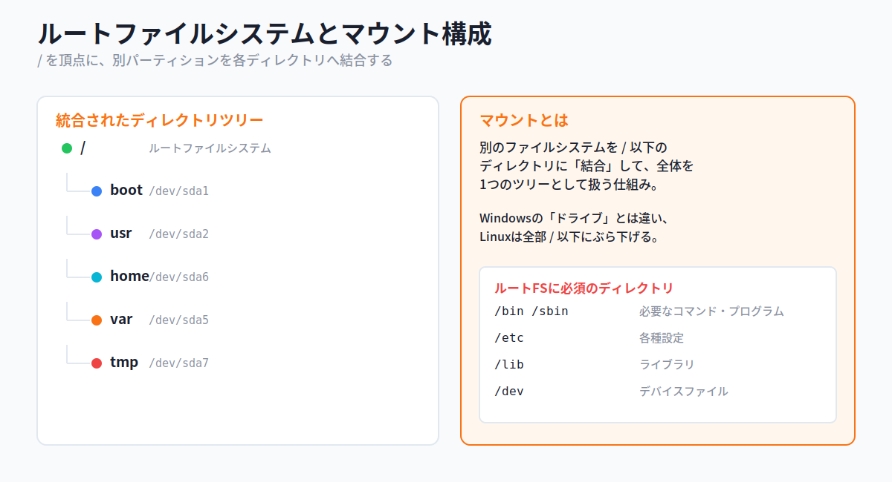

#### マウント ─ Windowsの「ドライブ」との違い

別々のパーティションに分けても、利用するときは **`/` 以下に結合され、1つの統合されたファイルシステム** として扱えます。この「結合」が **マウント** です。

Windowsには `C:` `D:` のような **ドライブ** という概念がありますが、Linuxにはありません。Linuxでは **すべてのパーティションや外部メディアを `/` 以下のディレクトリツリーに結合** して使います。USBメモリもDVDも、`/media/usb` のような「ツリー上の場所」としてアクセスするのです。

#### ルートファイルシステムに必須のディレクトリ

システムの起動には、最低限のコマンドやファイルがすぐ使える必要があります。そのため、次のディレクトリは **ルートファイルシステムに含まれていなければなりません**(別パーティションに分けてはいけない)。

| ディレクトリ | 内容 |
|---|---|
| **/bin, /sbin** | システムに必要なコマンド・プログラム |
| **/etc** | 各種設定 |
| **/lib** | ライブラリ |
| **/dev** | デバイスファイル |

> 💡 たとえばファイルシステムをマウントする `mount` コマンドは `/sbin`(正確には `/bin` や `/usr/bin` のことも)に置かれています。マウント前から使える場所になければ、そもそも他のパーティションをマウントできません。だから起動に必要なものはルートFSに入っているのです。

#### 📌 試験ポイント

| 問われ方 | 答え |
|---|---|
| ディレクトリツリーの頂点は? | **/(ルート)ディレクトリ** |
| / を含むファイルシステムを何という? | **ルートファイルシステム** |
| パーティションを / 以下に結合することを何という? | **マウント** |
| ルートFSに必須のディレクトリは? | **/bin, /sbin, /etc, /dev, /lib** |
| Linuxにドライブ(C:等)の概念はある? | **ない**(全て / 以下に結合する) |

### 5.1.4 パーティション管理コマンド

#### 3つの管理コマンド ─ fdisk / gdisk / parted

パーティションを作成・削除・変更するコマンドは3つあります。操作を誤るとディスクのデータを壊すこともあるので、慣れるまでは注意が必要です。

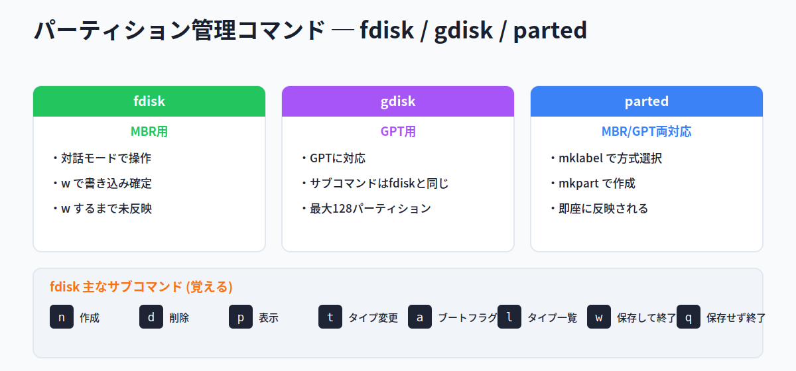

#### fdiskコマンド ─ MBR用

**fdisk** はパーティションの作成・削除・変更・情報表示を行う、もっとも代表的なコマンドです。

```
書式: fdisk [-l] デバイス名
```

`-l` を付けるとパーティションテーブルの状態を表示します。デバイス名だけを指定すると **対話モード** に入り、サブコマンドでパーティションを操作します。

```bash
# fdisk -l /dev/sda     # パーティションテーブルの状態を表示
# fdisk /dev/sdb        # 対話モードに入る
```

主なサブコマンドは暗記しておきましょう。

| サブコマンド | 機能 |
|---|---|
| **l** | パーティションタイプを一覧表示 |
| **n** | パーティションを作成(new) |
| **d** | パーティションを削除(delete) |
| **p** | パーティションテーブルを表示(print) |
| **t** | パーティションタイプを変更(type) |
| **a** | ブートフラグのオン/オフ |
| **w** | 変更を **保存して終了**(write) |
| **q** | 変更を **保存せず終了**(quit) |

> ⚠ **w と q の違いは頻出**。`fdisk` や `gdisk` では、操作した内容は **w で書き込むまでパーティションテーブルに反映されません**。間違えたら `q` で保存せずに抜ければ、ディスクは無傷です。

#### gdiskコマンド ─ GPT用

パーティションテーブルの方式には、従来の **MBR(マスターブートレコード)** のほかに **GPT(GUIDパーティションテーブル)** があります。


| 方式 | 扱える容量 | パーティション数 | 操作コマンド |
|---|---|---|---|
| **MBR** | **2TBまで** | 基本 **4個** | fdisk |
| **GPT** | **2TB制限なし** | 最大 **128個** | gdisk |

**gdisk** はGPTに対応したパーティション操作コマンドです。サブコマンドはfdiskと同じです。GPTを使うにはOSやマザーボードの対応が必要ですが、最近のディストリビューションは基本的に対応しています。

```
書式: gdisk [-l] デバイス名
```

#### partedコマンド ─ MBR/GPT両対応

**parted** はMBRにもGPTにも対応したコマンドです。`mklabel` でパーティションテーブルの方式を選び、`mkpart` でパーティションを作成します。

```
書式: parted デバイス名 [-s サブコマンド]
```

| サブコマンド | 説明 |
|---|---|
| **mklabel [gpt\|msdos]** | 新しいパーティションテーブルを作成 |
| **mkpart 種類 開始 終了** | パーティションを作成 |
| **rm 番号** | パーティションを削除 |
| **print, p** | パーティションテーブルを表示 |
| **check 番号** | 簡単なチェック |
| **quit, q** | 終了 |

`-s` を付けると、対話形式ではなく一括で処理を実行できます。

```bash
# parted /dev/sdb -s mkpart primary ext4 1 1G    # 一括で1GBのパーティション作成
```

> ⚠ **fdisk/gdiskとpartedの大きな違い**: fdisk・gdiskは `w` で書き込むまで未反映ですが、**parted は操作が即座にパーティションテーブルに反映** されます。「partedは取り消しが効かない」と覚えておきましょう。

#### 📌 試験ポイント

| 問われ方 | 答え |
|---|---|
| 代表的なパーティション管理コマンドは? | **fdisk** |
| パーティションテーブルの状態を表示するfdiskオプションは? | **-l** |
| fdiskで変更を保存して終了するサブコマンドは? | **w** |
| 保存せずに終了するサブコマンドは? | **q** |
| GPTに対応したコマンドは? | **gdisk** |
| MBRとGPT両方に対応したコマンドは? | **parted** |
| MBRで扱える最大容量と基本パーティション数は? | **2TB / 4個** |
| GPTで作れる最大パーティション数は? | **128個** |
| 操作が即座に反映されるのは? | **parted** |

### 5.1.5 ファイルシステムの作成

#### ファイルシステムとは

パーティションを作っただけでは、まだファイルを保存できません。次に **ファイルシステム** を作成する必要があります。

ファイルシステムは、ディスク上のデータを **ファイルとして扱う仕組み** です。もしファイルシステムがなければ、データを読むのに「182945セクタと182946セクタのデータを取り出す」といった面倒な指示が必要になります。ファイルシステムがあれば「`/data` の中の `sales.txt` を開く」のように分かりやすく扱えます。

> 💡 **セクタとブロック**: ディスク上の物理的な区画が **セクタ**(ハードディスクは通常1セクタ512バイト)です。ファイルシステムは **ブロック** という単位でデータを管理します。アプリは物理的な媒体の違いを意識せず、ブロック単位で扱えます。
>
> また第4章で学んだ **iノード** がここで再登場します。Linuxのファイルシステムでは「**ファイルの中身(データ)**」と「**ファイルの属性・管理情報**」が別々に保存され、後者を格納するのがiノードです。iノードはファイルシステム作成時にあらかじめ用意され、ファイルやディレクトリを作るたびに1つずつ消費されます。

#### ファイルシステムの種類

Linuxではさまざまなファイルシステムが扱えます。現在多くのディストリビューションで標準なのは **ext4** です。

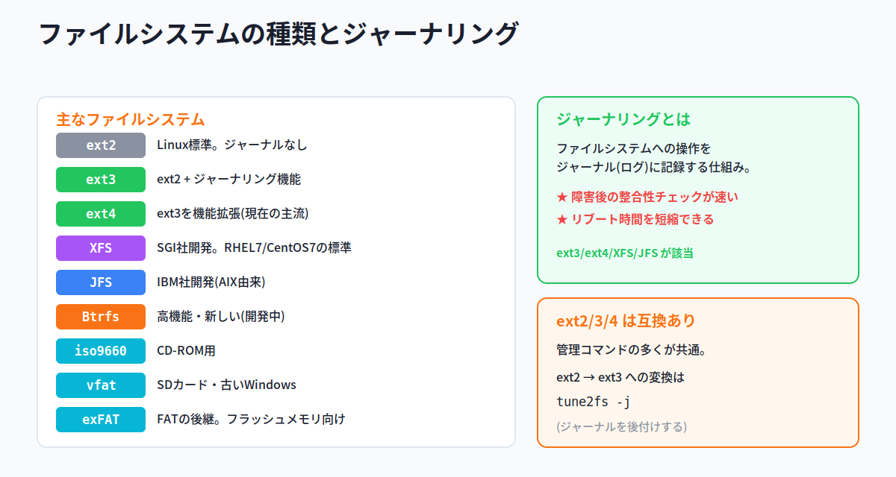

| ファイルシステム | 説明 |
|---|---|
| **ext2** | Linuxの標準ファイルシステム(ジャーナルなし) |
| **ext3** | ext2に **ジャーナリング機能** を加えたもの |
| **ext4** | ext3を機能拡張(現在の主流) |
| **XFS** | SGI社が開発したジャーナリングファイルシステム(IRIX由来) |
| **JFS** | IBM社が開発したジャーナリングファイルシステム(AIX由来) |
| **Btrfs** | 高度な機能を備えた新しいファイルシステム(開発中) |
| **iso9660** | CD-ROMのファイルシステム |
| **msdos / vfat** | MS-DOSや古いWindows、SDカードで使われる |
| **exFAT** | FATの後継。フラッシュメモリ向け |

ext2/ext3/ext4は **互換性があり、管理コマンドの多くが共通** です。

> 💡 **ジャーナリングとは**: ファイルシステムへの操作を **ジャーナル(ログ)に記録** する仕組みです。最大のメリットは、障害発生後の **整合性チェックが素早く行える**(=リブート時間を短縮できる)こと。ext3/ext4/XFS/JFSがこれに当たります。「ジャーナル=作業日誌をつけておくから、事故後の復旧が速い」と覚えましょう。

> 💡 **Btrfsの特徴**: 複数の物理ボリュームをまとめて1つの仮想ボリュームにする(ストレージプール)、複数ディスクにまたがるファイルシステム(マルチデバイス)、アンマウントせずにバックアップできる **スナップショット**、ディレクトリのように作れる **サブボリューム** などの先進機能を持ちます。

#### mkfsコマンド ─ ファイルシステム作成の入口

パーティション上にファイルシステムを作るのが **mkfs** です。mkfsは各ファイルシステム専用プログラムの **フロントエンド**(取りまとめ役)で、種類に応じて `mkfs.ext4` などを呼び出します。

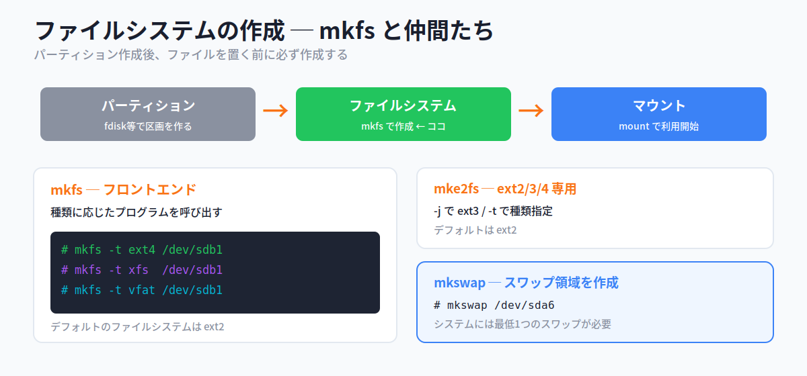

```
書式: mkfs [-t ファイルシステムタイプ] [オプション] デバイス名
```

| オプション | 説明 |
|---|---|
| **-t タイプ** | ファイルシステムの種類を指定(ext4, xfs, vfat など) |
| **-c** | 実行前に不良ブロックを検査する |

```bash
# mkfs -t ext4 /dev/sdb1     # ext4ファイルシステムを作成
```

呼び出されるプログラムは種類ごとに決まっています(`mkfs.ext4`, `mkfs.xfs`, `mkfs.vfat`, `mkfs.btrfs` など)。**mkfsのデフォルトは ext2** です。

#### mke2fsコマンド ─ ext2/3/4専用

**mke2fs** はext2/ext3/ext4を作成する専用コマンドです。**デフォルトはext2**、`-j` を付けるとext3を作成します。

```
書式: mke2fs [オプション] デバイスファイル名
```

| オプション | 説明 |
|---|---|
| **-t タイプ** | 種類を指定(ext2/ext3/ext4) |
| **-j** | ext3ファイルシステムを作成する |
| **-c** | 実行前に不良ブロックを検査する |

> 💡 ext2/ext3/ext4を作成すると、デフォルトで **5%の領域がrootユーザー用に予約** されます。この割合は `mke2fs` や `tune2fs` の `-m` オプションで変更できます。

#### mkswapコマンド ─ スワップ領域の作成

スワップ領域(メモリが足りなくなったときの一時退避先)は、通常 **独立したパーティション** として割り当てます。これを作るのが **mkswap** です。システムには **最低1つのスワップ領域** が必要です。

```bash
# mkswap /dev/sda6     # スワップ領域を作成
```

#### 📌 試験ポイント

| 問われ方 | 答え |
|---|---|
| 現在多くのディストリで標準のファイルシステムは? | **ext4** |
| ext2にジャーナリングを加えたものは? | **ext3** |
| RHEL7/CentOS7で標準のファイルシステムは? | **XFS** |
| ファイルシステムを作成するコマンドは? | **mkfs**(または mke2fs) |
| mkfsで種類を指定するオプションは? | **-t** |
| mkfsのデフォルトのファイルシステムは? | **ext2** |
| ext2/3/4専用の作成コマンドは? | **mke2fs** |
| mke2fsでext3を作るオプションは? | **-j** |
| スワップ領域を作成するコマンドは? | **mkswap** |
| ジャーナリングのメリットは? | **障害後の整合性チェックが速い**(リブート短縮) |

#### 📝 ここまでのまとめ

- ディスクを使うまでの3ステップ: **パーティション作成 → ファイルシステム作成 → マウント**
- ディスクは **デバイスファイル**(/dev/sda, sdb...)で扱う。ディスク・パーティションは **ブロックデバイス**、一覧は **lsblk**
- パーティションは **基本(最大4)・拡張(1つ)・論理(sda5以降)**。UEFIではEFIシステムパーティション + 基本
- パーティション操作: **fdisk(MBR)/ gdisk(GPT)/ parted(両対応・即反映)**。fdisk/gdiskは **w で保存**
- **MBR=2TB・4個 / GPT=制限なし・128個**
- ファイルシステム作成: **mkfs**(-t で種類、デフォルトext2)/ **mke2fs**(ext2/3/4、-jでext3)/ **mkswap**(スワップ)
- 主なファイルシステム: **ext2/3/4, XFS, JFS, Btrfs, iso9660, vfat, exFAT**。ジャーナリングは障害復旧が速い

---

## 5.2 ファイルシステムの管理

### ここで学ぶこと

- ファイルシステムの **空き容量** や **iノードの使用状況** を確認する方法(df / du)
- 壊れたファイルシステムを **チェック・修復** する方法(fsck / e2fsck)
- ファイルシステムの **パラメータ調整**(tune2fs)と **XFS専用ツール**

ファイルシステムは作って終わりではなく、運用中に「空きが足りない」「壊れた」といったトラブルが起こります。そんなとき、原因を素早く突き止めて対処するための道具がこの節のコマンド群です。ファイルシステムに書き込めなくなる主な原因は、**空き容量の不足** と **iノードの枯渇** の2つです。

### 5.2.1 ディスクの利用状況の確認

#### df と du ─ 「対象の単位」が違う

ディスクの使用状況を調べるコマンドには **df** と **du** があり、**何を集計するか** が違います。ここを混同しないことが試験対策の要です。

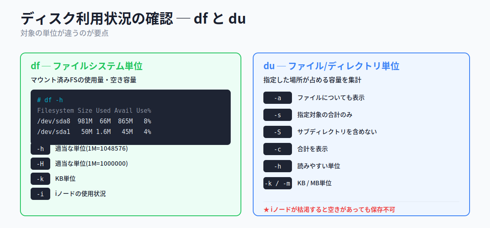

#### dfコマンド ─ ファイルシステム単位

**df**(disk free)は、マウントされているファイルシステムの **使用量・空き容量** を表示します。引数なしで全ファイルシステム、ディレクトリを指定するとそのディレクトリが属するファイルシステムのみを表示します。

```
書式: df [オプション] [デバイス名やディレクトリ名]
```

| オプション | 説明 |
|---|---|
| **-h** | 適当な単位で表示(Mは1,048,576バイト=1024×1024) |
| **-H** | 適当な単位で表示(Mは1,000,000バイト) |
| **-k** | KB単位で表示 |
| **-i** | **iノードの使用状況** を表示 |

```bash
# df -h
Filesystem  Size  Used Avail Use% Mounted on
/dev/sda8   981M   66M  865M   8% /
/dev/sda1    50M  1.6M   45M   4% /boot
```

#### iノードの枯渇に注意

第4章でも触れた **iノード** には、ファイルの属性(アクセス権・所有者など)が記録されています。作成できるiノード数は **ファイルシステム作成時に決まり、後から増やせません**。

そのため、**小さなファイルを大量に作る** とiノードが先に尽きてしまい、ディスクに空き容量があっても **新規ファイルを保存できなくなる** ことがあります。iノードの使用状況は `df -i` で確認します。

```bash
# df -i
Filesystem  Inodes IUsed  IFree IUse% Mounted on
/dev/sda8   127744 17271 110473   14% /
```

> 💡 ファイルの「中身」は **データブロック** に、「属性情報」は **iノードブロック** に、別々に保存されます。どちらかの書き込みが失敗すると整合性が崩れ、これを直すのが後述の fsck です。

#### duコマンド ─ ファイル/ディレクトリ単位

**du**(disk usage)は、指定したファイルやディレクトリが **占めている容量** を集計します。引数を省略するとカレントディレクトリが対象です。

```
書式: du [オプション] [ファイル名やディレクトリ名]
```

| オプション | 説明 |
|---|---|
| **-a** | ディレクトリだけでなくファイルについても表示 |
| **-s** | 指定したファイル/ディレクトリの **合計のみ** 表示 |
| **-S** | サブディレクトリを含めずに集計 |
| **-c** | すべての容量の **合計** を表示 |
| **-h** | 読みやすい単位で表示 |
| **-k / -m** | KB単位 / MB単位で表示 |
| **-l** | リンクも含めて集計 |

> 💡 **覚え方Hack ─ df は「全体(Filesystem)」、du は「中身(Usage)」**
> `df` は **ファイルシステム全体** の空き具合を上から眺めるイメージ、`du` は **特定のディレクトリの中身** がどれだけ容量を食っているかを下から積み上げるイメージ。「どのフォルダが重いか調べたい」→ du、「ディスク全体の残量を見たい」→ df です。

#### 📌 試験ポイント

| 問われ方 | 答え |
|---|---|
| ファイルシステムごとの使用状況を見るコマンドは? | **df** |
| ファイル/ディレクトリの占有容量を見るコマンドは? | **du** |
| iノードの使用状況を表示するには? | **df -i** |
| df/duで読みやすい単位にするオプションは? | **-h** |
| duで合計のみ表示するオプションは? | **-s** |
| duでファイルも表示するオプションは? | **-a** |
| 空きがあっても保存できなくなる原因は? | **iノードの枯渇** |

### 5.2.2 ファイルシステムのチェック

#### fsckコマンド ─ チェックと修復

システム障害などでファイルシステムが破損することがあります。**fsck**(file system check)はディスクをチェックし、必要なら修復を試みるコマンドです。

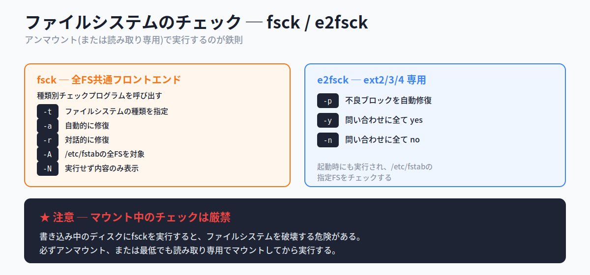

fsckは、ファイルシステムごとに用意されたチェックプログラム(`fsck.ext3`, `fsck.xfs` など)の **フロントエンド** です。

```
書式: fsck [オプション] デバイス名
```

| オプション | 説明 |
|---|---|
| **-t ファイルシステム名** | 種類を指定する |
| **-a** | 自動的に修復を実行する |
| **-r** | 対話的に修復を実行する |
| **-A** | /etc/fstabに記述された **全ファイルシステム** に対して実行 |
| **-N** | 実際には実行せず、何が行われるかのみ表示 |

> ⚠ **最重要 ─ チェックはアンマウント状態で**。fsckは **ファイルシステムをアンマウントした状態**(最低でも読み取り専用でマウント)で実行します。**書き込み中のディスクに実行するとファイルシステムを破壊する危険** があります。これは試験でも実務でも最重要の注意点です。

#### e2fsckコマンド ─ ext2/3/4専用

ext2/ext3/ext4のチェック・修復には **e2fsck** が使えます。

```
書式: e2fsck [オプション] デバイス名
```

| オプション | 説明 |
|---|---|
| **-p** | すべての不良ブロックを自動的に修復 |
| **-y** | 問い合わせに自動的に「yes」と回答 |
| **-n** | 問い合わせに自動的に「no」と回答 |

障害を検出すると修復するか尋ねられますが、`-y` を付けておけば自動的に修復されます。fsckはLinux起動時にも実行され、`/etc/fstab` でチェック対象に指定されたファイルシステムをチェックします。

#### 📌 試験ポイント

| 問われ方 | 答え |
|---|---|
| ファイルシステムをチェック・修復するコマンドは? | **fsck** |
| ext2/3/4専用のチェックコマンドは? | **e2fsck** |
| fsckを実行するときのディスクの状態は? | **アンマウント**(最低でも読み取り専用) |
| /etc/fstabの全FSをチェックするfsckオプションは? | **-A** |
| 実行せず内容だけ見るfsckオプションは? | **-N** |
| 問い合わせに全てyesと答えるe2fsckオプションは? | **-y** |

### 5.2.3 ファイルシステムの管理

#### tune2fsコマンド ─ ext2/3/4のパラメータ調整

**tune2fs** は、ext2/ext3/ext4ファイルシステムのさまざまなパラメータを設定します。たとえば、fsckでチェックする間隔を指定できます。調整するファイルシステムは **アンマウント**(または読み取り専用でマウント)しておく必要があります。

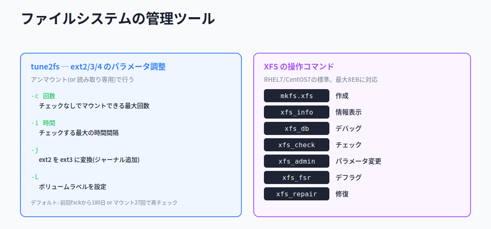

```
書式: tune2fs [オプション] デバイス名
```

| オプション | 説明 |
|---|---|
| **-c 回数** | チェックなしでマウントできる最大回数を指定 |
| **-i 時間** | ファイルシステムをチェックする最大の時間間隔を指定 |
| **-j** | **ext2をext3に変換** する(ジャーナルを追加) |
| **-L** | ボリュームラベルを設定する |

```bash
# tune2fs -j /dev/sda5     # ext2 を ext3 に変換(ジャーナル追加)
```

> 💡 デフォルトでは、前回fsckから **180日** か **マウント27回** のいずれか早い方でファイルシステムチェックが行われます。`-c` や `-i` でこの条件を調整できます。

### 5.2.4 XFS

#### XFSと専用コマンド

多くのディストリビューションではext4が標準ですが、**Red Hat Enterprise Linux 7やCentOS 7ではXFSが標準** です。XFSはSGI社が自社UNIX「IRIX」用に開発した、堅固で高速な **ジャーナリングファイルシステム** です。最大ファイルシステムサイズ・最大ファイルサイズが **8EB(エクサバイト)** という非常に大きなサイズに対応します。

XFSはext系とは別系統なので、専用の操作コマンドを使います(`tune2fs` や `e2fsck` はXFSには使えません)。

| コマンド | 説明 |
|---|---|
| **mkfs.xfs** | XFSファイルシステムを作成 |
| **xfs_info** | XFSの情報を表示 |
| **xfs_db** | XFSのデバッグ |
| **xfs_check** | XFSをチェック |
| **xfs_admin** | XFSのパラメータを変更 |
| **xfs_fsr** | XFSのデフラグ |
| **xfs_repair** | XFSを修復 |

> 💡 **覚え方Hack ─ XFSは「xfs_ で始まる」**
> XFSの操作コマンドは作成(`mkfs.xfs`)以外、ほぼ **`xfs_◯◯`** という形です。「情報=info、チェック=check、修復=repair」と英単語そのままなので、`xfs_` を頭に付けるだけ。ext系の `tune2fs`・`e2fsck` とは名前の系統が違う、という対比で覚えましょう。

#### 📌 試験ポイント

| 問われ方 | 答え |
|---|---|
| ext2/3/4のパラメータを調整するコマンドは? | **tune2fs** |
| tune2fsでext2をext3に変換するオプションは? | **-j** |
| RHEL7/CentOS7で標準のファイルシステムは? | **XFS** |
| XFSを作成するコマンドは? | **mkfs.xfs** |
| XFSを修復するコマンドは? | **xfs_repair** |
| XFSの情報を表示するコマンドは? | **xfs_info** |
| tune2fsやe2fsckはXFSに使える? | **使えない**(XFSは専用コマンド) |

#### 📝 ここまでのまとめ

- **df** = ファイルシステム単位の使用量・空き容量(**-i** でiノード、**-h** で読みやすく)
- **du** = ファイル/ディレクトリ単位の占有容量(**-s** 合計のみ、**-a** ファイルも、**-S** サブ含めず)
- **iノードの枯渇** に注意(空きがあっても保存不可)。小さいファイル大量作成で起こりやすい
- **fsck** = チェック・修復のフロントエンド。**必ずアンマウント(or 読み取り専用)で実行**
- **e2fsck** = ext2/3/4専用(**-y** で全てyes)
- **tune2fs** = ext2/3/4のパラメータ調整(**-j** でext2→ext3変換)
- **XFS** = RHEL7/CentOS7標準。操作は **xfs_◯◯** 系コマンド(mkfs.xfs / xfs_repair / xfs_info ...)

---

## 5.3 ファイルシステムのマウントとアンマウント

### ここで学ぶこと

- **マウント** の仕組み(別のファイルシステムを `/` 以下に結合する)
- 起動時やマウント時に参照される設定ファイル **/etc/fstab** の書式
- 実際にマウント・アンマウントする **mount / umount** コマンド

ディスク上のファイルシステムは、作成しただけでは使えません。**最初にマウントを行う** 必要があります。USBメモリを挿しても、Linuxでは(自動マウントの設定がなければ)マウントするまでアクセスできない、というのがこの節の話です。

### 5.3.1 マウントの仕組み

#### マウントとマウントポイント

あるファイルシステムに別のファイルシステムを組み込んで、全体として1つのファイルシステムとして扱えるようにすることを **マウント** といいます。マウントしたファイルシステムが結合される **ディレクトリ** が **マウントポイント** です。


`/media` 以下や `/mnt` 以下などに、空のディレクトリがマウントポイントとして用意されています。マウントは、DVD-ROMやUSBメモリなどの **リムーバブルメディア** や、**NFS**(Network File System)などのリモートファイルシステムにも使われます。マウントした後は、デバイスやネットワークの違いを意識せずにファイルへアクセスできます。

たとえば `/media/dvdrom` をマウントポイントに指定してDVD-ROMをマウントすると、DVD-ROM内の `data` ディレクトリは **`/media/dvdrom/data`** としてアクセスできるようになります。「ツリーの一部として、普通のディレクトリのように見える」のがマウントの効果です。

#### 📌 試験ポイント

| 問われ方 | 答え |
|---|---|
| 別のファイルシステムを結合することを何という? | **マウント** |
| 結合先のディレクトリを何という? | **マウントポイント** |
| マウントポイントによく使われるディレクトリは? | **/media, /mnt** |
| リモートファイルシステムの例は? | **NFS** |

### 5.3.2 /etc/fstabファイル

#### マウント情報を記述する設定ファイル

ファイルシステムの情報は **/etc/fstab** ファイルに記述されています。マウント時にこのファイルが参照されるため、**マウント頻度の高いファイルシステム** を記述しておきます。

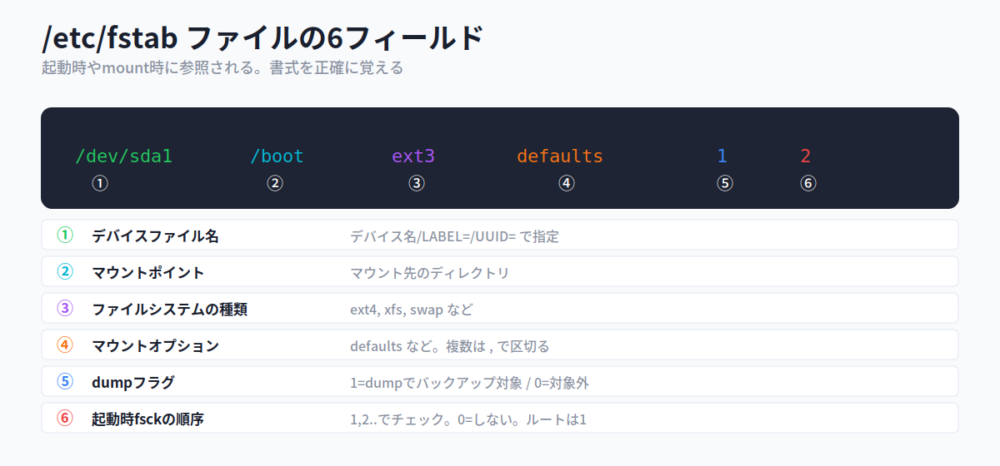

各行は **6つのフィールド** から成り、空白で区切られます。この6項目は正確に暗記しておきましょう。

```
/dev/sda1    /boot    ext3    defaults    1    2
    ①         ②        ③         ④       ⑤    ⑥
```

| # | フィールド | 説明 |
|---|---|---|
| **①** | デバイスファイル名 | デバイス名、`LABEL=ラベル名`、または `UUID=...` で指定 |
| **②** | マウントポイント | マウント先のディレクトリ |
| **③** | ファイルシステムの種類 | ext4, xfs, swap など |
| **④** | マウントオプション | defaults など。複数指定は **`,`(カンマ)** で区切る |
| **⑤** | dumpフラグ | **1** でdumpコマンドのバックアップ対象。通常ext2/ext3は1、その他は0 |
| **⑥** | 起動時fsckの順序 | 1,2,...の順にチェック。**0でチェックしない**。**ルートファイルシステムは1** |

#### UUIDでの指定

最近のシステムでは、デバイスファイル欄に **UUID** を指定していることがあります。

```
UUID=dd992ea1-ae8a-4efc-b6c6-aaec6942fd6f  /  ext4  errors=remount-ro  0  1
```

**UUID**(Universally Unique Identifier)はデバイスを識別するための一意なIDで、`blkid` コマンドでデバイスファイルとの対応を確認できます。

> 💡 **なぜUUIDで指定するのか**: デバイスを追加すると、起動時の認識順序が変わって **同じディスクに割り当てられるデバイスファイル名(/dev/sdaなど)が入れ替わる** ことがあります。すると起動やアクセスでエラーが起きかねません。デバイスごとに不変な **UUIDで指定すれば、名前の入れ替わり事故を防げます**。

#### 主なマウントオプション

`/etc/fstab` の④や `mount -o` で使うマウントオプションです。

| オプション | 説明 |
|---|---|
| **defaults** | 標準的なオプションのまとめ(async, auto, dev, exec, nouser, rw, suid) |
| **auto / noauto** | `mount -a` 実行時にマウントする / しない |
| **exec / noexec** | バイナリの実行を許可する / しない |
| **ro / rw** | 読み取り専用 / 読み書き可でマウント |
| **suid** | SUID・SGIDを有効にする |
| **user** | 一般ユーザーでもマウントを可能にする |
| **users** | マウントしたユーザー以外でもアンマウント可能にする |
| **nouser** | 一般ユーザーのマウントを許可しない |
| **async** | 非同期入出力を設定する |

#### 📌 試験ポイント

| 問われ方 | 答え |
|---|---|
| マウント情報を記述する設定ファイルは? | **/etc/fstab** |
| /etc/fstabは1行あたり何項目? | **6項目** |
| 2番目のフィールドは何? | **マウントポイント** |
| 5番目(dumpフラグ)で1の意味は? | **dumpのバックアップ対象** |
| 6番目で0の意味は? | **起動時にfsckチェックしない** |
| ルートファイルシステムの6番目の値は? | **1** |
| デバイスを一意に識別するIDは? | **UUID** |
| UUIDとデバイスファイルの対応を見るコマンドは? | **blkid** |
| 読み取り専用でマウントするオプションは? | **ro** |
| mount -a でマウントされないようにするには? | **noauto** |

### 5.3.3 マウントとアンマウント

#### mountコマンド

ファイルシステムをマウントするには **mount** を使います。オプションなしで実行すると **現在のマウント状況** が表示されます。

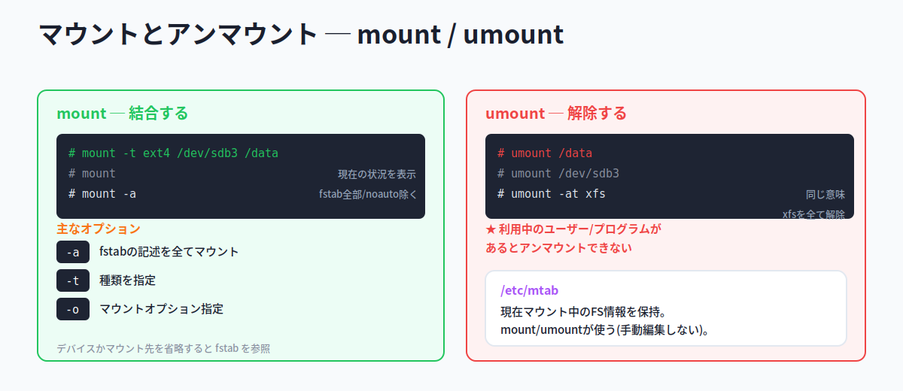

```
書式: mount [オプション]
書式: mount [オプション] デバイス名 マウントポイント
```

| オプション | 説明 |
|---|---|
| **-a** | /etc/fstabのファイルシステムを **すべてマウント**(noauto付きを除く) |
| **-t ファイルシステム名** | 種類を指定 |
| **-o** | マウントオプションを指定 |

```bash
# mount -t ext4 /dev/sdb3 /data    # /dev/sdb3 を /data にマウント
# mount /data                       # /etc/fstabに記述があれば、これだけでOK
```

> 💡 デバイス名かマウントポイントの **どちらかを省略** すると、`/etc/fstab` の記述が参照されます。`/etc/fstab` に書いてあるものは `mount /data` のように片方だけでマウントできます。

#### umountコマンド

マウントを解除(アンマウント)するには **umount** を使います(スペルは **n のない umount** な点に注意)。

```
書式: umount [オプション]
書式: umount [オプション] デバイス名またはマウントポイント
```

| オプション | 説明 |
|---|---|
| **-a** | /etc/mtabに記述されたファイルシステムをすべてアンマウント |
| **-t ファイルシステム名** | 指定した種類だけアンマウント |

```bash
# umount /data         # マウントポイントで指定
# umount /dev/sdb3     # デバイス名で指定(同じ意味)
# umount -at xfs       # マウント中のxfsを全てアンマウント
```

> ⚠ **利用中はアンマウントできない**: マウントポイント以下のディレクトリを使っているユーザーやプログラムがあると、アンマウントできません。「そのディレクトリにいる人がいると扉を外せない」とイメージしましょう。

> 💡 **/etc/mtab**: 現在マウントされているファイルシステムの情報を保持するファイルです。mount/umountコマンドが使うファイルで、**ユーザーが手動で書き換えることはありません**。設定を書く `/etc/fstab` と、現状を記録する `/etc/mtab` の役割の違いを押さえましょう。

#### 📌 試験ポイント

| 問われ方 | 答え |
|---|---|
| ファイルシステムをマウントするコマンドは? | **mount** |
| アンマウントするコマンドは? | **umount**(nが入らない) |
| 引数なしでmountを実行すると? | **現在のマウント状況を表示** |
| /etc/fstabを全てマウントするオプションは? | **-a** |
| マウント時に種類を指定するオプションは? | **-t** |
| 利用中のファイルシステムはアンマウントできる? | **できない** |
| 現在のマウント状況を保持するファイルは? | **/etc/mtab** |
| 設定を記述するファイルは? | **/etc/fstab** |

#### 📝 ここまでのまとめ

- **マウント** = 別のファイルシステムを `/` 以下の **マウントポイント** に結合し、1つのツリーとして扱う
- 設定ファイル **/etc/fstab** は **6フィールド**: デバイス / マウントポイント / 種類 / オプション / dumpフラグ / fsck順序
- **ルートFSのfsck順序は1**、0はチェックしない。複数オプションは **カンマ区切り**
- **UUID** でデバイス指定すると名前入れ替わり事故を防げる。対応確認は **blkid**
- **mount**(-a で全マウント、引数なしで状況表示)/ **umount**(利用中は不可)
- 設定=**/etc/fstab**、現状=**/etc/mtab**(手動編集しない)

---

## 5.4 ファイルの配置と検索

### ここで学ぶこと

- どのディレクトリに何を置くかの取り決め **FHS**(ファイルシステム階層標準)
- 各ディレクトリの役割(/bin, /etc, /var, /usr など)
- ファイルを探す **find / locate** と、その使い分け
- コマンドの場所を調べる **which / whereis / type**

Linuxのディレクトリ構成は、ディストリビューションによってバラバラだと困ります。そこで「どこに何を置くか」を標準化したのが **FHS** です。また、目的のファイルやコマンドを探すための検索コマンドも、用途に応じて使い分けます。

### 5.4.1 FHS

#### FHS ─ ディレクトリ配置の標準

**FHS**(Filesystem Hierarchy Standard:ファイルシステム階層標準)は、Linuxのディレクトリ配置を標準化したものです。主要なディストリビューションはFHSをサポートしています。

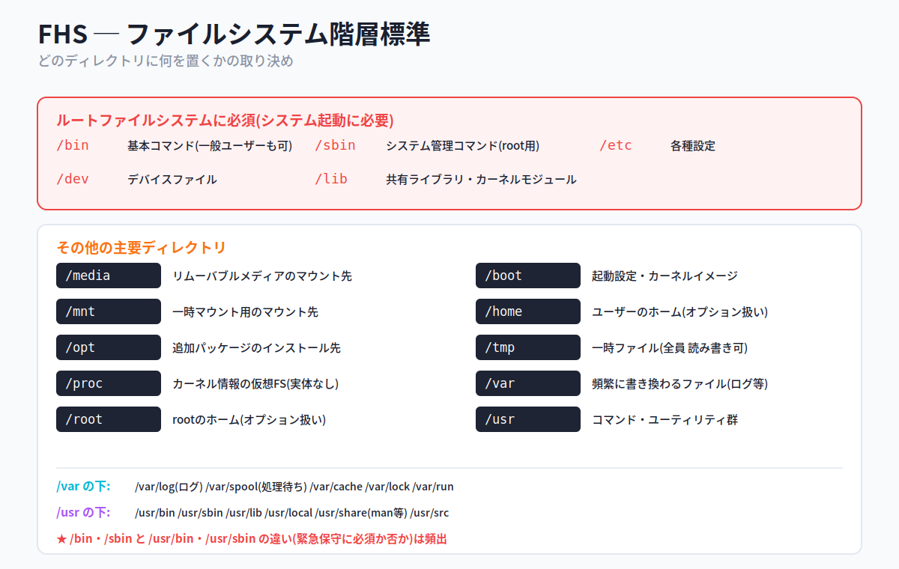

#### ルートファイルシステムに必須のディレクトリ

ルートファイルシステムは階層の最上位に位置し、次のディレクトリを **含まなければなりません**。

- **/bin** ─ 基本的なコマンドが配置される。**一般ユーザーでも実行可能**。cat, chmod, cp, ls, mkdir, mount, mv, ps, rm, sed, su, umount, uname など
- **/sbin** ─ システム管理に必須のコマンド。**rootユーザーのみ実行可能**。shutdown, fdisk, fsck, init, mkfs, mkswap, reboot, route など
- **/etc** ─ システムやアプリケーションの設定情報、スクリプトファイル
- **/dev** ─ デバイスファイル(特殊ファイル)
- **/lib** ─ 共有ライブラリやカーネルモジュール。とくに /bin, /sbin のコマンドが必要とするライブラリ

#### その他の主要ディレクトリ

| ディレクトリ | 内容 |
|---|---|
| **/media** | DVD-ROMなど **リムーバブルメディア** のマウントポイント |
| **/mnt** | **一時的に** マウントするファイルシステムのマウントポイント |
| **/opt** | パッケージ管理で追加プログラムがインストールされる(無い場合もある) |
| **/proc** | カーネル内部の情報にアクセスする **仮想ファイルシステム**(実体はディスク上にない) |
| **/root** | スーパーユーザーrootのホームディレクトリ。/home が使えなくても保守できるよう別。**FHSではオプション扱い** |
| **/boot** | 起動に必要な設定やカーネルイメージ |
| **/home** | ユーザーごとのホームディレクトリ。**FHSではオプション扱い** |
| **/tmp** | 一時ファイル。**すべてのユーザーが読み書き可能** |
| **/var** | ログ・スプールなど **頻繁に書き換えられる** ファイル |
| **/usr** | コマンドやユーティリティなど |

#### /var と /usr の下位ディレクトリ

`/var` と `/usr` はさらに細分化されており、試験でよく問われます。

**/var の下**

- **/var/log** ─ ログファイル(`messages`, `maillog` など)
- **/var/spool** ─ 印刷待ち(`/var/spool/lpd`)や予約ジョブ(`/var/spool/at`)など処理待ちのデータ
- **/var/cache** ─ 一時的なキャッシュファイル(man用の整形データなど)
- **/var/lock** ─ アプリの排他制御に使うロックファイル
- **/var/run** ─ システムの状態を示すファイル。とくにPIDを格納したファイル(`httpd.pid` など)

**/usr の下**

- **/usr/bin** ─ 一般ユーザー向けで、**緊急時の保守には必須でない** コマンド
- **/usr/sbin** ─ システム管理コマンドで、**緊急時の保守には必須でない** もの
- **/usr/lib** ─ プログラムに必要な共有ライブラリ
- **/usr/local** ─ ローカルシステム独自のコマンドやライブラリ(さらに bin, sbin, lib に細分化)
- **/usr/share** ─ アーキテクチャに依存しないファイル(`/usr/share/man` にマニュアル)
- **/usr/src** ─ カーネルソースなどソースコード

> ⚠ **最頻出ポイント ─ /bin・/sbin と /usr/bin・/usr/sbin の違い**
> 両方とも「コマンドを置く場所」ですが、**/bin・/sbin はシステム起動・緊急保守に必須** なのでルートFSに置きます。一方 **/usr/bin・/usr/sbin は必須でない** コマンドの置き場です。「緊急時に最低限必要か?」が分かれ目。また、**ルートFSに必要なディレクトリ**(/bin, /sbin, /etc, /dev, /lib)と、**FHSでオプション扱い**(/root, /home)も区別して覚えましょう。

#### 📌 試験ポイント

| 問われ方 | 答え |
|---|---|
| ディレクトリ配置を標準化したものは? | **FHS**(ファイルシステム階層標準) |
| 一般ユーザーが使う基本コマンドの場所は? | **/bin** |
| root専用のシステム管理コマンドの場所は? | **/sbin** |
| デバイスファイルの場所は? | **/dev** |
| カーネル情報の仮想ファイルシステムは? | **/proc** |
| 全ユーザーが読み書きできる一時ファイルの場所は? | **/tmp** |
| ログファイルが書き出される場所は? | **/var/log** |
| 印刷待ちなど処理待ちデータの場所は? | **/var/spool** |
| manのマニュアルが置かれる場所は? | **/usr/share/man** |
| FHSでオプション扱いのディレクトリは? | **/root, /home** |

### 5.4.2 ファイルの検索

#### findコマンド ─ 実際に走査する高機能検索

**find** は、指定したディレクトリ以下から条件にマッチするファイル/ディレクトリを **実際にたどって** 検索します。名前だけでなくアクセス権・サイズ・更新日時などを併用でき、マッチしたファイルに **アクション(削除など)を実行** することもできる、高機能なコマンドです。

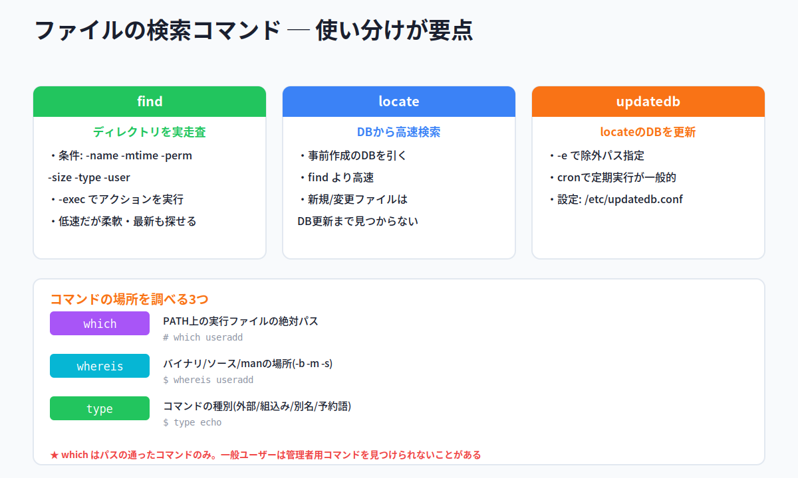

検索ディレクトリを省略すると **カレントディレクトリ** が対象です。検索対象にアクセスできる権限が必要で、一般ユーザーがアクセス禁止のディレクトリ内を検索することはできません。

```
書式: find [検索ディレクトリ] [検索式]
```

| 検索式 | 説明 |
|---|---|
| **-name ファイル名** | ファイル名で検索 |
| **-atime 日数** | 最終アクセス時刻で検索 |
| **-mtime 日数** | 最終更新時刻で検索 |
| **-perm アクセス権** | アクセス権で検索 |
| **-size サイズ** | ファイルサイズ(ブロック単位)で検索 |
| **-type 種類** | 種類で検索(**f**:ファイル / **d**:ディレクトリ / **l**:シンボリックリンク) |
| **-user ユーザー名** | 所有者で検索 |
| **-print** | マッチしたファイルを表示(省略可) |
| **-exec コマンド {} \;** | マッチしたファイルにコマンドを実行 |
| **-ok コマンド {} \;** | 同上だが、実行前に確認する |

```bash
# find /home -name "*.rpm"          # /home以下の.rpmファイルを検索
$ find /data -type f -mtime -1      # /data以下で過去1日以内に更新されたファイル
$ find /usr/bin -type f -perm -u+s  # SUIDが設定されたファイルを検索
$ find /tmp -user student           # 所有者がstudentのものを検索
$ find -atime +30 -exec rm {} \;    # 30日超アクセスのないファイルを削除
```

> ⚠ **検索式は引用符で囲む**: `-name "*.rpm"` のようにメタキャラクタを引用符で囲まないと、**find に渡る前にシェルが `*` を展開** してしまい、意図しない動作になります(第3章の「メタキャラクタはシェルが展開する」の話と同じ理由です)。

#### locateコマンド ─ DBから高速検索

**locate** は、あらかじめ作成された **データベース** をもとに、パターンに一致するファイルを検索します。findより **高速** です。

```bash
$ locate "*.h"     # 名前が .h で終わるファイルを検索
```

ただし、DBに基づくため **DB更新後に作成・変更されたファイルは見つけられません**。

#### updatedbコマンド ─ locateのDBを更新

locateのデータベースを更新するのが **updatedb** です。

```
書式: updatedb [オプション]
```

| オプション | 説明 |
|---|---|
| **-e パス** | データベースに取り込まないパスを指定 |

```bash
# updatedb -e /home     # /homeを除外してDBを再構築
```

> 💡 updatedbは多くのディストリビューションで **cronによって定期的に実行** されます。動作の設定は **/etc/updatedb.conf** ファイルで行い、DBに登録しないパス(PRUNEPATHS)やファイルシステム(PRUNEFS)を指定できます。

#### which / whereis / type ─ コマンドの場所を調べる

| コマンド | 何を調べる |
|---|---|
| **which** | **環境変数PATH上** にある実行ファイルの **絶対パス** |
| **whereis** | コマンドの **バイナリ・ソース・マニュアル** の場所(`-b` バイナリ / `-m` man / `-s` ソース) |
| **type** | コマンドが **外部コマンド・組み込み・エイリアス・予約語** のどれか |

```bash
# which useradd
/usr/sbin/useradd
$ whereis useradd
useradd: /usr/sbin/useradd /usr/share/man/man8/useradd.8.gz
$ type cat
cat はハッシュされています (/usr/bin/cat)      # 外部コマンド
$ type echo
echo はシェル組み込み関数です                  # 組み込み
$ type vi
vi は `vim' のエイリアスです                    # エイリアス
```

> ⚠ **whichはPATHが通ったものだけ**: which は環境変数PATHに基づいて検索するため、**一般ユーザーが管理者用コマンド(/sbin等)を検索すると、何も表示されない** ことがあります(PATHにそのディレクトリが含まれていないため)。

#### 📌 試験ポイント

| 問われ方 | 答え |
|---|---|
| ディレクトリをたどって検索する高機能コマンドは? | **find** |
| findで名前を指定する検索式は? | **-name** |
| findで種類(ファイル/ディレクトリ)を指定するのは? | **-type**(f / d / l) |
| findでマッチしたファイルにコマンドを実行するのは? | **-exec** |
| DBを使った高速検索コマンドは? | **locate** |
| locateのDBを更新するコマンドは? | **updatedb** |
| updatedbの設定ファイルは? | **/etc/updatedb.conf** |
| PATH上のコマンドの絶対パスを表示するのは? | **which** |
| バイナリ・ソース・manの場所を調べるのは? | **whereis** |
| コマンドの種別(組み込み/外部/別名)を調べるのは? | **type** |

#### 📝 ここまでのまとめ

- **FHS** = どこに何を置くかの標準。ルートFS必須は **/bin /sbin /etc /dev /lib**、オプションは **/root /home**
- **/bin・/sbin(必須)** と **/usr/bin・/usr/sbin(必須でない)** の違いが最頻出
- 役割: **/proc**(仮想FS) **/tmp**(全員書込可) **/var/log**(ログ) **/var/spool**(処理待ち) **/usr/share/man**(man)
- **find** = 実走査・高機能(-name -type -mtime -perm -exec)。検索式は **引用符で囲む**
- **locate**(DBで高速・新規は見つからない)+ **updatedb**(DB更新、設定は /etc/updatedb.conf)
- 場所を調べる3つ: **which**(PATH上の絶対パス)/ **whereis**(バイナリ・ソース・man)/ **type**(種別)

---

## 📝 全体まとめ ─ ここまでの学習内容

このセクションを終えた時点で、次のことができるようになっているはずです：

1. ディスクを使うまでの **3ステップ**（パーティション作成 → ファイルシステム作成 → マウント）を説明できる
2. ディスクの接続規格（**SATA / SAS / SCSI / USB**）と、SATAが現在主流だと分かる
3. **デバイスファイル**（/dev/sda, sdb, sdc, sdd / sr0 / st0）を暗記している
4. ディスク・パーティションが **ブロックデバイス** だと分かり、**lsblk** で一覧できる
5. パーティションの3種類（**基本=最大4 / 拡張=1つ / 論理=sda5以降**）を区別できる
6. UEFIでは **EFIシステムパーティション + 基本** を使い、拡張・論理は使わないと分かる
7. パーティションに分けるメリット（**障害の被害を局所化**）を説明できる
8. **/（ルート）** が頂点で、それを含むのが **ルートファイルシステム** だと分かる
9. **マウント** がパーティションを `/` 以下に結合する仕組みで、Linuxに **ドライブ（C:）の概念がない** と分かる
10. ルートFSに必須のディレクトリ（**/bin /sbin /etc /dev /lib**）を答えられる
11. パーティション操作の **fdisk（MBR）/ gdisk（GPT）/ parted（両対応・即反映）** を区別できる
12. fdiskのサブコマンド（**n / d / p / t / a / l / w保存 / q保存せず**）が分かる
13. **MBR=2TB・基本4個 / GPT=制限なし・128個** の違いを答えられる
14. ファイルシステムの種類（**ext2/3/4, XFS, JFS, Btrfs, iso9660, vfat, exFAT**）を区別できる
15. **ジャーナリング** が障害後の整合性チェックを速くする仕組みだと説明できる
16. ファイルシステム作成の **mkfs（-t、デフォルトext2）/ mke2fs（-jでext3）/ mkswap** を区別できる
17. **df（ファイルシステム単位）** と **du（ファイル/ディレクトリ単位）** を混同せず使い分けられる
18. **iノードの枯渇** で空きがあっても保存できなくなると分かり、**df -i** で確認できる
19. **fsck** はチェック・修復のフロントエンドで、**アンマウント状態で実行** が鉄則だと分かる
20. ext2/3/4専用の **e2fsck（-y）** と、調整用の **tune2fs（-jでext2→ext3）** を区別できる
21. **XFS** がRHEL7/CentOS7標準で、操作は **xfs_◯◯** 系コマンド（mkfs.xfs / xfs_repair / xfs_info）だと分かる
22. **マウントポイント**（/media, /mnt）と **NFS** などのリモートFSへのマウントが分かる
23. **/etc/fstab の6フィールド**（デバイス / マウントポイント / 種類 / オプション / dumpフラグ / fsck順序）を答えられる
24. **UUID** でデバイス指定するメリット（名前入れ替わり事故の防止）と **blkid** が分かる
25. **mount（-a / 引数なしで状況表示）/ umount（利用中は不可）** と、設定=**/etc/fstab**・現状=**/etc/mtab** の違いが分かる
26. **FHS** の主要ディレクトリの役割（**/proc 仮想FS / /tmp 全員書込 / /var/log / /var/spool / /usr/share/man**）を説明できる
27. **/bin・/sbin（必須）** と **/usr/bin・/usr/sbin（必須でない）** の違いが分かる
28. ファイル検索の **find（実走査・高機能）/ locate（DB高速）/ updatedb（DB更新）** を区別できる
29. コマンドの場所を調べる **which（PATH上）/ whereis（バイナリ・ソース・man）/ type（種別）** を区別できる

第5章はコマンドもパス（ディレクトリ）も多い章ですが、「3ステップの流れ」「デバイス名とパーティション番号」「fstabの6項目」「コマンドの使い分け」を軸に整理すれば、トピック104の得点源になります。

---

## 事前チェックリスト

研修当日の朝、これに自信を持って「✓」を付けられる状態が理想です。
分からない項目があれば、該当セクションに戻って読み直してください。

### パーティションとファイルシステムの作成（5.1）

- [ ] ディスクを使うまでの3ステップ（パーティション → ファイルシステム → マウント）を言える
- [ ] ディスク接続規格（SATA / SAS / SCSI / USB）を区別できる
- [ ] 現在主流の規格が **SATA** だと分かる
- [ ] **/dev/sda 〜 /dev/sdd** がハードディスクだと分かる
- [ ] **/dev/sr0**（CD/DVD）/ **/dev/st0**（テープ）が分かる
- [ ] ディスク・パーティションが **ブロックデバイス** だと分かる
- [ ] **キャラクタデバイス**（キーボード等）との違いが分かる
- [ ] **lsblk** でブロックデバイス一覧を表示できると分かる
- [ ] **基本パーティションは最大4個** だと分かる
- [ ] **拡張パーティション** の中に **論理パーティション** が入ると分かる
- [ ] **論理パーティションは /dev/sda5 から** 始まると分かる
- [ ] UEFIでは **EFIシステムパーティション + 基本** を使うと分かる
- [ ] パーティション分割のメリット（被害の局所化）を説明できる
- [ ] **/（ルート）** が頂点で **ルートファイルシステム** だと分かる
- [ ] **マウント** の意味と、ドライブ概念がないことが分かる
- [ ] ルートFSに必須の **/bin /sbin /etc /dev /lib** を言える
- [ ] **fdisk** がパーティション操作の代表コマンドだと分かる
- [ ] fdiskの **-l**（テーブル表示）が分かる
- [ ] fdiskサブコマンド **n / d / p / t / a / l** が分かる
- [ ] fdiskの **w（保存）/ q（保存せず）** を区別できる
- [ ] **gdisk** がGPT用だと分かる
- [ ] **parted** がMBR/GPT両対応で **即反映** だと分かる
- [ ] **MBR=2TB・4個 / GPT=128個** を言える
- [ ] ファイルシステムが「データをファイルとして扱う仕組み」だと分かる
- [ ] **ext2 / ext3 / ext4** の違い（ジャーナルの有無・拡張）が分かる
- [ ] **XFS / JFS / Btrfs / iso9660 / vfat / exFAT** を区別できる
- [ ] **ジャーナリング** のメリット（復旧が速い）を説明できる
- [ ] **mkfs**（-t で種類、デフォルトext2）が分かる
- [ ] **mke2fs**（ext2/3/4専用、-jでext3）が分かる
- [ ] **mkswap**（スワップ作成）が分かる

### ファイルシステムの管理（5.2）

- [ ] 書き込めなくなる原因（空き不足 / iノード枯渇）を言える
- [ ] **df** がファイルシステム単位の使用状況だと分かる
- [ ] **du** がファイル/ディレクトリ単位だと分かる
- [ ] df / du の **-h**（読みやすい単位）が分かる
- [ ] **df -i**（iノード使用状況）が分かる
- [ ] du の **-s（合計のみ）/ -a（ファイルも）/ -S（サブ含めず）** が分かる
- [ ] **iノードの枯渇** で空きがあっても保存できないと分かる
- [ ] **fsck** がチェック・修復のフロントエンドだと分かる
- [ ] fsckは **アンマウント（or 読み取り専用）で実行** が鉄則だと分かる
- [ ] fsck の **-A（fstab全FS）/ -N（実行せず表示）** が分かる
- [ ] **e2fsck** がext2/3/4専用で **-y** が「全てyes」だと分かる
- [ ] **tune2fs** がext2/3/4のパラメータ調整だと分かる
- [ ] tune2fs の **-j** で ext2→ext3 変換できると分かる
- [ ] **XFS** がRHEL7/CentOS7標準だと分かる
- [ ] **mkfs.xfs / xfs_repair / xfs_info** など xfs_系コマンドが分かる
- [ ] tune2fs・e2fsck がXFSには使えないと分かる

### ファイルシステムのマウントとアンマウント（5.3）

- [ ] **マウント** と **マウントポイント** の意味が分かる
- [ ] マウントポイントによく使う **/media / /mnt** が分かる
- [ ] **NFS** がリモートファイルシステムの例だと分かる
- [ ] **/etc/fstab** がマウント情報の設定ファイルだと分かる
- [ ] /etc/fstab の **6フィールド** をすべて言える
- [ ] 1番目がデバイス（名 / LABEL= / UUID=）だと分かる
- [ ] 2番目が **マウントポイント** だと分かる
- [ ] 5番目の **dumpフラグ**（1でバックアップ対象）が分かる
- [ ] 6番目の **fsck順序**（0でしない・ルートは1）が分かる
- [ ] 複数のマウントオプションは **カンマ区切り** だと分かる
- [ ] **UUID** の意味と、指定するメリットが分かる
- [ ] **blkid** でUUIDとデバイスの対応を確認できると分かる
- [ ] マウントオプション **ro / rw / noauto / user / defaults** が分かる
- [ ] **mount** の使い方（-a / -t / 引数なしで状況表示）が分かる
- [ ] **umount**（スペルにnが入らない）が分かる
- [ ] **利用中はアンマウントできない** と分かる
- [ ] **/etc/mtab**（現状を保持・手動編集しない）が分かる

### ファイルの配置と検索（5.4）

- [ ] **FHS** がディレクトリ配置の標準だと分かる
- [ ] ルートFS必須の **/bin /sbin /etc /dev /lib** を言える
- [ ] **/bin（一般可）と /sbin（root専用）** の違いが分かる
- [ ] **/bin・/sbin と /usr/bin・/usr/sbin** の違い（緊急保守の必須性）が分かる
- [ ] **/proc** がカーネル情報の仮想FS（実体なし）だと分かる
- [ ] **/tmp** が全ユーザー読み書き可だと分かる
- [ ] **/var/log（ログ）/ /var/spool（処理待ち）** が分かる
- [ ] **/usr/share/man** にマニュアルがあると分かる
- [ ] **/root / /home** がFHSでオプション扱いだと分かる
- [ ] **find** が実走査の高機能検索だと分かる
- [ ] find の **-name / -type（f,d,l）/ -mtime / -perm / -exec** が分かる
- [ ] 検索式は **引用符で囲む** べきだと分かる
- [ ] **locate** がDBを使った高速検索だと分かる
- [ ] **updatedb** でDBを更新し、設定が **/etc/updatedb.conf** だと分かる
- [ ] **which**（PATH上の絶対パス）が分かる
- [ ] **whereis**（バイナリ・ソース・man）が分かる
- [ ] **type**（コマンドの種別）が分かる

### コマンド総まとめ（暗記）

これらのコマンドを「見ただけで何をするか」答えられるようになっていれば理想です：

| コマンド | これは何? |
|---|---|
| `lsblk` | |
| `fdisk -l /dev/sda` | |
| `fdisk /dev/sdb` | |
| `gdisk /dev/sdc` | |
| `parted /dev/sdb -s mkpart primary ext4 1 1G` | |
| `mkfs -t ext4 /dev/sdb1` | |
| `mke2fs -j /dev/sdb1` | |
| `mkswap /dev/sda6` | |
| `df -h` | |
| `df -i` | |
| `du -s testdir` | |
| `du -a` | |
| `fsck /dev/sdb1` | |
| `fsck -A` | |
| `e2fsck -y /dev/sdb1` | |
| `tune2fs -j /dev/sda5` | |
| `mkfs.xfs /dev/sdb1` | |
| `xfs_repair /dev/sdb1` | |
| `xfs_info /dev/sdb1` | |
| `mount` | |
| `mount -t ext4 /dev/sdb3 /data` | |
| `mount -a` | |
| `umount /data` | |
| `umount -at xfs` | |
| `blkid` | |
| `find /home -name "*.rpm"` | |
| `find /data -type f -mtime -1` | |
| `find -atime +30 -exec rm {} \;` | |
| `locate "*.h"` | |
| `updatedb -e /home` | |
| `which useradd` | |
| `whereis useradd` | |
| `type echo` | |

### 重要な記号・数値総まとめ（暗記）

数字やデバイス名の暗記は第5章の得点に直結します。即答できるようにしておきましょう：

| 記号・数値 | これは何? |
|---|---|
| `/dev/sda` / `/dev/sdb` / `/dev/sdc` / `/dev/sdd` | |
| `/dev/sda1`（数字の意味） | |
| `/dev/sda5`（なぜ5から?） | |
| `/dev/sr0` / `/dev/st0` | |
| 基本パーティションの最大数 | |
| 拡張パーティションの数 | |
| MBRの最大容量 | |
| GPTの最大パーティション数 | |
| mkfsのデフォルトFS | |
| mke2fsの `-j` | |
| `tune2fs -j` の意味 | |
| df の `-i` | |
| du の `-s` / `-a` / `-S` | |
| fsck の `-A` / `-N` | |
| e2fsck の `-y` | |
| /etc/fstab のフィールド数 | |
| fstab 第5項（dumpフラグ）の1 | |
| fstab 第6項（fsck順序）の0 | |
| ルートFSの fsck順序 | |
| XFSの最大サイズ（8EB） | |
| tune2fsのデフォルト再チェック（180日 / 27回） | |
| ルートFSに予約される割合（5%） | |
| find の `-type` の f / d / l | |

### ファイル・パス総まとめ（暗記）

| パス | これは何? |
|---|---|
| `/dev/sda` | |
| `/dev/sr0` | |
| `/etc/fstab` | |
| `/etc/mtab` | |
| `/etc/updatedb.conf` | |
| `/proc` | |
| `/tmp` | |
| `/var/log` | |
| `/var/spool` | |
| `/usr/share/man` | |
| `/bin` / `/sbin` | |
| `/usr/bin` / `/usr/sbin` | |
| `/media` / `/mnt` | |
| `/root` / `/home`（FHSでの扱い） | |

### 用語総まとめ（暗記）

これらの用語を「自分の言葉で説明できる」状態が目標：

- [ ] デバイスファイル
- [ ] ブロックデバイス / キャラクタデバイス
- [ ] パーティション
- [ ] 基本パーティション / 拡張パーティション / 論理パーティション
- [ ] MBR / GPT
- [ ] UEFI / EFIシステムパーティション
- [ ] ルートファイルシステム
- [ ] マウント / マウントポイント
- [ ] ファイルシステム
- [ ] セクタ / ブロック
- [ ] iノード
- [ ] ext2 / ext3 / ext4
- [ ] XFS / JFS / Btrfs
- [ ] iso9660 / vfat / exFAT
- [ ] ジャーナリングファイルシステム
- [ ] スワップ領域
- [ ] 不良ブロック
- [ ] UUID
- [ ] dumpフラグ
- [ ] NFS
- [ ] FHS（ファイルシステム階層標準）
- [ ] 仮想ファイルシステム（/proc）
- [ ] スティッキービット（/tmp、第4章の復習）
- [ ] 検索式 / メタキャラクタ
- [ ] PATH（環境変数、第3章の復習）

---

## 研修当日に向けて

事前学習がきちんとできていれば、研修当日は以下の流れで進みます：

1. **おさらい**（このチェックリストの中から数問）
2. **Hackの説明**（覚え方のコツ、暗記時間）
3. **テスト**（実際の試験問題を含む）
4. **答え合わせ・おさらい**

第5章は「デバイス名」「パーティションの種類」「fstabの6項目」「コマンドの使い分け」など、**暗記が点数に直結** するテーマが多い章です。でも安心してください。バラバラに覚えるのではなく、「**ディスクを使う3ステップ**（パーティション → ファイルシステム → マウント）」という1本の流れに沿って整理すれば、どのコマンドがどの段階の道具なのかが一気に見えてきます。「論理パーティションはsda5から」「fsckは必ずアンマウント」「dfは全体・duは中身」のように、この資料に散りばめたHack(覚え方のコツ)を手がかりに読み進めてください。

研修当日にいきなり知らないコマンドやパスが並ぶと焦ってしまうものです。事前にこの資料で予備知識を入れておけば、当日は **「あ、これ事前学習で見た」** という安心感を持ちながら進められます。
分からない部分があっても**慌てる必要はありません**。一度通読してから、チェックリストで自分のウィークポイントを把握しておけば、研修で確実に固められます。

頑張ってください。
