# 第7章：シェルとシェルスクリプト

> **この資料について**
> これは研修当日のための **予備知識** をまとめた資料です。
> 研修当日は **おさらい → 暗記のコツの説明 → テスト → 答え合わせ** という流れで進むため、当日「初めて聞く話」が出てこないように、ここで必要な前提をひと通り押さえておきます。
>
> ここからは **102試験** の範囲に入ります。第7章はその最初の章「シェルとシェルスクリプト」(トピック105)です。
>
> Linuxを触ったことがなくても理解できるよう、できるだけ身近な例で書いています。
>
> **前提**
> この資料は **101試験の範囲(第1〜5章)** をひと通り学んでいることを前提にしています。とくに **第3章(GNUとUNIXコマンド)で学んだシェル・変数・パイプ・リダイレクト・メタキャラクタ** と、**第4章のプロセス・パーミッション(SUID/SGID)** は本章でも再登場します。あやしい場合は先にそちらを確認してください。
>
> **この章の重要度について**
> 第7章は、102試験の「トピック105(シェルとシェルスクリプト)」に対応します。「環境変数とシェル変数の違い(export)」「エイリアス」「bashの設定ファイルと実行順序」「シェルスクリプトの実行方法」「位置パラメータ($1, $?)」「test条件式」「制御構造(if/case/for/while/read)」は確実に複数問出題されます。とくに **設定ファイルの実行順序** と **test条件式・制御構造の文法** は丸暗記レベルで押さえる必要があります。
>
> **読み方の指針**
> 1. まずは1回ざっと通読してください(細かい暗記は不要)
> 2. 各セクションの「📌 試験ポイント」と「📝 ここまでのまとめ」を見直してください
> 3. 巻末の「事前チェックリスト」で自分の理解度を測ってください
> 4. 研修当日は、このチェックリストのおさらいから始まります

---

<!-- ## 目次

- [7.1 シェル環境のカスタマイズ](#71-シェル環境のカスタマイズ)
  - [7.1.1 環境変数とシェル変数](#711-環境変数とシェル変数)
  - [7.1.2 シェルのオプション](#712-シェルのオプション)
  - [7.1.3 エイリアス](#713-エイリアス)
  - [7.1.4 関数の定義](#714-関数の定義)
  - [7.1.5 bashの設定ファイル](#715-bashの設定ファイル)
  - [7.1.6 bash起動時における設定ファイルの実行順序](#716-bash起動時における設定ファイルの実行順序)
- [7.2 シェルスクリプト](#72-シェルスクリプト)
  - [7.2.1 シェルスクリプトの基礎](#721-シェルスクリプトの基礎)
  - [7.2.2 ファイルのチェック](#722-ファイルのチェック)
  - [7.2.3 制御構造](#723-制御構造)
  - [7.2.4 シェルスクリプトの実行環境](#724-シェルスクリプトの実行環境)
- [事前チェックリスト](#事前チェックリスト)

--->

## 7.1 シェル環境のカスタマイズ

### ここで学ぶこと

- ユーザーの作業環境を決める **変数**(環境変数とシェル変数)の違い
- シェルの動作を切り替える **オプション**(set)
- コマンドに別名を付ける **エイリアス** と、処理をまとめる **関数**
- 設定を自動化する **bashの設定ファイル** と、その **実行順序**

「シェル」とは、第3章で学んだ通り、ユーザーが入力したコマンドを受け取ってOSに渡す **窓口** のプログラムです(Linuxでは **bash** が標準)。同じLinuxでも、使う人によって「日本語表示にしたい」「プロンプトの形を変えたい」「`ls` といつも `-l` 付きで使いたい」など好みは様々です。この節では、その **シェルの環境を自分好みにカスタマイズする** 方法を学びます。

### 7.1.1 環境変数とシェル変数

#### 変数は2種類 ─ 値が「どこまで」届くか

シェルの環境は、たくさんの **変数**(値を格納する入れ物)によって決まります。変数には **環境変数** と **シェル変数** の2種類があり、違いは **その値がどこまで届くか(有効範囲)** です。

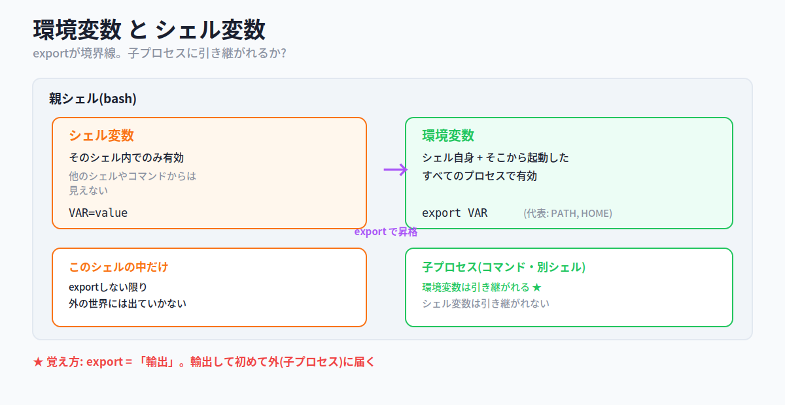

- **環境変数**: そのシェル自身と、**そこから起動されたすべてのプロセス**(コマンドや別のシェル)で有効。代表例は、コマンドを検索するディレクトリのリストを格納する **PATH** や、ホームディレクトリのフルパスを表す **HOME**
- **シェル変数**: **そのシェルの中だけ** で有効。他のシェルや、そこから起動したコマンドには引き継がれない

#### export ─ シェル変数を環境変数に昇格させる

シェル変数は、**export** コマンドでエクスポートすると環境変数になり、そのシェルから起動したコマンドや別のシェルでも使えるようになります。

```bash
$ VAR=hello       # まずシェル変数として定義
$ export VAR      # 環境変数に昇格(子プロセスでも有効になる)
```

> 💡 **覚え方Hack ─ export は「輸出」**
> `export` は英語で「輸出」。手元(シェル内)だけで使っていた変数を、**輸出して初めて外(子プロセス)に届く** ようになる、とイメージすると、環境変数とシェル変数の違いが一発で整理できます。

#### 変数を確認・操作するコマンド

設定されている変数を確認したり、操作したりするコマンドを整理します。

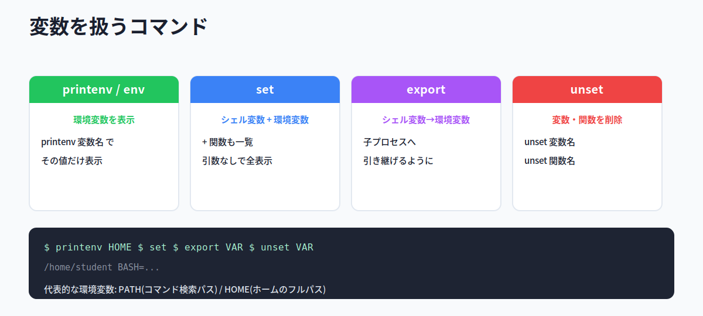

| コマンド | 何をする |
|---|---|
| **printenv** / **env** | **環境変数** を表示する(`printenv 変数名` でその値だけ表示) |
| **set** | **シェル変数 + 環境変数**(さらに関数も)を表示する |
| **export** | シェル変数を環境変数にする(子プロセスへ引き継ぐ) |
| **unset** | 変数や関数を削除する |

> 💡 「環境変数だけ見たい → `env` / `printenv`」「全部(シェル変数も)見たい → `set`」と覚えましょう。`printenv HOME` のように変数名を付けると、その値だけが表示されます。

#### 📌 試験ポイント

| 問われ方 | 答え |
|---|---|
| シェルとその子プロセスで有効な変数は? | **環境変数** |
| そのシェル内だけで有効な変数は? | **シェル変数** |
| シェル変数を環境変数にするコマンドは? | **export** |
| 環境変数を表示するコマンドは? | **printenv / env** |
| シェル変数も含めて表示するコマンドは? | **set** |
| 変数を削除するコマンドは? | **unset** |
| コマンド検索パスを格納する環境変数は? | **PATH** |
| ホームディレクトリを表す環境変数は? | **HOME** |

### 7.1.2 シェルのオプション

#### set -o / +o ─ 動作のスイッチ

シェルには動作を切り替えるさまざまな **オプション** があり、**set** コマンドでオン/オフを切り替えます。

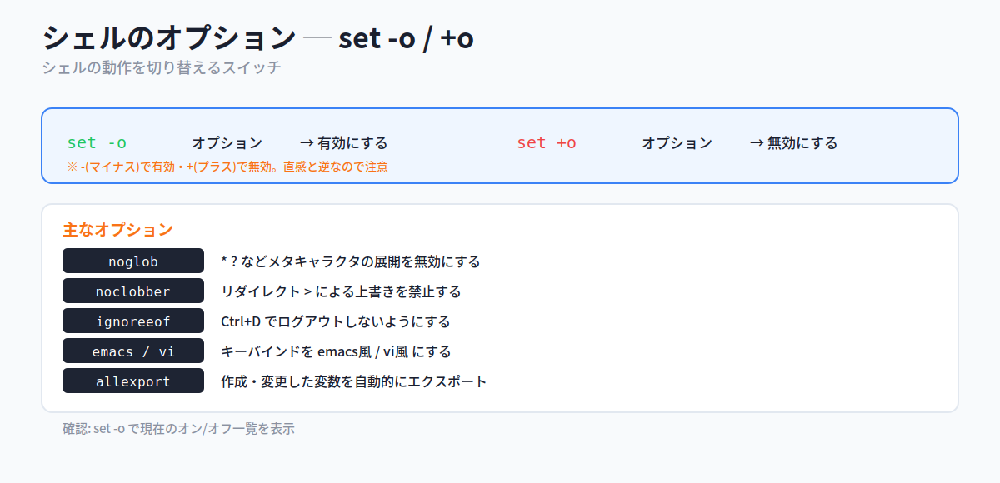

```
書式: set [-o][+o] [オプション]
```

ここが引っかけポイントです。**`-o`(マイナス)で有効、`+o`(プラス)で無効** になります。プラスなのに無効、と直感と逆なので注意してください。

| オプション | 説明 |
|---|---|
| **allexport** | 作成・変更した変数を自動的にエクスポートする |
| **noclobber** | リダイレクト(`>`)による上書きを禁止する |
| **noglob** | メタキャラクタ(`*` `?`)によるファイル名展開を無効にする |
| **ignoreeof** | Ctrl+D でログアウトしないようにする |
| **emacs** | emacs風のキーバインドにする |
| **vi** | vi風のキーバインドにする |

```bash
$ set -o noglob    # ファイル名展開を無効にする
$ set +o noglob    # 元に戻す(有効にする)
$ set -o           # 現在のオプション設定を一覧表示
```

> 💡 **覚え方Hack ─ マイナスで点ける、プラスで消す**
> 電気のスイッチと逆だと思うと混乱します。「`-o` = optionを on」「`+o` = onを取り消す(off)」と、`o` を on の頭文字として結びつけると覚えやすいです。

#### 📌 試験ポイント

| 問われ方 | 答え |
|---|---|
| シェルのオプションを切り替えるコマンドは? | **set** |
| オプションを有効にするのは? | **-o**(マイナス) |
| オプションを無効にするのは? | **+o**(プラス) |
| メタキャラクタ展開を無効にするオプションは? | **noglob** |
| リダイレクトの上書きを禁止するオプションは? | **noclobber** |
| Ctrl+Dでログアウトしないようにするのは? | **ignoreeof** |
| 現在のオプションを一覧表示するには? | **set -o** |

### 7.1.3 エイリアス

#### alias ─ コマンドに別名を付ける

**エイリアス**(別名)を使うと、コマンドに別名を付けたり、コマンドとオプションをひとまとめにして新しいコマンドのように使ったりできます。設定は **alias** コマンドで行います。

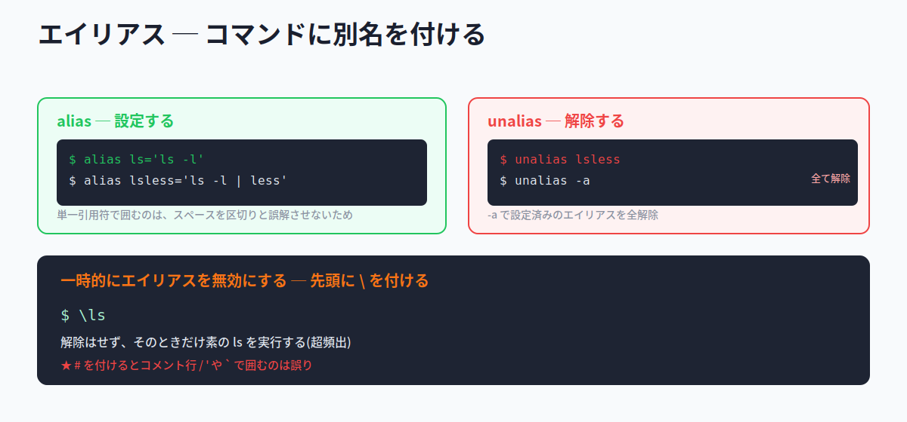

```bash
$ alias ls='ls -l'             # ls と打つと ls -l が実行される
$ alias lsless='ls -l | less'  # 一連のコマンドにも付けられる
```

シングルクォート(`'`)で囲むのは、**コマンドとオプションの間のスペースをシェルに解釈させないため** です。

#### エイリアスの解除と一時的な無効化

| やりたいこと | 方法 |
|---|---|
| エイリアスを解除する | `unalias エイリアス名` |
| すべてのエイリアスを解除する | `unalias -a` |
| そのときだけ無効にする(解除はしない) | コマンドの前に **`\`** を付ける |

```bash
$ unalias lsless     # lsless を解除
$ \ls                # ls のエイリアスを一時的に無視して、素の ls を実行
```

> ⚠ **超頻出 ─ 一時的な無効化は `\`**
> 「エイリアスを解除せずに、今回だけ元のコマンドを使いたい」ときは、コマンドの直前に **`\`** を付けます。`unalias` だと完全に解除されてしまい、`#` を付けるとコメント行になって実行されず、`'` や `` ` `` で囲むのも誤りです。「今回だけ素のコマンド → バックスラッシュ」と覚えましょう。

#### 📌 試験ポイント

| 問われ方 | 答え |
|---|---|
| コマンドに別名を付けるコマンドは? | **alias** |
| エイリアスを解除するコマンドは? | **unalias** |
| すべてのエイリアスを解除するには? | **unalias -a** |
| エイリアスを一時的に無効にするには? | コマンド前に **`\`** |
| alias定義で値を `'` で囲む理由は? | **スペースをシェルに解釈させないため** |

### 7.1.4 関数の定義

#### function ─ コマンドの組み合わせに名前を付ける

bashの組み込みコマンド **function** を使うと、独自の関数を定義できます。頻繁に使うコマンドの組み合わせに名前を付けておくと便利です。

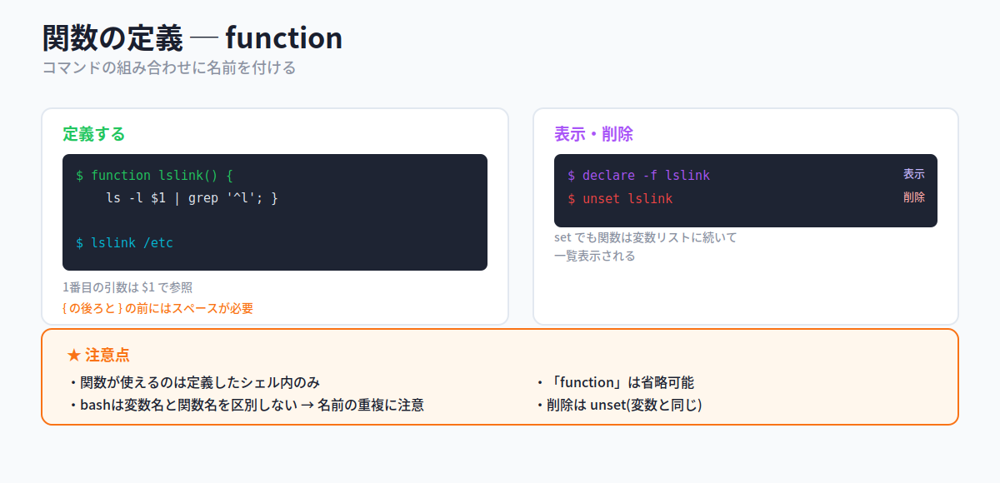

```
書式: [function] 関数名() { コマンド; }
```

`function` は省略できます。**`{` の後ろと `}` の前にはスペースが必要** な点に注意してください。

```bash
$ function lslink() { ls -l $1 | grep '^l'; }    # 引数($1)も使える
$ lslink /etc                                     # 関数名を打てば実行
```

引数は **`$1` `$2` ...** で受け取ります(詳しくは7.2で解説)。

#### 関数の表示・削除

| やりたいこと | 方法 |
|---|---|
| 定義されている関数を表示 | `declare -f`(`set` でも変数に続いて表示される) |
| 関数を削除 | `unset 関数名`(変数の削除と同じ) |

> ⚠ **bashは変数名と関数名を区別しません**。名前が重複しないよう注意が必要です。また関数が使えるのは **定義したシェル内だけ** です。削除が変数と同じ `unset` である点もよく問われます。

#### 📌 試験ポイント

| 問われ方 | 答え |
|---|---|
| 関数を定義するコマンドは? | **function**(省略可) |
| 関数定義で必要な記法上の注意は? | **`{` の後ろと `}` の前にスペース** |
| 関数内で1番目の引数を参照するには? | **$1** |
| 定義済みの関数だけを表示するには? | **declare -f** |
| 関数を削除するコマンドは? | **unset** |
| 関数が有効な範囲は? | **定義したシェル内のみ** |

### 7.1.5 bashの設定ファイル

#### 設定を自動化するファイルたち

シェルを起動するたびに環境変数・エイリアス・関数を手で定義するのは非効率です。そこで、それらを **自動的に実行する設定ファイル** が用意されています(これらの設定ファイル自体がシェルスクリプトです)。

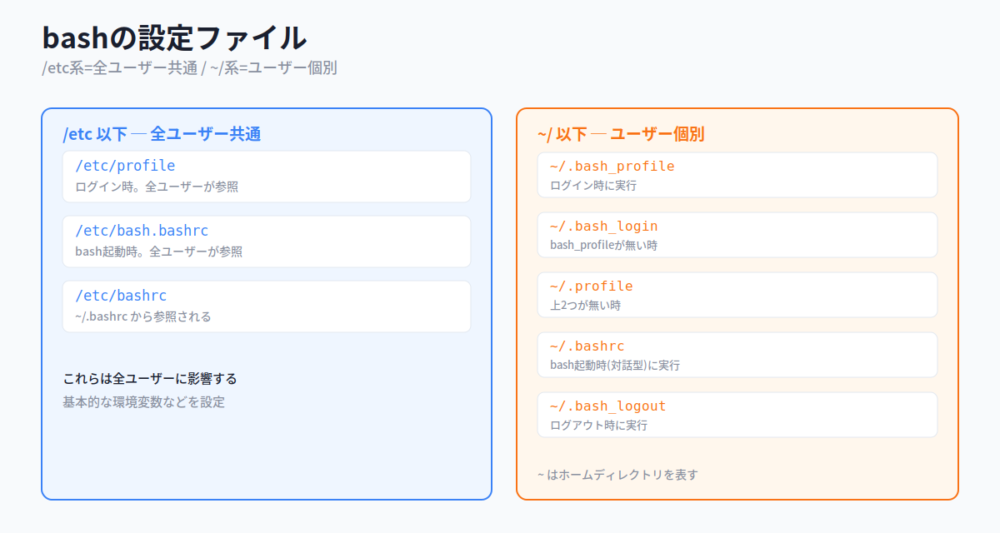

ポイントは **`/etc` 以下=全ユーザー共通**、**`~`(ホーム)以下=ユーザー個別** という住み分けです。

**全ユーザー共通(/etc 以下)**

| ファイル | 説明 |
|---|---|
| **/etc/profile** | ログイン時に実行され、全ユーザーから参照される |
| **/etc/bash.bashrc** | bash起動時に実行され、全ユーザーから参照される |
| **/etc/bashrc** | `~/.bashrc` から参照される |

**ユーザー個別(~ 以下)**

| ファイル | 説明 |
|---|---|
| **~/.bash_profile** | ログイン時に実行される |
| **~/.bash_login** | `~/.bash_profile` が無い場合、ログイン時に実行される |
| **~/.profile** | 上の2つが無い場合、ログイン時に実行される |
| **~/.bashrc** | bash起動時(対話型)に実行される |
| **~/.bash_logout** | ログアウト時に実行される |

> 💡 `/etc` 以下を変更すると **全ユーザーに影響** が及びます。個人の設定はホームディレクトリ以下のファイルで行います。`~` はそのユーザーのホームディレクトリを表す記号です。

#### 📌 試験ポイント

| 問われ方 | 答え |
|---|---|
| 全ユーザー共通の設定ファイルはどこ? | **/etc 以下** |
| ユーザー個別の設定ファイルはどこ? | **~(ホーム)以下** |
| ログイン時に全ユーザーが参照するのは? | **/etc/profile** |
| ログアウト時に実行されるのは? | **~/.bash_logout** |
| 対話型bash起動時に実行される個人ファイルは? | **~/.bashrc** |

### 7.1.6 bash起動時における設定ファイルの実行順序

#### ログインシェルと対話型シェルで違う

設定ファイルが **どの順番で** 実行されるかは試験頻出です。鍵は **ログインシェル** か **対話型シェル** かで読まれるファイルが違うことです。

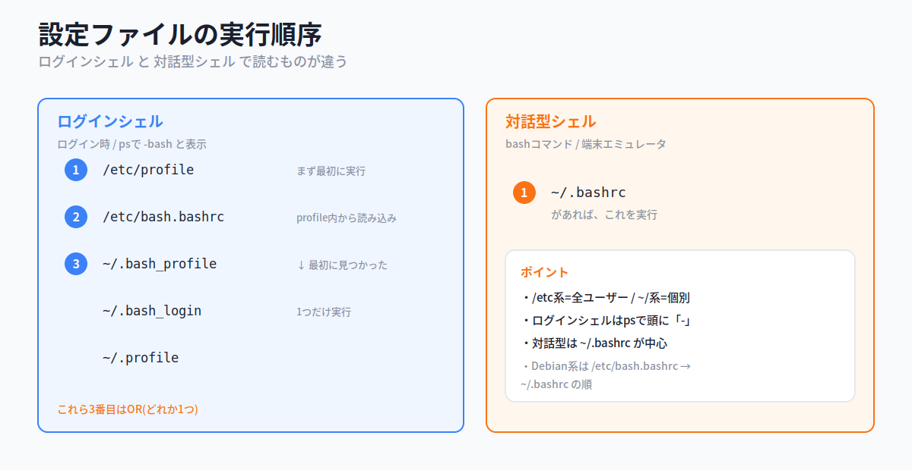

**ログインシェルの場合**(ログイン時。`bash` がログインシェルとして起動)

1. **/etc/profile** を読み込んで実行(あれば)
2. その中で **/etc/bash.bashrc** を読み込んで実行(あれば)
3. その後、**~/.bash_profile → ~/.bash_login → ~/.profile** の順に探し、**最初に見つかった1つだけ** を実行

**対話型シェルの場合**(`bash` コマンド入力時や、端末エミュレータ起動時)

- **~/.bashrc** があれば、これを読み込んで実行

> 💡 **ログインシェルとは**: ログインしたときに最初に起動するシェルです。`ps` コマンドで見ると **`-bash`** のように頭に `-` が付きます。一方、すでにログインした状態で `bash` と打ったり端末を開いたときに起動するのが対話型シェルです。

> 💡 **覚え方Hack ─ profile はログイン、bashrc は起動ごと**
> `profile` は「ログインのときの身支度」、`bashrc` は「bashを起動するたびの設定」とイメージ。`rc` は run command(実行するコマンド)の略で、UNIX系の設定ファイルによく付く接尾辞です。

#### 📌 試験ポイント

| 問われ方 | 答え |
|---|---|
| ログインシェルが最初に読むのは? | **/etc/profile** |
| その後に個人設定として探す順は? | **~/.bash_profile → ~/.bash_login → ~/.profile** |
| 上の3つはいくつ実行される? | **最初に見つかった1つだけ** |
| 対話型シェルが読む個人ファイルは? | **~/.bashrc** |
| ログインシェルは `ps` でどう見える? | 頭に **`-`** が付く(`-bash`) |

#### 📝 ここまでのまとめ

- 変数は **環境変数(子プロセスにも有効)** と **シェル変数(そのシェル内のみ)**。**export** で昇格
- 確認: **printenv / env**(環境変数)、**set**(シェル変数も)。削除は **unset**
- **set -o** で有効・**+o** で無効(noglob, noclobber, ignoreeof など)
- **alias** で別名、**unalias** で解除、**`\`** で一時的に無効化
- **function** で関数定義(`{ }` の内側にスペース、引数は `$1`、削除は **unset**、定義シェル内のみ有効)
- 設定ファイル: **/etc 以下=全員 / ~ 以下=個人**。順序は **ログインシェル(profile系) vs 対話型(~/.bashrc)**

---

## 7.2 シェルスクリプト

### ここで学ぶこと

- **シェルスクリプト** の作り方と、4つの **実行方法**
- スクリプトに値を渡す **引数(位置パラメータ)** と、成否を表す **戻り値 $?**
- ファイルや数値を判定する **test コマンド**
- 処理を分岐・繰り返す **制御構造**(if / case / for / while / read)
- スクリプトの **実行環境**(シェバン・サブシェル・権限)

シェルには、スクリプト言語によるプログラミング機能が備わっています。これが **シェルスクリプト** です。一連のコマンドライン作業を **自動化** できるのが最大の利点で、「毎回手で打っていた作業をファイルにまとめて一発実行」といったことができます。

### 7.2.1 シェルスクリプトの基礎

#### スクリプトはテキストファイル

シェルスクリプトは、実行したいコマンドをテキストファイルに並べて書くだけで作れます。たとえば次は、いくつかのコマンドを順番に実行する `lsld` というスクリプトです。

```bash
$ cat lsld
ls -l $1 > lslink
echo "Link Files"
grep '^l' lslink
echo "Directories"
grep '^d' lslink
```

#### 4つの実行方法

スクリプトを実行する方法はいくつかあり、**実行権が必要か** と **どこのシェルで動くか** が異なります。ここは試験頻出です。

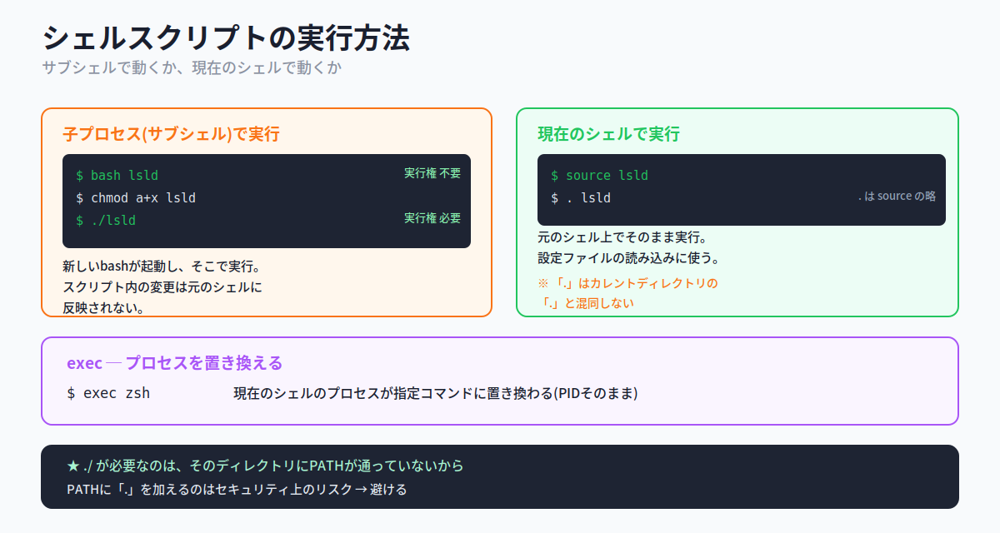

| 実行方法 | 実行権 | 動く場所 |
|---|---|---|
| **bash script** | 不要(読み取り権だけでよい) | 子プロセス(サブシェル) |
| **./script** | **必要**(`chmod +x` する) | 子プロセス(サブシェル) |
| **source script** | 不要 | **現在のシェル** |
| **. script** | 不要(`source` の省略形) | **現在のシェル** |

```bash
$ bash lsld           # bashの引数として渡す(実行権不要)
$ chmod a+x lsld      # 実行権を付ければ
$ ./lsld              # コマンドのように実行できる
$ source lsld         # 現在のシェルで実行
$ . lsld              # source の省略形(カレントを表す . とは別物)
```

> 💡 **`./` が必要な理由**: カレントディレクトリにパスが通っていない(`PATH` に含まれていない)ため、「ここにあるこのファイル」と明示する必要があるからです。なお **`PATH` に `.` を加えるのはセキュリティ上のリスク** があるので避けます。

> ⚠ **サブシェル vs 現在のシェル(重要)**: `bash` や `./` で実行すると **新しいbash(子プロセス)** が起動し、そこでスクリプトが動きます。そのため **スクリプト内での変数変更などは、終了後の元のシェルには残りません**。一方 `source`(`.`)は **現在のシェルで実行** されるので、変更が元のシェルに反映されます。設定ファイルの読み込みに `source`(`.`)が使われるのはこのためです。

#### exec ─ プロセスを置き換える

**exec** コマンドを使うと、スクリプトを実行しているシェルのプロセスが、指定したコマンドのプロセスに **置き換わります**(新しいプロセスを作るのではなく、PIDがそのまま乗っ取られる)。待機するシェルが不要な場面(例: X Window Systemでウィンドウマネージャを起動する場合)で使います。

```
書式: exec コマンド
```

#### スクリプトに渡す引数(位置パラメータ)

スクリプトにも引数を渡せると便利です。bashでは次の **特殊な変数** で引数を参照します。

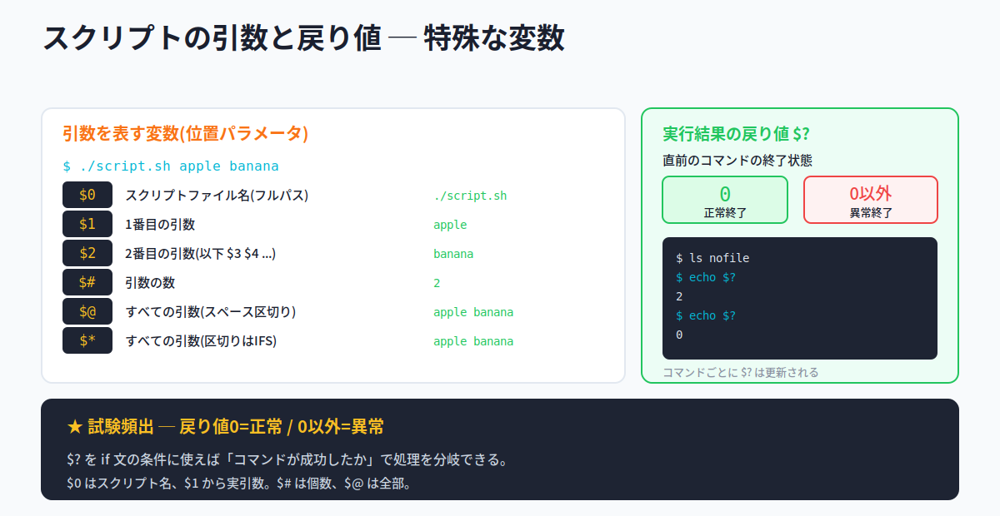

| 変数 | 説明 |
|---|---|
| **$0** | スクリプトファイル名(フルパス) |
| **$1** | 1番目の引数(以下 `$2` `$3` ... `$n`) |
| **$#** | 引数の数 |
| **$@** | すべての引数(スペース区切り) |
| **$\*** | すべての引数(区切りは環境変数 IFS で指定されたもの) |

```bash
$ ./testargs args1
./testargs      # $0(スクリプト名)
args1           # $1(1番目の引数)
                # $2 は空(引数が1つしかないため)
1               # $#(引数の数)
```

#### 実行結果の戻り値 $?

コマンドは終了時に、シェルへ **戻り値** を返します。**正常終了なら 0**、**正常終了でなければ 0以外** です。この戻り値は特殊変数 **`$?`** に格納され、コマンドが成功したかどうかの判定に使えます。

```bash
$ ls nofile
ls: nofile にアクセスできません: ...
$ echo $?
2               # エラーだったので 0以外
$ echo $?
0               # 直前の echo は成功したので 0
```

> ⚠ **戻り値0=正常、0以外=異常** は試験頻出。コマンドを実行するたびに `$?` は更新されます。`$?` を `if` 文の条件に使えば「コマンドが成功したか」で処理を分岐できます。

#### 📌 試験ポイント

| 問われ方 | 答え |
|---|---|
| 実行権がなくても動かせる実行方法は? | **bash script** / **source** / **.** |
| 実行権が必要な実行方法は? | **./script** |
| 現在のシェルで実行されるのは? | **source** と **.** |
| source の省略形は? | **.**(ドット) |
| 1番目の引数を表す変数は? | **$1** |
| スクリプト名を表す変数は? | **$0** |
| 引数の数を表す変数は? | **$#** |
| すべての引数を表す変数は? | **$@**(または $*) |
| 直前のコマンドの戻り値が入る変数は? | **$?** |
| 正常終了の戻り値は? | **0** |
| プロセスを置き換えるコマンドは? | **exec** |

### 7.2.2 ファイルのチェック

#### test コマンド ─ 条件を判定する

「ファイルが存在すれば〜する」のように、条件によって動作を変えたいとき、**test** コマンドで条件を判定します。`test` には別の書き方 **`[ 条件 ]`** もあります。

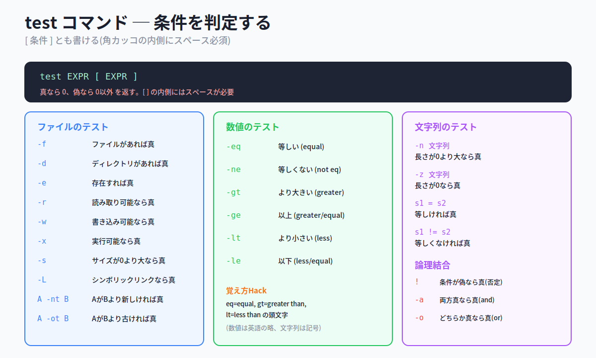

```
書式: test 条件文
書式: [ 条件文 ]
```

条件が **真(満たされる)なら 0** を、**偽なら 0以外** を返します。2番目の書式では **`[` の後ろと `]` の前にスペースが必要** です。

**ファイルのテスト**

| 条件式 | 真になる条件 |
|---|---|
| **-f ファイル** | (通常の)ファイルがあれば真 |
| **-d ディレクトリ** | ディレクトリがあれば真 |
| **-e ファイル** | ファイルが存在すれば真 |
| **-r / -w / -x ファイル** | 読み取り / 書き込み / 実行が可能なら真 |
| **-s ファイル** | サイズが0より大きければ真 |
| **-L ファイル** | シンボリックリンクなら真 |
| **ファイル1 -nt ファイル2** | ファイル1がファイル2より新しければ真(newer than) |
| **ファイル1 -ot ファイル2** | ファイル1がファイル2より古ければ真(older than) |

**数値のテスト**

| 条件式 | 真になる条件 |
|---|---|
| **数値1 -eq 数値2** | 等しい(equal) |
| **数値1 -ne 数値2** | 等しくない(not equal) |
| **数値1 -gt 数値2** | より大きい(greater than) |
| **数値1 -ge 数値2** | 以上(greater or equal) |
| **数値1 -lt 数値2** | より小さい(less than) |
| **数値1 -le 数値2** | 以下(less or equal) |

**文字列のテスト・論理結合**

| 条件式 | 真になる条件 |
|---|---|
| **-n 文字列** | 長さが0より大きければ真 |
| **-z 文字列** | 長さが0であれば真 |
| **文字列1 = 文字列2** | 等しければ真 |
| **文字列1 != 文字列2** | 等しくなければ真 |
| **! 条件** | 条件が偽であれば真(否定) |
| **条件1 -a 条件2** | 両方が真であれば真(and) |
| **条件1 -o 条件2** | いずれかが真であれば真(or) |

> 💡 **覚え方Hack ─ 数値は英語の略**
> 数値比較は `-eq`(equal) `-gt`(greater than) `-lt`(less than) のように **英語の頭文字** です。一方、文字列の等値は記号の `=` `!=` を使います。「数値=英単語の略、文字列=記号」と対比で覚えると混同しません。`-nt`/`-ot` は newer/older than の略です。

#### 📌 試験ポイント

| 問われ方 | 答え |
|---|---|
| 条件を判定するコマンドは? | **test**(または `[ ]`) |
| `[ ]` を使うときの注意は? | **内側にスペースが必要** |
| 真のときの戻り値は? | **0** |
| ファイルの存在を調べる条件式は? | **-e**(通常ファイルは -f) |
| ディレクトリかどうかを調べるのは? | **-d** |
| 数値が等しいことを調べるのは? | **-eq** |
| 数値が大きいことを調べるのは? | **-gt** |
| 文字列が等しいことを調べるのは? | **=** |
| 文字列の長さが0かを調べるのは? | **-z** |
| andで結合するのは? | **-a** |

### 7.2.3 制御構造

シェルスクリプトは上から順に実行するだけでなく、条件で **分岐** したり、処理を **繰り返し** たりできます。

#### if 文 ─ 真/偽で分岐

条件によって処理を選ぶには **if** 文を使います。

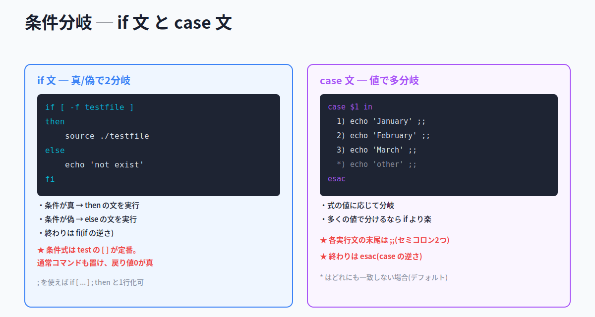

```bash
if 条件式
then
    実行文1      # 条件が真なら実行
else
    実行文2      # 条件が偽なら実行
fi
```

条件が真なら `then` 以下、偽なら `else` 以下が実行されます。**終わりは `fi`**(if を逆さにした綴り)です。

```bash
if [ -f testscript ] ; then
    . ./testscript
else
    echo "testscript file not exist"
fi
```

> 💡 `;` を使えば `if [ -f testscript ] ; then` のように1行にまとめられます。条件式は `test`(`[ ]`)に限らず **通常のコマンド** も置け、その場合は **コマンドの戻り値が0(正常終了)なら真** とみなされます。

#### case 文 ─ 値で多分岐

たくさんの値で分けるときは **case** 文が便利です。

```bash
case $1 in
  1) echo "January" ;;
  2) echo "February" ;;
  3) echo "March" ;;
  *) echo "other" ;;
esac
```

> ⚠ **case文の文法は頻出**。各実行文の末尾は **`;;`(セミコロン2つ)**、全体の **終わりは `esac`**(case を逆さにした綴り)です。`*)` はどの値にも一致しなかった場合(デフォルト)に使います。

#### for 文 ─ リストの数だけ繰り返す

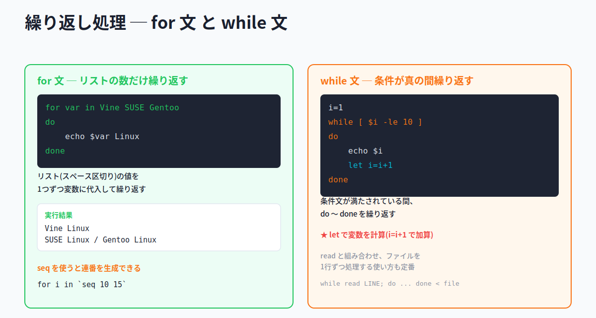

**for** 文は、指定した変数にリスト(スペース区切りの文字列)の値を順に代入しながら、そのつど実行文を実行します。

```bash
for var in Vine SUSE Gentoo
do
    echo $var Linux
done
```

実行すると「Vine Linux」「SUSE Linux」「Gentoo Linux」が順に表示されます。**`seq`** コマンドを使うと連続した数値を生成でき、リストとして利用できます。

```bash
for i in `seq 10 15`     # 10〜15 を生成して繰り返す
do
    echo $i
done
```

#### while 文 ─ 条件が真の間繰り返す

**while** 文は、条件文が満たされている間 `do` 〜 `done` を繰り返します。

```bash
i=1
while [ $i -le 10 ]
do
    echo $i
    let i=i+1     # let で変数を計算(1ずつ増やす)
done
```

> 💡 `let` は算術計算を行うコマンドで、`let i=i+1` で変数を1増やせます。`while` は次の `read` と組み合わせ、ファイルを1行ずつ処理する使い方も定番です。

#### read ─ 標準入力を受け取る

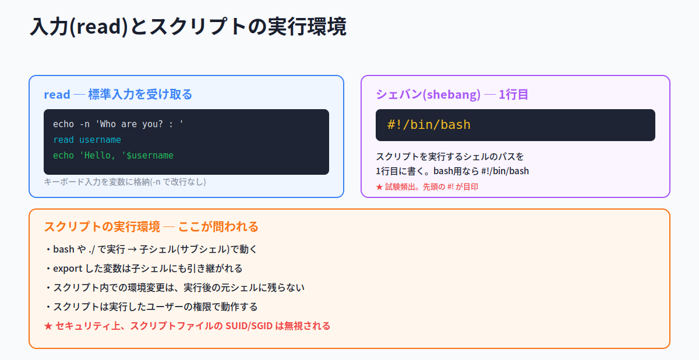

**read** は、スクリプト内で標準入力(キーボードなど)からの入力を受け付け、変数に格納します。

```bash
echo -n "Who are you? : "    # -n で改行しない
read username                # 入力を変数 username に格納
echo "Hello, $username!"
```

`while` と組み合わせると、ファイルから1行ずつ読み込めます。次は、ユーザー名リストのファイルから自動でユーザーを作成する例です。

```bash
while read USERNAME
do
    useradd $USERNAME
    echo $USERNAME | passwd --stdin $USERNAME
done < $1                    # ファイル($1)を1行ずつ読む
```

#### 📌 試験ポイント

| 問われ方 | 答え |
|---|---|
| 真/偽で分岐する制御構造は? | **if 文** |
| if文の終わりは? | **fi** |
| 条件が真のとき実行されるブロックは? | **then** 以下 |
| 値で多分岐する制御構造は? | **case 文** |
| case文で各実行文の末尾に付けるのは? | **;;** |
| case文の終わりは? | **esac** |
| リストの数だけ繰り返すのは? | **for 文** |
| 連続した数値を生成するコマンドは? | **seq** |
| 条件が真の間繰り返すのは? | **while 文** |
| for/whileの繰り返し範囲を囲むのは? | **do 〜 done** |
| 標準入力を受け取るコマンドは? | **read** |

### 7.2.4 シェルスクリプトの実行環境

#### シェバン(shebang) ─ 1行目の指定

スクリプトは、シェルの種類によって書き方が異なります。bash用のスクリプトなら、**1行目** に実行するシェルのパスを書きます。

```bash
#!/bin/bash
```

これを1行目に書くことで、スクリプトはbashで実行されるようになります。この **`#!`** で始まる行を **シェバン(shebang)** と呼びます。

> ⚠ **試験頻出 ─ 1行目は `#!/bin/bash`**。先頭の `#!` が目印です。

#### 実行環境と権限

スクリプトの実行環境については、次の点が問われます。

- `bash` や `./` でスクリプトを実行すると、**子プロセス(サブシェル)** が生成され、そこで実行される
- 元のシェルで **export した変数は、子シェルにも引き継がれる**
- 逆に、**スクリプト内での環境変更は、実行後の元のシェルには反映されない**
- スクリプトは **実行したユーザーの権限** で動作する
- セキュリティ上の理由から、**スクリプトファイルに設定された SUID / SGID は無視される**

> ⚠ **SUID/SGIDの無視は要注意**。第4章で学んだ通り、実行ファイルにSUIDを付けると所有者の権限で動きますが、**シェルスクリプトではこれが無視されます**(他ユーザー権限で動かしたい場合の落とし穴)。

#### 📌 試験ポイント

| 問われ方 | 答え |
|---|---|
| スクリプト1行目に書くシェル指定を何という? | **シェバン(shebang)** |
| bash用スクリプトの1行目は? | **#!/bin/bash** |
| bash/./ で実行したスクリプトはどこで動く? | **子プロセス(サブシェル)** |
| exportした変数は子シェルで有効? | **有効** |
| スクリプトはどの権限で動作する? | **実行したユーザーの権限** |
| スクリプトファイルのSUID/SGIDは? | **無視される** |

#### 📝 ここまでのまとめ

- スクリプト実行: **bash(権限不要・子)/ ./(要実行権・子)/ source・.(現在のシェル)**。**exec** はプロセス置換
- 引数: **$0**(スクリプト名)**$1**(1番目)**$#**(個数)**$@**(全部)。戻り値 **$?**(0=正常)
- **test**(`[ ]`)で条件判定。ファイル(-f -d -e ...)/ 数値(-eq -gt -lt ...)/ 文字列(= != -z -n)
- 分岐: **if 〜 fi**(then/else)、**case 〜 esac**(`;;` で区切る)
- 繰り返し: **for 〜 do 〜 done**(リスト/seq)、**while 〜 do 〜 done**(条件が真の間)。**read** で入力
- 実行環境: 1行目 **#!/bin/bash**、サブシェルで動く、**SUID/SGIDは無視される**

---

## 📝 全体まとめ ─ ここまでの学習内容

このセクションを終えた時点で、次のことができるようになっているはずです：

1. **環境変数**(子プロセスにも有効)と **シェル変数**(そのシェル内のみ)の違いを説明できる
2. **export** でシェル変数を環境変数に昇格できると分かる
3. 代表的な環境変数 **PATH**(コマンド検索パス)・**HOME**(ホーム)を知っている
4. **printenv / env**(環境変数)、**set**(シェル変数も)、**unset**(削除)を区別できる
5. **set -o**(有効)/ **+o**(無効)でシェルのオプションを切り替えられる
6. **noglob / noclobber / ignoreeof** などの主なオプションの意味が分かる
7. **alias** で別名を付け、**unalias** で解除できる(`-a` で全解除)
8. エイリアスを **一時的に無効にするには `\`** を付けると分かる
9. alias定義で値を `'` で囲む理由(スペースを解釈させない)を説明できる
10. **function** で関数を定義でき、`{ }` の内側にスペースが必要だと分かる
11. 関数の引数を **$1** で受け取り、**unset** で削除すると分かる
12. 関数は定義したシェル内でのみ有効で、bashは変数名と関数名を区別しないと分かる
13. bashの設定ファイルが **/etc 以下=全員 / ~ 以下=個人** に分かれると分かる
14. **/etc/profile / ~/.bash_profile / ~/.bashrc / ~/.bash_logout** の役割を区別できる
15. ログインシェルの実行順序(**/etc/profile → ~/.bash_profile → ~/.bash_login → ~/.profile** の順で最初の1つ)を言える
16. 対話型シェルは **~/.bashrc** を読むと分かる
17. シェルスクリプトがテキストにコマンドを並べたものだと分かる
18. 実行方法 **bash(権限不要)/ ./(要実行権)/ source・.(現在のシェル)** を区別できる
19. **bash・./ はサブシェル**、**source・. は現在のシェル** で動く違いを説明できる
20. **exec** がプロセスを置き換えるコマンドだと分かる
21. 引数の変数 **$0(名前)/ $1(1番目)/ $#(個数)/ $@(全部)** を区別できる
22. 戻り値 **$?** が **0=正常 / 0以外=異常** を表すと分かる
23. **test**(`[ ]`)で条件を判定でき、`[ ]` の内側にスペースが必要だと分かる
24. ファイル系(**-f -d -e -r -w -x -s -L**)・数値系(**-eq -ne -gt -ge -lt -le**)・文字列系(**-n -z = !=**)を区別できる
25. 条件分岐 **if 〜 fi**(then/else)を書ける
26. 多分岐 **case 〜 esac**(各文末は `;;`)を書ける
27. 繰り返し **for 〜 do 〜 done**(リスト・seq)と **while 〜 do 〜 done**(条件が真の間)を書ける
28. **read** で標準入力を変数に受け取れると分かる
29. スクリプト1行目の **シェバン #!/bin/bash** の意味が分かる
30. スクリプトは実行ユーザーの権限で動き、**SUID/SGIDは無視される** と分かる

第7章は文法(if/case/for/while)と特殊変数($1, $?)が中心ですが、「変数の有効範囲(export)」「設定ファイルの順序」「test条件式」「終端キーワード(fi/esac/done)」を固めれば、トピック105の得点源になります。

---

## 事前チェックリスト

研修当日の朝、これに自信を持って「✓」を付けられる状態が理想です。
分からない項目があれば、該当セクションに戻って読み直してください。

### シェル環境のカスタマイズ（7.1）

- [ ] 環境変数とシェル変数の違い(有効範囲)を説明できる
- [ ] **export** でシェル変数を環境変数にできると分かる
- [ ] **PATH** がコマンド検索パスだと分かる
- [ ] **HOME** がホームディレクトリを表すと分かる
- [ ] **printenv / env** が環境変数を表示すると分かる
- [ ] **set** がシェル変数も含めて表示すると分かる
- [ ] **unset** で変数を削除できると分かる
- [ ] **set -o** で有効・**set +o** で無効だと分かる
- [ ] **noglob**(メタキャラクタ展開を無効)が分かる
- [ ] **noclobber**(上書き禁止)が分かる
- [ ] **ignoreeof**(Ctrl+Dでログアウトしない)が分かる
- [ ] **alias** でコマンドに別名を付けられると分かる
- [ ] **unalias**(`-a` で全解除)が分かる
- [ ] エイリアスを一時的に無効にするのは **`\`** だと分かる
- [ ] alias定義で `'` で囲む理由が分かる
- [ ] **function** で関数を定義できると分かる
- [ ] `{` の後ろと `}` の前にスペースが必要だと分かる
- [ ] 関数の引数を **$1** で受け取れると分かる
- [ ] 関数の削除が **unset** だと分かる
- [ ] 関数が定義したシェル内でのみ有効だと分かる
- [ ] 設定ファイルが /etc系=全員 / ~系=個人 と分かる
- [ ] **/etc/profile**(全員・ログイン時)が分かる
- [ ] **~/.bash_profile**(個人・ログイン時)が分かる
- [ ] **~/.bashrc**(対話型起動時)が分かる
- [ ] **~/.bash_logout**(ログアウト時)が分かる
- [ ] ログインシェルの実行順序を言える
- [ ] 個人ファイルは最初に見つかった1つだけ実行と分かる
- [ ] ログインシェルが `ps` で `-bash` と見えると分かる

### シェルスクリプト（7.2）

- [ ] シェルスクリプトがテキストにコマンドを並べたものだと分かる
- [ ] **bash script**(実行権不要)で実行できると分かる
- [ ] **./script**(要実行権 `chmod +x`)で実行できると分かる
- [ ] **source** / **.** が現在のシェルで実行されると分かる
- [ ] **.** が source の省略形だと分かる
- [ ] bash/./ はサブシェル、source/. は現在のシェルと区別できる
- [ ] **./** が必要な理由(PATHが通っていない)が分かる
- [ ] **exec** がプロセスを置き換えると分かる
- [ ] **$0**(スクリプト名)が分かる
- [ ] **$1 $2 ...**(位置パラメータ)が分かる
- [ ] **$#**(引数の数)が分かる
- [ ] **$@ / $***(すべての引数)が分かる
- [ ] **$?**(戻り値)が分かる
- [ ] 戻り値 **0=正常 / 0以外=異常** だと分かる
- [ ] **test** / **[ ]** で条件を判定できると分かる
- [ ] **[ ]** の内側にスペースが必要だと分かる
- [ ] ファイル系条件(**-f -d -e -r -w -x -s -L**)が分かる
- [ ] 数値系条件(**-eq -ne -gt -ge -lt -le**)が分かる
- [ ] 文字列系条件(**-n -z = !=**)が分かる
- [ ] 論理結合(**! -a -o**)が分かる
- [ ] **if 〜 then 〜 else 〜 fi** を書ける
- [ ] if文の終わりが **fi** だと分かる
- [ ] **case 〜 esac** を書ける
- [ ] case文の各文末が **;;** だと分かる
- [ ] case文の終わりが **esac** だと分かる
- [ ] **for 〜 do 〜 done** を書ける
- [ ] **seq** で連番を生成できると分かる
- [ ] **while 〜 do 〜 done** を書ける
- [ ] **read** で標準入力を受け取れると分かる
- [ ] 1行目の **#!/bin/bash**(シェバン)が分かる
- [ ] スクリプトが実行ユーザーの権限で動くと分かる
- [ ] スクリプトの **SUID/SGIDは無視される** と分かる

### コマンド・記法総まとめ（暗記）

これらを「見ただけで何をするか」答えられるようになっていれば理想です：

| コマンド・記法 | これは何? |
|---|---|
| `export VAR` | |
| `printenv` / `printenv HOME` | |
| `env` | |
| `set` | |
| `set -o noglob` / `set +o noglob` | |
| `unset VAR` | |
| `alias ls='ls -l'` | |
| `unalias ls` / `unalias -a` | |
| `\ls` | |
| `function f() { ...; }` | |
| `declare -f` | |
| `bash script` | |
| `./script` | |
| `source script` / `. script` | |
| `exec zsh` | |
| `test -f file` / `[ -f file ]` | |
| `[ $a -eq $b ]` | |
| `[ -z "$s" ]` | |
| `if ... ; then ... else ... fi` | |
| `case $1 in ... ;; esac` | |
| `for i in ... ; do ... done` | |
| `seq 10 15` | |
| `while [ ... ] ; do ... done` | |
| `read username` | |
| `let i=i+1` | |
| `#!/bin/bash` | |

### 特殊変数・記号総まとめ（暗記）

| 記号 | これは何? |
|---|---|
| `$0` | |
| `$1` / `$2` | |
| `$#` | |
| `$@` / `$*` | |
| `$?` | |
| 戻り値 `0` / `0以外` | |
| `-o` / `+o`（set） | |
| `\`（コマンド前） | |
| `;;`（case） | |
| `fi` / `esac` / `done` | |
| `#!`（1行目） | |

### test条件式総まとめ（暗記）

| 条件式 | これは何? |
|---|---|
| `-f` / `-d` / `-e` | |
| `-r` / `-w` / `-x` | |
| `-s` / `-L` | |
| `-nt` / `-ot` | |
| `-eq` / `-ne` | |
| `-gt` / `-ge` / `-lt` / `-le` | |
| `-n` / `-z` | |
| `=` / `!=`（文字列） | |
| `!` / `-a` / `-o` | |

### ファイル・パス総まとめ（暗記）

| パス | これは何? |
|---|---|
| `/etc/profile` | |
| `/etc/bash.bashrc` | |
| `/etc/bashrc` | |
| `~/.bash_profile` | |
| `~/.bash_login` | |
| `~/.profile` | |
| `~/.bashrc` | |
| `~/.bash_logout` | |
| `/bin/bash` | |

### 用語総まとめ（暗記）

これらの用語を「自分の言葉で説明できる」状態が目標：

- [ ] 環境変数 / シェル変数
- [ ] エクスポート（export）
- [ ] シェルのオプション
- [ ] エイリアス
- [ ] 関数（function）
- [ ] 設定ファイル（profile / bashrc）
- [ ] ログインシェル / 対話型シェル
- [ ] シェルスクリプト
- [ ] サブシェル（子プロセス）
- [ ] source（ドットコマンド）
- [ ] exec
- [ ] 位置パラメータ（$1, $2 ...）
- [ ] 戻り値（$?）
- [ ] test コマンド / [ ]
- [ ] 条件分岐（if / case）
- [ ] 繰り返し（for / while）
- [ ] read
- [ ] seq / let
- [ ] シェバン（shebang）
- [ ] PATH（第3章の復習）
- [ ] SUID / SGID（第4章の復習）

---

## 研修当日に向けて

事前学習がきちんとできていれば、研修当日は以下の流れで進みます：

1. **おさらい**（このチェックリストの中から数問）
2. **Hackの説明**（覚え方のコツ、暗記時間）
3. **テスト**（実際の試験問題を含む）
4. **答え合わせ・おさらい**

第7章は、102試験で初めて登場する「プログラミングっぽい」章です。`if` や `for` といった文法、`$1` や `$?` といった記号が並ぶと身構えてしまうかもしれませんが、心配いりません。どれも **「やりたいこと」と「書き方」をセットで覚えれば** すっと頭に入ります。「export = 輸出して外に届く」「fi は if の逆さ・esac は case の逆さ」「数値比較は英語の略(eq, gt, lt)」のように、この資料に散りばめたHack(覚え方のコツ)を手がかりに読み進めてください。

研修当日にいきなり知らない文法や記号が並ぶと焦ってしまうものです。事前にこの資料で予備知識を入れておけば、当日は **「あ、これ事前学習で見た」** という安心感を持ちながら進められます。
分からない部分があっても**慌てる必要はありません**。一度通読してから、チェックリストで自分のウィークポイントを把握しておけば、研修で確実に固められます。

頑張ってください。
