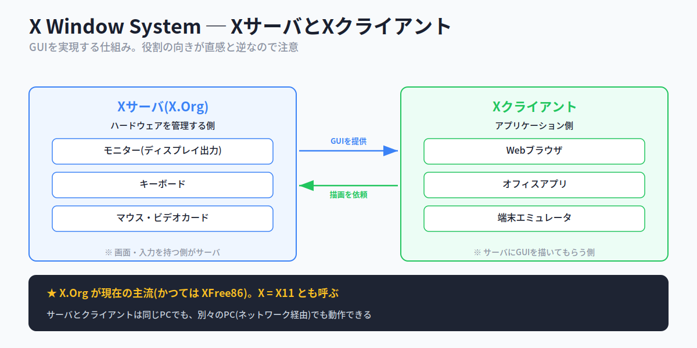
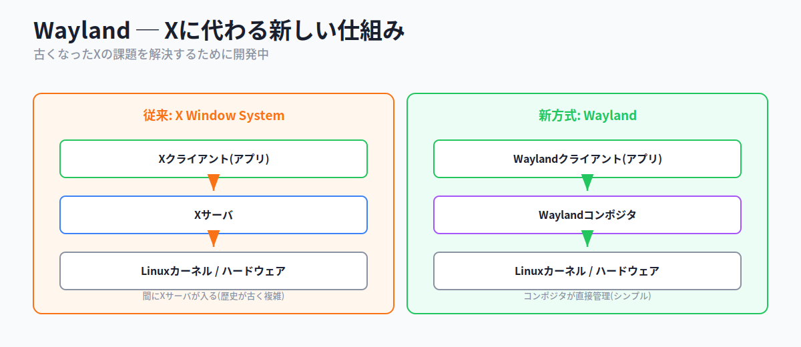
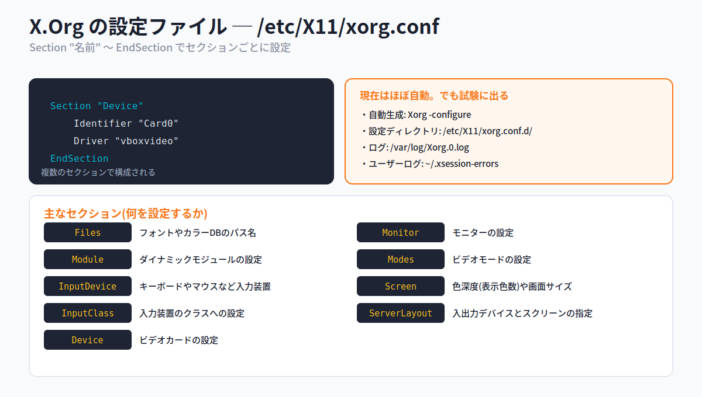
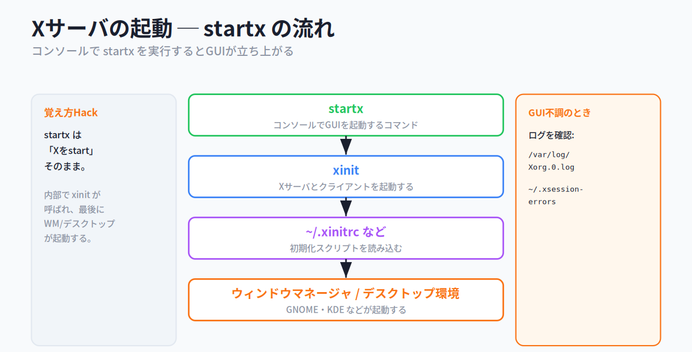
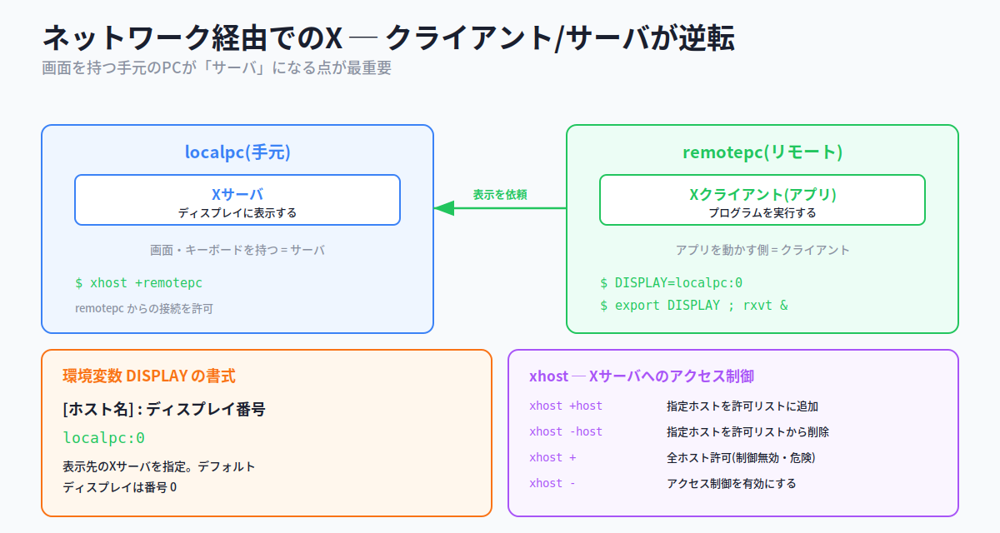
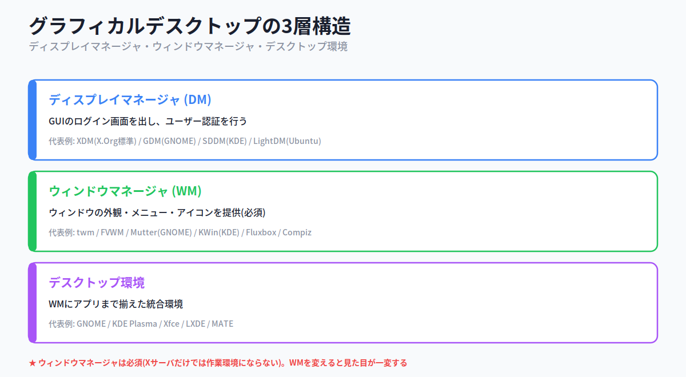
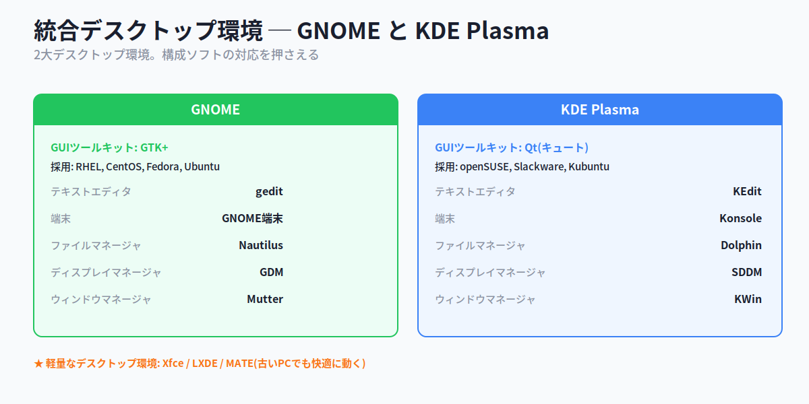
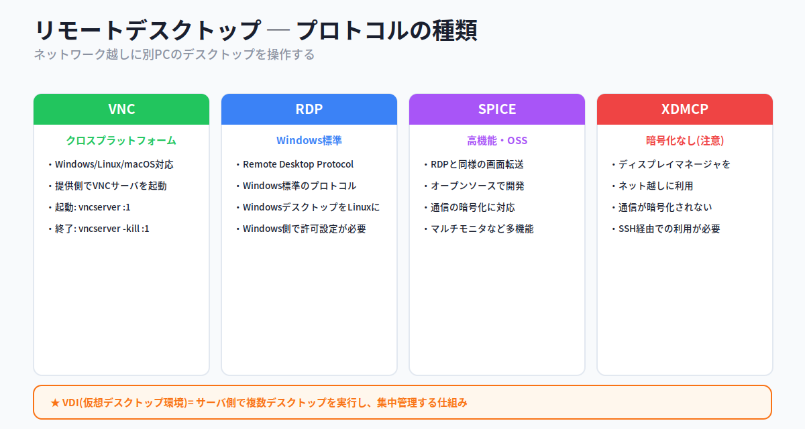
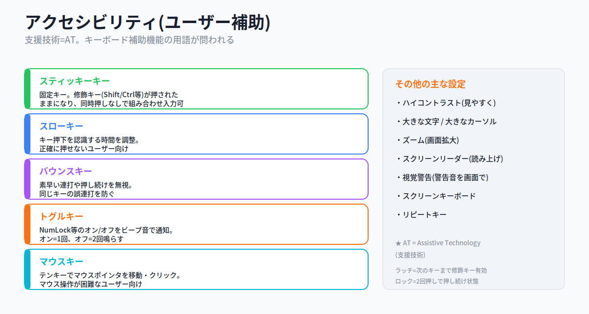

# 第8章：ユーザーインターフェースとデスクトップ

> **この資料について**
> これは研修当日のための **予備知識** をまとめた資料です。
> 研修当日は **おさらい → 暗記のコツの説明 → テスト → 答え合わせ** という流れで進むため、当日「初めて聞く話」が出てこないように、ここで必要な前提をひと通り押さえておきます。
>
> Linuxを触ったことがなくても理解できるよう、できるだけ身近な例で書いています。
>
> **前提**
> この資料は **101試験の範囲(第1〜5章)** と **第7章(シェルとシェルスクリプト)** をひと通り学んでいることを前提にしています。とくに第7章で学んだ **環境変数とexport** は、本章の「ネットワーク経由でのX(環境変数DISPLAY)」で再登場します。あやしい場合は先にそちらを確認してください。
>
> **この章の重要度について**
> 第8章は、102試験の「トピック106(ユーザーインターフェースとデスクトップ)」に対応します。トピック106は出題数こそ多くありませんが、**用語を覚えていれば確実に得点できる** 章です。「X Window System(X.Org)とクライアント/サーバの関係」「xorg.confのセクション」「xhostとDISPLAY」「ディスプレイマネージャ/ウィンドウマネージャ/デスクトップ環境の区別」「VNCなどのリモートデスクトップ」「アクセシビリティの用語」が問われます。手を動かすより **名前と役割の暗記** が中心の章です。
>
> **読み方の指針**
> 1. まずは1回ざっと通読してください(細かい暗記は不要)
> 2. 各セクションの「📌 試験ポイント」と「📝 ここまでのまとめ」を見直してください
> 3. 巻末の「事前チェックリスト」で自分の理解度を測ってください
> 4. 研修当日は、このチェックリストのおさらいから始まります

---

<!-- ## 目次

- [8.1 Xのインストールと設定](#81-xのインストールと設定)
  - [8.1.1 GUIを実現する技術](#811-guiを実現する技術)
  - [8.1.2 X.Orgの設定](#812-xorgの設定)
  - [8.1.3 Xサーバの起動](#813-xサーバの起動)
  - [8.1.4 ネットワーク経由でのXの利用](#814-ネットワーク経由でのxの利用)
- [8.2 グラフィカルデスクトップ](#82-グラフィカルデスクトップ)
  - [8.2.1 ディスプレイマネージャ](#821-ディスプレイマネージャ)
  - [8.2.2 ウィンドウマネージャ](#822-ウィンドウマネージャ)
  - [8.2.3 デスクトップ環境](#823-デスクトップ環境)
  - [8.2.4 リモートデスクトップ](#824-リモートデスクトップ)
- [8.3 アクセシビリティ](#83-アクセシビリティ)
  - [8.3.1 アクセシビリティの設定](#831-アクセシビリティの設定)
- [事前チェックリスト](#事前チェックリスト)

--->

## 8.1 Xのインストールと設定

### ここで学ぶこと

- LinuxでGUI(画面)を実現する仕組み **X Window System(X.Org)**
- Xの **クライアント/サーバ方式** という、ちょっと不思議な役割分担
- Xの設定ファイル **xorg.conf** のセクション
- Xを起動する **startx** と、**ネットワーク経由でX** を使う方法

私たちが普段Windowsやスマホで見ている「ウィンドウ」「アイコン」「マウスで操作する画面」を **GUI**(Graphical User Interface:グラフィカルなユーザー操作画面)と呼びます。一方、第3章までで扱ってきた黒い画面にコマンドを打つ操作は **CUI**(Character User Interface:文字ベースの操作画面)です。

ここで知っておきたいのは、Linuxにとって **GUIは「後付けの仕組み」** だということです。Linuxの土台(カーネル)はCUIで動いており、その上にGUIを実現するソフトウェアを乗せて、はじめてマウスで操作する画面が使えるようになります。Windowsのように最初から画面が一体化しているのとは発想が違います。この「乗せる仕組み」の代表が、これから学ぶ **X Window System** です。この節では、LinuxがどうやってGUIを実現しているのか、その土台となる仕組みを学びます。

### 8.1.1 GUIを実現する技術

#### X Window System ─ GUIの土台

LinuxやUNIXでは、GUIを実現するために **X Window System**(略して **X** または **X11**)が古くから使われてきました。「ウィンドウを表示し、マウスやキーボードの操作を受け付ける」という、GUIの一番下の土台を担うソフトウェアです。かつてはフリー(無償)の実装である **XFree86** が多くのディストリビューションで使われていましたが、現在はそこから派生した **X.Org** が主流です。

> ここで「実装」とは、同じ仕組み(X Window System)を実際に動くソフトウェアとして作ったもの、という意味です。「Xという規格」に対して「X.Orgというその具体的な製品」と考えてください。



#### クライアント/サーバ方式 ─ 向きに注意

Xは **クライアント/サーバ方式** を採用しています。ここが第8章で最初につまずきやすいポイントなので、丁寧に見ていきます。

そもそも「クライアント/サーバ方式」とは、役割を「サービスを提供する側(サーバ)」と「それを利用する側(クライアント)」に分ける考え方です。普段は「サーバ=遠くにある強力なコンピュータ、クライアント=手元の端末」とイメージしがちですが、**Xではこの役割の決め方が独特** です。

- **Xサーバ**: モニター・ビデオカード・キーボードといった **ハードウェアを管理** する側。アプリに「画面を描く」というサービスを提供する
- **Xクライアント**: Webブラウザやオフィスアプリなどの **ユーザーアプリケーション** 側。Xサーバに「これを描いて」と依頼する

つまり、**「画面・キーボードを持っている側」がサーバ**、**「アプリを動かす側」がクライアント** です。レストランでたとえると、料理(画面表示)を出してくれる厨房がXサーバ、注文する客がXクライアント。客(アプリ)は自分で料理を作らず、厨房(画面を持つPC)にお願いする、という関係です。

XサーバとXクライアントは、**同じコンピュータ上** で動いても、**別々のコンピュータ上**(ネットワーク経由)で動いてもかまいません。同じPCで完結している場合は意識しませんが、8.1.4のネットワーク経由の話で、この役割分担が効いてきます。

> 💡 **覚え方Hack ─ 「画面を出す側がサーバ」**
> Xでは「ユーザーに画面サービスを提供する側」がサーバです。手元のモニター・キーボードを持っている自分のPCがXサーバ、その画面を借りて動くアプリがXクライアント。普通のサーバ/クライアントの感覚と逆に見えるので、「画面=サーバ」と覚えてしまいましょう。

#### Wayland ─ Xに代わる新しい仕組み

X Window Systemはとても古く(1980年代から続く)、現代のコンピュータ環境ではいろいろと無理が出てきています。設計が古いぶん構造も複雑で、動作も重くなりがちです。そこで、**まったく新しい仕組み** として **Wayland** が開発されています。

Xでは「アプリ」と「ハードウェア」の間に **Xサーバ** という仲介役が挟まりますが、Waylandでは **コンポジタ**(ウィンドウマネージャに相当する部品)が直接ハードウェアやグラフィックを管理します。仲介役が減るぶんシンプルで効率的です。ただし、まだWaylandに対応していないアプリケーションもあり、移行は進行中です。



#### 📌 試験ポイント

| 問われ方 | 答え |
|---|---|
| LinuxでGUIを実現する仕組みは? | **X Window System**(X / X11) |
| 現在主流のX実装は? | **X.Org** |
| かつて主流だったフリーのX実装は? | **XFree86** |
| ハードウェアを管理するのはどちら? | **Xサーバ** |
| アプリケーション側はどちら? | **Xクライアント** |
| Xに代わる新しい仕組みは? | **Wayland** |

### 8.1.2 X.Orgの設定

#### 設定ファイルは xorg.conf

X.Orgの動作(どのビデオカードを使うか、画面の解像度はどうするか、など)は、設定ファイルで決められます。そのファイルが **/etc/X11/xorg.conf** です。

ただし、これは少し補足が必要です。**現在のLinuxでは、xorg.confを手で書く必要はほとんどありません**。ハードウェアを自動認識して、適切な設定をその場で組み立ててくれるからです。とはいえ **LPIC試験では、このxorg.confについて問われます**。ですから、ここでは「設定を `/etc/X11/xorg.conf` で行う」という前提で、その中身を学んでおきます。

設定は `/etc/X11/xorg.conf` という1つのファイルのほか、**/etc/X11/xorg.conf.d** というディレクトリの下に、複数の `.conf` ファイルに分けて置かれることもあります(設定を用途ごとにファイル分割する方式)。



#### セクション構造

xorg.confは、設定が用途ごとに **セクション** という単位にまとめられています。各セクションは **`Section "セクション名"` で始まり `EndSection` で終わる** 範囲で、その中に関連する設定を書きます。「項目ごとに見出しを付けて整理したノート」をイメージしてください。

```
Section "Device"
    Identifier "Card0"
    Driver "vboxvideo"
EndSection
```

上は「Device(ビデオカード)」セクションの例で、「Card0という名前で、vboxvideoというドライバを使う」と設定しています。

主なセクションと、その役割を覚えましょう。試験では **どのセクションで何を設定するか** がそのまま問われます。

| セクション | 何を設定するか |
|---|---|
| **Files** | フォントやカラーデータベースファイルのパス名 |
| **Module** | ダイナミックモジュールの設定 |
| **InputDevice** | キーボードやマウスなどの入力装置の設定 |
| **InputClass** | 入力装置の「クラス」に適用される設定 |
| **Device** | **ビデオカード** の設定 |
| **Monitor** | モニターの設定 |
| **Modes** | ビデオモードの設定 |
| **Screen** | ディスプレイの色深度(表示色数)や画面サイズの設定 |
| **ServerLayout** | 入出力デバイスとスクリーンの指定 |

> ⚠ **DeviceとInputDeviceの混同に注意**。名前が似ていますが、**Device = ビデオカード(出力側)**、**InputDevice = キーボードやマウス(入力側)** です。「Input が付く方が入力装置」と区別しましょう。試験では「マウスの設定はどのセクション?」→ InputDevice、「ビデオカードは?」→ Device、という形でよく問われます。

#### 設定の補助とトラブル時のログ

xorg.confを手書きするのは難解なので、補助ツールが用意されています。ハードウェアを調べて(スキャンして)設定ファイルを **自動生成** するには、次のコマンドを使います。

```bash
# Xorg -configure       # ハードウェアを調べて xorg.conf を自動生成する
```

また、GUIがうまく起動しない(GUIログインに失敗する、画面が真っ暗になる、など)ときは、**ログファイル**(動作の記録)を見て原因を探ります。

- **/var/log/Xorg.0.log** ─ Xサーバの動作ログ(末尾の数字 `0` はディスプレイ番号)
- **~/.xsession-errors** ─ デスクトップ上で動くアプリのエラーログ(ユーザーごと)

> 💡 「システム全体のXの記録 → `/var/log/Xorg.0.log`」「自分のデスクトップアプリの記録 → `~/.xsession-errors`」と、置き場所(全体用の `/var/log` か、個人用の `~` か)で区別すると覚えやすいです。

#### 📌 試験ポイント

| 問われ方 | 答え |
|---|---|
| X.Orgの中心となる設定ファイルは? | **xorg.conf**(/etc/X11/xorg.conf) |
| 複数の設定ファイルを置くディレクトリは? | **/etc/X11/xorg.conf.d** |
| ビデオカードを設定するセクションは? | **Device** |
| キーボードやマウスを設定するセクションは? | **InputDevice** |
| 色深度や画面サイズを設定するセクションは? | **Screen** |
| 入出力デバイスとスクリーンを指定するのは? | **ServerLayout** |
| 設定ファイルを自動生成するコマンドは? | **Xorg -configure** |
| Xサーバのログファイルは? | **/var/log/Xorg.0.log** |

### 8.1.3 Xサーバの起動

#### startx ─ コンソールからGUIを起動

GUIの設定が整っていれば、CUIの画面(コンソール)から **startx** コマンドを実行することで、X Window System(GUI)を起動できます。「文字の画面から、グラフィカルな画面へ切り替える号令」だと思ってください。その内部では、いくつかの段階を踏んでGUIが立ち上がります。



1. **startx** を実行する(GUI起動の号令)
2. 内部で **xinit** が呼ばれ、Xサーバとクライアントを起動する
3. **~/.xinitrc** などの初期化スクリプトを読み込む(起動時の設定を反映)
4. **ウィンドウマネージャ / デスクトップ環境**(GNOME・KDEなど)が起動し、いつもの画面になる

つまり、`startx` 一発の裏で「Xサーバ起動 → 設定読み込み → デスクトップ表示」という連鎖が起きているわけです。各段階の細かいファイル名まで暗記する必要はなく、「`startx` が入口で、内部で `xinit` が呼ばれる」という流れを押さえれば十分です。

> 💡 **覚え方Hack ─ startx は「Xをstart」**。名前そのままです。困ったときは「GUIを手動で立ち上げる = startx」とだけ覚えておけば対応できます。

#### 📌 試験ポイント

| 問われ方 | 答え |
|---|---|
| コンソールからGUIを起動するコマンドは? | **startx** |
| startxの内部で呼ばれるコマンドは? | **xinit** |
| 起動時に読まれる初期化スクリプトは? | **~/.xinitrc** など |

### 8.1.4 ネットワーク経由でのXの利用

#### クライアント/サーバが「逆転」して見える

ここがトピック106の山場のひとつです。Xは **ネットワーク経由** でも使えます。具体的には、**あるコンピュータで動いているアプリ(Xクライアント)の画面を、別のコンピュータの画面(Xサーバ)に表示して操作する** ことができます。

8.1.1で学んだ「画面を持つ側がXサーバ」を、ここで思い出してください。次のような状況を考えます。

- **localpc(手元のPC)**: あなたが今触っている、モニターとキーボードのあるPC。画面表示を担当する = **Xサーバ**
- **remotepc(リモートのPC)**: 離れた場所にあり、実際にアプリ(プログラム)を動かすPC = **Xクライアント**

「手元のPC = サーバ、遠くのPC = クライアント」── 一般的な感覚(手元=クライアント、遠く=サーバ)とは **真逆** になります。これは「画面サービスを提供しているのは手元のPCだから」です。ここが試験で最も狙われるポイントです。



#### xhost ─ Xサーバへのアクセス制御

リモートのアプリ(Xクライアント)が、手元の画面(Xサーバ)を勝手に使えてしまうとセキュリティ上問題です。そこで、**「どのコンピュータからの表示を受け入れるか」を手元側で許可する** 必要があります。これを行うのが **xhost** コマンドです。「受付に通行許可証を登録する」イメージです。

```
書式: xhost [+-][ホスト名]
```

| 指定 | 説明 |
|---|---|
| **xhost +ホスト名** | 指定したホストを接続許可リストに追加する(通行許可) |
| **xhost -ホスト名** | 指定したホストを許可リストから削除する(許可取り消し) |
| **xhost +** | すべてのホストの接続を許可する(アクセス制御を無効化・誰でも入れる状態で危険) |
| **xhost -** | アクセス制御を有効にする(許可制に戻す) |

```bash
[lpic@localpc]$ xhost +remotepc     # remotepc からの表示を受け入れる
```

#### 環境変数 DISPLAY ─ 表示先を指定

許可を出したら、次は **リモート側(アプリを動かす側)に「画面をどこに出すか」を教えます**。これに使うのが、第7章で学んだ **環境変数** の仲間、**DISPLAY** です。「出力先の宛先ラベル」のような役割です。

DISPLAYに表示先のXサーバを設定し、`export` で環境変数にすることで、そこから起動するアプリの表示先が決まります(第7章のexportがここで活きます)。

```
書式: [ホスト名]:ディスプレイ番号
```

```bash
[lpic@remotepc]$ DISPLAY=localpc:0     # 表示先を localpc のディスプレイ0に設定
[lpic@remotepc]$ export DISPLAY        # 環境変数にして、起動するアプリに引き継ぐ
[lpic@remotepc]$ rxvt &                # アプリを起動 → localpc の画面に表示される
```

「ホスト名」にはXサーバ(=表示先)のホスト名かIPアドレスを、「ディスプレイ番号」にはデフォルトの画面なら **0** を指定します。`localpc:0` は「localpcの0番ディスプレイに表示せよ」という意味です。

#### X11フォワーディング

リモートでアプリを動かして手元に表示する、より安全な方法として **X11フォワーディング** があります。これは **SSH**(暗号化された安全な通信路。詳しくは後の章)を経由してXの表示を転送する仕組みです。通信が暗号化されるため、`xhost`+`DISPLAY` の方式より安全です。利用にはSSHサーバ・クライアント双方の適切な設定が必要です。

#### 📌 試験ポイント

| 問われ方 | 答え |
|---|---|
| ネットワーク経由でXを使うとき、手元のPCはどちら? | **Xサーバ** |
| アプリを実行するリモート側はどちら? | **Xクライアント** |
| Xサーバへのアクセスを許可するコマンドは? | **xhost** |
| ホストを許可リストに追加するには? | **xhost +ホスト名** |
| 表示先のXサーバを指定する環境変数は? | **DISPLAY** |
| DISPLAYの書式は? | **ホスト名:ディスプレイ番号** |
| SSH経由でXを転送する仕組みは? | **X11フォワーディング** |

#### 📝 ここまでのまとめ

- GUIの土台は **X Window System**(X / X11)。現在の実装は **X.Org**(旧 XFree86)
- **クライアント/サーバ方式**: **画面・入力を持つ側がXサーバ**、**アプリ側がXクライアント**(向きに注意)
- 新しい仕組みは **Wayland**(コンポジタが直接管理し、Xサーバの仲介がない)
- 設定ファイルは **xorg.conf**。セクション: **Device=ビデオカード / InputDevice=入力装置 / Screen=色深度・画面サイズ / ServerLayout** など
- 自動生成は **Xorg -configure**、ログは **/var/log/Xorg.0.log**(全体)と **~/.xsession-errors**(個人)
- GUI起動は **startx**(内部で xinit → ~/.xinitrc → WM/デスクトップ)
- ネットワーク経由: **手元=Xサーバ**(逆転)、**xhost** で許可、**DISPLAY** で表示先指定。SSH経由は **X11フォワーディング**

---

## 8.2 グラフィカルデスクトップ

### ここで学ぶこと

- GUIログイン画面を出す **ディスプレイマネージャ**
- ウィンドウの見た目を担う **ウィンドウマネージャ**
- それらを統合した **デスクトップ環境**(GNOME・KDEなど)
- ネットワーク越しに操作する **リモートデスクトップ**(VNCなど)

8.1では、GUIの一番下の土台(X)を学びました。しかし、実は **Xサーバだけでは、まだ実際に使える画面にはなりません**。Xはあくまで「画面に絵を描く能力」を提供するだけで、その上で「ログイン画面を出す」「ウィンドウに枠や閉じるボタンを付ける」「アプリを統一感のあるデザインで揃える」といった役割は、別のソフトウェアが担います。

家を建てるのにたとえると、X(土台)は基礎工事のようなもの。その上に「玄関(ログイン)」「壁や窓(ウィンドウの外観)」「内装一式(統合環境)」が乗って、はじめて住める家になります。この節では、その3つの層 ── **ディスプレイマネージャ・ウィンドウマネージャ・デスクトップ環境** を整理します。



### 8.2.1 ディスプレイマネージャ

#### GUIのログイン画面を担う

電源を入れてLinuxを起動すると、GUI環境では「ユーザー名とパスワードを入れるログイン画面」が出てきます。この **GUIのログイン画面を表示し、ユーザー認証(本人確認)を行う** ソフトウェアが **ディスプレイマネージャ**(DM)です。家でいえば「玄関で来訪者を確認する受付」にあたります。

代表的なディスプレイマネージャは次の通りです。どのデスクトップ環境に付属するか、という対応で覚えるのがコツです。

| ディスプレイマネージャ | 特徴 |
|---|---|
| **XDM**(X Display Manager) | X.Org標準のディスプレイマネージャ |
| **GDM**(Gnome Display Manager) | GNOMEで利用される |
| **SDDM**(Simple Desktop Display Manager) | KDE Plasmaで利用される |
| **LightDM** | Ubuntuで標準採用されている(軽量) |

複数のデスクトップ環境がインストールされている場合、ディスプレイマネージャのログイン画面で **「どの環境でログインするか」を選んで切り替え** られます(玄関で「和室と洋室どちらに通すか」を選ぶイメージ)。

なお、GUI環境をインストールしても、デフォルトのログインがCUIになっている場合があります。その場合、システム起動時にディスプレイマネージャが自動で立ち上がるよう設定します(LightDMの例)。

```bash
# systemctl enable lightdm.service     # 起動時にlightdmを自動有効化
```

> 💡 **覚え方Hack ─ 頭文字で対応づけ**。**G**DM=**G**NOME(頭文字が一致)、**S**DDM=KDE(Simple **D**esktop)、**Light**DM=Ubuntu(軽量)、**X**DM=**X**.Org標準。とくに「GDMのG=GNOME」が最大の手がかりです。

#### 📌 試験ポイント

| 問われ方 | 答え |
|---|---|
| GUIログイン画面を出し認証するソフトは? | **ディスプレイマネージャ** |
| X.Org標準のディスプレイマネージャは? | **XDM** |
| GNOMEで使われるのは? | **GDM** |
| KDE Plasmaで使われるのは? | **SDDM** |
| Ubuntu標準のディスプレイマネージャは? | **LightDM** |

### 8.2.2 ウィンドウマネージャ

#### Xの外観を制御する

ログインした後、画面に並ぶウィンドウには「タイトルバー」「最小化・最大化・閉じるボタン」「枠」があり、ドラッグで動かせます。この **ウィンドウの外観・メニュー・アイコンなどを提供** するのが **ウィンドウマネージャ**(WM)です。家でいえば「壁・窓・ドアの建具」にあたります。

重要なのは、**ウィンドウマネージャは必須** だという点です。Xサーバだけでは、ウィンドウを動かすことも、複数のアプリを並べることもできず、作業環境として使えません。建具のない家には住めないのと同じです。そして、ウィンドウマネージャを変えると、ものによっては **まるで別のOSのように見た目や操作感が一変** します(同じ家でも内装業者を変えると雰囲気がガラッと変わる、という感覚)。

代表的なウィンドウマネージャを挙げます。すべて暗記する必要はなく、太字のものを押さえれば十分です。

| ウィンドウマネージャ | 特徴 |
|---|---|
| **twm** | 最小限の機能を備えた基本的なWM |
| **FVWM** | 軽快でシンプルなWM |
| **Enlightenment** | 高度なカスタマイズが可能なWM |
| **Metacity** | GNOME 2の標準WM |
| **Mutter** | **GNOME 3** の標準WM |
| **Fluxbox** | 軽快でカスタマイズ性の高いWM |
| **WindowMaker** | 簡素で軽量なWM |
| **Compiz** | 立体的な画面効果が華やかなWM |
| **KWin** | **KDE** の標準WM |

> 💡 試験で重要なのは **Mutter(GNOME)** と **KWin(KDE)** の対応です。次のデスクトップ環境の話とセットで覚えましょう。「GNOMEのウィンドウを動かすのがMutter、KDEのウィンドウを動かすのがKWin」です。

#### 📌 試験ポイント

| 問われ方 | 答え |
|---|---|
| ウィンドウの外観・メニューを提供するソフトは? | **ウィンドウマネージャ** |
| ウィンドウマネージャは必須? | **必須**(Xサーバだけでは使えない) |
| GNOME 3の標準ウィンドウマネージャは? | **Mutter** |
| KDEの標準ウィンドウマネージャは? | **KWin** |

### 8.2.3 デスクトップ環境

#### ウィンドウマネージャ + アプリの統合

ウィンドウマネージャだけでも操作はできますが、現在は **ウィンドウマネージャに加えて、ファイル管理・テキスト編集・端末などのアプリまで一式揃え、統一的なデザイン・操作感で提供する** のが一般的です。これを **統合デスクトップ環境** と呼びます。家具・家電・内装まで揃った「フルセットの住まい」にあたります。

代表例が **GNOME** と **KDE Plasma** です。両者は土台となる **GUIツールキット**(ボタンやメニューなどのGUI部品を集めたライブラリ)が異なります。



- **GNOME**(グノーム): **GTK+** というGUIツールキットをベースに開発。ディスプレイマネージャは **GDM**、ウィンドウマネージャは **Mutter**。Red Hat Enterprise Linux・CentOS・Fedora・Ubuntuなどで標準採用
- **KDE Plasma**: **Qt(キュート)** というGUIツールキットをベースに開発。ディスプレイマネージャは **SDDM**、ウィンドウマネージャは **KWin**。openSUSE・Slackware・Kubuntuなどで標準採用

> 💡 **GUIツールキット** とは、ウィンドウ・ボタン・メニューといったGUIの「部品」をまとめた道具箱(ライブラリ)のこと。これが違うと、見た目や使い勝手の土台が変わります。**GNOME=GTK+**、**KDE=Qt** の対応は頻出です。

両者の構成ソフトを対比して覚えると、試験で問われたときに迷いません。

| 種類 | GNOME | KDE Plasma |
|---|---|---|
| テキストエディタ | gedit | KEdit |
| 端末 | GNOME端末 | Konsole |
| ファイルマネージャ | **Nautilus** | **Dolphin** |
| ディスプレイマネージャ | **GDM** | **SDDM** |
| ウィンドウマネージャ | **Mutter** | **KWin** |
| GUIツールキット | **GTK+** | **Qt** |

#### 軽量なデスクトップ環境

GNOMEやKDEは多機能なぶん、それなりのCPUパワーやメモリを必要とします。そのため、性能の低い古いPCでは動作が重く、快適とはいえません。そうしたPCでも軽快に動くよう、機能を絞った軽量なデスクトップ環境として **Xfce・LXDE・MATE** などがあります。

> 💡 「古いPC・非力なPCでも軽快に動く → Xfce / LXDE / MATE」とセットで覚えておきましょう。「重いのがGNOME/KDE、軽いのがXfce/LXDE/MATE」という対比です。

#### 📌 試験ポイント

| 問われ方 | 答え |
|---|---|
| WMにアプリまで揃えた統合環境を何という? | **(統合)デスクトップ環境** |
| 2大デスクトップ環境は? | **GNOME** と **KDE Plasma** |
| GNOMEのGUIツールキットは? | **GTK+** |
| KDEのGUIツールキットは? | **Qt** |
| GNOMEのファイルマネージャは? | **Nautilus** |
| KDEのファイルマネージャは? | **Dolphin** |
| 軽量なデスクトップ環境は? | **Xfce / LXDE / MATE** |

### 8.2.4 リモートデスクトップ

#### ネットワーク越しにデスクトップを操作

**リモートデスクトップ** は、ネットワーク経由で離れたコンピュータのデスクトップ画面を、手元のコンピュータに丸ごと映して操作する技術です。たとえば手元のWindows PCから、別の部屋にあるLinux PCのデスクトップをそのまま操作する、といったことができます。「離れた場所のPC画面をテレビ電話のように手元に映し、遠隔操作する」イメージです。

8.1.4の「ネットワーク経由でのX」が **個々のアプリの画面** を飛ばすのに対し、リモートデスクトップは **デスクトップ全体** を飛ばす、という違いがあります。



画面を飛ばすやり方(プロトコル=通信の約束事)にはいくつかの種類があり、それぞれ特徴があります。

| 名前 | 説明 |
|---|---|
| **VNC**(Virtual Network Computing) | Windows/Linux/macOSに対応した **クロスプラットフォーム**(OSを問わない)。画面を提供する側で **VNCサーバ** を動かす |
| **RDP**(Remote Desktop Protocol) | **Windows標準** のリモートデスクトッププロトコル |
| **SPICE** | RDPと同様の画面転送プロトコルで、**オープンソース** で開発。通信の暗号化やマルチモニタなど多機能 |
| **XDMCP**(X Display Manager Control Protocol) | ディスプレイマネージャをネット越しに利用する。**通信が暗号化されない** ため、SSH経由で使うなどの注意が必要 |

VNCサーバの起動・終了は次の通りです(`:1` はディスプレイ番号)。

```bash
$ vncserver :1          # VNCサーバを起動(ディスプレイ番号1で待ち受け)
$ vncserver -kill :1    # 終了する
```

> ⚠ **XDMCPは暗号化されない** 点が試験で狙われます。そのままでは通信内容が盗み見られる危険があるため、安全な通信路であるSSHを介して利用します。「XDMCP=暗号化なし=要注意」と覚えましょう。

> 💡 仮想化技術の進展で **VDI(仮想デスクトップ環境)** も普及しています。これは **サーバ側で複数のデスクトップ環境をまとめて動かし、アプリ・データ・セキュリティを集中管理** する仕組みです。手元の端末が非力でも、サーバの豊富なリソースを使えるという利点があります。

#### 📌 試験ポイント

| 問われ方 | 答え |
|---|---|
| クロスプラットフォーム対応のリモートデスクトップは? | **VNC** |
| VNCサーバを起動するコマンドは? | **vncserver :1** |
| Windows標準のリモートデスクトッププロトコルは? | **RDP** |
| RDPと同様でオープンソースのプロトコルは? | **SPICE** |
| 暗号化されず注意が必要なプロトコルは? | **XDMCP** |
| サーバ側で集中管理する仮想デスクトップは? | **VDI** |

#### 📝 ここまでのまとめ

- デスクトップは3層: **ディスプレイマネージャ(ログイン認証)/ ウィンドウマネージャ(外観・必須)/ デスクトップ環境(統合)**
- ディスプレイマネージャ: **XDM(X.Org)/ GDM(GNOME)/ SDDM(KDE)/ LightDM(Ubuntu)**
- ウィンドウマネージャ: **Mutter(GNOME)/ KWin(KDE)** が重要。WMは必須
- デスクトップ環境: **GNOME(GTK+)** vs **KDE Plasma(Qt)**。軽量版は **Xfce / LXDE / MATE**
- リモートデスクトップ: **VNC(クロスPF)/ RDP(Windows標準)/ SPICE(OSS・多機能)/ XDMCP(暗号化なし)**。集中管理は **VDI**

---

## 8.3 アクセシビリティ

### ここで学ぶこと

- ユーザー補助機能 **アクセシビリティ** と、支援技術 **AT** の考え方
- キーボード補助の主要機能(スティッキーキー・スローキー・バウンスキー・トグルキー・マウスキー)

GUIは多くの人にとって親しみやすいものですが、**すべての人にとって使いやすいとは限りません**。たとえば、手が不自由で複数キーの同時押しが難しい人、視力が弱く小さな文字が見えにくい人、細かいマウス操作が苦手な人もいます。

Linuxには、こうした人々を支援するさまざまなソフトウェアがあります。そうした技術を **AT**(Assistive Technology:支援技術)、ユーザー補助機能の全般を **アクセシビリティ**(Accessibility)と呼びます。「誰もが使えるようにするための工夫」と考えてください。試験では、これらの機能の **名前と動作の対応** が問われます。

### 8.3.1 アクセシビリティの設定

#### キーボード補助の主要機能

キーボードやマウスの操作を、障がいのある人にとって扱いやすくする機能を **キーボードアクセシビリティ** といいます。それぞれ「どんな困りごとを解決するか」とセットで理解すると、丸暗記より記憶に残ります。



| 機能 | 動作 |
|---|---|
| **スティッキーキー**(固定キー) | 修飾キー(Shift/Ctrl/Alt/Metaなど)を押すと、次のキーを押すまで **押されたままの状態**(ラッチ)になり、同時押しなしで組み合わせ入力できる。修飾キーを2回連続で押すと **ロック**(押し続け状態)になる |
| **スローキー** | キーを押してから **認識するまでの時間を調整** したり、押下に合わせてビープ音を鳴らす。手が震えるなどで正確に押せないユーザー向け |
| **バウンスキー** | 素早い連打や押し続けを **無視** する。誤って同じキーを連打してしまっても1回の入力とみなす |
| **トグルキー** | NumLock・CapsLock・ScrollLockのオン/オフを **ビープ音で通知**(オン=1回、オフ=2回)。LEDランプの確認が難しいユーザー向け |
| **マウスキー** | **テンキー**(数字キー)でマウスポインタの移動・クリックができる。マウス操作が困難なユーザー向け |

少し補足します。スティッキーキーの「ラッチ」と「ロック」は、どちらも修飾キーを押しっぱなしにする機能ですが、ラッチは **次のキーを押したら自動で解除**(1回限り)、ロックは **同じ修飾キーをもう一度押すまで維持**(押し続け)という違いがあります。たとえば「Ctrl+L」を押したいとき、ラッチならCtrlを押し→Lを押せば、Lを押した時点でラッチが外れます。

> 💡 **覚え方Hack ─ 名前が動作を表す**
> 英単語の意味から動作を連想できます。スティッキー(sticky=ねばつく)=キーが押されたまま **くっつく**。スロー(slow=遅い)=認識に時間をかける。バウンス(bounce=跳ね返り)=連打の **跳ね返り** を無視。トグル(toggle=切り替え)=オン/オフを音で知らせる。マウスキー=キーでマウス操作。名前を見れば動作が思い出せます。

#### その他のアクセシビリティ機能

キーボード補助以外にも、見やすさ・聞きやすさを助ける機能があります。

- **ハイコントラスト**(背景と文字の明暗差を強調して見やすく)
- **大きな文字 / 大きなカーソル**(視認性を上げる)
- **ズーム**(画面の一部を拡大表示)
- **スクリーンリーダー**(画面のテキストを音声で読み上げる。視覚障がい者向け)
- **視覚警告**(警告音が鳴るとき、画面もフラッシュさせて目でも気づけるように)
- **スクリーンキーボード**(画面上に表示したキーボードをマウスで打って入力)
- **リピートキー**(キーを長押しすると繰り返し入力したことにする)

アクセシビリティ機能は障がい者支援だけでなく、ジェスチャー操作や音声認識のように、いまや誰にとっても便利な機能も含んでいます。

#### 📌 試験ポイント

| 問われ方 | 答え |
|---|---|
| ユーザー補助機能全般を何という? | **アクセシビリティ** |
| 支援技術の略称は? | **AT**(Assistive Technology) |
| 修飾キーを押されたままにする機能は? | **スティッキーキー** |
| キー押下の認識時間を調整する機能は? | **スローキー** |
| 連打を無視する機能は? | **バウンスキー** |
| NumLock等のオン/オフを音で知らせる機能は? | **トグルキー** |
| テンキーでマウス操作する機能は? | **マウスキー** |

#### 📝 ここまでのまとめ

- ユーザー補助全般が **アクセシビリティ**、支援技術が **AT**(Assistive Technology)
- キーボード補助の主要5機能: **スティッキーキー(修飾キー固定)/ スローキー(認識時間調整)/ バウンスキー(連打無視)/ トグルキー(音で通知)/ マウスキー(テンキーで操作)**
- スティッキーキーの **ラッチ(次のキーで解除)** と **ロック(押し続け)** の違いに注意
- その他: ハイコントラスト・大きな文字・ズーム・スクリーンリーダー・視覚警告など

---

## 📝 全体まとめ ─ ここまでの学習内容

このセクションを終えた時点で、次のことができるようになっているはずです：

1. GUIの土台が **X Window System**(X / X11)だと分かる
2. 現在の実装が **X.Org**(かつては XFree86)だと分かる
3. **Xサーバ=ハードウェア(画面・入力)を管理**、**Xクライアント=アプリ** だと区別できる
4. サーバとクライアントは別PCでも動作でき、Xに代わる **Wayland** があると分かる
5. X.Orgの設定ファイルが **xorg.conf**(/etc/X11/)だと分かる
6. xorg.confが **Section 〜 EndSection** のセクション構造だと分かる
7. **Device=ビデオカード / InputDevice=入力装置 / Screen=色深度・画面サイズ / ServerLayout** を区別できる
8. 設定の自動生成 **Xorg -configure** と、ログ **/var/log/Xorg.0.log** を知っている
9. GUI起動コマンド **startx**(内部で xinit → ~/.xinitrc → WM)が分かる
10. ネットワーク経由のXで **手元のPCがXサーバ** になる(向きが逆)と分かる
11. **xhost** でアクセスを許可し、**xhost +ホスト名** で追加すると分かる
12. 環境変数 **DISPLAY**(ホスト名:ディスプレイ番号)で表示先を指定すると分かる
13. SSH経由でXを転送する **X11フォワーディング** を知っている
14. デスクトップの3層(**ディスプレイマネージャ / ウィンドウマネージャ / デスクトップ環境**)を区別できる
15. ディスプレイマネージャ **XDM / GDM / SDDM / LightDM** の対応が分かる
16. ウィンドウマネージャは **必須** で、**Mutter(GNOME)/ KWin(KDE)** が重要だと分かる
17. 2大デスクトップ環境 **GNOME(GTK+)** と **KDE Plasma(Qt)** を区別できる
18. GNOME/KDEの構成ソフト(Nautilus/Dolphin、GDM/SDDM、Mutter/KWin)を対比できる
19. 軽量デスクトップ環境 **Xfce / LXDE / MATE** を知っている
20. リモートデスクトップ **VNC / RDP / SPICE / XDMCP** の特徴を区別できる
21. **VNCサーバ起動 vncserver :1** が分かる
22. **XDMCPは暗号化されない** ため注意が必要だと分かる
23. **VDI**(仮想デスクトップ環境)が集中管理の仕組みだと分かる
24. ユーザー補助全般が **アクセシビリティ**、支援技術が **AT** だと分かる
25. キーボード補助5機能(スティッキー/スロー/バウンス/トグル/マウスキー)の動作を説明できる

第8章は暗記中心の章です。「Xはサーバ/クライアントの向きが逆」「セクション名と設定内容」「DM/WM/デスクトップ環境の対応表」「リモートデスクトップ4種」「アクセシビリティ5機能」を表で覚えれば、トピック106は確実に得点できます。

---

## 事前チェックリスト

研修当日の朝、これに自信を持って「✓」を付けられる状態が理想です。
分からない項目があれば、該当セクションに戻って読み直してください。

### Xのインストールと設定（8.1）

- [ ] GUIの土台が **X Window System**(X/X11)だと分かる
- [ ] 現在の実装が **X.Org** だと分かる
- [ ] かつての実装が **XFree86** だと分かる
- [ ] **Xサーバ=ハードウェア管理**(画面・入力)だと分かる
- [ ] **Xクライアント=アプリ** だと分かる
- [ ] サーバ/クライアントは別PCでも動作できると分かる
- [ ] Xに代わる新方式 **Wayland** を知っている
- [ ] 設定ファイルが **xorg.conf** だと分かる
- [ ] **/etc/X11/xorg.conf.d** に複数ファイルを置けると分かる
- [ ] **Section 〜 EndSection** の構造が分かる
- [ ] **Device**(ビデオカード)が分かる
- [ ] **InputDevice**(キーボード・マウス)が分かる
- [ ] **Screen**(色深度・画面サイズ)が分かる
- [ ] **ServerLayout**(入出力とスクリーンの指定)が分かる
- [ ] **Files / Module / Monitor / Modes** の役割が分かる
- [ ] DeviceとInputDeviceを混同しない
- [ ] 自動生成コマンド **Xorg -configure** が分かる
- [ ] ログ **/var/log/Xorg.0.log** が分かる
- [ ] ユーザーログ **~/.xsession-errors** が分かる
- [ ] GUI起動コマンド **startx** が分かる
- [ ] startxの内部で **xinit** が呼ばれると分かる
- [ ] ネットワーク経由で手元のPCが **Xサーバ** になると分かる
- [ ] **xhost** がアクセス制御コマンドだと分かる
- [ ] **xhost +ホスト名** で許可を追加すると分かる
- [ ] 環境変数 **DISPLAY** で表示先を指定すると分かる
- [ ] DISPLAYの書式(**ホスト名:ディスプレイ番号**)が分かる
- [ ] **X11フォワーディング**(SSH経由)を知っている

### グラフィカルデスクトップ（8.2）

- [ ] デスクトップが3層構造だと分かる
- [ ] **ディスプレイマネージャ** がGUIログイン・認証だと分かる
- [ ] **XDM**(X.Org標準)が分かる
- [ ] **GDM**(GNOME)が分かる
- [ ] **SDDM**(KDE)が分かる
- [ ] **LightDM**(Ubuntu)が分かる
- [ ] **ウィンドウマネージャ** が外観を担い必須だと分かる
- [ ] **Mutter**(GNOME)が分かる
- [ ] **KWin**(KDE)が分かる
- [ ] twm/FVWM/Fluxbox/Compiz などWMの例を知っている
- [ ] **デスクトップ環境** がWM+アプリの統合だと分かる
- [ ] **GNOME** が **GTK+** ベースだと分かる
- [ ] **KDE Plasma** が **Qt** ベースだと分かる
- [ ] GNOME/KDEの構成ソフト(Nautilus/Dolphinなど)を対比できる
- [ ] 軽量環境 **Xfce / LXDE / MATE** を知っている
- [ ] **リモートデスクトップ** の概念が分かる
- [ ] **VNC**(クロスプラットフォーム)が分かる
- [ ] **vncserver :1** で起動すると分かる
- [ ] **RDP**(Windows標準)が分かる
- [ ] **SPICE**(OSS・多機能)が分かる
- [ ] **XDMCP**(暗号化なし・注意)が分かる
- [ ] **VDI**(仮想デスクトップ環境)が分かる

### アクセシビリティ（8.3）

- [ ] ユーザー補助全般が **アクセシビリティ** だと分かる
- [ ] 支援技術の略称が **AT** だと分かる
- [ ] **スティッキーキー**(修飾キーを固定)が分かる
- [ ] ラッチとロックの違いが分かる
- [ ] **スローキー**(認識時間を調整)が分かる
- [ ] **バウンスキー**(連打を無視)が分かる
- [ ] **トグルキー**(オン/オフを音で通知)が分かる
- [ ] **マウスキー**(テンキーでマウス操作)が分かる
- [ ] ハイコントラスト・ズーム・スクリーンリーダー等を知っている

### コマンド・設定総まとめ（暗記）

これらを「見ただけで何をするか」答えられるようになっていれば理想です：

| コマンド・項目 | これは何? |
|---|---|
| `startx` | |
| `xinit` | |
| `Xorg -configure` | |
| `xhost +remotepc` | |
| `xhost -` | |
| `xhost +` | |
| `DISPLAY=localpc:0` | |
| `export DISPLAY` | |
| `vncserver :1` | |
| `vncserver -kill :1` | |
| `systemctl enable lightdm.service` | |

### 用語・対応総まとめ（暗記）

| 項目 | これは何 / 対応は? |
|---|---|
| X / X11 / X.Org / XFree86 | |
| Xサーバ / Xクライアント | |
| Wayland / コンポジタ | |
| Device（セクション） | |
| InputDevice（セクション） | |
| Screen（セクション） | |
| ServerLayout（セクション） | |
| XDM / GDM / SDDM / LightDM | |
| Mutter / KWin | |
| GNOME / GTK+ | |
| KDE Plasma / Qt | |
| Nautilus / Dolphin | |
| Xfce / LXDE / MATE | |
| VNC / RDP / SPICE / XDMCP | |
| VDI | |
| AT（Assistive Technology） | |
| スティッキー / スロー / バウンス / トグル / マウスキー | |

### ファイル・パス総まとめ（暗記）

| パス | これは何? |
|---|---|
| `/etc/X11/xorg.conf` | |
| `/etc/X11/xorg.conf.d/` | |
| `/var/log/Xorg.0.log` | |
| `~/.xsession-errors` | |
| `~/.xinitrc` | |

### 用語総まとめ（暗記）

これらの用語を「自分の言葉で説明できる」状態が目標：

- [ ] X Window System（X / X11）
- [ ] X.Org / XFree86
- [ ] Xサーバ / Xクライアント
- [ ] Wayland / コンポジタ
- [ ] xorg.conf / セクション
- [ ] DISPLAY（環境変数）
- [ ] xhost
- [ ] X11フォワーディング
- [ ] ディスプレイマネージャ
- [ ] ウィンドウマネージャ
- [ ] デスクトップ環境 / 統合デスクトップ環境
- [ ] GUIツールキット（GTK+ / Qt）
- [ ] リモートデスクトップ
- [ ] VNC / RDP / SPICE / XDMCP
- [ ] VDI（仮想デスクトップ環境）
- [ ] アクセシビリティ / AT
- [ ] スティッキーキー（ラッチ / ロック）
- [ ] スローキー / バウンスキー / トグルキー / マウスキー
- [ ] 環境変数 / export（第7章の復習）

---

## 研修当日に向けて

事前学習がきちんとできていれば、研修当日は以下の流れで進みます：

1. **おさらい**（このチェックリストの中から数問）
2. **Hackの説明**（覚え方のコツ、暗記時間）
3. **テスト**（実際の試験問題を含む）
4. **答え合わせ・おさらい**

第8章は、コマンドを叩いて覚えるというより **「名前と役割の対応」を覚える** 章です。X・xorg.confのセクション・ディスプレイマネージャ・ウィンドウマネージャ・デスクトップ環境・リモートデスクトップ・アクセシビリティと、固有名詞がたくさん出てきますが、どれも **対応表で整理すれば一気に頭に入ります**。「画面を出す側がXサーバ」「Device=ビデオカード/InputDevice=入力装置」「GDM=GNOME」「GNOME=GTK+ / KDE=Qt」のように、この資料に散りばめたHack(覚え方のコツ)を手がかりにしてください。

研修当日にいきなり知らない用語が並ぶと焦ってしまうものです。事前にこの資料で予備知識を入れておけば、当日は **「あ、これ事前学習で見た」** という安心感を持ちながら進められます。
分からない部分があっても**慌てる必要はありません**。一度通読してから、チェックリストで自分のウィークポイントを把握しておけば、研修で確実に固められます。

頑張ってください。
