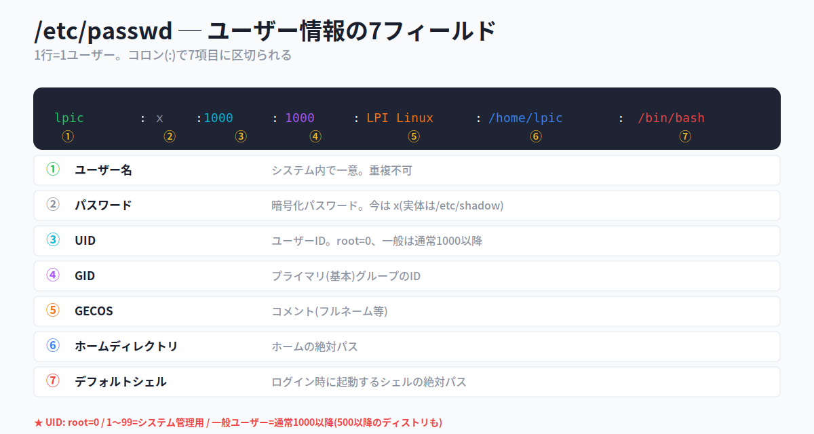
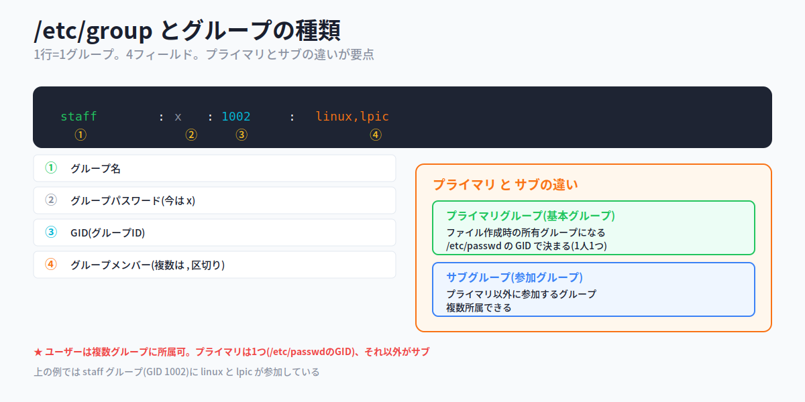
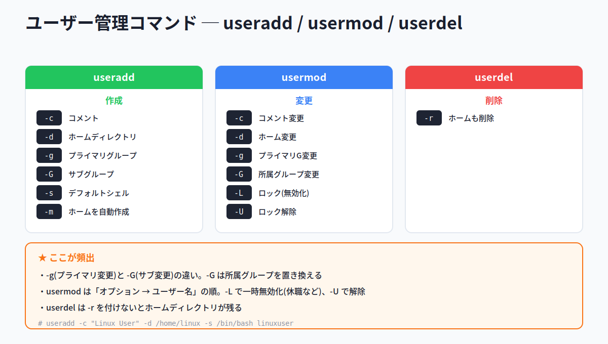
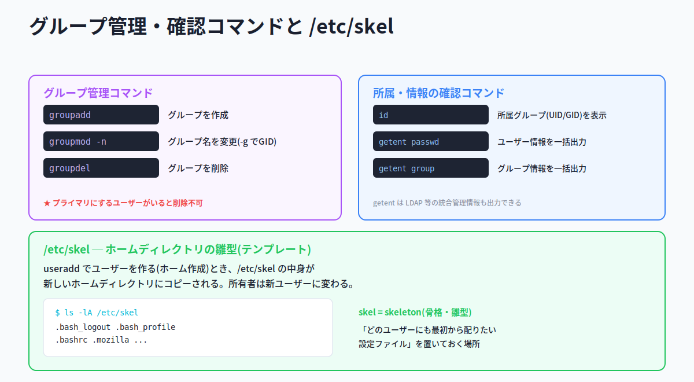
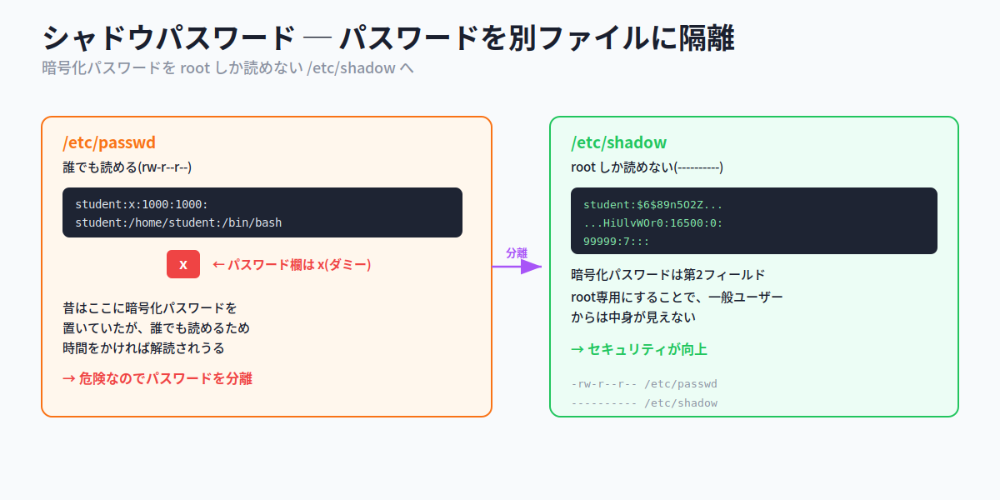
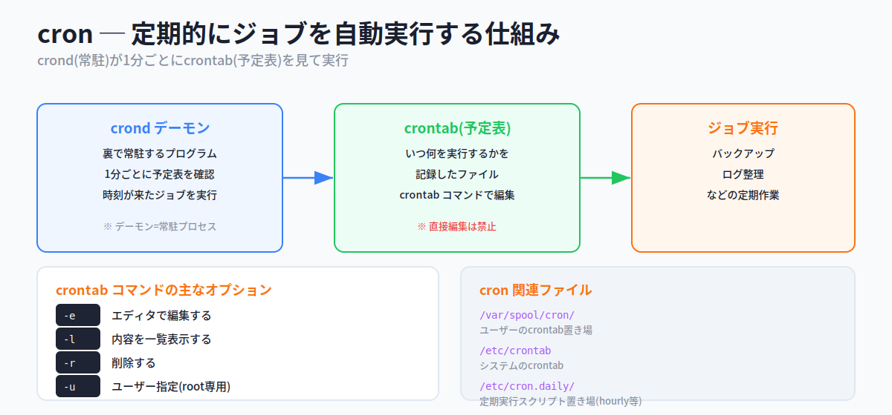
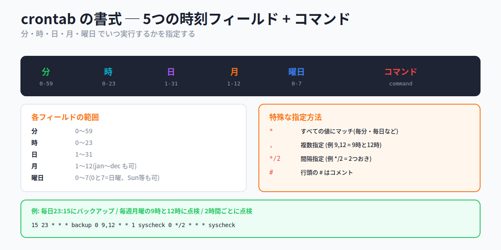
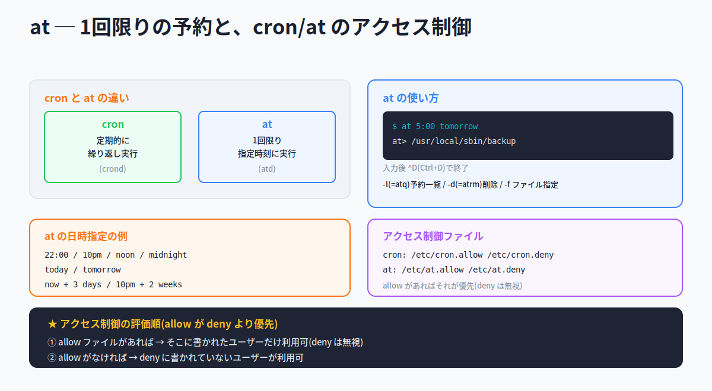
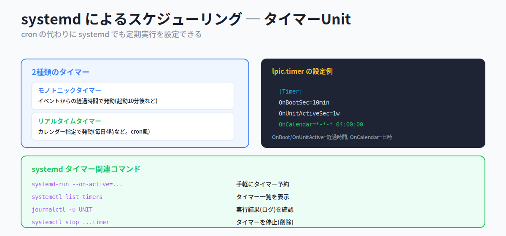
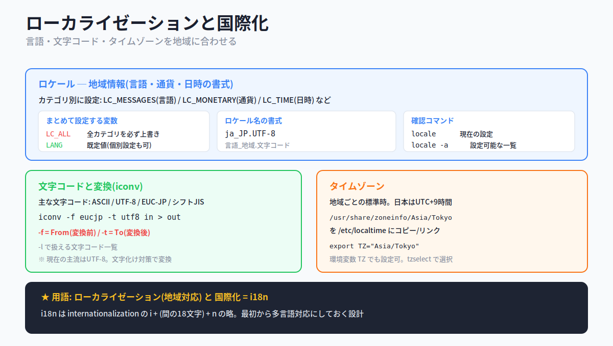

# 第9章：管理タスク

> **この資料について**
> これは研修当日のための **予備知識** をまとめた資料です。
> 研修当日は **おさらい → 暗記のコツの説明 → テスト → 答え合わせ** という流れで進むため、当日「初めて聞く話」が出てこないように、ここで必要な前提をひと通り押さえておきます。
>
> Linuxを触ったことがなくても理解できるよう、できるだけ身近な例で書いています。
>
> **前提**
> この資料は **101試験の範囲(第1〜5章)** と、102の **第7章(シェルとシェルスクリプト)・第8章(ユーザーインターフェース)** をひと通り学んでいることを前提にしています。とくに第4章の **パーミッション・所有者・SUID**、第7章の **環境変数(LANG・TZ)・設定ファイル(.bash_profile等)** は本章で再登場します。あやしい場合は先にそちらを確認してください。
>
> **この章の重要度について**
> 第9章は、102試験の「トピック107(管理タスク)」に対応します。出題数が多く、**実務でも毎日使う** 重要章です。「/etc/passwd・/etc/group の各フィールド」「useradd / usermod / userdel のオプション」「シャドウパスワード」「crontab の書式」「at の使い方」「cron/at のアクセス制御」「ロケール・文字コード・タイムゾーン」は、確実に複数問出題されます。とくに **設定ファイルのフィールドの意味** と **コマンドのオプション** は丸暗記が必要です。
>
> **読み方の指針**
> 1. まずは1回ざっと通読してください(細かい暗記は不要)
> 2. 各セクションの「📌 試験ポイント」と「📝 ここまでのまとめ」を見直してください
> 3. 巻末の「事前チェックリスト」で自分の理解度を測ってください
> 4. 研修当日は、このチェックリストのおさらいから始まります

---

<!-- ## 目次

- [9.1 ユーザーとグループの管理](#91-ユーザーとグループの管理)
  - [9.1.1 ユーザーアカウントと/etc/passwd](#911-ユーザーアカウントとetcpasswd)
  - [9.1.2 グループアカウントと/etc/group](#912-グループアカウントとetcgroup)
  - [9.1.3 コマンドを用いたユーザーとグループの管理](#913-コマンドを用いたユーザーとグループの管理)
  - [9.1.4 シャドウパスワード](#914-シャドウパスワード)
- [9.2 ジョブスケジューリング](#92-ジョブスケジューリング)
  - [9.2.1 cron](#921-cron)
  - [9.2.2 atコマンド](#922-atコマンド)
  - [9.2.3 cronとatのアクセス制御](#923-cronとatのアクセス制御)
  - [9.2.4 systemdによるスケジューリング](#924-systemdによるスケジューリング)
- [9.3 ローカライゼーションと国際化](#93-ローカライゼーションと国際化)
  - [9.3.1 ロケール](#931-ロケール)
  - [9.3.2 文字コード](#932-文字コード)
  - [9.3.3 タイムゾーン](#933-タイムゾーン)
- [事前チェックリスト](#事前チェックリスト)

--->

## 9.1 ユーザーとグループの管理

### ここで学ぶこと

- ユーザー情報を記録する **/etc/passwd** と、グループ情報の **/etc/group**
- ユーザーを作成・変更・削除する **useradd / usermod / userdel**
- グループを管理する **groupadd** 系と、所属を確認する **id / getent**
- パスワードを安全に保管する **シャドウパスワード**

Linuxは、1台のコンピュータを **複数のユーザーが同時に使える** マルチユーザーシステムです。1つのサーバを、開発チームの何人もが同時にログインして使う、といった場面が当たり前にあります。

そうなると、「誰がこのシステムを使えるのか」「それぞれのユーザーは何ができるのか」を管理する必要が出てきます。会社にたとえれば、社員証(アカウント)を発行し、所属部署(グループ)を決め、入退室の権限を管理する ── そんな「人事・総務」の仕事にあたるのが、この節で学ぶユーザー管理です。

そして重要なのは、これらの情報が **すべてテキストファイルに保存されている** こと。Windowsのように見えない場所で管理されるのではなく、`/etc/passwd` などのファイルを開けば中身を確認できます。まずはそのファイルの構造から見ていきましょう。

### 9.1.1 ユーザーアカウントと/etc/passwd

#### ユーザー情報は /etc/passwd に1行ずつ

Linuxでは、ユーザーアカウントの情報は **/etc/passwd** ファイルに保存されます。このファイルは **プレーンテキスト**(装飾のない、純粋な文字だけのデータ)なので、`cat` や `less` で中身を見られます。**1行につき1ユーザー** の情報が書かれ、各項目は **コロン(`:`)** で区切られています。



たとえば、次のような1行があったとします。

```
lpic:x:1000:1000:LPI Linux:/home/lpic:/bin/bash
```

これはコロンで7つの項目に分かれており、それぞれ次の意味を持ちます。

| # | フィールド | 意味 |
|---|---|---|
| **①** | ユーザー名 | システム内で一意のアカウント名。重複できない |
| **②** | パスワード | 暗号化パスワード。現在は **`x`** が入る(実体は後述の/etc/shadow) |
| **③** | UID(ユーザーID) | ユーザーを識別する一意な番号。**root は必ず 0**、一般ユーザーは通常 **1000以降** |
| **④** | GID(グループID) | そのユーザーの **プライマリ(基本)グループ** のID。対応は/etc/groupで定義 |
| **⑤** | GECOS | コメント欄。フルネームなどを記述 |
| **⑥** | ホームディレクトリ | ユーザーのホームの絶対パス |
| **⑦** | デフォルトシェル | ログイン時に起動するシェルの絶対パス |

UIDの番号配分には決まりがあります。**root は 0**、**1〜99 はシステム管理用**、**一般ユーザーは通常 1000以降**(ディストリビューションによっては500以降)です。「番号を見ればそのユーザーの素性(管理者か一般か)がわかる」という仕組みです。

> 💡 ②のパスワード欄が `x` になっているのには理由があります。`/etc/passwd` は **一般ユーザーでも読み取れる** ファイルです。もしここに暗号化済みとはいえパスワードを書いておくと、時間をかければ解読されかねません。そこで現在は、パスワード本体を別ファイル(`/etc/shadow`)に隔離し、ここには「中身は別にあるよ」の印として `x` を置いています(詳しくは9.1.4)。

> ⚠ 「では `/etc/passwd` の読み取り権を一般ユーザーから外せばいいのでは?」と思うかもしれません。しかし、それをやると一般ユーザーで `ls -l` の表示がおかしくなる(UIDから名前を引けない)など、さまざまな不都合が生じます。だから読み取りは許したまま、パスワードだけを別ファイルに移す、という方式になっているのです。

#### 📌 試験ポイント

| 問われ方 | 答え |
|---|---|
| ユーザー情報を保存するファイルは? | **/etc/passwd** |
| /etc/passwd は何で区切られている? | **コロン(`:`)** |
| 第2フィールド(パスワード)は今どうなっている? | **`x`**(実体は/etc/shadow) |
| rootのUIDは? | **0** |
| 一般ユーザーのUIDは通常いくつから? | **1000以降**(500以降のディストリも) |
| 第4フィールドは何のID? | **プライマリグループのGID** |
| 第7フィールドは何? | **デフォルトシェル** |
| /etc/passwd は一般ユーザーでも読める? | **読める** |

### 9.1.2 グループアカウントと/etc/group

#### グループ情報は /etc/group に

グループとは、複数のユーザーをまとめる「グループ分け」の仕組みです。たとえば「開発チーム」というグループを作り、メンバーをまとめて同じファイルにアクセスできるようにする、といった使い方をします。会社の「部署」にあたる概念です。

グループの設定は **/etc/group** ファイルに保存されます。こちらも1行=1グループで、コロン区切りの **4フィールド** です。



```
staff:x:1002:linux,lpic
```

| # | フィールド | 意味 |
|---|---|---|
| **①** | グループ名 | グループの名称 |
| **②** | グループパスワード | 現在は **`x`**(シャドウ化されている) |
| **③** | GID(グループID) | グループを識別する番号 |
| **④** | グループメンバー | このグループに参加しているユーザー名。複数は **`,`(カンマ)** 区切り |

上の例は「staff というグループ(GID 1002)に、ユーザー linux と lpic が参加している」という意味です。

#### プライマリグループとサブグループ

ここが試験でよく問われるポイントです。**1人のユーザーは複数のグループに所属できます**。そのとき、グループは2種類に分かれます。

- **プライマリグループ(基本グループ)**: そのユーザーの「主たる所属」。**ファイルやディレクトリを作成したとき、その所有グループになる** のがこれです。`/etc/passwd` のGIDフィールド(④)で決まり、**1人につき1つ** です
- **サブグループ(参加グループ)**: プライマリ以外に参加しているグループ。**複数** 持てます

会社でたとえると、プライマリグループは「本籍の部署(営業部)」、サブグループは「兼務しているプロジェクト(新製品チーム)」のようなものです。新しく書類(ファイル)を作ると、本籍の部署(プライマリグループ)の名義になる、というわけです。

> 💡 自分のプライマリグループは `/etc/passwd` のGIDで確認できます。「プライマリは passwd 側で1つ決まっている、サブは group 側のメンバー欄に名前が並ぶ」と整理しておきましょう。

#### 📌 試験ポイント

| 問われ方 | 答え |
|---|---|
| グループ情報を保存するファイルは? | **/etc/group** |
| /etc/group は何フィールド? | **4フィールド** |
| グループメンバーの区切り文字は? | **`,`(カンマ)** |
| ファイル作成時の所有グループになるのは? | **プライマリグループ** |
| プライマリグループはどこで決まる? | **/etc/passwd のGID** |
| ユーザーは複数グループに所属できる? | **できる**(プライマリ1つ + サブ複数) |

### 9.1.3 コマンドを用いたユーザーとグループの管理

#### コマンドで管理する理由

ユーザーやグループは、`/etc/passwd` などを直接エディタで書き換えても理論上は管理できますが、書式ミスでシステムにログインできなくなる危険があります。そこで、**専用コマンドを使って安全に管理** します。GUIツールもありますが、ディストリビューションごとに違うため、どこでも使えるコマンド操作を覚えるのが確実です。

#### useradd / usermod / userdel ─ ユーザーの作成・変更・削除

ユーザー管理の中心となる3つのコマンドです。名前が「user + add / mod / del」と素直なので対応は覚えやすいでしょう。



**useradd ─ ユーザーを作成**

```
書式: useradd [オプション] ユーザー名
```

| オプション | 説明 |
|---|---|
| **-c コメント** | コメント(GECOS)フィールドを指定 |
| **-d パス** | ホームディレクトリを指定 |
| **-g グループ** | プライマリグループを指定 |
| **-G グループ** | プライマリ以外に所属するグループ(サブ)を指定 |
| **-s パス** | デフォルトシェルを指定 |
| **-m** | ホームディレクトリを自動的に作成する |

```bash
# useradd -c "Linux User" -d /home/linux -s /bin/bash linuxuser
```

**usermod ─ 既存ユーザーを変更**

useraddと多くのオプションが共通で、`/etc/passwd` の該当フィールドを書き換えるのと同じ効果です。

| オプション | 説明 |
|---|---|
| **-c / -d / -g / -G / -s** | useraddと同じ項目を変更 |
| **-L** | パスワードをロックして一時的に無効化する |
| **-U** | パスワードのロックを解除する |

**userdel ─ ユーザーを削除**

| オプション | 説明 |
|---|---|
| **-r** | ホームディレクトリも同時に削除する |

ここで特に試験で狙われる3点を押さえます。

> ⚠ **頻出ポイント①: -g と -G の違い**。`-g` は **プライマリグループ** を変更します。`-G` は **サブグループ(所属グループ)** を指定し、しかも **それまでの所属を置き換えてしまう** 点に注意。既存のサブグループを残したまま追加したいなら、すべてのグループを `-G group1,group2,group3` のように並べて指定する必要があります。

> ⚠ **頻出ポイント②: usermod の引数の順番**。`usermod -L lpic` のように **「オプション → ユーザー名」の順** です。`-L` でアカウントを一時無効化(長期休暇など、削除せず使えなくする)、`-U` で解除します。

> ⚠ **頻出ポイント③: userdel の -r**。`-r` を付けないと、アカウントは消えても **ホームディレクトリが残ります**。完全に消すなら `userdel -r ユーザー名` です。

#### ホームディレクトリの雛型 ─ /etc/skel

ユーザーを作成すると、通常ホームディレクトリも作られます。その際、「どのユーザーにも最初から置いておきたい設定ファイル(`.bashrc` など)」を自動で配布できると便利です。

その雛型(テンプレート)を置いておくのが **/etc/skel** ディレクトリです。ホームディレクトリが作られるとき、`/etc/skel` の中身が新しいホームへコピーされます(所有者は新ユーザーに変わります)。



> 💡 `skel` は **skeleton(骨格・雛型)** の略。「新入社員に配る初期セット」を用意しておく場所、とイメージしてください。第7章で学んだ `.bash_profile` や `.bashrc` も、ここに置かれているものがコピーされます。

#### groupadd / groupmod / groupdel ─ グループの管理

グループ側も「group + add / mod / del」で対応します。

| コマンド | 説明 |
|---|---|
| **groupadd グループ名** | グループを作成 |
| **groupmod -n 新名 旧名** | グループ名を変更(`-g` でGID変更) |
| **groupdel グループ名** | グループを削除 |

> ⚠ **groupdel の注意**: 削除しようとするグループを **プライマリグループにしているユーザーが1人でもいると、削除できません**。「どのグループにも属さないユーザー」ができてしまうのを防ぐためです。

#### id / getent ─ 所属やアカウント情報の確認

| コマンド | 説明 |
|---|---|
| **id [ユーザー名]** | そのユーザーのUID・GID・所属グループを表示 |
| **getent passwd** | ユーザー情報を一括出力 |
| **getent group** | グループ情報を一括出力 |

```bash
$ id student
uid=1000(student) gid=1000(student) groups=1000(student),1002(develop)
```

この例から、student は プライマリグループ student と、サブグループ develop に所属しているとわかります。`getent` は、ローカルの `/etc/passwd` だけでなく、**LDAP**(ユーザー情報を一元管理するディレクトリサービスのプロトコル)などで統合管理された情報も含めて出力できます。

#### 📌 試験ポイント

| 問われ方 | 答え |
|---|---|
| ユーザーを作成するコマンドは? | **useradd** |
| ホームディレクトリも作るuseraddオプションは? | **-m** |
| プライマリグループを指定/変更するオプションは? | **-g** |
| サブグループを指定/変更するオプションは? | **-G** |
| アカウントを一時無効化するusermodオプションは? | **-L**(解除は -U) |
| ユーザー削除でホームも消すには? | **userdel -r** |
| ホームの雛型を置くディレクトリは? | **/etc/skel** |
| グループを作成するコマンドは? | **groupadd** |
| グループ名を変更するには? | **groupmod -n** |
| プライマリにするユーザーがいるグループは削除できる? | **できない** |
| 所属グループを確認するコマンドは? | **id** |

### 9.1.4 シャドウパスワード

#### パスワードを /etc/shadow に隔離する

9.1.1で触れた通り、現在のシステムでは **シャドウパスワード** という仕組みが使われています。暗号化されたパスワードは `/etc/passwd` ではなく **/etc/shadow** ファイルに記録され、`/etc/passwd` のパスワード欄には `x` だけが入ります。



なぜ分けるのか。鍵は **ファイルの読み取り権限** です。

```bash
$ ls -l /etc/passwd /etc/shadow
-rw-r--r-- 1 root root 2067 ... /etc/passwd      # 誰でも読める
---------- 1 root root 1208 ... /etc/shadow      # rootしか読めない
```

`/etc/passwd` は誰でも読めますが、`/etc/shadow` は **root しか読めません**(権限がすべて `-`)。暗号化パスワードを root専用のファイルに隔離することで、一般ユーザーから中身が見えなくなり、解読のリスクが大幅に減ります。「貴重品を、誰でも入れる玄関(passwd)ではなく、鍵のかかった金庫(shadow)にしまう」イメージです。

`/etc/shadow` の中身は、次のようにコロン区切りで、第2フィールドに暗号化パスワードが格納されています。

```
student:$6$89n5O2Z...省略...0iAfC5LeXp.:16500:0:99999:7:::
```

> 💡 「`/etc/passwd` = 誰でも読める・パスワードは `x` / `/etc/shadow` = root専用・暗号化パスワード本体」というペアで覚えましょう。シャドウパスワードは、第12章(セキュリティ)でも再登場します。

#### 📌 試験ポイント

| 問われ方 | 答え |
|---|---|
| 暗号化パスワードを格納するファイルは? | **/etc/shadow** |
| /etc/shadow を読めるのは誰? | **root のみ** |
| 暗号化パスワードは/etc/shadowの第何フィールド? | **第2フィールド** |
| シャドウパスワードの目的は? | **パスワードを隔離してセキュリティを向上** |
| /etc/passwd のパスワード欄には何が入る? | **`x`** |

#### 📝 ここまでのまとめ

- **/etc/passwd** = ユーザー情報。コロン区切りの **7フィールド**(ユーザー名/x/UID/GID/コメント/ホーム/シェル)。誰でも読める
- UID: **root=0 / 1〜99=システム用 / 一般=通常1000以降**
- **/etc/group** = グループ情報。**4フィールド**(名/x/GID/メンバー)。メンバーは **カンマ区切り**
- **プライマリグループ**(passwdのGID、ファイル作成時の所有・1つ)と **サブグループ**(複数可)の違い
- ユーザー: **useradd / usermod / userdel**(-r でホームも削除)。**-g=プライマリ / -G=サブ(置換)**、**-L/-U** でロック
- グループ: **groupadd / groupmod -n / groupdel**(プライマリ利用者がいると削除不可)
- 確認: **id**(所属)、**getent**(一括)。ホーム雛型は **/etc/skel**
- **シャドウパスワード**: 暗号化パスワードを root専用の **/etc/shadow** に隔離

---

## 9.2 ジョブスケジューリング

### ここで学ぶこと

- 定期的な処理を自動実行する **cron**(crond と crontab)
- crontab の **書式**(分・時・日・月・曜日)
- 1回限りの予約を行う **at**
- cron/at を使えるユーザーを制限する **アクセス制御**
- systemd による新しいスケジューリング(**タイマーUnit**)

サーバの運用では、バックアップ・ログの整理・データの集計など、**定期的に繰り返す作業** が欠かせません。これを毎回手作業でやるのは大変ですし、忘れたり、夜中に実行したい作業もあります。

そこで、「決まった時刻に、決めておいた処理を自動で実行する」仕組みを使います。これが **ジョブスケジューリング** です。アラームやタイマー予約のコンピュータ版だと考えてください。Linuxでは、**繰り返しの定期実行は cron**、**1回限りの予約は at** と、用途で使い分けます。

### 9.2.1 cron

#### cron の仕組み ─ crond と crontab

**cron** は、定期的にジョブを実行する仕組みで、2つの部品から成ります。



- **crond(クロンディー)**: 裏で常駐しているプログラム(デーモン)。**1分ごと** に予定表を確認し、実行時刻が来たジョブを実行します。「デーモン」とは、ユーザーが意識しなくても裏で動き続ける常駐プロセスのこと(第4章の復習)
- **crontab(クロンタブ)**: 「いつ・何を実行するか」を書いた **予定表ファイル**。これを編集することでジョブを登録します

つまり「秘書(crond)が、手帳(crontab)を1分おきにチェックして、予定の時刻になったら仕事を実行する」という関係です。

#### crontab コマンドで予定表を編集する

ユーザーごとの crontab ファイルは `/var/spool/cron/` 以下に置かれますが、**エディタで直接開いて編集してはいけません**。必ず **crontab コマンド** を使います(書式チェックなどが行われるため)。

```
書式: crontab [オプション]
```

| オプション | 説明 |
|---|---|
| **-e** | エディタを使って crontab を編集する(edit) |
| **-l** | crontab の内容を一覧表示する(list) |
| **-r** | crontab を削除する(remove) |
| **-u ユーザー名** | ユーザーを指定して編集する(rootのみ) |

> ⚠ **-r と -e の押し間違いに注意**。`-r` は確認なしで **すべての設定を削除** してしまいます。隣り合うキーではありませんが、試験でも「全削除は -r」がよく問われます。

#### 📌 試験ポイント

| 問われ方 | 答え |
|---|---|
| 定期実行の仕組みは? | **cron** |
| cronで常駐するデーモンは? | **crond** |
| crondは何分ごとに確認する? | **1分ごと** |
| 予定表を編集するコマンドは? | **crontab** |
| crontabを編集するオプションは? | **-e** |
| 内容を一覧表示するオプションは? | **-l** |
| すべて削除するオプションは? | **-r** |
| ユーザーのcrontab置き場は? | **/var/spool/cron/** |

#### crontab の書式 ─ 5つの時刻フィールド

crontab の各行は、**5つの時刻フィールド + 実行コマンド** で構成されます。それぞれのフィールドが指定した値にマッチした時刻になると、コマンドが実行されます。



```
書式: 分 時 日 月 曜日 コマンド
```

| フィールド | 範囲 |
|---|---|
| **分** | 0〜59 |
| **時** | 0〜23 |
| **日** | 1〜31 |
| **月** | 1〜12(jan〜dec の文字列も可) |
| **曜日** | 0〜7(0と7=日曜、1=月曜〜6=土曜。Sun, Mon等の文字列も可) |

特殊な指定方法も覚えましょう。

- **`*`** … すべての値にマッチ(毎分・毎日など「指定なし」の意味)
- **`,`** … 複数指定(例: `9,12` = 9時と12時)
- **`*/2`** … 間隔指定(例: `*/2` = 2つおき。2時間ごとなど)
- 行頭の **`#`** … コメント行(実行されない)

具体例を見てみましょう。

```bash
# 毎日23:15にバックアップを実行
15 23 * * * /usr/local/bin/backup

# 毎週月曜の9時と12時にシステム点検
0 9,12 * * 1 /usr/local/bin/syscheck

# 2時間ごとにシステム点検
0 */2 * * * /usr/local/bin/syscheck
```

> 💡 **読み方のコツ**: 左から「**分・時・日・月・曜日**」の順です。「何分・何時に、(何日・何月・何曜日という条件で)実行」と、左から時刻の細かい順に並んでいると覚えましょう。`*` は「ここは問わない」の意味で、上の例の「毎日23:15」は『日・月・曜日は問わず、23時15分なら実行』という指定です。

#### システムの crontab

ユーザー個人の crontab とは別に、システム全体用の **/etc/crontab** もあります。こちらには「どのユーザーの権限で実行するか」を指定する **ユーザー名フィールド** が加わります(分 時 日 月 曜日 **ユーザー** コマンド)。また `/etc/cron.daily/` などのディレクトリに置いたスクリプトを、1日ごと・1週間ごとといった単位で自動実行する仕組みも用意されています。

| ファイル/ディレクトリ | 説明 |
|---|---|
| **/etc/crontab** | システムのcrontabファイル |
| **/etc/cron.d/** | cronジョブを記述したファイルを収める |
| **/etc/cron.hourly/ ～ monthly/** | 1時間/1日/1週/1月ごとに実行するスクリプト置き場 |
| **/var/spool/cron/** | ユーザーのcrontab置き場 |

#### 📌 試験ポイント

| 問われ方 | 答え |
|---|---|
| crontabのフィールドの順は? | **分 時 日 月 曜日 コマンド** |
| 「分」の範囲は? | **0〜59** |
| 「時」の範囲は? | **0〜23** |
| 「曜日」で日曜を表す数字は? | **0 または 7** |
| すべての値にマッチさせる記号は? | **`*`** |
| 複数の値を指定する記号は? | **`,`** |
| 2つおきに実行する書き方は? | **`*/2`** |
| システムのcrontabファイルは? | **/etc/crontab** |
| /etc/crontab に追加されるフィールドは? | **実行ユーザー名** |

### 9.2.2 atコマンド

#### 1回限りの予約は at

cron が「繰り返し」の定期実行を扱うのに対し、**at** は **1回限り** の実行予約を扱います。「明日の朝5時に、この処理を1度だけ実行して」といった用途です。利用には **atd**(at のデーモン)が動作している必要があります。



at は対話式で使います。日時を指定すると入力モードになり、実行したいコマンドを入力して **Ctrl+D** で終了します。

```bash
$ at 5:00 tomorrow
at> /usr/local/sbin/backup
at> ^D                      # Ctrl+D で入力終了
```

あらかじめコマンドを書いたファイルを `-f` で指定する方法もあります。

```bash
$ at -f my_jobs 23:30
```

主なオプションと、日時の指定方法は次の通りです。

| オプション | 説明 |
|---|---|
| **-l** | 予約中のジョブを一覧表示(`atq` コマンドと同じ) |
| **-d / -r** | 予約中のジョブをジョブ番号で削除(`atrm` コマンドと同じ) |
| **-f ファイル** | コマンドを記述したファイルを指定 |

日時は柔軟に指定でき、`22:00` / `10pm` / `noon`(正午) / `midnight`(真夜中) / `today` / `tomorrow` / `now + 3 days` / `10pm + 2 weeks` のように書けます。

> 💡 **覚え方Hack ─ atは「1回ぽっきり」**。`at` は英語で「〜の時点で」。「その時点で1回だけ」と覚えると、繰り返しの cron との違いが明確になります。一覧の `-l` は list、削除の `-d` は delete、別名の `atq`(queue=待ち行列の確認)・`atrm`(remove)もセットで押さえましょう。

#### 📌 試験ポイント

| 問われ方 | 答え |
|---|---|
| 1回限りの実行を予約するコマンドは? | **at** |
| atに必要なデーモンは? | **atd** |
| 予約中のジョブを一覧表示するには? | **at -l**(または atq) |
| 予約を削除するには? | **at -d / -r**(または atrm) |
| ファイルからコマンドを読むオプションは? | **-f** |
| 入力を終了するキーは? | **Ctrl+D** |

### 9.2.3 cronとatのアクセス制御

#### 誰に cron / at を使わせるか

cron や at は、ユーザー単位で **利用を許可・拒否** できます。誰でも自由に定期ジョブを仕込めるとサーバに負荷をかけられる恐れがあるため、制限する仕組みです。

cron は **/etc/cron.allow**(許可リスト)と **/etc/cron.deny**(拒否リスト)、at は **/etc/at.allow** と **/etc/at.deny** を使います。重要なのは **評価の順番** です。

**評価の順序(cron・at 共通)**

1. **allow ファイルがあれば** → そこに書かれたユーザー **だけ** が利用できる(deny ファイルは無視される)
2. **allow ファイルがなければ** → deny ファイルを参照し、deny に書かれていない **すべてのユーザー** が利用できる
3. (at の場合)**どちらもなければ** → root だけが利用できる

> 💡 **覚え方Hack ─ allow が最優先**。「`allow` があったら、もう `deny` は見ない。allow に名前がある人だけ通す」が鉄則です。ホワイトリスト(allow)があれば、それがすべてを決める ── という考え方。「許可リストが優先、なければ拒否リストで絞る」とセットで覚えましょう。なお、デフォルトでは空の `/etc/at.deny` があり、全ユーザーが at を使える状態になっています。

#### 📌 試験ポイント

| 問われ方 | 答え |
|---|---|
| cronの利用を許可するファイルは? | **/etc/cron.allow** |
| cronの利用を拒否するファイルは? | **/etc/cron.deny** |
| atの利用を許可/拒否するファイルは? | **/etc/at.allow / /etc/at.deny** |
| allowとdenyが両方ある場合は? | **allowが優先**(denyは無視) |
| allowがなくdenyがある場合は? | **denyに無いユーザーが利用可** |

### 9.2.4 systemdによるスケジューリング

#### タイマーUnit ─ cron に代わる仕組み

第1章で学んだ **systemd**(現在主流の起動・管理の仕組み)には、cron の代わりにスケジューリングを行う **タイマーUnit** という機能があります。



タイマーには2種類あります。

- **モノトニックタイマー**: 「システム起動の10分後」のように、**何らかのイベントからの経過時間** で発動し、以後定期的に実行される
- **リアルタイムタイマー**: crontab と同様に **カレンダーで日時を指定**(毎日4時など)して実行される

設定は `.timer` という拡張子のファイルで行います。

```
[Timer]
OnBootSec=10min            # 起動から10分後(モノトニック)
OnUnitActiveSec=1w         # 前回実行から1週間ごと(モノトニック)
OnCalendar=*-*-* 04:00:00  # 毎日4時(リアルタイム)
```

タイマーUnitの記述は crontab より煩雑なので、手軽に予約できる **systemd-run** コマンドや、確認用のコマンドも用意されています。

| コマンド | 説明 |
|---|---|
| **systemd-run --on-active=...** | 手軽にタイマーを予約する |
| **systemctl list-timers** | 設定されているタイマーの一覧を表示 |
| **journalctl -u Unit名** | ジョブの実行結果(ログ)を確認 |
| **systemctl stop Unit名.timer** | タイマーを停止(削除) |

> 💡 試験対策としては、「cron のほかに **systemd のタイマーUnit** でも定期実行できる」「`OnCalendar` でカレンダー指定、`OnBootSec` などで経過時間指定」「一覧は `systemctl list-timers`」を押さえれば十分です。

#### 📌 試験ポイント

| 問われ方 | 答え |
|---|---|
| systemdで定期実行を担うのは? | **タイマーUnit** |
| 経過時間で発動するタイマーは? | **モノトニックタイマー** |
| カレンダー指定で発動するタイマーは? | **リアルタイムタイマー** |
| カレンダー指定に使う項目は? | **OnCalendar** |
| タイマー一覧を表示するコマンドは? | **systemctl list-timers** |
| 実行ログを確認するコマンドは? | **journalctl -u** |

#### 📝 ここまでのまとめ

- **cron** = 定期的な繰り返し実行。**crond**(1分ごと確認)+ **crontab**(予定表)
- crontab編集は **crontab -e**(-l 一覧 / -r 全削除)。直接編集は禁止
- crontab書式: **分 時 日 月 曜日 コマンド**。`*`(全部)/ `,`(複数)/ `*/2`(間隔)
- **at** = 1回限りの予約(**atd** が必要)。-l(=atq)一覧 / -d(=atrm)削除 / Ctrl+Dで終了
- アクセス制御: **cron.allow/deny・at.allow/deny**。**allow が優先**(あればそれだけ)
- **systemd タイマーUnit** = cronの代替。モノトニック(経過時間)/ リアルタイム(OnCalendar)。一覧は **systemctl list-timers**

---

## 9.3 ローカライゼーションと国際化

### ここで学ぶこと

- 言語や書式を地域に合わせる **ロケール**
- 文字の表現方式である **文字コード** と、変換コマンド **iconv**
- 地域ごとの標準時 **タイムゾーン** の設定

世界中で使われるLinuxは、英語環境のままでは日本のユーザーに不便です。メニューやメッセージが日本語で出て、日付や通貨が日本の書式で表示され、時刻が日本時間になっていてほしい ── こうした **地域・言語への対応** を扱うのがこの節です。

用語を2つ押さえます。言語・通貨・日付の書式などを **特定の地域や国に合わせること** を **ローカライゼーション**(localization、地域化)といいます。そして、最初から多言語・多地域に対応できるようソフトウェアを作っておくことを **国際化**(internationalization)といいます。

> 💡 国際化は **i18n** と略されます。これは internationalization という長い単語を、先頭の `i` + 間の18文字 + 末尾の `n` で表したものです。「iとnの間に18文字」が語源、と覚えると忘れません。

### 9.3.1 ロケール

#### ロケール ─ 地域情報のまとまり

**ロケール** とは、利用者の地域情報(表示言語・通貨・日時の書式など)のまとまりです。多くのソフトウェアは、このロケールに従って表示を切り替えます。



ロケールは **カテゴリ** ごとに分かれていて、個別に設定できます。

| カテゴリ | 説明 |
|---|---|
| **LC_CTYPE** | 文字の種類・分類 |
| **LC_COLLATE** | 文字の照合・整列順 |
| **LC_MESSAGES** | メッセージ表示に使う言語 |
| **LC_MONETARY** | 通貨の書式 |
| **LC_NUMERIC** | 数値の書式 |
| **LC_TIME** | 日付・時刻の書式 |

カテゴリが分かれているおかげで、「メッセージは日本語だが、日付は英語表記」といった細かい調整もできます。

#### LANG と LC_ALL ─ まとめて設定する変数

カテゴリを1つずつ設定するのは大変なので、**まとめて設定する環境変数** が2つあります(第7章の環境変数の応用です)。

- **LC_ALL** … 設定されていれば、**全カテゴリで必ずこの値が使われます**(最優先・強制)
- **LANG** … 全カテゴリの **デフォルト値** として使われます。ただし個々のカテゴリで個別設定があればそちらが優先

優先順位は「**LC_ALL(強制) > 個別のLC_* > LANG(既定)**」です。「LC_ALL は問答無用で全部そろえる強制設定、LANG はとりあえずの既定値」と区別しましょう。

ロケール名は **`言語名_国や地域名.文字コード`** という書式です。

| ロケール名 | 説明 |
|---|---|
| **C、POSIX** | 英語(最も基本的なロケール) |
| **ja_JP.UTF-8** | 日本語 / Unicode |
| **ja_JP.eucJP** | 日本語 / EUC-JP |
| **en_US.UTF-8** | 英語(米) / Unicode |

現在のロケール設定は **locale** コマンドで確認できます。`locale -a` で設定可能な一覧、`locale -m` で利用できる文字コード一覧が見られます。一時的にロケールを変えたいときは、コマンドの前に `変数名=ロケール名` を置きます。

```bash
$ LANG=C man ls      # man ls を英語で表示する
```

#### 📌 試験ポイント

| 問われ方 | 答え |
|---|---|
| 地域情報(言語・書式)のまとまりを何という? | **ロケール** |
| メッセージの言語を決めるカテゴリは? | **LC_MESSAGES** |
| 日時の書式を決めるカテゴリは? | **LC_TIME** |
| 全カテゴリを強制的に設定する変数は? | **LC_ALL** |
| 全カテゴリのデフォルト値になる変数は? | **LANG** |
| 現在のロケールを確認するコマンドは? | **locale** |
| 設定可能なロケール一覧を見るには? | **locale -a** |
| 英語の基本ロケールは? | **C / POSIX** |

### 9.3.2 文字コード

#### 文字コードと変換(iconv)

**文字コード** とは、文字をコンピュータ内部で数値として表現する方式のことです。同じ「あ」でも、方式が違えば違う数値になります。方式が食い違うと、いわゆる **文字化け** が起こります。

| 文字コード | 説明 |
|---|---|
| **ASCII** | 7ビットで表す基本的な128文字(英数字＋α) |
| **ISO-8859** | ASCIIを拡張した8ビット・256文字 |
| **UTF-8** | Unicodeを使った方式。1文字を1〜6バイトで表す(現在の主流) |
| **EUC-JP(日本語EUC)** | UNIX環境で標準的だった日本語コード |
| **シフトJIS** | Windowsで使われる日本語コード |
| **ISO-2022-JP** | 電子メールで使われる日本語コード(JISコード) |

現在は多くのディストリビューションが **UTF-8** を使いますが、日本では複数の文字コードが混在しており、Windowsで作ったファイルをLinuxで開くと文字化けすることがあります。そんなときは文字コードを変換します。変換に使うのが **iconv** コマンドです。

```
書式: iconv [オプション] [入力ファイル名]
```

| オプション | 説明 |
|---|---|
| **-f 文字コード** | 変換前(From)の文字コードを指定 |
| **-t 文字コード** | 変換後(To)の文字コードを指定 |
| **-l** | 扱える文字コードの一覧を表示 |

```bash
# EUC-JPのファイルをUTF-8に変換して保存
$ iconv -f eucjp -t utf8 report.euc.txt > report.utf8.txt
```

> 💡 **覚え方Hack ─ -f は From、-t は To**。`-f`(from=どこから)が変換前、`-t`(to=どこへ)が変換後です。出力はリダイレクト(`>`)でファイルに保存します。なお、文字コードが不明なときは `nkf -g ファイル名` で調べられます。

#### 📌 試験ポイント

| 問われ方 | 答え |
|---|---|
| 現在主流の文字コードは? | **UTF-8** |
| Windowsで使われる日本語コードは? | **シフトJIS** |
| UNIXで標準的だった日本語コードは? | **EUC-JP** |
| 文字コードを変換するコマンドは? | **iconv** |
| 変換前の文字コードを指定するオプションは? | **-f**(From) |
| 変換後の文字コードを指定するオプションは? | **-t**(To) |

### 9.3.3 タイムゾーン

#### タイムゾーン ─ 地域ごとの標準時

地球上の地域ごとに標準時は異なります。日本は **グリニッジ標準時(協定世界時:UTC)より9時間早い** 時間帯です。この地域ごとに区分された標準時間帯を **タイムゾーン** といいます。

タイムゾーンの情報は、**/usr/share/zoneinfo** ディレクトリ以下のバイナリファイルに、地域別に格納されています(日本なら `/usr/share/zoneinfo/Asia/Tokyo`)。

#### タイムゾーンの設定方法

システムで使うタイムゾーンを設定するには、いくつか方法があります。

**方法1: /etc/localtime にコピーまたはリンク**

```bash
# cp /usr/share/zoneinfo/Asia/Tokyo /etc/localtime     # コピー
# ln -s /usr/share/zoneinfo/Asia/Tokyo /etc/localtime  # シンボリックリンク
```

**方法2: 環境変数 TZ で設定**

```bash
$ export TZ="Asia/Tokyo"
```

この値を全ユーザーで使うには `/etc/timezone` ファイルに `Asia/Tokyo` と書いておきます。また、**tzselect** コマンドを使うと、一覧から地域を選んでタイムゾーンの設定値を確認できます。

> 💡 「タイムゾーンの大本のデータは **/usr/share/zoneinfo**、実際にシステムが使う設定は **/etc/localtime**、環境変数なら **TZ**」と3点を押さえましょう。`/usr/share/zoneinfo/Asia/Tokyo` を `/etc/localtime` に持ってくる、という流れが基本です。

#### 📌 試験ポイント

| 問われ方 | 答え |
|---|---|
| 地域ごとの標準時間帯を何という? | **タイムゾーン** |
| 日本はUTCより何時間早い? | **9時間** |
| タイムゾーン情報が格納されるディレクトリは? | **/usr/share/zoneinfo** |
| システムが使うタイムゾーンの設定ファイルは? | **/etc/localtime** |
| タイムゾーンを設定する環境変数は? | **TZ** |
| 一覧から選んで設定値を確認するコマンドは? | **tzselect** |

#### 📝 ここまでのまとめ

- **ローカライゼーション**(地域化)と **国際化(i18n)** の違い。i18n=iとnの間に18文字
- **ロケール** = 地域情報。カテゴリ別(**LC_MESSAGES** 言語 / **LC_TIME** 日時 など)。まとめ設定は **LC_ALL**(強制)と **LANG**(既定)。確認は **locale**
- ロケール名: **言語_地域.文字コード**(例 ja_JP.UTF-8)。英語の基本は **C / POSIX**
- 文字コード: **UTF-8**(主流)/ EUC-JP / シフトJIS。変換は **iconv -f(From) -t(To)**
- タイムゾーン: 情報は **/usr/share/zoneinfo**、設定は **/etc/localtime** か環境変数 **TZ**。確認は **tzselect**

---

## 📝 全体まとめ ─ ここまでの学習内容

このセクションを終えた時点で、次のことができるようになっているはずです：

1. Linuxが複数ユーザーで使う **マルチユーザーシステム** だと分かる
2. ユーザー情報が **/etc/passwd** にコロン区切りの **7フィールド** で記録されると分かる
3. /etc/passwd の各項目(ユーザー名/x/UID/GID/コメント/ホーム/シェル)を答えられる
4. UIDの配分(**root=0 / 1〜99=システム用 / 一般=通常1000以降**)が分かる
5. /etc/passwd は **一般ユーザーでも読める** と分かる
6. グループ情報が **/etc/group** に **4フィールド**(名/x/GID/メンバー)で記録されると分かる
7. グループメンバーは **カンマ区切り** だと分かる
8. **プライマリグループ**(passwdのGID・ファイル作成時の所有・1つ)と **サブグループ**(複数可)を区別できる
9. **useradd** でユーザーを作成でき、主なオプション(-c -d -g -G -s -m)が分かる
10. **usermod** で変更でき、**-g(プライマリ)と -G(サブ・置換)** の違いが分かる
11. **-L / -U** でアカウントをロック・解除できると分かる
12. **userdel -r** でホームディレクトリも削除できると分かる
13. **/etc/skel** がホームディレクトリの雛型(テンプレート)だと分かる
14. **groupadd / groupmod -n / groupdel** でグループを管理できると分かる
15. プライマリにするユーザーがいるグループは **削除できない** と分かる
16. **id** で所属グループ、**getent** でユーザー・グループ情報を確認できると分かる
17. **シャドウパスワード** で暗号化パスワードを **/etc/shadow**(root専用)に隔離すると分かる
18. 定期実行は **cron**(crond + crontab)、1回限りは **at** と使い分けられる
19. **crond** が1分ごとに crontab を確認すると分かる
20. **crontab -e/-l/-r** の使い分けと、直接編集禁止が分かる
21. crontab書式 **分 時 日 月 曜日 コマンド** と、`*` `,` `*/2` の意味が分かる
22. **at** が1回限りで **atd** が必要、Ctrl+Dで終了すると分かる
23. cron/atのアクセス制御(**allow/deny**)で **allowが優先** だと分かる
24. **systemd タイマーUnit**(モノトニック/リアルタイム)でも定期実行できると分かる
25. **ローカライゼーション** と **国際化(i18n)** の違いが分かる
26. **ロケール** のカテゴリ(LC_MESSAGES等)と、**LC_ALL(強制)/ LANG(既定)** の優先順位が分かる
27. ロケール名 **言語_地域.文字コード**(ja_JP.UTF-8)と、英語の **C/POSIX** が分かる
28. 文字コード(UTF-8 / EUC-JP / シフトJIS)と、変換コマンド **iconv -f -t** が分かる
29. **タイムゾーン** の情報が **/usr/share/zoneinfo**、設定が **/etc/localtime** か **TZ** だと分かる

第9章は設定ファイルのフィールド・コマンドのオプション・cronの書式と、暗記が点数に直結する項目が多い章です。「passwdは7項目・groupは4項目・crontabは5項目」のように数字で整理し、コマンドは「対象＋add/mod/del」の規則性で覚えると、トピック107の得点源になります。

---

## 事前チェックリスト

研修当日の朝、これに自信を持って「✓」を付けられる状態が理想です。
分からない項目があれば、該当セクションに戻って読み直してください。

### ユーザーとグループの管理（9.1）

- [ ] Linuxがマルチユーザーシステムだと分かる
- [ ] ユーザー情報が **/etc/passwd** にあると分かる
- [ ] /etc/passwd がコロン区切りの **7フィールド** だと分かる
- [ ] 第1フィールド(ユーザー名)が分かる
- [ ] 第2フィールド(パスワード=今は x)が分かる
- [ ] 第3フィールド(UID)が分かる
- [ ] 第4フィールド(GID=プライマリグループ)が分かる
- [ ] 第5フィールド(GECOS=コメント)が分かる
- [ ] 第6フィールド(ホームディレクトリ)が分かる
- [ ] 第7フィールド(デフォルトシェル)が分かる
- [ ] **root のUIDが 0** だと分かる
- [ ] 一般ユーザーのUIDが通常 **1000以降** だと分かる
- [ ] /etc/passwd が一般ユーザーでも読めると分かる
- [ ] グループ情報が **/etc/group** にあると分かる
- [ ] /etc/group が **4フィールド** だと分かる
- [ ] グループメンバーが **カンマ区切り** だと分かる
- [ ] **プライマリグループ** がファイル作成時の所有になると分かる
- [ ] プライマリが /etc/passwd の GID で決まると分かる
- [ ] **サブグループ** は複数所属できると分かる
- [ ] **useradd** でユーザーを作成できると分かる
- [ ] useradd の **-d**(ホーム)/ **-s**(シェル)/ **-m**(ホーム作成)が分かる
- [ ] useradd の **-g**(プライマリ)/ **-G**(サブ)が分かる
- [ ] **usermod** で変更できると分かる
- [ ] -g と -G の違い(-G は置換)が分かる
- [ ] **-L / -U** でロック・解除できると分かる
- [ ] usermod が「オプション→ユーザー名」の順だと分かる
- [ ] **userdel** で削除でき、**-r** でホームも消すと分かる
- [ ] **/etc/skel** が雛型ディレクトリだと分かる
- [ ] **groupadd / groupmod -n / groupdel** が分かる
- [ ] プライマリ利用者がいるグループは削除不可と分かる
- [ ] **id** で所属グループを確認できると分かる
- [ ] **getent passwd / group** が分かる
- [ ] **シャドウパスワード** の仕組みが分かる
- [ ] 暗号化パスワードが **/etc/shadow** にあると分かる
- [ ] /etc/shadow が **root しか読めない** と分かる

### ジョブスケジューリング（9.2）

- [ ] 定期実行は **cron**、1回限りは **at** と使い分けられる
- [ ] cron が **crond**(デーモン)と **crontab**(予定表)から成ると分かる
- [ ] crond が **1分ごと** に確認すると分かる
- [ ] crontab は **crontab コマンド** で編集すると分かる(直接編集禁止)
- [ ] **crontab -e**(編集)/ **-l**(一覧)/ **-r**(削除)が分かる
- [ ] crontab書式 **分 時 日 月 曜日 コマンド** が分かる
- [ ] 分(0-59)時(0-23)日(1-31)月(1-12)曜日(0-7)の範囲が分かる
- [ ] 曜日の **0と7が日曜** だと分かる
- [ ] **`*`**(全部)/ **`,`**(複数)/ **`*/2`**(間隔)が分かる
- [ ] ユーザーのcrontabが **/var/spool/cron/** にあると分かる
- [ ] **/etc/crontab** にユーザー名フィールドが加わると分かる
- [ ] **at** が1回限りで **atd** が必要だと分かる
- [ ] at の **-l**(=atq)/ **-d -r**(=atrm)/ **-f** が分かる
- [ ] at の入力終了が **Ctrl+D** だと分かる
- [ ] at の日時指定(tomorrow / now + 3 days など)が分かる
- [ ] cron制御の **/etc/cron.allow / cron.deny** が分かる
- [ ] at制御の **/etc/at.allow / at.deny** が分かる
- [ ] **allow が deny より優先** だと分かる
- [ ] **systemd タイマーUnit** で定期実行できると分かる
- [ ] モノトニック(経過時間)/ リアルタイム(OnCalendar)が分かる
- [ ] **systemctl list-timers** で一覧表示すると分かる
- [ ] **journalctl -u** で実行ログを確認すると分かる

### ローカライゼーションと国際化（9.3）

- [ ] **ローカライゼーション**(地域化)が分かる
- [ ] **国際化(i18n)** とその語源(iとnの間18文字)が分かる
- [ ] **ロケール** が地域情報のまとまりだと分かる
- [ ] **LC_MESSAGES**(言語)/ **LC_TIME**(日時)等のカテゴリが分かる
- [ ] **LC_ALL**(強制)と **LANG**(既定)の優先順位が分かる
- [ ] ロケール名 **言語_地域.文字コード** が分かる
- [ ] 英語の基本ロケール **C / POSIX** が分かる
- [ ] **locale**(確認)/ **locale -a**(一覧)が分かる
- [ ] 主な文字コード(UTF-8 / EUC-JP / シフトJIS)が分かる
- [ ] 現在の主流が **UTF-8** だと分かる
- [ ] **iconv** で文字コードを変換すると分かる
- [ ] iconv の **-f**(From)/ **-t**(To)が分かる
- [ ] **タイムゾーン** が地域ごとの標準時だと分かる
- [ ] 日本が **UTC+9時間** だと分かる
- [ ] 情報が **/usr/share/zoneinfo** にあると分かる
- [ ] 設定が **/etc/localtime** か環境変数 **TZ** だと分かる
- [ ] **tzselect** で選択・確認できると分かる

### コマンド総まとめ（暗記）

これらを「見ただけで何をするか」答えられるようになっていれば理想です：

| コマンド | これは何? |
|---|---|
| `useradd -m -d /home/x -s /bin/bash x` | |
| `usermod -G group1,group2 user` | |
| `usermod -L user` / `usermod -U user` | |
| `userdel -r user` | |
| `groupadd sales` | |
| `groupmod -n new old` | |
| `groupdel sales` | |
| `id student` | |
| `getent passwd` / `getent group` | |
| `passwd -l` / `passwd -u` | |
| `crontab -e` / `crontab -l` / `crontab -r` | |
| `at 5:00 tomorrow` | |
| `atq` / `atrm` | |
| `at -f my_jobs 23:30` | |
| `systemd-run --on-active=...` | |
| `systemctl list-timers` | |
| `journalctl -u lpictest` | |
| `locale` / `locale -a` | |
| `iconv -f eucjp -t utf8 in > out` | |
| `tzselect` | |
| `export TZ="Asia/Tokyo"` | |

### ファイル・パス総まとめ（暗記）

| パス | これは何? |
|---|---|
| `/etc/passwd` | |
| `/etc/group` | |
| `/etc/shadow` | |
| `/etc/skel` | |
| `/var/spool/cron/` | |
| `/etc/crontab` | |
| `/etc/cron.daily/` など | |
| `/etc/cron.allow` / `/etc/cron.deny` | |
| `/etc/at.allow` / `/etc/at.deny` | |
| `/usr/share/zoneinfo` | |
| `/etc/localtime` | |

### 設定ファイルのフィールド総まとめ（暗記）

| ファイル | フィールド構成 |
|---|---|
| `/etc/passwd`（7項目） | |
| `/etc/group`（4項目） | |
| crontab（5項目＋コマンド） | |

### 用語総まとめ（暗記）

これらの用語を「自分の言葉で説明できる」状態が目標：

- [ ] ユーザーアカウント / UID
- [ ] グループ / GID
- [ ] プライマリグループ / サブグループ
- [ ] GECOS
- [ ] デフォルトシェル
- [ ] /etc/skel（雛型）
- [ ] シャドウパスワード
- [ ] ジョブスケジューリング
- [ ] cron / crond / crontab
- [ ] at / atd
- [ ] アクセス制御（allow / deny）
- [ ] systemd タイマーUnit
- [ ] モノトニックタイマー / リアルタイムタイマー
- [ ] ローカライゼーション / 国際化（i18n）
- [ ] ロケール / ロケールカテゴリ（LC_*）
- [ ] LANG / LC_ALL
- [ ] 文字コード（UTF-8 / EUC-JP / シフトJIS）
- [ ] タイムゾーン
- [ ] LDAP（ディレクトリサービス）
- [ ] デーモン（第4章の復習）
- [ ] 環境変数（第7章の復習）

---

## 研修当日に向けて

事前学習がきちんとできていれば、研修当日は以下の流れで進みます：

1. **おさらい**（このチェックリストの中から数問）
2. **Hackの説明**（覚え方のコツ、暗記時間）
3. **テスト**（実際の試験問題を含む）
4. **答え合わせ・おさらい**

第9章は、設定ファイルのフィールド・コマンドのオプション・cronの書式など、**暗記が点数に直結** するテーマが多い章です。覚えることが多く見えますが、規則性をつかめば一気に楽になります。「passwdは7項目・groupは4項目・crontabは5項目」と数字で整理し、コマンドは「**対象＋add/mod/del**」(user/group)の規則で覚える。`-f`=From・`-t`=To、i18n=iとnの間18文字、allowが優先 ── このように、この資料に散りばめたHack(覚え方のコツ)を手がかりに読み進めてください。

研修当日にいきなり知らないコマンドやファイル名が並ぶと焦ってしまうものです。事前にこの資料で予備知識を入れておけば、当日は **「あ、これ事前学習で見た」** という安心感を持ちながら進められます。
分からない部分があっても**慌てる必要はありません**。一度通読してから、チェックリストで自分のウィークポイントを把握しておけば、研修で確実に固められます。

頑張ってください。
